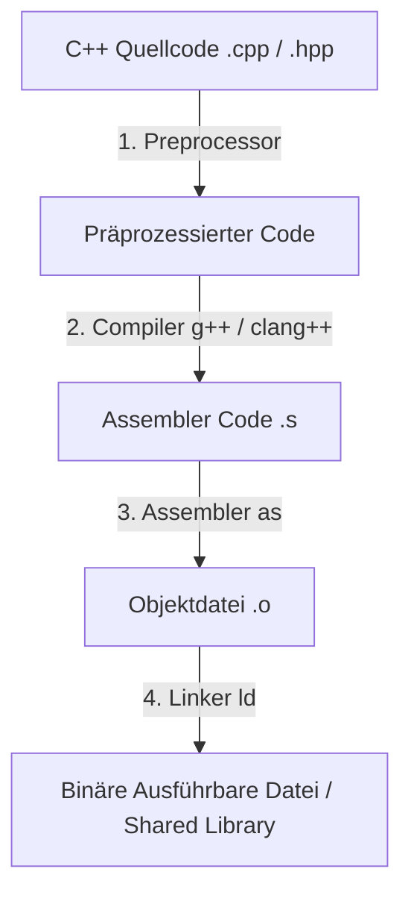
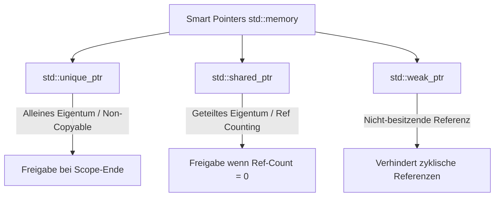

# C++ Programmierung – Das Praxis-Handbuch & Modern C++ Leitfaden

**C++** ist die führende Hochsprache für objektorientierte, generische und leistungskritische Systemprogrammierung. Von Spiele-Engines (Unreal Engine) und High-Frequency Trading über GUI-Frameworks (Qt) bis hin zu KI-Bibliotheken (PyTorch, TensorFlow, OpenCV) kombiniert C++ hardwarenahe Performance mit mächtigen Abstraktionsmechanismen.

Dieses Handbuch fasst die Sprachgrundlagen, modernes Speichermanagement (Smart Pointers, RAII), Objektorientierung (Rule of 0/3/5, Vtables), Templates & Metaprogrammierung (SFINAE, Concepts), die Standard Template Library (STL), Multithreading, CMake und C++-Idiome prägnant zusammen.

---

## 🚀 1. Einführung & Setup

### Warum C++?
* **Zero-Overhead Principle**: Sie bezahlen nur für Abstraktionen, die Sie auch tatsächlich nutzen.
* **Modernes Speichermanagement**: Automatische Ressourcenverwaltung durch **RAII** (Resource Acquisition Is Initialization) ohne Garbage Collector.
* **Multi-Paradigmen-Sprache**: Unterstützt prozedurale, objektorientierte, funktionale (Lambdas) und generische Programmierung (Templates).



### Compiler & Toolchain einrichten

=== "Ubuntu / Linux"
    ```bash
    # GCC 13+ / Clang 17+ und CMake installieren
    sudo apt update && sudo apt install -y build-essential g++ clang cmake ninja-build gdb

    # Erstes modernes C++20 Programm kompilieren
    g++ -std=c++20 -Wall -Wextra -O2 main.cpp -o app
    ./app
    ```

=== "Compiler-Flags Best Practices"
    * `-std=c++20` / `-std=c++23`: Aktiviert den modernen Sprachstandard.
    * `-Wall -Wextra -Wpedantic`: Aktiviert alle strengen Warnungen des Compilers.
    * `-O3`: Maximale Inferenz- & Ausführungsoptimierung.
    * `-fsanitize=address,undefined`: Aktiviert ASan & UBSan zum automatischen Erkennen von Speicherfehlern und undefiniertem Verhalten zur Laufzeit.

---

## 🔒 2. Speichermanagement & Smart Pointers (RAII)

Modernes C++ (C++11 bis C++23) vermeidet rohes `new` und `delete` vollständig zugunsten von **Smart Pointern** und **RAII**.

### Smart Pointer im Überblick (`<memory>`)



| Smart Pointer | Eigentum | Kopierbar? | Anwendungsfall |
|---|---|---|---|
| `std::unique_ptr<T>` | Exklusiv | Nein (nur `std::move`) | Standard-Pointer für Ressourcen & Objekte |
| `std::shared_ptr<T>` | Geteilt (Ref-Count) | Ja | Ressourcen mit mehreren gleichberechtigten Eigentümern |
| `std::weak_ptr<T>` | Beobachtend | Ja | Auflösung zirkulärer `shared_ptr`-Abhängigkeiten |

=== "Smart Pointer Praxisbeispiel"
    ```cpp
    #include <iostream>
    #include <memory>
    #include <string>

    class Resource {
    public:
        Resource(const std::string& name) : name_(name) {
            std::cout << "Resource " << name_ << " erstellt.\n";
        }
        ~Resource() {
            std::cout << "Resource " << name_ << " automatisch zerstört (RAII).\n";
        }
        void process() const { std::cout << "Verarbeite " << name_ << "...\n"; }
    private:
        std::string name_;
    };

    int main() {
        // Erstellen eines unique_ptr mit std::make_unique
        auto res = std::make_unique<Resource>("Datenbank-Verbindung");
        res->process();
        // Speicher wird am Ende des Scope ohne manuelle 'delete'-Aufrufe freigegeben!
        return 0;
    }
    ```

---

## 🏛️ 3. Klassen, OOP & Die Rule of 0 / 3 / 5

### Die Rule of Five (Ressourcen-Verwaltung)
Wenn eine Klasse Speicher oder Ressourcen direkt verwaltet, müssen 5 Spezialmethoden definiert (oder explizit gedefaultet/gedeletet) werden:

1. **Destruktor**: `~Class()`
2. **Copy-Konstruktor**: `Class(const Class&)`
3. **Copy-Zuweisung**: `Class& operator=(const Class&)`
4. **Move-Konstruktor**: `Class(Class&&) noexcept`
5. **Move-Zuweisung**: `Class& operator=(Class&&) noexcept`

!!! tip "Rule of Zero"
    Verwenden Sie Smart Pointer (`std::unique_ptr`), `std::vector` und `std::string`. Die Rule of Zero besagt: Wenn Ihre Klasse nur RAII-Typen enthält, müssen Sie **keinen** benutzerdefinierten Destruktor oder Copy/Move-Operator schreiben!

---

## ⚙️ 4. Explicit Type Casting & Modern C++ Concepts

### C++ Casts vs. C-Style Casts
Verwenden Sie **niemals** C-Style Casts `(int)x`, sondern immer explizite C++-Casts:

* `static_cast<T>(expr)`: Sichere Konvertierung bekannter Typen zur Kompilierzeit.
* `dynamic_cast<T>(expr)`: Laufzeitgeprüfte Konvertierung in Vererbungshierarchien (erfordert RTTI).
* `const_cast<T>(expr)`: Entfernt oder fügt `const`-Qualifizierer hinzu.
* `reinterpret_cast<T>(expr)`: Low-Level Bitorientierte Reinterpretation von Speicheradressen.

### Modern C++20 Concepts
C++20 bietet `concepts` als typsichere Einschränkung für Templates:

```cpp
#include <concepts>

// Dieses Template akzeptiert NUR numerische Typen (Integral oder Floating-Point)
template <typename T>
requires std::integral<T> || std::floating_point<T>
T addieren(T a, T b) {
    return a + b;
}
```

---

## 📦 5. Standard Template Library (STL) & Multithreading

### STL-Container & Algorithmen
* **`std::vector<T>`**: Dynamisches Array mit sequenziellem Speicherlayout (Standard-Container).
* **`std::unordered_map<K, V>`**: Hash-Table mit $\mathcal{O}(1)$ Suchzeit.
* **`std::ranges` (C++20)**: Moderne, komponierbare Pipeline-Algorithmen.

=== "Ranges & Lambdas Beispiel"
    ```cpp
    #include <iostream>
    #include <vector>
    #include <ranges>

    int main() {
        std::vector<int> zahlen = {1, 2, 3, 4, 5, 6, 7, 8, 9, 10};

        // Filtert gerade Zahlen und quadriert sie mit C++20 Ranges
        auto ergebnis = zahlen 
            | std::views::filter([](int n) { return n % 2 == 0; })
            | std::views::transform([](int n) { return n * n; });

        for (int n : ergebnis) {
            std::cout << n << " "; // Gibt 4 16 36 64 100 aus
        }
    }
    ```

=== "Multithreading & std::async"
    ```cpp
    #include <iostream>
    #include <future>

    int berechne_wert() {
        return 42;
    }

    int main() {
        // Führt die Funktion asynchron in einem eigenen Thread aus
        std::future<int> ergebnis = std::async(std::launch::async, berechne_wert);
        
        std::cout << "Ergebnis: " << ergebnis.get() << "\n";
    }
    ```

---

## 🛠️ 6. Modernes Build-Management mit CMake

Eine standardisierte `CMakeLists.txt` für C++20 Projekte:

```cmake
cmake_minimum_required(VERSION 3.20)
project(MeinCppProjekt VERSION 1.0 LANGUAGES CXX)

set(CMAKE_CXX_STANDARD 20)
set(CMAKE_CXX_STANDARD_REQUIRED ON)
set(CMAKE_EXPORT_COMPILE_COMMANDS ON)

# Hinzufügen von Quellcodedateien
add_executable(app src/main.cpp src/utils.cpp)

# Einbinden von Include-Ordnern
target_include_directories(app PRIVATE include)

# Externe Bibliotheken verknüpfen (z. B. Threads & spdlog)
find_package(Threads REQUIRED)
target_link_libraries(app PRIVATE Threads::Threads)
```

---

## 🔗 7. Verwandte Themen & Weiterführende Links
* [Zurück zur Systemprogrammierungs-Übersicht](index.md)
* [C++20 Modules & Modern CMake](cpp20-modules-cmake.md)
* [C Praxis-Handbuch](c-praxis.md)
* [Rust Praxis-Handbuch](rust-praxis.md)
