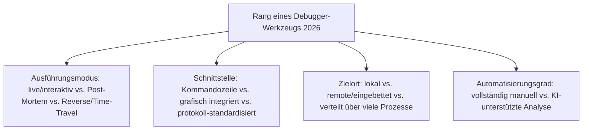
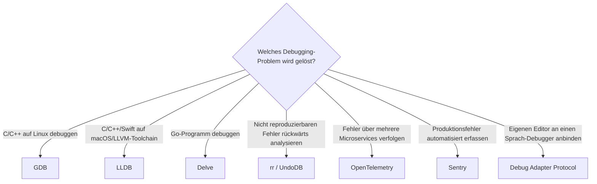

# Beste Debugger-Werkzeuge 2026 — Top-15-Topliste

Die [Evolution und Architekturen digitaler Debugger](evolution-digitaler-debugger.md) ordnet diese Werkzeuggattung chronologisch nach Architektur-Generation — von den ersten interaktiven Speicher-Inspektoren über symbolische Quellcode-Debugger, grafische IDE-Integration und Remote-/Post-Mortem-Analyse bis zu Reverse-Debugging, protokoll-standardisierter IDE-Anbindung und verteiltem sowie KI-gestütztem Debugging. Diese Seite übersetzt die Chronologie in eine **Momentaufnahme 2026**: 15 Werkzeuge, die heute tatsächlich betrieben werden.

!!! note "Hinweis: Print-Statement-Debugging bleibt die informelle Nullte Generation"
    Wie die Quellchronologie selbst festhält, ist manuelles Print-Statement-Debugging die älteste und bis heute nie ganz verschwundene Technik — sie erscheint hier bewusst nicht als Rang, weil sie kein eigenständiges Werkzeug, sondern eine Praxis ist.

---

## Bewertungskriterien

---

## Top 15 im Überblick

| Rang | Werkzeug | Generation | Rolle | Besondere Stärke |
|---|---|---|---|---|
| 1 | **GDB** (GNU Debugger) | 2 (Symbolische Quellcode-Debugger) | Debugger | De-facto-Standard-Debugger für Unix/Linux, bis heute produktiv im Einsatz |
| 2 | **LLDB** | Ergänzung 2026 | Debugger | LLVM-natives Pendant zu GDB, Standard-Debugger von Xcode und zunehmend Rust-/Swift-Toolchains |
| 3 | **Debug Adapter Protocol (DAP)** | 5 (Reverse-Debugging & Protokoll-Standardisierung) | Protokoll | Standardisiert die Kommunikation zwischen Editor und Debugger-Backend, jeder Sprach-Debugger bedient jeden DAP-fähigen Editor |
| 4 | **OpenTelemetry** | 6 (Verteiltes & KI-gestütztes Debugging) | Tracing-Standard | Standard für verteiltes Tracing über Microservice-Grenzen hinweg |
| 5 | **rr** | 5 (Reverse-Debugging & Protokoll-Standardisierung) | Reverse-Debugger | Open-Source-Record-and-Replay-Debugger, zeichnet Ausführung deterministisch auf und macht sie beliebig durchsuchbar |
| 6 | **gdbserver** | 4 (Remote- & Post-Mortem-Debugging) | Remote-Debug-Agent | Ermöglicht Debugging auf eingebetteten Systemen oder entfernten Servern ohne lokal laufenden vollen GDB |
| 7 | **Delve** | Ergänzung 2026 | Debugger | De-facto-Standard-Debugger für Go, füllt die Lücke, die GDB für Go-Runtime-Interna nur unzureichend abdeckt |
| 8 | **KI-gestützte Root-Cause-Analyse** | 6 (Verteiltes & KI-gestütztes Debugging) | Agentische Analyse | Autonome Coding-Agenten analysieren Fehlermeldungen, Stack-Traces und Logs eigenständig |
| 9 | **Sentry** | Ergänzung 2026 | Error-Tracking | Verbreitetste kommerzielle Plattform für automatisierte Produktionsfehler-Erfassung mit Stack-Trace-Aggregation |
| 10 | **Core-Dump-Analyse** | 4 (Remote- & Post-Mortem-Debugging) | Post-Mortem-Analyse | Untersucht Programmzustand zum Absturzzeitpunkt nachträglich, wichtig für seltene Produktionsfehler |
| 11 | **UndoDB** | 5 (Reverse-Debugging & Protokoll-Standardisierung) | Reverse-Debugger | Frühes kommerzielles Reverse-Debugging-Werkzeug, Vorreiter der Aufzeichnung-und-Wiedergabe-Kategorie |
| 12 | **dbx** | 2 (Symbolische Quellcode-Debugger) | Debugger (historisch) | Einer der ersten quellcode-symbolischen Debugger, direkter Vorläufer des GDB-Bedienkonzepts |
| 13 | **Turbo Debugger** | 3 (Grafische, integrierte Debugger) | Debugger (historisch) | Vollbild-Debugger-Oberfläche, prägte eine ganze Entwicklergeneration auf DOS-Systemen |
| 14 | **CodeView** | 3 (Grafische, integrierte Debugger) | Debugger (historisch) | Einer der ersten grafischen Debugger für DOS, direkt in Microsofts Compiler-Toolchain integriert |
| 15 | **DDT** | 1b (DDT — der erste interaktive Debugger) | Debugger (historisch) | Erster interaktive Debugger überhaupt, etabliert das Grundprinzip live inspizierbarer Programme |

---

## Highlights im Detail

### Rang 1–3, 6–7: die heute tatsächlich genutzten Sprach-Debugger und ihr gemeinsames Protokoll
GDB, LLDB, DAP, gdbserver und Delve zeigen, wie unterschiedliche Sprachökosysteme (C/C++, Rust/Swift, Go) eigene Debugger-Backends betreiben, die sich alle über dasselbe Protokoll in jeden modernen Editor einklinken lassen, siehe [Generation 5](evolution-digitaler-debugger.md#generation-5-reverse-debugging-protokoll-standardisierung-2005-2018).

### Rang 4, 8–9: verteiltes und automatisiertes Debugging als jüngste Antwort
OpenTelemetry, KI-gestützte Root-Cause-Analyse und Sentry zeigen, dass „Debugging" 2026 zunehmend über einzelne Prozessgrenzen hinausgeht — ein Fehler wird über Dutzende Microservices verfolgt und zunehmend automatisiert diagnostiziert statt manuell, siehe [Generation 6](evolution-digitaler-debugger.md#generation-6-verteiltes-ki-gestutztes-debugging-ab-2019).

### Rang 5, 11: Zeitreise statt reiner Vorwärts-Ausführung
rr und UndoDB machen Ausführung rückwärts nachvollziehbar — besonders wertvoll bei selten reproduzierbaren Heisenbugs, die bei jedem erneuten Lauf ihr Verhalten ändern.

---

## Entscheidungshilfe nach Baustellen-Typ

!!! tip "Tipp: Compiler-Perspektive separat prüfen"
    DWARF-Debug-Symbole, die diese Werkzeuge lesen, entstehen im Compiler — siehe [Beste Compiler-Werkzeuge 2026](compiler-2026-topliste.md), Generation 3–4.

---

## 🔗 Verwandte Themen

- [Startseite](../../index.md) — zurück zur Dokumentations-Zentrale
- [Evolution und Architekturen digitaler Debugger](evolution-digitaler-debugger.md) — chronologisches Generationenmodell, dessen aktuellen Stand diese Topliste zusammenfasst
- [Beste Compiler-Werkzeuge 2026 (Top 15)](compiler-2026-topliste.md) — DWARF-Debug-Symbole als geteilter Berührungspunkt
- [Beste Editoren 2026 (Top 15)](editoren-2026-topliste.md) — DAP-Integration als Debugger-Pendant zur dortigen Generation 5
- [C in der Praxis](c-praxis.md) — praktische GDB-Nutzung
- [C++ Praxis-Handbuch](cpp-praxis.md) — Sanitizer und Debug-Symbole als Ergänzung zu GDB
- [AI Agents – Das Praxis-Handbuch & Architektur-Leitfaden](../../künstliche-intelligenz/coding/ai-agents-praxis.md) — Vertiefung zu KI-gestützter Fehleranalyse aus Rang 8
