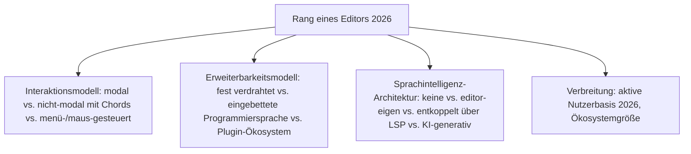
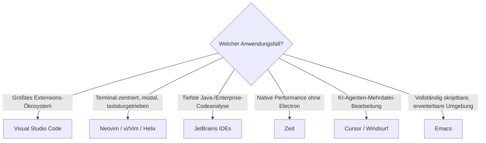

# Beste Editoren 2026 — Top-15-Topliste

Die [Evolution und Architekturen digitaler Editoren](evolution-digitaler-editoren.md) ordnet diese Werkzeuggattung chronologisch nach Architektur-Generation — von zeilenweisen Kommandozeilen-Editoren über die modale/erweiterbare Editor-Ära (vi vs. Emacs), grafische Maus-Editoren und Plugin-Ökosysteme bis zum Language-Server-basierten VS-Code-Zeitalter und KI-nativen Editoren. Diese Seite übersetzt die Chronologie in eine **Momentaufnahme 2026**: 15 Editoren, die heute tatsächlich genutzt werden.

!!! note "Hinweis: Abgrenzung zur Rust-IDE-Topliste"
    [Beste IDEs & Editoren mit Rust-Unterstützung](rust-ide-topliste.md) rankt dieselben und weitere Werkzeuge speziell nach **Rust-Sprachunterstützung**. Diese Seite bleibt breiter — sie rankt nach allgemeiner Verbreitung und architektonischer Bedeutung über alle sechs Generationen hinweg, unabhängig von einer bestimmten Sprache.

---

## Bewertungskriterien

---

## Top 15 im Überblick

| Rang | Editor | Generation | Besondere Stärke |
|---|---|---|---|
| 1 | **Visual Studio Code** | 5 (VS Code & das Language-Server-Ökosystem) | Open-Source-Kern, riesiger Extensions-Marketplace, setzte sich vor allem durch tiefe Sprachintelligenz über LSP durch |
| 2 | **Neovim** | Ergänzung 2026 (Weiterentwicklung von Generation 2) | Modernisierter Vim-Fork mit nativer LSP-/Lua-Erweiterbarkeit, wachsende Adoption bei terminal-zentrierten Entwicklern |
| 3 | **JetBrains IDEs** (IntelliJ, PyCharm, WebStorm u. a.) | Ergänzung 2026 | Tiefste sprachspezifische Codeanalyse dieser Liste, dominant im Java-/Enterprise-Umfeld |
| 4 | **vi / Vim** | 1c/2 (ex/vi — visueller Modus / Modale & erweiterbare Editoren) | Minimaler Speicherbedarf, auf praktisch jedem Unix-System vorinstalliert, begründete das modale Bearbeitungsmodell |
| 5 | **Emacs** | 2 (Modale & erweiterbare Editoren) | Vollständig in Emacs Lisp skriptbar, oft als „Betriebssystem, das sich als Editor tarnt" beschrieben |
| 6 | **Zed** | 5/6 (Native Rust-Gegenbewegung / KI-native Editoren) | Nativ statt Electron gebaut, GPU-beschleunigte Performance, agentische KI-Funktionen direkt im Rust-Kern |
| 7 | **Cursor** | 6 (KI-native Editoren) | VS-Code-Fork mit tief integrierten KI-Agenten-Funktionen, größte Adoption unter den KI-nativen Editoren |
| 8 | **Windsurf** | 6 (KI-native Editoren) | „Cascade"-Agentenmodus für autonome Mehrdatei-Änderungen auf VS-Code-Basis |
| 9 | **Sublime Text** | 4 (Erweiterbare, Plugin-basierte Editoren) | Plattformübergreifend, extrem performant, riesiges Package-Ökosystem über Package Control |
| 10 | **Helix** | Ergänzung 2026 | Modaler Editor in Rust mit eingebautem LSP/Tree-sitter ab Werk, wachsende Nischen-Alternative zu Neovim |
| 11 | **TextMate** | 4 (Erweiterbare, Plugin-basierte Editoren) | Prägte das „Bundle"-Konzept (Snippets, Makros, Sprachgrammatiken), direktes Vorbild für Sublime Text |
| 12 | **Atom** | 4 (Erweiterbare, Plugin-basierte Editoren) | Erste breite Umsetzung eines Desktop-Editors in Web-Technologie über Electron, 2022 von GitHub eingestellt |
| 13 | **BBEdit** | 3 (Grafische Maus-Editoren) | Früher professioneller GUI-Editor für Mac, bis heute aktiv gepflegt |
| 14 | **Notepad** | 3 (Grafische Maus-Editoren) | Denkbar einfachster GUI-Texteditor, mit Windows 1.0 gebündelt, bis heute Teil jeder Windows-Installation |
| 15 | **TECO** | 1a (TECO — makro-programmierbarer Editor) | Direkter Namens- und Konzept-Vorfahre von Emacs, historische Wurzel der Erweiterbarkeits-Philosophie |

---

## Highlights im Detail

### Rang 1–3, 6–8: die sechs heute dominanten Editoren/IDEs
VS Code, Neovim, JetBrains IDEs, Zed, Cursor und Windsurf decken zusammen praktisch den gesamten professionellen Editor-Markt 2026 ab — von terminal-zentriert bis KI-agentisch, siehe [Generation 5–6](evolution-digitaler-editoren.md#generation-6-ki-native-editoren-ab-2022).

### Rang 4–5: die „Editor Wars" bleiben bis heute unentschieden
vi/Vim und Emacs verfolgen seit [Generation 2](evolution-digitaler-editoren.md#generation-2-modale-erweiterbare-editoren-vi-vs-emacs-1976-1985) zwei grundverschiedene Antworten auf dieselbe Frage — beide sind 2026 weiterhin aktiv gepflegt und in täglichem Einsatz, keine hat die andere verdrängt.

### Rang 9–12: die Plugin-Ökosystem-Generation mit gemischtem Fortbestand
Sublime Text bleibt aktiv, TextMate lebt vor allem als konzeptioneller Vorläufer fort, Atom wurde 2022 vollständig eingestellt — ein seltenes Beispiel eines kompletten Produkt-Endes innerhalb dieser Chronologie-Familie.

---

## Entscheidungshilfe nach Anwendungsfall

!!! tip "Tipp: Rust-Sprachunterstützung separat prüfen"
    Für ein Ranking speziell nach Rust-Tooling-Tiefe siehe [Beste IDEs & Editoren mit Rust-Unterstützung](rust-ide-topliste.md).

---

## 🔗 Verwandte Themen

- [Startseite](../../index.md) — zurück zur Dokumentations-Zentrale
- [Evolution und Architekturen digitaler Editoren](evolution-digitaler-editoren.md) — chronologisches Generationenmodell, dessen aktuellen Stand diese Topliste zusammenfasst
- [Beste IDEs & Editoren mit Rust-Unterstützung (Top 20)](rust-ide-topliste.md) — Zed, Cursor und Windsurf im praktischen Rust-Vergleich
- [Beste Compiler-Werkzeuge 2026 (Top 15)](compiler-2026-topliste.md) — LSP als Fundament der hier gerankten Generation 5
- [Beste Debugger-Werkzeuge 2026 (Top 15)](debugger-2026-topliste.md) — DAP als Debugger-Pendant zu Generation 5 dieser Liste
- [IDE & Tools: Übersicht](../ide/index.md) — produkt-/tool-orientierte Gesamtübersicht konkreter Editoren und IDEs
- [KI Coding](../../künstliche-intelligenz/coding/ki-coding.md) — Einstieg in terminal-/agentenzentrierte Werkzeuge derselben Generation 6
