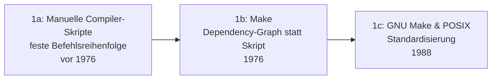

# Evolution und Architekturen digitaler Build-Systeme

Fünfter Teil der Entwickler-Werkzeug-Reihe neben [Compilern](evolution-digitaler-compiler.md), [Interpretern](evolution-digitaler-interpreter.md), [Debuggern](evolution-digitaler-debugger.md) und [Editoren](evolution-digitaler-editoren.md): das **Build-System**, das entscheidet, *was* wann neu kompiliert, verlinkt oder verpackt werden muss — statt jeden Compiler-Aufruf von Hand zu tippen. Dieser Artikel ordnet die Architektur-Geschichte dieser Werkzeuggattung chronologisch nach **technologischen Generationen**: von der ersten dependency-graph-basierten Automatisierung über plattformübergreifende Meta-Build-Generatoren, sprachintegrierte Build-/Paketmanager und hermetische Monorepo-Systeme bis zu content-hash-basierten Task-Runnern und schließlich KI-Agenten, die fehlgeschlagene Builds selbstständig reparieren.

!!! note "Hinweis: Generationen überlappen sich"
    Die Zeiträume sind grobe Orientierung, keine scharfen Grenzen — Make (Generation 1) treibt bis heute unzählige Projekte an, parallel zu Bazel-Monorepos (Generation 4). Entscheidend ist das **Cache- und Reproduzierbarkeitsmodell** (Zeitstempel vs. Inhalts-Hash, umgebungsabhängig vs. hermetisch), nicht allein das Erscheinungsjahr.

---

## Generation 1: Make — erste dependency-graph-basierte Automatisierung, 1976

Die Gründergeneration eint ein Prinzip: statt Compiler-Befehle in einer festen, manuell gepflegten Reihenfolge auszuführen, beschreibt ein **Abhängigkeitsgraph**, welche Datei von welcher abhängt — nur tatsächlich veraltete Teile werden neu gebaut. Sie lässt sich in drei technologische Entwicklungsstufen unterteilen:

### 1a. Manuelle Compiler-Skripte — feste Befehlsreihenfolge, vor 1976

- **Architektur:** ein Shell-Skript ruft Compiler-Befehle in fester Reihenfolge auf — jede Änderung erfordert einen kompletten Neubau, es gibt kein Konzept „nur das Nötige neu bauen".
- **Bedeutung:** der Zustand, den Generation 1b gezielt löst — bei wachsenden Projekten wird das vollständige Neubauen jeder Datei bei jeder Änderung schnell unpraktikabel.

### 1b. Make — Dependency-Graph statt Skript, 1976

- **Architektur:** Stuart Feldman, Bell Labs — ein **Makefile** beschreibt Zieldateien, deren Abhängigkeiten und die Befehle zur Erzeugung; Make vergleicht **Datei-Zeitstempel** und baut nur veraltete Ziele neu.
- **Bedeutung:** etabliert den bis heute gültigen Grundbegriff „Build-System" als eigenständige Werkzeugkategorie neben Compiler und Editor.

### 1c. GNU Make & POSIX-Standardisierung, 1988

- **Architektur:** GNU Make erweitert das Grundkonzept um Mustern, Variablen und Funktionen, POSIX standardisiert eine gemeinsame Make-Untermenge.
- **Bedeutung:** Make wird zum portablen Standard-Werkzeug über praktisch jede Unix-Variante hinweg.

---

## Generation 2: Plattformübergreifende Meta-Build-Generatoren, 1991 – 2011

Ein einzelnes Makefile ist nicht plattformübergreifend portabel — diese Generation trennt die **Build-Beschreibung** von der tatsächlichen, plattformspezifischen Ausführung: ein Generator erzeugt daraus native Build-Dateien für die jeweilige Zielplattform.

**Architektur:** ein Meta-Build-System liest eine plattformneutrale Projektbeschreibung und generiert daraus native Artefakte (Makefiles, Visual-Studio-Projekte, oder ein minimales, extrem schnelles Ausführungsformat) — Entwickler schreiben nie direkt für den ausführenden Build-Prozess.

| System | Jahr | Rolle |
|---|---|---|
| **Autoconf/Automake** (Autotools) | 1991 | GNU-Projekt — generiert portable `configure`-Skripte und Makefiles, die zur Laufzeit Systemeigenschaften prüfen (`./configure && make && make install`). |
| **CMake** | 2000 | Kitware — liest eine einzige `CMakeLists.txt` und generiert daraus Makefiles, Ninja-Dateien oder Visual-Studio-Projekte, siehe [C++20 Modules & Modern CMake](cpp20-modules-cmake.md). |
| **Ninja** | 2011 | Google/Evan Martin, ursprünglich für Chromiums Build entwickelt — bewusst nicht zum Handschreiben gedacht, sondern als extrem schnelles Ausführungsziel für Generatoren wie CMake. |

---

## Generation 3: Sprachintegrierte Build- & Paketmanager, 2004 – 2014

Statt Build-Logik und Abhängigkeitsverwaltung als getrennte Werkzeuge zu betreiben, verschmilzt diese Generation beides zu einem einzigen, sprachspezifischen Kommandozeilen-Werkzeug.

**Architektur:** ein zentrales Paket-Repository (Maven Central, crates.io) liefert Abhängigkeiten direkt in den Build-Prozess, „Convention over Configuration" ersetzt manuell gepflegte Abhängigkeitslisten für den Standardfall.

| System | Jahr | Besonderheit |
|---|---|---|
| **Maven** | 2004 | Apache — XML-basierte, konventionsgetriebene Projektstruktur für Java, zentrales Repository-Modell. |
| **Gradle** | 2007/2012 | Kombiniert Mavens Abhängigkeitsmodell mit einer flexiblen Groovy-/später Kotlin-DSL statt starrem XML, eingebautes inkrementelles Caching. |
| **Cargo** | 2014 | Direkt in die Rust-Toolchain integriert — Build, Testen, Paketverwaltung und Registry (crates.io) aus einem einzigen Werkzeug statt separater Tools, siehe [Rust in der Praxis](rust-praxis.md). |

---

## Generation 4: Hermetische, cachefähige Monorepo-Build-Systeme, 2013 – 2023

Bei Tausenden Paketen in einem einzigen Repository (Monorepo) reicht dateizeitstempel-basiertes Caching nicht mehr — diese Generation garantiert **hermetische** Builds: das Ergebnis hängt ausschließlich von explizit deklarierten Eingaben ab, nie von der lokalen Umgebung.

**Architektur:** jede Build-Aktion läuft in einer isolierten Sandbox mit exakt deklarierten Eingaben, ein **Inhalts-Hash** über diese Eingaben dient als Cache-Schlüssel — identische Eingaben liefern das identische, aus einem geteilten Remote-Cache wiederverwendbare Ergebnis, selbst über verschiedene Entwicklerrechner hinweg.

| System | Jahr | Rolle |
|---|---|---|
| **Buck** | 2013 | Facebook — hermetisches Build-System für sehr große Monorepos. |
| **Bazel** | 2015 | Google — Open-Source-Version des internen „Blaze", dieselbe hermetische Philosophie, verbreitetstes System dieser Generation. |
| **Buck2** | 2023 | Meta — vollständiger Rewrite von Buck in Rust, deutlich schnellere Ausführung bei gleicher hermetischer Grundidee. |

---

## Generation 5: Content-Hash-basierte JS-Monorepo-Task-Runner, ab 2017

Speziell für JavaScript-/TypeScript-Monorepos entstehen leichtgewichtigere Alternativen zu Bazels vollständiger Hermetik — Fokus auf **Task-Orchestrierung** (welches Skript in welcher Reihenfolge über wie viele Pakete hinweg) statt einer eigenen Sandbox-Sprache.

**Architektur:** ein Abhängigkeitsgraph zwischen Paketen innerhalb desselben Repositories, Task-Ergebnisse werden per Inhalts-Hash gecacht und optional über ein Team hinweg per Remote-Cache geteilt — ähnliches Cache-Prinzip wie Generation 4, aber ohne vollständige Sandbox-Isolation.

| System | Jahr | Rolle |
|---|---|---|
| **Nx** | ab 2017 | Nrwl — Monorepo-Task-Orchestrierung mit Abhängigkeitsgraph-Visualisierung und Computation-Caching. |
| **Turborepo** | 2021 | Jared Palmer, seit 2021 bei Vercel — minimalistischer, extrem schneller Task-Runner mit Remote-Caching für JS-/TS-Monorepos. |

---

## Generation 6: KI-Agenten reparieren Build-Fehler autonom, ab 2023

Statt fehlgeschlagene Builds nur zu melden, analysieren autonome Coding-Agenten Fehlermeldungen selbstständig und schlagen — oder committen direkt — eine Korrektur vor.

**Architektur:** ein Agent liest Build-/CI-Fehlerausgabe, identifiziert die wahrscheinliche Ursache und öffnet einen Fix-Commit oder Pull-Request, ohne dass ein Mensch den Fehler zuerst manuell diagnostiziert.

| Baustein | Jahr | Rolle |
|---|---|---|
| **Autonome Coding-Agenten in CI-Pipelines** | ab 2023 | Analysieren fehlgeschlagene Build-/Test-Läufe und schlagen automatisiert Korrekturen vor, siehe [Generation 3 der Autonomen-KI-Agenten-Zeitachse](../../künstliche-intelligenz/evolution-digitaler-autonome-ki-agenten.md#generation-3-autonome-coding-agenten-2023-2025) und [Generation 6 der Debugger-Zeitachse](evolution-digitaler-debugger.md#generation-6-verteiltes-ki-gestutztes-debugging-ab-2019) für die analoge Root-Cause-Analyse bei Laufzeitfehlern. |

---

## Alternative Sortier- & Klassifikationskriterien für Build-Systeme

Neben dem chronologischen Generationenmodell lassen sich Build-Systeme nach folgenden Dimensionen einordnen:

### 1. Cache-Schlüssel

- **Datei-Zeitstempel** — Make (Generation 1): Ziel gilt als aktuell, wenn es neuer ist als seine Abhängigkeiten.
- **Inhalts-Hash** — Bazel, Nx, Turborepo (Generation 4–5): Ziel gilt als aktuell, wenn sich der Hash seiner Eingaben nicht geändert hat, unabhängig vom Zeitstempel.

### 2. Reproduzierbarkeit

- **Umgebungsabhängig** — Make, Autotools (Generation 1–2): Ergebnis kann je nach installierten Systembibliotheken variieren.
- **Hermetisch/sandboxed** — Bazel, Buck (Generation 4): Ergebnis hängt ausschließlich von explizit deklarierten Eingaben ab.

### 3. Kopplung an eine Sprache

- **Sprachneutral** — Make, CMake, Ninja, Bazel (Generation 1–2, 4): baut Projekte in beliebigen Sprachen.
- **Sprachintegriert** — Maven, Gradle, Cargo (Generation 3): Build-Werkzeug und Sprach-Toolchain sind untrennbar.

### 4. Skalierungsziel

- **Einzelprojekt** — klassisches Make, Autotools-Projekt (Generation 1–2).
- **Monorepo mit Tausenden Paketen** — Bazel, Buck2, Nx, Turborepo (Generation 4–5).

---

## Verwandte Themen

- [Beste Build-Systeme 2026 (Top 15)](build-systeme-2026-topliste.md) — Momentaufnahme 2026, die diese Chronologie in eine gerankte Topliste übersetzt
- [Evolution und Architekturen digitaler Compiler](evolution-digitaler-compiler.md) — die Werkzeuge, deren Aufrufe Build-Systeme dieses Artikels orchestrieren
- [Evolution und Architekturen digitaler Debugger](evolution-digitaler-debugger.md) — KI-gestützte Root-Cause-Analyse aus Generation 6 dort als Analogie zu Generation 6 dieses Artikels
- [Evolution und Architekturen digitaler Editoren](evolution-digitaler-editoren.md) — komplementäre Werkzeuggattung in derselben Entwickler-Werkzeug-Reihe
- [Evolution und Architekturen digitaler Paketmanager](evolution-digitaler-paketmanager.md) — verwandte, aber nicht deckungsgleiche Achse: Woher Software/Abhängigkeiten kommen statt wie sie gebaut werden; Nix' hermetisches Prinzip als konzeptioneller Vorläufer von Generation 4 dieses Artikels
- [Evolution und Architekturen digitaler Versionskontrollsysteme](evolution-digitaler-versionskontrollsysteme.md) — Monorepo-Skalierungsproblem, das Generation 4/5 dieses Artikels und Generation 5 dort aus komplementären Blickwinkeln lösen
- [C++20 Modules & Modern CMake](cpp20-modules-cmake.md) — praktische Vertiefung zu CMake aus Generation 2 dieses Artikels
- [Rust in der Praxis](rust-praxis.md) — praktische Vertiefung zu Cargo aus Generation 3 dieses Artikels
- [C in der Praxis](c-praxis.md) und [C++ Praxis-Handbuch](cpp-praxis.md) — Make/CMake-Nutzung in der Praxis
- [Evolution und Architekturen digitaler Autonomer KI-Agenten](../../künstliche-intelligenz/evolution-digitaler-autonome-ki-agenten.md) — Vertiefung zu Generation 6 dieses Artikels
- [AI Agents – Das Praxis-Handbuch & Architektur-Leitfaden](../../künstliche-intelligenz/coding/ai-agents-praxis.md) — Vertiefung zu KI-gestützter Fehleranalyse aus Generation 6 dieses Artikels
