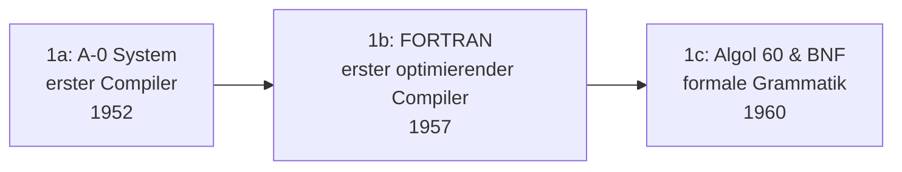

# Evolution und Architekturen digitaler Compiler

Wie [Programmiersprachen](../evolution-digitaler-programmiersprachen.md) selbst durchlaufen auch die Werkzeuge, die sie in Maschinencode übersetzen, eigene Architektur-Generationen: von den ersten handgeschriebenen Übersetzern über systematisch aus formaler Grammatik generierte Parser, portable Multi-Sprachen-Backends und modulare, Just-in-time-fähige Infrastruktur bis zum Compiler als Dauerdienst für Editoren und schließlich KI-nativer Compiler-Infrastruktur für heterogene Hardware. Die praktischen Phasen (Preprocessing, Parsing, Codegenerierung, Linken) und der Umgang mit GCC/Clang/Rustc erklärt [Compiler: Übersetzen von Hochsprachen zu Maschinencode](compiler.md) — dieser Artikel ordnet stattdessen die **Architektur-Geschichte** der Compiler-Werkzeuge selbst chronologisch nach **technologischen Generationen**.

!!! note "Hinweis: Generationen überlappen sich"
    Die Zeiträume sind grobe Orientierung, keine scharfen Grenzen — GCC (Generation 3) läuft bis heute produktiv parallel zu LLVM/Clang (Generation 4). Entscheidend ist die **Architektur** (handgeschrieben vs. generiert, monolithisch vs. modular über eine Zwischendarstellung, Batch vs. Dauerdienst), nicht allein das Erscheinungsjahr.

---

## Generation 1: Erste Compiler & die Geburt der Optimierung, 1952 – 1960

Die Gründergeneration eint ein Ziel: beweisen, dass ein automatisch übersetztes Programm überhaupt mit handgeschriebenem Maschinencode mithalten kann — zunächst bezweifelt, dann durch FORTRAN eindrucksvoll widerlegt. Sie lässt sich in drei technologische Entwicklungsstufen unterteilen:

### 1a. A-0 System — erster Compiler, 1952

- **Architektur:** Grace Hoppers **A-0 System** übersetzt symbolische mathematische Notation erstmals automatisch in Maschinencode, siehe [Generation 1c der allgemeinen Programmiersprachen-Zeitachse](../evolution-digitaler-programmiersprachen.md#1c-erster-compiler-grace-hoppers-a-0-system-1952).
- **Bedeutung:** etabliert das Grundprinzip, dass ein Übersetzungsprogramm zwischen menschlicher Notation und Maschinencode vermitteln darf.

### 1b. FORTRAN — der erste optimierende Compiler, 1957

- **Architektur:** IBMs FORTRAN-Team um John Backus investiert von Beginn an massiv in Codeoptimierung — Skeptiker glaubten damals, kein automatisch generierter Code könne mit handgeschriebenem Assembler mithalten.
- **Bedeutung:** widerlegt diese Skepsis eindrucksvoll und macht „ein Compiler kann performanten Code erzeugen" erstmals zur belegten Tatsache statt Hoffnung — das Fundament, auf dem jede spätere Optimierungs-Generation aufbaut.

### 1c. Algol 60 & BNF — formale Grammatik als Fundament, 1960

- **Architektur:** Algol 60 wird erstmals vollständig über die **Backus-Naur-Form (BNF)** spezifiziert — eine präzise, maschinell verarbeitbare Syntaxbeschreibung statt informeller Prosa.
- **Bedeutung:** legt den theoretischen Grundstein für Generation 2 — sobald eine Grammatik formal genug ist, lässt sich der dazu passende Parser systematisch statt von Hand konstruieren.

---

## Generation 2: Compiler-Theorie wird Wissenschaft — Parser-Generatoren, 1975

Statt Parser für jede Sprache erneut von Hand zu schreiben, generiert diese Generation sie automatisch aus einer formalen Grammatik-Beschreibung — die direkte praktische Konsequenz aus Algol 60s BNF-Fundament.

**Architektur:** ein Werkzeug liest eine formale Grammatik-Datei und erzeugt daraus automatisch lauffähigen Parser-Quellcode, statt dass ein Mensch die Zustandsmaschine des Parsers manuell implementiert.

| Werkzeug | Jahr | Rolle |
|---|---|---|
| **Lex** | 1975 | Generiert automatisch einen **lexikalischen Analysierer** (Tokenizer) aus regulären Ausdrücken. |
| **Yacc** („Yet Another Compiler Compiler") | 1975 | Generiert automatisch einen **Parser** aus einer kontextfreien Grammatik — Bell Labs, Stephen C. Johnson. |
| **„Principles of Compiler Design"** (der „Dragon Book") | 1977 | Aho & Ullman kodifizieren die heute noch gültige Compiler-Pipeline (lexikalische Analyse → Parsing → semantische Analyse → Codegenerierung), siehe dieselbe Phasenfolge praktisch erklärt in [Compiler-Phasen](compiler.md#compiler-phasen). |

---

## Generation 3: Portable Multi-Sprachen-Backends — GCC, ab 1987

Statt eines Compilers pro Sprache und Zielarchitektur trennt diese Generation **Frontend** (Sprach-Parsing) und **Backend** (Zielarchitektur-Codegenerierung) über eine gemeinsame Zwischendarstellung — ein Backend bedient damit viele Sprachen gleichzeitig.

**Architektur:** eine sprachneutrale interne Zwischendarstellung entkoppelt Parsing von Codegenerierung — neue Zielarchitekturen erfordern nur ein neues Backend, nicht die Neuimplementierung jedes Sprach-Frontends.

| Baustein | Jahr | Rolle |
|---|---|---|
| **GCC** (GNU C Compiler, später GNU Compiler Collection) | 1987 | Richard Stallman/GNU-Projekt — freier, portabler Compiler für zunächst C, später C++, Fortran, Ada, Go und weitere Sprachen über dasselbe Backend, siehe [GCC im praktischen Vergleich](compiler.md#gcc-gnu-compiler-collection). |
| **Portabilität über viele CPU-Architekturen** | ab 1987 | x86, ARM, RISC-V, PowerPC und weitere — derselbe Frontend-Code erzeugt Maschinencode für völlig unterschiedliche Prozessorfamilien. |

---

## Generation 4: Modulare Zwischendarstellung & Just-in-Time — LLVM, Clang & V8, 2003 – 2008

Zwei parallele Antworten auf dieselbe Grundidee wie Generation 3, jeweils weiter radikalisiert: **LLVM** macht die Zwischendarstellung selbst zum wiederverwendbaren Produkt für beliebige Werkzeuge (nicht nur Compiler), **V8** verschiebt die Kompilierung von der Build-Zeit in die Laufzeit.

**Architektur:** **LLVM IR** als eigenständig dokumentiertes, stabiles Format, das nicht nur GCC-artige Ahead-of-time-Compiler, sondern auch Analyse-Werkzeuge und Debugger konsumieren können; **Just-in-Time (JIT)**-Kompilierung übersetzt Code erst beim tatsächlichen Ausführen, mit Laufzeit-Profilinformationen als zusätzlicher Optimierungsgrundlage.

| Baustein | Jahr | Rolle |
|---|---|---|
| **LLVM** | 2003 | Chris Lattner (zunächst Universitätsprojekt) — vollständig modulare Compiler-Infrastruktur mit eigenständiger, dokumentierter Zwischendarstellung (**LLVM IR**) als zentralem Produkt. |
| **Clang** | 2007 | Apple-gesponserter LLVM-Frontend für C/C++/Objective-C, deutlich schnellere Kompilierzeiten und bessere Diagnosemeldungen als GCC, siehe [Clang/LLVM im praktischen Vergleich](compiler.md#clangllvm). |
| **V8** | 2008 | Googles JavaScript-Engine — kompiliert JavaScript zur Laufzeit direkt in nativen Maschinencode (JIT) statt es zu interpretieren, macht performante Web-Anwendungen erst praktikabel. |

!!! tip "Rustc, Swift und weitere Frontends auf LLVM-Basis"
    LLVMs modulare Architektur macht es zum geteilten Backend für zahlreiche spätere Sprachen — darunter Rustc (siehe [Rust in der Praxis](rust-praxis.md)) und Apples Swift, das später ebenfalls von Chris Lattner mitentworfen wird.

---

## Generation 5: Der Compiler als Dauerdienst — LSP & rust-analyzer, ab 2016

Ein klassischer Batch-Compiler läuft einmal pro Build und beendet sich danach — moderne IDE-Erfahrung braucht dagegen kontinuierliches, inkrementelles Feedback bei jedem Tastenanschlag. Diese Generation macht Compiler-Frontend-Analyse zu einem dauerhaft laufenden Dienst statt eines Einmalprozesses.

**Architektur:** ein standardisiertes Protokoll entkoppelt Compiler-Analyse-Logik vom jeweiligen Editor, inkrementelle Neuberechnung aktualisiert nur die tatsächlich geänderten Programmteile statt das gesamte Projekt neu zu analysieren.

| Baustein | Jahr | Rolle |
|---|---|---|
| **Language Server Protocol (LSP)** | 2016 | Microsoft — standardisiert die Kommunikation zwischen Editor und Compiler-Analyse-Dienst, ein Sprachserver bedient damit jeden LSP-fähigen Editor statt eines proprietären IDE-Plugins pro Kombination. |
| **rust-analyzer** | 2018 | Eigenständiger, inkrementeller Compiler-Frontend speziell für IDE-Nutzung — bewusst getrennt von `rustc` selbst entwickelt, weil dessen Batch-Architektur für Live-Feedback ungeeignet war. |

---

## Generation 6: KI-native Compiler-Infrastruktur — MLIR & Mojo, ab 2019

Der Kreis schließt sich mit demselben Architekten: **MLIR** verallgemeinert LLVMs Zwischendarstellungs-Idee auf mehrere gleichzeitige Abstraktionsebenen, um heterogene KI-Beschleuniger-Hardware (GPUs, TPUs, NPUs) statt nur klassischer CPUs zu bedienen — **Mojo** baut direkt darauf eine neue, KI-fokussierte Sprache.

**Architektur:** mehrere gleichzeitig gültige Zwischendarstellungs-Ebenen (Multi-Level IR) statt einer einzigen LLVM-IR-Ebene, um sowohl High-Level-Tensor-Operationen als auch Low-Level-Hardware-Details im selben Compiler-Framework abzubilden.

| Baustein | Jahr | Rolle |
|---|---|---|
| **MLIR** (Multi-Level Intermediate Representation) | 2019 | Chris Lattner (Google) — erweitert die LLVM-Idee für ML-Compiler-Infrastruktur (ursprünglich für TensorFlow), mehrere Abstraktionsebenen statt einer einzigen IR. |
| **Mojo** | 2023 | Chris Lattners neue Sprache bei **Modular Inc.**, direkt auf MLIR aufgebaut — explizit für KI-/ML-Workloads auf heterogener Hardware konzipiert, siehe [Generation 6 der Enterprise-Programmiersprachen-Zeitachse](../evolution-digitaler-enterprise-programmiersprachen.md#generation-6-rust-sicherheitskritisches-enterprise-ab-ca-2018) für Rusts parallele Sicherheits-Generation derselben Ära. |

---

## Alternative Sortier- & Klassifikationskriterien für Compiler

Neben dem chronologischen Generationenmodell lassen sich Compiler nach folgenden Dimensionen einordnen:

### 1. Ausführungszeitpunkt

- **Ahead-of-Time/Batch** — GCC, Clang, klassisches Rustc (Generation 1–4).
- **Just-in-Time zur Laufzeit** — V8 (Generation 4).
- **Inkrementell als Dauerdienst** — rust-analyzer, LSP-Sprachserver (Generation 5).

### 2. Architektur

- **Monolithisch, sprachspezifisch** — frühe handgeschriebene Compiler (Generation 1).
- **Frontend/Backend über eine einzelne Zwischendarstellung getrennt** — GCC, klassisches LLVM (Generation 3–4).
- **Mehrere Abstraktionsebenen gleichzeitig** — MLIR (Generation 6).

### 3. Parser-Erzeugung

- **Handgeschrieben** — frühe Compiler vor Generation 2.
- **Aus formaler Grammatik generiert** — Yacc/Lex (Generation 2).

### 4. Zielhardware-Fokus

- **Einzelarchitektur** — früheste Compiler (Generation 1).
- **Multi-Architektur über Backend-Abstraktion** — GCC, LLVM (Generation 3–4).
- **Heterogene KI-Beschleuniger** — MLIR/Mojo (Generation 6).

---

## Verwandte Themen

- [Beste Compiler-Werkzeuge 2026 (Top 15)](compiler-2026-topliste.md) — Momentaufnahme 2026, die diese Chronologie in eine gerankte Topliste übersetzt
- [Produktionsreife Open-Source-Compiler-Werkzeuge nach Generation (Top 8)](produktionsreife-compiler-werkzeuge-generationen-2026-topliste.md) — dasselbe Generationenmodell durch ein konservatives Fünf-Filter-Sieb (Reifegrad, Betreiberbasis, Betriebs-Skala, Speicherbackend)
- [Compiler: Übersetzen von Hochsprachen zu Maschinencode](compiler.md) — praktische Vertiefung: Phasen, GCC/Clang/Rustc im Vergleich, Compiler-Optionen
- [Evolution und Architekturen digitaler Programmiersprachen](../evolution-digitaler-programmiersprachen.md) — übergeordnetes Paradigmen-Generationenmodell, Generation 1c dort entspricht Generation 1a dieses Artikels
- [Evolution und Architekturen digitaler Enterprise-Programmiersprachen](../evolution-digitaler-enterprise-programmiersprachen.md) — Rust als parallele Sicherheits-Generation zu Mojo aus Generation 6 dieses Artikels
- [Assembler-Grundlagen](assembler.md) — die Zielebene, in die jeder hier genannte Compiler letztlich übersetzt
- [C in der Praxis](c-praxis.md) — Vertiefung zu GCC/Clang aus Generation 3/4 dieses Artikels
- [C++ Praxis-Handbuch](cpp-praxis.md) — Vertiefung zu GCC/Clang aus Generation 3/4 dieses Artikels
- [Rust in der Praxis](rust-praxis.md) — Vertiefung zu Rustc und rust-analyzer aus Generation 5 dieses Artikels
- [Evolution und Architekturen digitaler Interpreter](evolution-digitaler-interpreter.md) — komplementäre Ausführungsstrategie, V8/JIT als geteilter Berührungspunkt in Generation 4 beider Artikel
- [Evolution und Architekturen digitaler Debugger](evolution-digitaler-debugger.md) — DWARF-Debug-Symbole aus Generation 3/4 dieses Artikels als technische Grundlage von Generation 2 dort, Language Server Protocol aus Generation 5 dieses Artikels als direktes Vorbild für das Debug Adapter Protocol dort
- [Evolution und Architekturen digitaler Editoren](evolution-digitaler-editoren.md) — Language Server Protocol aus Generation 5 dieses Artikels als Fundament von Generation 5 dort
- [Evolution und Architekturen digitaler Build-Systeme](evolution-digitaler-build-systeme.md) — orchestriert die Compiler-Aufrufe aus diesem Artikel, CMake/Ninja als geteilte Bausteine
