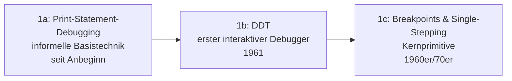

# Evolution und Architekturen digitaler Debugger

Neben [Compilern](evolution-digitaler-compiler.md) (Quelltext → Maschinencode) und [Interpretern](evolution-digitaler-interpreter.md) (Quelltext/Bytecode → Ausführung) bildet der **Debugger** das dritte zentrale Entwickler-Werkzeug: statt Code zu übersetzen oder auszuführen, macht er die laufende Ausführung selbst **beobachtbar und steuerbar** — Programmzustand inspizieren, Ausführung anhalten, Schritt für Schritt verfolgen. Dieser Artikel ordnet die Architektur-Geschichte dieser Werkzeuggattung chronologisch nach **technologischen Generationen**: von den ersten interaktiven Speicher-Inspektoren über symbolische Quellcode-Debugger, grafische IDE-Integration und Remote-/Post-Mortem-Analyse bis zu Reverse-Debugging, protokoll-standardisierter IDE-Anbindung und schließlich verteiltem sowie KI-gestütztem Debugging.

!!! note "Hinweis: Generationen überlappen sich"
    Die Zeiträume sind grobe Orientierung, keine scharfen Grenzen — GDB (Generation 2) wird bis heute produktiv genutzt, parallel zu Reverse-Debuggern wie rr (Generation 5). Entscheidend ist die **Architektur** (Speicheradressen vs. Quellcode-Symbole, live vs. post-mortem, vorwärts vs. rückwärts steuerbar), nicht allein das Erscheinungsjahr.

---

## Generation 1: Erste interaktive Debugger, 1961 – 1970er

Die Gründergeneration eint ein Ziel: Programmzustand während der Ausführung sichtbar machen, statt nur auf das Endergebnis zu warten. Sie lässt sich in drei technologische Entwicklungsstufen unterteilen:

### 1a. Print-Statement-Debugging — die informelle Basistechnik

- **Architektur:** Entwickler fügt manuell Ausgabe-Anweisungen in den Code ein, um Zwischenwerte sichtbar zu machen — kein dediziertes Werkzeug, nur der Compiler/Interpreter selbst nötig.
- **Bedeutung:** die älteste und bis heute nie ganz verschwundene Debugging-Technik, gegen die sich jedes spätere dedizierte Debugger-Werkzeug behaupten muss.

### 1b. DDT — der erste interaktive Debugger, 1961

- **Architektur:** **DDT** (Dynamic Debugging Technique), entwickelt am MIT für den PDP-1, erlaubt erstmals, Speicherinhalte eines laufenden Programms interaktiv zu inspizieren und zu verändern, statt das Programm neu zu starten.
- **Bedeutung:** etabliert das Grundprinzip „Debugger als eigenständiges, interaktives Werkzeug neben dem eigentlichen Programm" — der Name lebt in Emacs' `M-x doctor`-Vorgänger-Tradition und diversen späteren Tools fort.

### 1c. Breakpoints & Single-Stepping — Kernprimitive, 1960er/70er

- **Architektur:** zwei bis heute gültige Grundoperationen etablieren sich: der **Breakpoint** (Ausführung hält an einer markierten Stelle an) und **Single-Stepping** (Ausführung genau eine Instruktion/Zeile weiter).
- **Bedeutung:** diese beiden Primitive bleiben das gemeinsame Vokabular jedes späteren Debuggers, unabhängig von Oberfläche oder Zielsprache.

---

## Generation 2: Symbolische Quellcode-Debugger — dbx & GDB, 1979 – 1986

Frühe Debugger operierten auf rohen Speicheradressen und Registern — diese Generation verknüpft die Debugger-Sitzung erstmals mit dem **Quellcode selbst**: Variablennamen, Zeilennummern und Funktionsnamen statt Hexadezimaladressen.

**Architektur:** der Compiler bettet zusätzliche **Debug-Symbole** (Variablennamen, Typinformationen, Zeilennummer-Zuordnungen) in die Objektdatei ein — der Debugger liest diese Metadaten, um Maschinenzustand in Quellcode-Begriffe zu übersetzen. Das dafür genutzte **DWARF**-Format entsteht in denselben Jahren, siehe [Debug-Info in Generation 3/4 der Compiler-Zeitachse](evolution-digitaler-compiler.md#generation-3-portable-multi-sprachen-backends-gcc-ab-1987).

| Werkzeug | Jahr | Rolle |
|---|---|---|
| **dbx** | ca. 1979 | Berkeley Unix — einer der ersten quellcode-symbolischen Debugger, direkter Vorläufer des GDB-Bedienkonzepts. |
| **GDB** (GNU Debugger) | 1986 | Richard Stallman/GNU-Projekt — wird zum de-facto-Standard-Debugger für Unix/Linux, bis heute produktiv im Einsatz, siehe [GDB in der Praxis](c-praxis.md#1-gdb-gnu-debugger). |

---

## Generation 3: Grafische, integrierte Debugger, 1985 – 1988

Statt Kommandozeilenbefehle zum Setzen von Breakpoints einzutippen, visualisiert diese Generation Aufrufstapel, Variablen und Breakpoints direkt im Editor — Debugging wird Teil der IDE statt separater Kommandozeilen-Sitzung.

**Architektur:** ein Fenster-/Panel-basiertes Interface zeigt Quellcode, Variablenwerte und Aufrufstapel gleichzeitig, Breakpoints werden per Mausklick/Cursor statt Textbefehl gesetzt.

| System | Jahr | Rolle |
|---|---|---|
| **CodeView** | 1985 | Microsoft — einer der ersten grafischen (textbasiert-visuellen) Debugger für DOS, direkt in Microsofts C-Compiler-Toolchain integriert. |
| **Turbo Debugger** | 1988 | Borland — Vollbild-Debugger-Oberfläche, gebündelt mit Turbo C/Turbo Pascal, prägt eine ganze Entwicklergeneration auf DOS-Systemen. |

---

## Generation 4: Remote- & Post-Mortem-Debugging, 1990er

Nicht jedes zu debuggende Programm läuft auf derselben Maschine wie der Entwickler — diese Generation trennt Debugger-Frontend und laufendes Programm über eine Netzwerkverbindung, oder analysiert einen bereits abgestürzten Prozess nachträglich statt live.

**Architektur:** ein schlanker Debug-Agent (`gdbserver`) läuft direkt auf dem Zielsystem und kommuniziert über ein Protokoll mit dem Debugger-Frontend auf der Entwicklermaschine; alternativ liest der Debugger einen **Core Dump** (vollständiges Speicherabbild zum Absturzzeitpunkt) statt eines laufenden Prozesses.

| Baustein | Rolle |
|---|---|
| **gdbserver** | Ermöglicht Debugging auf eingebetteten Systemen oder entfernten Servern, bei denen der volle GDB nicht lokal laufen kann oder soll. |
| **Core-Dump-Analyse** | Untersucht den Programmzustand zum Absturzzeitpunkt nachträglich, ohne den Fehler live reproduzieren zu müssen — wichtig für seltene, schwer reproduzierbare Produktionsfehler. |

---

## Generation 5: Reverse-Debugging & Protokoll-Standardisierung, 2005 – 2018

Klassische Debugger laufen ausschließlich vorwärts — diese Generation macht Ausführung **rückwärts** nachvollziehbar und löst gleichzeitig ein zweites Problem: jedes Sprach-Debugger-Backend brauchte bisher eine eigene IDE-Integration pro Editor.

**Architektur:** ein **Aufzeichnungs-Modus** protokolliert jede Zustandsänderung während der Ausführung, sodass der Entwickler anschließend beliebig vor- und zurückspulen kann; parallel entkoppelt ein standardisiertes Protokoll Debugger-Backend und Editor-Frontend — dieselbe Grundidee wie das Language Server Protocol aus [Generation 5 der Compiler-Zeitachse](evolution-digitaler-compiler.md#generation-5-der-compiler-als-dauerdienst-lsp-rust-analyzer-ab-2016), diesmal für Debugger statt Compiler-Analyse.

| Baustein | Jahr | Rolle |
|---|---|---|
| **UndoDB** | ca. 2005 | Frühes kommerzielles Reverse-Debugging-Werkzeug — Aufzeichnung und Rückwärts-Wiedergabe der Programmausführung. |
| **rr** | 2015 | Mozilla — Open-Source-Record-and-Replay-Debugger für Linux, zeichnet eine Ausführung deterministisch auf und macht sie beliebig oft rückwärts/vorwärts durchsuchbar. |
| **Debug Adapter Protocol (DAP)** | 2016 | Microsoft (mit VS Code) — standardisiert die Kommunikation zwischen Editor und Debugger-Backend, ein Sprach-Debugger bedient damit jeden DAP-fähigen Editor statt eines proprietären Plugins pro Kombination. |

---

## Generation 6: Verteiltes & KI-gestütztes Debugging, ab 2019

Moderne Systeme bestehen aus vielen verteilten Prozessen statt eines einzelnen Programms — „Debugging" bedeutet zunehmend, einen Fehler über Dutzende Microservices hinweg zu verfolgen, zunehmend unterstützt durch KI-Agenten statt rein manueller Analyse.

**Architektur:** jede Anfrage erhält eine eindeutige **Trace-ID**, die über alle beteiligten Services hinweg mitgeführt wird — statt eines einzelnen Prozessstopps liefert das System eine zusammenhängende Zeitleiste über verteilte Aufrufe; KI-Agenten analysieren Logs/Traces zusätzlich automatisiert auf Fehlerursachen.

| Baustein | Jahr | Rolle |
|---|---|---|
| **OpenTelemetry** | 2019 | CNCF (Zusammenschluss von OpenTracing und OpenCensus) — Standard für verteiltes Tracing über Microservice-Grenzen hinweg. |
| **KI-gestützte Root-Cause-Analyse** | ab 2023 | Autonome Coding-Agenten analysieren Fehlermeldungen, Stack-Traces und Logs eigenständig, siehe [Generation 3 der Autonomen-KI-Agenten-Zeitachse](../../künstliche-intelligenz/evolution-digitaler-autonome-ki-agenten.md#generation-3-autonome-coding-agenten-2023-2025) und [AI Agents Praxis-Handbuch](../../künstliche-intelligenz/coding/ai-agents-praxis.md). |

---

## Alternative Sortier- & Klassifikationskriterien für Debugger

Neben dem chronologischen Generationenmodell lassen sich Debugger nach folgenden Dimensionen einordnen:

### 1. Ausführungsmodus

- **Live/interaktiv** — Programm läuft, Debugger greift direkt ein (Generation 1–3, 5).
- **Post-Mortem** — Analyse nach dem Absturz anhand eines Core Dumps (Generation 4).
- **Reverse/Time-Travel** — aufgezeichnete Ausführung beliebig vor- und zurückspulbar (Generation 5).

### 2. Schnittstelle

- **Kommandozeile** — DDT, dbx, klassisches GDB (Generation 1–2).
- **Grafisch/visuell integriert** — CodeView, Turbo Debugger, moderne IDEs (Generation 3).
- **Protokoll-standardisiert, editor-agnostisch** — Debug Adapter Protocol (Generation 5).

### 3. Zielort

- **Lokal, derselbe Prozess/Maschine** — klassisches GDB (Generation 2).
- **Remote/eingebettet** — gdbserver (Generation 4).
- **Verteilt über viele Prozesse** — OpenTelemetry-Tracing (Generation 6).

### 4. Automatisierungsgrad

- **Vollständig manuell** — Entwickler setzt jeden Breakpoint und interpretiert jeden Wert selbst (Generation 1–5).
- **KI-unterstützte Analyse** — Agent schlägt Fehlerursache automatisiert vor (Generation 6).

---

## Verwandte Themen

- [Beste Debugger-Werkzeuge 2026 (Top 15)](debugger-2026-topliste.md) — Momentaufnahme 2026, die diese Chronologie in eine gerankte Topliste übersetzt
- [Evolution und Architekturen digitaler Compiler](evolution-digitaler-compiler.md) — DWARF-Debug-Symbole aus Generation 3/4 dort als technische Grundlage von Generation 2 dieses Artikels, Language Server Protocol aus Generation 5 dort als direktes Vorbild für das Debug Adapter Protocol aus Generation 5 dieses Artikels
- [Evolution und Architekturen digitaler Interpreter](evolution-digitaler-interpreter.md) — komplementäre Ausführungsarchitekturen, die Debugger dieses Artikels jeweils beobachtbar machen
- [Evolution und Architekturen digitaler Editoren](evolution-digitaler-editoren.md) — Debug Adapter Protocol aus Generation 5 dieses Artikels als Debugger-Pendant zu Generation 5 dort
- [Evolution und Architekturen digitaler Build-Systeme](evolution-digitaler-build-systeme.md) — KI-Agenten reparieren Build-Fehler aus Generation 6 dort als Analogie zur KI-gestützten Root-Cause-Analyse aus Generation 6 dieses Artikels
- [C in der Praxis](c-praxis.md) — praktische GDB-Nutzung, siehe Generation 2 dieses Artikels
- [C++ Praxis-Handbuch](cpp-praxis.md) — Sanitizer und Debug-Symbole als Ergänzung zu GDB
- [Assembler: Fehler & Sicherheit](assembler-fehler-sicherheit.md) — Debugging auf Maschinencode-Ebene
- [Evolution und Architekturen digitaler Autonomer KI-Agenten](../../künstliche-intelligenz/evolution-digitaler-autonome-ki-agenten.md) — Vertiefung zu Generation 6 dieses Artikels
- [AI Agents – Das Praxis-Handbuch & Architektur-Leitfaden](../../künstliche-intelligenz/coding/ai-agents-praxis.md) — Vertiefung zu KI-gestützter Fehleranalyse aus Generation 6 dieses Artikels
