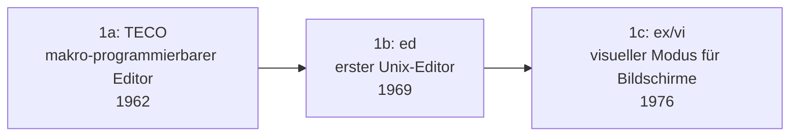

# Evolution und Architekturen digitaler Editoren

Vierter Teil der Entwickler-Werkzeug-Reihe neben [Compilern](evolution-digitaler-compiler.md), [Interpretern](evolution-digitaler-interpreter.md) und [Debuggern](evolution-digitaler-debugger.md): der **Editor**, mit dem der Quelltext überhaupt erst entsteht. Dieser Artikel ordnet die Architektur-Geschichte dieser Werkzeuggattung chronologisch nach **technologischen Generationen** — von zeilenweisen Kommandozeilen-Editoren über die modale/erweiterbare Editor-Ära (vi vs. Emacs), grafische Maus-Editoren und Plugin-Ökosysteme bis zum Language-Server-basierten VS-Code-Zeitalter und schließlich KI-nativen Editoren. Die produkt-/tool-orientierte Übersicht konkreter Editoren und IDEs bietet [IDE & Tools: Übersicht](../ide/index.md).

!!! note "Hinweis: Generationen überlappen sich"
    Die Zeiträume sind grobe Orientierung, keine scharfen Grenzen — vi/Vim (Generation 2) und Emacs (Generation 2) laufen bis heute produktiv parallel zu KI-nativen Editoren (Generation 6). Entscheidend ist das **Erweiterbarkeits- und Interaktionsmodell** (modal, skriptbar, plugin-basiert, sprachserver-gestützt, KI-generativ), nicht allein das Erscheinungsjahr.

---

## Generation 1: Zeilen- & erste Bildschirm-Editoren, 1962 – 1976

Die Gründergeneration eint eine Einschränkung: Bildschirme waren teuer oder fehlten ganz — Editoren arbeiten zunächst zeilenweise auf Teletype-Ausgabe, erst am Ende dieser Generation entsteht ein echter, den ganzen Bildschirm nutzender visueller Modus. Sie lässt sich in drei technologische Entwicklungsstufen unterteilen:

### 1a. TECO — makro-programmierbarer Editor, 1962

- **Architektur:** **T**ext **E**ditor and **CO**rrector, MIT/DEC PDP-1 — Bearbeitung über eine eigene Kommandosprache, die sich zu vollständigen Makros verketten lässt.
- **Bedeutung:** direkter Namens- und Konzept-Vorfahre von Emacs („**E**ditor **MAC**ro**S**" — ursprünglich eine Sammlung von TECO-Makros).

### 1b. ed — der erste Unix-Editor, 1969

- **Architektur:** Ken Thompson, Bell Labs — reiner Zeilen-Editor ohne Bildschirmdarstellung, Befehle wirken auf einzelne Zeilen oder Zeilenbereiche.
- **Bedeutung:** bis heute POSIX-Standard-Editor, direkte syntaktische Grundlage für `sed` und reguläre Ausdrücke in der Unix-Werkzeugkette.

### 1c. ex/vi — visueller Modus für Bildschirme, 1976

- **Architektur:** Bill Joy, UC Berkeley — **ex** erweitert `ed` um mächtigere Zeilenbefehle, sein **vi**-Modus (visual) nutzt erstmals den vollen Bildschirm für eine fortlaufende Textansicht statt einzelner Zeilen.
- **Bedeutung:** begründet das **modale Bearbeitungsmodell** (getrennter Einfüge- und Kommando-Modus), das Generation 2 prägt.

---

## Generation 2: Modale & erweiterbare Editoren — vi vs. Emacs, 1976 – 1985

Zwei grundverschiedene Antworten auf dieselbe Frage („Wie bearbeitet man Text ohne Maus, nur mit Tastatur, möglichst effizient?") entstehen praktisch zeitgleich und prägen bis heute konkurrierende Editor-Philosophien — der Beginn der bekannten „Editor Wars".

**Architektur:** **vi** trennt strikt zwischen Kommando- und Einfüge-Modus (Tastendrücke bedeuten je nach Modus etwas anderes), **Emacs** bleibt in einem einzigen Modus und nutzt stattdessen Tastenkombinationen (Chords) sowie eine vollständige eingebettete Programmiersprache zur Erweiterung.

| System | Jahr | Prinzip |
|---|---|---|
| **vi** | 1976 | Minimaler Speicherbedarf, auf praktisch jedem Unix-System vorinstalliert, modales Editiermodell. |
| **Emacs / GNU Emacs** | 1976/1985 | Richard Stallman — vollständig in **Emacs Lisp** skriptbar, oft als „Betriebssystem, das sich als Editor tarnt" beschrieben. |

---

## Generation 3: Grafische Maus-Editoren, 1985 – 1992

Mit dem Aufstieg grafischer Benutzeroberflächen verschiebt sich Textbearbeitung von reiner Tastatursteuerung zu Maus, Menüs und sichtbaren Textauswahlen.

**Architektur:** WYSIWYG-Textdarstellung, Menüleisten statt Kommandozeilen-Befehlen, Textauswahl per Maus-Drag statt Tastaturkommandos.

| System | Jahr | Besonderheit |
|---|---|---|
| **Notepad** | 1985 | Microsoft, mit Windows 1.0 gebündelt — denkbar einfachster GUI-Texteditor. |
| **BBEdit** | 1992 | Bare Bones Software, Mac — früher professioneller GUI-Editor, bis heute aktiv gepflegt. |

---

## Generation 4: Erweiterbare, Plugin-basierte Editoren, 2004 – 2015

Statt eines festen Funktionsumfangs definiert diese Generation den Editor über sein **Erweiterungs-Ökosystem** — Syntax-Highlighting, Snippets und Sprachunterstützung kommen als installierbare Pakete statt fest einprogrammierter Features.

**Architektur:** deklarative „Bundles"/Packages pro Sprache/Framework, community-getriebene Erweiterungs-Repositories; ab Atom zusätzlich ein radikaler Technologiewechsel — der Editor selbst wird als Webanwendung in **Electron** gebaut statt nativ kompiliert.

| System | Jahr | Besonderheit |
|---|---|---|
| **TextMate** | 2004 | Allan Odom Jones, Mac — prägt das „Bundle"-Konzept (Snippets, Makros, Sprachgrammatiken), direktes Vorbild für Sublime Text. |
| **Sublime Text** | 2008 | Jon Skinner — plattformübergreifender Nachfolger derselben Idee, extrem performant, riesiges Package-Ökosystem über Package Control. |
| **Atom** | 2014 | GitHub — „hackbarer Editor für das 21. Jahrhundert", erste breite Umsetzung eines Desktop-Editors in Web-Technologie (HTML/CSS/JS) über Electron. |

---

## Generation 5: VS Code & das Language-Server-Ökosystem, ab 2015

Microsofts VS Code setzt sich trotz technisch ähnlicher Electron-Basis wie Atom entscheidend durch — nicht primär durch Geschwindigkeit, sondern durch tiefe **Sprachintelligenz** über einen entkoppelten Standard statt editor-eigener Lösungen.

**Architektur:** Sprachanalyse läuft als eigenständiger Prozess über das **Language Server Protocol** statt im Editor-Kern selbst, siehe [Generation 5 der Compiler-Zeitachse](evolution-digitaler-compiler.md#generation-5-der-compiler-als-dauerdienst-lsp-rust-analyzer-ab-2016) — derselbe LSP-Standard, den VS Code miterschuf, wird zum editor-übergreifenden Ökosystem-Fundament, ergänzt um das analoge [Debug Adapter Protocol](evolution-digitaler-debugger.md#generation-5-reverse-debugging-protokoll-standardisierung-2005-2018) für Debugger-Integration.

| Baustein | Jahr | Rolle |
|---|---|---|
| **Visual Studio Code** | 2015 | Microsoft — Open-Source-Kern, riesiger Extensions-Marketplace, siehe [Visual Studio Code in der IDE-Übersicht](../ide/index.md#visual-studio-code-vs-code). |
| **Native, Rust-basierte Gegenbewegung** | ab 2022 | **Zed** — von ehemaligen Atom-Entwicklern gebaut, verzichtet bewusst auf Electron zugunsten nativer GPU-beschleunigter Performance, siehe [Zed in der Rust-IDE-Topliste](rust-ide-topliste.md#3-zed). |

---

## Generation 6: KI-native Editoren, ab 2022

Generative KI wandert vom externen Plugin direkt in den Editor-Kern — Inline-Vorschläge, Chat und autonome Mehrdatei-Bearbeitung werden zu eingebauten Primitiven statt nachgerüsteter Erweiterungen.

**Architektur:** LLM-Streaming-Vorschläge direkt im Editor-Puffer, agentische Mehrdatei-Bearbeitungsschleifen mit Zugriff auf Terminal/Build/Tests statt reiner Textvervollständigung.

| System | Jahr | Rolle |
|---|---|---|
| **Cursor** | 2023 | Anysphere — VS-Code-Fork mit tief integrierten KI-Agenten-Funktionen, siehe [Cursor in der Rust-IDE-Topliste](rust-ide-topliste.md). |
| **Windsurf** | 2024 | Codeium — ebenfalls VS-Code-Basis, „Cascade"-Agentenmodus für Mehrdatei-Änderungen. |
| **Zeds Agentische Funktionen** | ab 2023 | Native KI-Kollaboration direkt im Rust-basierten Editor aus Generation 5 dieses Artikels, siehe [Zed-KI-Integration in der IDE-Übersicht](../ide/index.md#zed). |

!!! tip "Bezug zu diesem Repository"
    Claude Code selbst folgt einem verwandten, aber terminal- statt editor-zentrierten Ansatz derselben Generation — siehe [KI Coding](../../künstliche-intelligenz/coding/ki-coding.md) und [AI Agents Praxis-Handbuch](../../künstliche-intelligenz/coding/ai-agents-praxis.md).

---

## Alternative Sortier- & Klassifikationskriterien für Editoren

Neben dem chronologischen Generationenmodell lassen sich Editoren nach folgenden Dimensionen einordnen:

### 1. Interaktionsmodell

- **Modal** — getrennte Kommando-/Einfüge-Modi, vi/Vim (Generation 2).
- **Nicht-modal mit Chords** — Tastenkombinationen statt Moduswechsel, Emacs (Generation 2).
- **Menü-/Maus-gesteuert** — grafische Editoren (Generation 3+).

### 2. Erweiterbarkeitsmodell

- **Fest verdrahtet** — frühe GUI-Editoren wie Notepad (Generation 3).
- **Eingebettete vollständige Programmiersprache** — Emacs Lisp (Generation 2).
- **Plugin-/Package-Ökosystem** — TextMate, Sublime Text, VS Code (Generation 4–5).

### 3. Implementierungstechnologie

- **Nativ kompiliert** — vi, Emacs, Sublime Text, Zed (Generation 2, 4–5).
- **Electron/Web-Technologie** — Atom, VS Code (Generation 4–5).

### 4. Sprachintelligenz-Architektur

- **Keine** — reine Textbearbeitung ohne Code-Verständnis (Generation 1–3).
- **Editor-eigene Logik** — Sprachunterstützung fest im Editor-Kern verdrahtet (frühe Generation 4).
- **Entkoppelt über Protokoll** — Language Server Protocol (Generation 5).
- **KI-generativ** — LLM erzeugt/verändert Code direkt (Generation 6).

---

## Verwandte Themen

- [Beste Editoren 2026 (Top 15)](editoren-2026-topliste.md) — Momentaufnahme 2026, die diese Chronologie in eine gerankte Topliste übersetzt
- [Evolution und Architekturen digitaler Compiler](evolution-digitaler-compiler.md) — Language Server Protocol aus Generation 5 dort als Fundament von Generation 5 dieses Artikels
- [Evolution und Architekturen digitaler Debugger](evolution-digitaler-debugger.md) — Debug Adapter Protocol aus Generation 5 dort als Debugger-Pendant zu Generation 5 dieses Artikels
- [Evolution und Architekturen digitaler Interpreter](evolution-digitaler-interpreter.md) — komplementäre Ausführungsarchitekturen, die Editoren dieses Artikels als Quelltext-Werkzeug ergänzen
- [IDE & Tools: Übersicht](../ide/index.md) — produkt-/tool-orientierte Gesamtübersicht konkreter Editoren und IDEs
- [Beste IDEs & Editoren mit Rust-Unterstützung (Top 20)](rust-ide-topliste.md) — Zed, Cursor und Windsurf aus Generation 5/6 dieses Artikels im praktischen Rust-Vergleich
- [KI Coding](../../künstliche-intelligenz/coding/ki-coding.md) — Einstieg in terminal-/agentenzentrierte Werkzeuge derselben Generation 6
- [AI Agents – Das Praxis-Handbuch & Architektur-Leitfaden](../../künstliche-intelligenz/coding/ai-agents-praxis.md) — Vertiefung zu agentischer Mehrdatei-Bearbeitung aus Generation 6 dieses Artikels
- [Shell & Bash Praxis-Handbuch](shell-bash-praxis.md) — Vim/vi als alltägliches Terminal-Werkzeug
- [Evolution und Architekturen digitaler Build-Systeme](evolution-digitaler-build-systeme.md) — komplementäre Werkzeuggattung in derselben Entwickler-Werkzeug-Reihe
