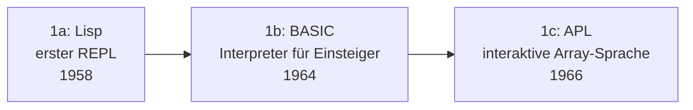

# Evolution und Architekturen digitaler Interpreter

Während [Evolution und Architekturen digitaler Compiler](evolution-digitaler-compiler.md) Quellcode einmalig vollständig in Maschinencode übersetzt, führt ein **Interpreter** ihn direkt aus — Zeile für Zeile, Bytecode-Instruktion für Bytecode-Instruktion, oder heute zunehmend hybrid mit Just-in-Time-Kompilierung heißer Codepfade. Dieser Artikel verfolgt die Architektur-Geschichte dieser komplementären Ausführungsstrategie chronologisch nach **technologischen Generationen**: vom ersten interaktiven Lisp-REPL über portable Bytecode-Virtuelle-Maschinen, den Skriptsprachen-Interpreter-Boom und JIT-Hybride bis zu registerbasierten und Tracing-JIT-Interpretern sowie schließlich sandboxed WebAssembly- und KI-Agenten-Interpretern.

!!! note "Hinweis: Generationen überlappen sich"
    Die Zeiträume sind grobe Orientierung, keine scharfen Grenzen — CPython (Generation 3) läuft bis heute produktiv parallel zu PyPy (Generation 5) für dieselbe Sprache. Entscheidend ist die **Ausführungsarchitektur** (Quelltext-Traversierung, Bytecode-VM, JIT-Hybrid, Tracing), nicht allein das Erscheinungsjahr.

---

## Generation 1: Erste Interpreter — Lisp-REPL, BASIC & APL, 1958 – 1966

Die Gründergeneration eint ein Prinzip: Code wird **direkt aus seiner Baumstruktur heraus ausgeführt** (Tree-Walking), ohne Zwischenschritt in eine kompaktere Zwischendarstellung — dafür interaktiv, mit sofortigem Feedback statt Build-Wartezeit. Sie lässt sich in drei technologische Entwicklungsstufen unterteilen:

### 1a. Lisp — der erste REPL, 1958

- **Architektur:** John McCarthys **Lisp** (siehe [Generation 2 der allgemeinen Programmiersprachen-Zeitachse](../evolution-digitaler-programmiersprachen.md#generation-2-fruhe-hochsprachen-fortran-lisp-algol-1957-1960er)) wird ursprünglich rein interpretiert ausgeführt — der **Read-Eval-Print-Loop (REPL)** entsteht hier als Grundmuster: Ausdruck lesen, auswerten, Ergebnis ausgeben, wiederholen.
- **Bedeutung:** prägt das bis heute dominante interaktive Interpreter-Interface, das praktisch jede spätere Skriptsprache übernimmt.

### 1b. BASIC — Interpreter für Einsteiger, 1964

- **Architektur:** am Dartmouth College (Kemeny & Kurtz) entwickelt, zeilenweise interpretiert, explizit für Programmieranfänger ohne Informatik-Hintergrund konzipiert.
- **Bedeutung:** macht interaktives Programmieren über den Forschungskontext hinaus massentauglich — direkter Vorläufer der Heimcomputer-BASIC-Dialekte der 1970er/1980er.

### 1c. APL — interaktive Array-Sprache, 1966

- **Architektur:** Ken Iversons **APL** interpretiert eine extrem kompakte, auf Array-Operationen spezialisierte Notation direkt und interaktiv.
- **Bedeutung:** zeigt bereits in dieser Frühphase, dass Interpreter nicht nur für Einsteiger-, sondern auch für hochspezialisierte, ausdrucksstarke Notationen taugen — ein konzeptioneller Vorfahre heutiger Array-/Vektor-orientierter Datenanalyse-Werkzeuge.

---

## Generation 2: Portable Bytecode-Virtuelle-Maschinen — p-Code & Smalltalk, 1973 – 1980

Statt bei jeder Ausführung erneut den Quelltext zu parsen, kompiliert diese Generation einmalig in eine kompakte **Bytecode**-Zwischendarstellung — eine virtuelle Maschine interpretiert anschließend diesen Bytecode, nicht mehr den Rohtext.

**Architektur:** ein Compiler-Vorlauf erzeugt plattformunabhängigen Bytecode, eine schlanke virtuelle Maschine führt diesen Bytecode auf jeder Zielplattform gleich aus — Portabilität durch eine gemeinsame Bytecode-Zielarchitektur statt nativer Kompilierung pro Plattform.

| System | Jahr | Rolle |
|---|---|---|
| **UCSD-Pascal-P-System** | 1973/1976 | Kompiliert Pascal zu portablem **p-Code**, der auf jeder Plattform mit passender virtueller Maschine unverändert läuft — früher Vorläufer des „Compile once, run anywhere"-Prinzips. |
| **Smalltalk-80** | 1980 | Xerox PARC — eigene Bytecode-VM plus persistentes „Image" (der gesamte Laufzeitzustand wird gespeichert und fortgesetzt statt bei jedem Start neu aufgebaut). |

---

## Generation 3: Skriptsprachen-Interpreter-Boom, 1987 – 1995

Mit dem Aufstieg der Skriptsprachen (siehe [Generation 4 der allgemeinen Programmiersprachen-Zeitachse](../evolution-digitaler-programmiersprachen.md#generation-4-skriptsprachen-perl-python-ruby-php-javascript-1987-2000er)) wird „Quelltext kompilieren zu Bytecode, dann Bytecode interpretieren" zum Standardmuster für eine ganze neue Sprachgeneration.

**Architektur:** ein interner Compiler-Schritt erzeugt Bytecode bei jedem Programmstart (oder gecacht als `.pyc`-Datei), eine Bytecode-Interpreter-Schleife führt diesen anschließend aus — kein separater, für Menschen sichtbarer Build-Schritt wie bei Generation 2.

| Interpreter | Jahr | Besonderheit |
|---|---|---|
| **Perl** | 1987 | Kompiliert intern zu einem Op-Baum, den die Perl-VM anschließend abarbeitet. |
| **Tcl** | 1988 | John Ousterhout — als eingebettete Kommandosprache für andere Anwendungen konzipiert, nicht als eigenständiges Programm. |
| **CPython** | 1991 | Kompiliert zu `.pyc`-Bytecode, den eine Stack-basierte virtuelle Maschine interpretiert — bis heute die Referenzimplementierung von Python. |

---

## Generation 4: JIT-Hybride — Bytecode-Interpretation trifft Laufzeitkompilierung, 1995 – 1999

Reine Bytecode-Interpretation bleibt langsamer als nativer Maschinencode — diese Generation kombiniert beides: zunächst interpretieren, häufig durchlaufene („heiße") Codepfade zur Laufzeit zusätzlich in nativen Code kompilieren.

**Architektur:** ein Profiler innerhalb der Laufzeitumgebung erkennt häufig ausgeführten Code, ein Just-in-Time-Compiler übersetzt genau diese Pfade nachträglich — kalter, selten ausgeführter Code bleibt einfach interpretiert statt vollständig vorab kompiliert zu werden.

| System | Jahr | Rolle |
|---|---|---|
| **Java HotSpot VM** | 1999 | Sun Microsystems — interpretiert Java-Bytecode zunächst, identifiziert „heiße" Methoden per Laufzeit-Profiling und kompiliert nur diese in nativen Code. |

!!! tip "V8 als spätere Radikalisierung desselben Prinzips"
    **V8** (2008, Google) treibt dieselbe Grundidee weiter, indem JavaScript-Quelltext direkt statt vorher kompiliertem Bytecode als JIT-Ausgangspunkt dient — Details dazu in [Generation 4 der Compiler-Architektur-Zeitachse](evolution-digitaler-compiler.md#generation-4-modulare-zwischendarstellung-just-in-time-llvm-clang-v8-2003-2008).

---

## Generation 5: Register-basierte VMs & Tracing-JIT — Lua & PyPy, 1993 – 2007

Die meisten Bytecode-Interpreter aus Generation 2–4 sind **stack-basiert** — diese Generation zeigt zwei alternative Architekturentscheidungen, die jeweils messbare Geschwindigkeitsvorteile bringen.

**Architektur:** ein **register-basiertes** Instruktionsformat (mehr Information pro Instruktion, weniger Instruktionen insgesamt) statt eines Stack-basierten Formats; alternativ ein **Tracing-JIT**, der tatsächlich durchlaufene Ausführungspfade („Traces") statt einzelner Methoden als Kompilierungseinheit nutzt.

| System | Jahr | Besonderheit |
|---|---|---|
| **Lua** | 1993 (Register-VM ab Lua 5.0, 2003) | Roberto Ierusalimschy u. a. (Brasilien) — registerbasierte statt stackbasierte Bytecode-VM, eine bewusste Ausnahme vom üblichen VM-Design. |
| **PyPy** | 2007 | Ein Python-Interpreter, selbst in einer Python-Teilmenge geschrieben, mit **Meta-Tracing-JIT** — verfolgt tatsächlich durchlaufene Schleifen-Pfade zur Laufzeit und kompiliert genau diese, statt einzelner Funktionen wie bei Generation 4. |

---

## Generation 6: Sandbox-Interpreter für WebAssembly & KI-Agenten, ab 2017

Portabilität (Generation 2) und Interaktivität (Generation 1) treffen auf ein neues Design-Ziel: **Sicherheits-Isolation** — Code aus nicht vertrauenswürdiger Quelle (Browser-Plugin, von einem LLM generierter Code) muss ausführbar sein, ohne das Host-System zu gefährden.

**Architektur:** ein kompaktes, formal spezifiziertes Bytecode-Format mit eingebauten Sandbox-Garantien (kein direkter Speicherzugriff außerhalb des zugewiesenen linearen Speichers) statt nachträglich aufgesetzter Betriebssystem-Sandboxen.

| Baustein | Jahr | Rolle |
|---|---|---|
| **WebAssembly (WASM) & Wasmtime/Wasmer** | 2017/2019 | Portables, sandboxed Bytecode-Format plus eigenständige Runtimes außerhalb des Browsers — knüpft konzeptionell an p-Codes Portabilitätsidee aus Generation 2 an, mit Sicherheit als zusätzlichem Kernziel. |
| **Pyodide** | 2018 | CPython zu WebAssembly kompiliert — vollständiger Python-Interpreter läuft sandboxed direkt im Browser, ohne Server-Backend. |
| **LLM-Agenten-Code-Sandboxes** | ab 2023 | Autonome KI-Agenten führen generierten Code in isolierten Interpreter-Umgebungen aus, siehe [ChatGPT Code Interpreter in Generation 6 der Notebook-Systeme-Zeitachse](../../wissen/dokumentation/evolution-digitaler-notebook-systeme.md#generation-6-ki-native-agentengestutzte-notebook-umgebungen-ab-2023) und [Generation 3 der Autonomen-KI-Agenten-Zeitachse](../../künstliche-intelligenz/evolution-digitaler-autonome-ki-agenten.md#generation-3-autonome-coding-agenten-2023-2025). |

---

## Alternative Sortier- & Klassifikationskriterien für Interpreter

Neben dem chronologischen Generationenmodell lassen sich Interpreter nach folgenden Dimensionen einordnen:

### 1. Ausführungseinheit

- **Tree-Walking** — direkte AST-Traversierung ohne Zwischenschritt (Generation 1).
- **Bytecode-Interpretation** — vorab kompakt kompilierte Zwischendarstellung (Generation 2–3).
- **JIT-Hybrid** — Interpretation plus selektive Laufzeitkompilierung heißer Pfade (Generation 4–5).

### 2. VM-Architektur

- **Stack-basiert** — die meisten Bytecode-VMs, u. a. CPython, JVM-Bytecode (Generation 2–4).
- **Register-basiert** — Lua (Generation 5), seltener und meist schneller pro Instruktion.

### 3. Portabilitätsziel

- **Plattformunabhängige Distribution** — p-Code, Java-Bytecode, WASM (Generation 2, 6).
- **Reine Ausführungsgeschwindigkeit** — JIT-Hybride ohne primären Portabilitäts-Fokus (Generation 4–5).

### 4. Sicherheits-Isolation

- **Kein Sandboxing** — frühe Interpreter, volles Systemvertrauen vorausgesetzt (Generation 1–5).
- **Explizit sicherheitsisoliert** — WASM-Runtimes, Pyodide, LLM-Code-Sandboxes (Generation 6).

---

## Verwandte Themen

- [Evolution und Architekturen digitaler Compiler](evolution-digitaler-compiler.md) — komplementäre Ausführungsstrategie, V8/JIT als geteilter Berührungspunkt in Generation 4 beider Artikel
- [Evolution und Architekturen digitaler Programmiersprachen](../evolution-digitaler-programmiersprachen.md) — übergeordnetes Paradigmen-Generationenmodell, Lisp/BASIC (Generation 2/4 dort) als Ursprung von Generation 1 dieses Artikels
- [Shell & Bash Praxis-Handbuch](shell-bash-praxis.md) — Bash selbst als alltäglich genutzter Interpreter
- [Evolution und Architekturen digitaler Notebook-Systeme](../../wissen/dokumentation/evolution-digitaler-notebook-systeme.md) — ChatGPT Code Interpreter als Produktbeispiel aus Generation 6 dieses Artikels
- [Evolution und Architekturen digitaler Autonomer KI-Agenten](../../künstliche-intelligenz/evolution-digitaler-autonome-ki-agenten.md) — Vertiefung zu den Code-Sandboxes aus Generation 6 dieses Artikels
- [Evolution und Architekturen digitaler Programmierparadigmen](../evolution-digitaler-programmierparadigmen.md) — die Berechnungsmodelle, die Interpreter dieses Artikels jeweils zur Laufzeit ausführen
- [Evolution und Architekturen digitaler Editoren](evolution-digitaler-editoren.md) — komplementäre Werkzeuggattung, in der Quelltext für diese Interpreter überhaupt erst entsteht
