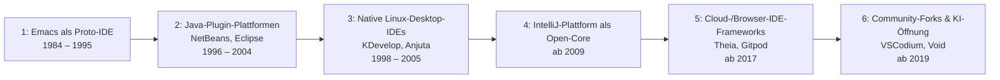

# Evolution und Architekturen digitaler Open-Source-IDEs

Ergänzung zur [Evolution und Architekturen digitaler Editoren](evolution-digitaler-editoren.md): Jene Chronologie ordnet schlanke, universelle Text-Editoren ein — dieser Artikel widmet sich der eng verwandten, aber architektonisch andersartigen Werkzeuggattung der vollwertigen **integrierten Entwicklungsumgebung (IDE)**: eingebaute Projektverwaltung, Build- und Debugger-Integration sowie Refactoring-Werkzeuge direkt ab Werk statt lose zusammengesteckter Einzelprogramme. Der Fokus liegt bewusst auf **Open-Source-IDEs** — von den ersten frei verfügbaren Editor/Compiler/Debugger-Verschmelzungen über Java-getriebene Plugin-Plattformen und native Linux-Desktop-IDEs bis zu Open-Core-Plattformen, Cloud-IDE-Frameworks und community-getriebenen KI-Öffnungen.

!!! note "Hinweis: Generationen überlappen sich"
    Die Zeiträume sind grobe Orientierung, keine scharfen Grenzen — Eclipse (Generation 2) wird bis heute aktiv weiterentwickelt, parallel zu Cloud-IDE-Frameworks (Generation 5) und KI-nativen Forks (Generation 6). Entscheidend ist das **Architektur- und Lizenzmodell** (monolithisch vs. Plugin-Ökosystem, vollständig offen vs. Open-Core), nicht allein das Erscheinungsjahr.

---

## Generationen im Überblick

---

## Generation 1: Emacs als Proto-IDE, 1984 – 1995

Vor dem Begriff „IDE" verschmilzt GNU Emacs erstmals frei verfügbar Editor, Compiler-Aufruf und Debugger in einem einzigen Prozess — ohne grafische Projektverwaltung, aber mit dem architektonischen Grundprinzip, das spätere Generationen ausbauen: externe Werkzeuge werden **in** den Editor eingebunden statt daneben in einem separaten Terminal bedient zu werden.

- **Architektur:** `compile-mode` verknüpft Compiler-Fehlermeldungen direkt mit Quellcodezeilen (Sprung per Tastendruck), `GUD` (Grand Unified Debugger) steuert GDB, DBX und weitere Debugger aus demselben Emacs-Puffer heraus.
- **Bedeutung:** Referenzpunkt „Editor + externe Werkzeuge über Prozess-Schnittstelle" statt monolithischer IDE mit grafischer Oberfläche — dieselbe Grundidee lebt in Generation 5 der [Editoren-Evolution](evolution-digitaler-editoren.md#generation-5-vs-code-das-language-server-okosystem-ab-2015) über das Language Server Protocol fort.

---

## Generation 2: Java-getriebene Plugin-Plattformen, 1996 – 2004

Mit Javas Aufstieg entstehen die ersten grafischen Open-Source-IDEs, die eine ganze Sprache samt Werkzeugkette (Compiler, Debugger, Projektverwaltung) in einer Anwendung bündeln — und dabei zwei grundverschiedene Architektur-Philosophien etablieren.

| System | Jahr | Architektur |
|---|---|---|
| **NetBeans** | 1996 (als „Xelfi", tschechisches Studentenprojekt); 2000 von Sun Microsystems gekauft und unter der Sun Public License quelloffen veröffentlicht | eigenes, modulares NetBeans-Plattform-Framework — Module lassen sich zur Laufzeit hinzufügen, Vorläufer heutiger Plugin-Container. |
| **Eclipse** | 2001, von IBM als Open Source veröffentlicht (zunächst Common Public License, später Eclipse Public License) | radikalerer Ansatz: die IDE selbst ist nur eine Sammlung von Plugins auf der generischen **Rich Client Platform (RCP)**, aufgebaut auf dem OSGi-Komponentenmodell — Sprachunterstützung jenseits Java (C/C++ über CDT, Python über PyDev) kommt ebenfalls als Plugin, kein fest verdrahteter Kern. |

**Bedeutung:** Eclipses OSGi-basierte Plugin-Architektur wird zum Vorbild für praktisch jede spätere erweiterbare Open-Source-IDE und beeinflusst sogar spätere Cloud-IDE-Frameworks (Generation 5).

---

## Generation 3: Native Linux-Desktop-IDEs, 1998 – 2005

Als Gegenentwurf zu den „schwergewichtigen", Java-zentrierten IDEs aus Generation 2 entstehen IDEs, die tief in die jeweiligen Linux-Desktop-Toolkits integriert sind statt auf einer eigenen, sprachunabhängigen Plattform zu laufen.

| System | Jahr | Toolkit/Ökosystem |
|---|---|---|
| **KDevelop** | 1998 | Qt/KDE — native C++-IDE, seit KDevelop 4 (2010) auf LLVM/Clang für semantische Codeanalyse umgestellt. |
| **Anjuta** | 1999 | GTK/GNOME — ursprünglich stark auf C-Entwicklung fokussiert, Glade-Integration für GUI-Design. |

**Bedeutung:** näher am jeweiligen Betriebssystem-Look-and-Feel und schlanker als Eclipse/NetBeans, dafür enger an ein einzelnes Desktop-Ökosystem gebunden — ein Kompromiss, der Generation 4 mit einer sprachübergreifenden, aber leichtgewichtigeren Plattform auflöst.

---

## Generation 4: IntelliJ-Plattform als Open-Core, ab 2009

JetBrains öffnet 2009 den Kern von IntelliJ IDEA als **IntelliJ IDEA Community Edition** unter Apache-2.0-Lizenz, während die funktionsreichere „Ultimate"-Version proprietär und kostenpflichtig bleibt — ein **Open-Core**-Modell statt vollständigem Open Source.

- **Architektur:** die offene IntelliJ-Plattform (PSI für Code-Strukturanalyse, eigenes Indexierungssystem) wird zur gemeinsamen Basis für weitere Produkte — darunter **Android Studio** (Google, 2013, direkt auf der IntelliJ-Plattform aufgesetzt) und **PyCharm Community Edition**.
- **Bedeutung:** erstes verbreitetes Beispiel, bei dem eine kommerzielle IDE-Firma den Plattform-Kern öffnet, um ein Plugin-Ökosystem zu fördern, während Premium-Features proprietär bleiben — ein Muster, das Jahre später auch VS Code (offener Kern, Microsofts proprietärer Marketplace-Vertrag) in abgewandelter Form wiederholt, siehe [Generation 5 der Editoren-Evolution](evolution-digitaler-editoren.md#generation-5-vs-code-das-language-server-okosystem-ab-2015).

---

## Generation 5: Cloud-/Browser-IDE-Frameworks, ab 2017

Die IDE verlässt den lokal installierten Rechner und wird zum containerisierten Dienst, der im Browser läuft — Quellcode und Rechenleistung liegen auf einem Server statt auf dem Entwicklungsrechner.

| System | Jahr | Rolle |
|---|---|---|
| **Eclipse Theia** | 2017, TypeFox/Ericsson, an die Eclipse Foundation übergeben | quelloffenes IDE-**Framework** für Browser und Desktop, wiederverwendet VS Codes Erweiterungsmodell und Language-Server-Protocol-Anbindung, aber vollständig unter Open-Source-Lizenz statt Microsofts Mischmodell. |
| **Gitpod** | seit 2018 (Gründung), Cloud-Produkt ab 2020 | ephemere, automatisiert aus dem Git-Repository hochgefahrene Cloud-Entwicklungsumgebung — Konfiguration selbst versioniert als `.gitpod.yml` im Projekt. |

**Bedeutung:** löst die IDE aus der lokalen Maschine heraus und macht Entwicklungsumgebungen reproduzierbar und sofort startbar — dieselbe Grundidee wie in [VS Code Dev Containers](../ide/index.md#remote-entwicklung), hier jedoch vollständig im Browser statt lokal mit Remote-Anbindung.

---

## Generation 6: Community-Forks & KI-native Öffnung, ab 2019

Als Reaktion auf zunehmend proprietäre Zusatzschichten — Microsofts Telemetrie/Marketplace-Bedingungen bei VS Code, geschlossene KI-Agentenfunktionen bei Cursor/Windsurf (siehe [Generation 6 der Editoren-Evolution](evolution-digitaler-editoren.md#generation-6-ki-native-editoren-ab-2022)) — entstehen vollständig quelloffene Gegenentwürfe auf derselben Codebasis.

| System | Jahr | Rolle |
|---|---|---|
| **VSCodium** | seit 2019 | vollständig aus dem offenen VS-Code-Kern gebauter Fork ohne Microsofts proprietäre Telemetrie und Branding — zeigt das Spannungsfeld zwischen offenem Kern und proprietären Zusatzdiensten aus Generation 4/5 explizit auf. |
| **Void** | seit 2024 | quelloffener Gegenentwurf zu Cursor — VS-Code-Fork mit integrierten KI-Agentenfunktionen, die beim proprietären Vorbild verschlossen bleiben. |

**Bedeutung:** die KI-Schicht selbst wird zum neuen Schauplatz der Open-Source-vs-proprietär-Debatte, die diese Chronologie seit Generation 2 (Eclipse vs. proprietäre Java-IDEs) begleitet.

---

## Alternative Sortier- & Klassifikationskriterien für Open-Source-IDEs

Neben dem chronologischen Generationenmodell lassen sich Open-Source-IDEs nach folgenden Dimensionen einordnen:

### 1. Architekturmodell

- **Monolithisch mit eingebetteten Werkzeugen** — Emacs als Proto-IDE (Generation 1).
- **Plugin-/Modul-Ökosystem auf generischer Plattform** — Eclipse RCP, NetBeans-Plattform, IntelliJ-Plattform (Generation 2, 4).
- **Containerisiertes Cloud-Framework** — Eclipse Theia, Gitpod (Generation 5).

### 2. Lizenzmodell

- **Vollständig quelloffen** — Eclipse, NetBeans, KDevelop, Anjuta, Theia, VSCodium.
- **Open-Core** — IntelliJ IDEA Community (offen) vs. Ultimate (proprietär), Android Studio als vollständig offener Sonderfall auf derselben Plattform.

### 3. Ziel-Ökosystem/Toolkit

- **Java/Swing** — NetBeans, frühes Eclipse SWT/JFace.
- **Qt/KDE bzw. GTK/GNOME** — KDevelop bzw. Anjuta (Generation 3).
- **Web/Electron/Browser** — Theia, Gitpod, VSCodium, Void (Generation 5–6).

### 4. Grad der KI-Integration

- **Keine** — Generation 1–4, reine Werkzeugintegration ohne generative Komponente.
- **Community-nachgerüstet** — Plugin-basierte KI-Erweiterungen auf offenen Plattformen.
- **Nativ agentisch, vollständig offen** — Void (Generation 6), im Gegensatz zum proprietären Cursor/Windsurf-Modell.

---

## Verwandte Themen

- [Evolution und Architekturen digitaler Editoren](evolution-digitaler-editoren.md) — komplementäre Chronologie schlanker Text-Editoren, auf die dieser Artikel in mehreren Generationen verweist
- [Beste Editoren 2026 (Top 15)](editoren-2026-topliste.md) — Momentaufnahme 2026, in der JetBrains IDEs (Generation 4 dieses Artikels) als Rang 3 geführt werden
- [Beste IDEs & Editoren mit Rust-Unterstützung (Top 20)](rust-ide-topliste.md) — praktischer Vergleich konkreter Werkzeuge, darunter mehrere Systeme aus Generation 5/6 dieses Artikels
- [Evolution und Architekturen digitaler Compiler](evolution-digitaler-compiler.md) — Language Server Protocol, das die Editor/IDE-Trennung aus Generation 1 dieses Artikels architektonisch neu auflöst
- [Evolution und Architekturen digitaler Debugger](evolution-digitaler-debugger.md) — Debug Adapter Protocol als Pendant zur GUD-Integration aus Generation 1 dieses Artikels
- [IDE & Tools: Übersicht](../ide/index.md) — produkt-/tool-orientierte Gesamtübersicht konkreter Editoren und IDEs
- [KI Coding](../../künstliche-intelligenz/coding/ki-coding.md) — Einstieg in terminal-/agentenzentrierte Werkzeuge, die Generation 6 dieses Artikels ergänzen
