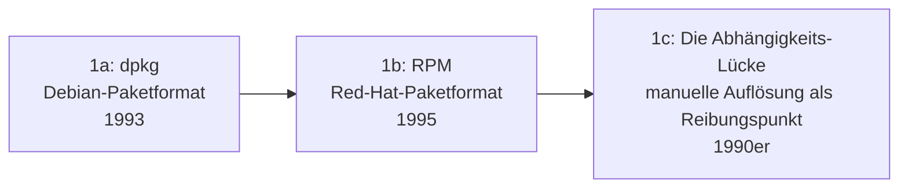

# Evolution und Architekturen digitaler Paketmanager

Verwandt, aber nicht deckungsgleich mit [Evolution und Architekturen digitaler Build-Systeme](evolution-digitaler-build-systeme.md): Ein **Paketmanager** entscheidet nicht, *wie* aus Quellcode ein Programm entsteht, sondern *woher* fertige Software (oder ihre Quell-Abhängigkeiten) kommt, wie deren Versionsbeziehungen untereinander aufgelöst werden und wie sie installiert, aktualisiert und wieder entfernt wird — Cargo und Maven aus Generation 3 der Build-Systeme-Zeitachse vereinen beide Rollen in einem Werkzeug, die meisten Paketmanager dieses Artikels bleiben eigenständig. Dieser Artikel ordnet die Architektur-Geschichte der Paketverwaltung chronologisch nach **technologischen Generationen**: von ersten OS-Paketformaten ohne automatische Abhängigkeitsauflösung über deren Lösung, sprachspezifische Registries, funktionale/hermetische Paketmanager, Lockfiles bis zu automatisierter Abhängigkeitspflege und kryptographischer Lieferketten-Sicherheit.

!!! note "Hinweis: Generationen überlappen sich"
    Die Zeiträume sind grobe Orientierung, keine scharfen Grenzen — APT (Generation 2) läuft bis heute produktiv, parallel zu KI-gestützten Dependency-Bots (Generation 6). Entscheidend ist das **Auflösungs- und Isolationsmodell** (keine Auflösung, automatisch aus Repository, projektlokal, hash-adressiert-koexistent), nicht allein das Erscheinungsjahr.

---

## Generation 1: Erste OS-Paketformate ohne Abhängigkeitsauflösung, 1993 – 1995

Die Gründergeneration löst ein erstes, aber noch unvollständiges Problem: Software wird als **Paket** mit Metadaten (Name, Version, Abhängigkeitsliste) statt als lose Dateisammlung verteilt — die eigentliche Auflösung dieser Abhängigkeiten bleibt jedoch noch manuelle Handarbeit. Sie lässt sich in drei technologische Entwicklungsstufen unterteilen:

### 1a. dpkg — das Debian-Paketformat, 1993

- **Architektur:** Ian Murdock/Ian Jackson, Debian-Projekt — ein `.deb`-Archiv bündelt Programmdateien mit Metadaten, eine lokale Datenbank verfolgt installierte Pakete und deren Versionen.
- **Bedeutung:** eines der ersten strukturierten Paketformate für Linux, direktes Fundament der späteren Debian-/Ubuntu-Paketwelt.

### 1b. RPM — das Red-Hat-Paketformat, 1995

- **Architektur:** Erik Troan/Marc Ewing, Red Hat — analoges Konzept zu dpkg für die RPM-basierte Distributionsfamilie (Red Hat, später Fedora, SUSE).
- **Bedeutung:** etabliert ein zweites, bis heute paralleles Paketformat-Ökosystem neben Debian/dpkg.

### 1c. Die Abhängigkeits-Lücke — manuelle Auflösung als Reibungspunkt, 1990er

- **Architektur:** beide Formate speichern Abhängigkeiten nur als **Metadaten** — weder dpkg noch RPM laden fehlende Abhängigkeiten selbstständig nach, das berüchtigte „Dependency Hell" entsteht.
- **Bedeutung:** die direkte Motivation für Generation 2 — ein Paketformat allein löst das Verteilungsproblem nicht, ohne einen Auflösungsmechanismus darüber.

---

## Generation 2: Automatische Abhängigkeitsauflösung — APT & YUM, 1998 – 2003

Diese Generation löst exakt die Lücke aus Generation 1c: ein Auflösungs-Werkzeug berechnet die vollständige Abhängigkeitskette automatisch und lädt fehlende Pakete direkt aus einem Netzwerk-Repository nach.

**Architektur:** ein zentraler oder gespiegelter **Repository-Index** listet verfügbare Pakete samt Abhängigkeiten, ein Solver-Algorithmus berechnet daraus die vollständige, widerspruchsfreie Installationsmenge — der Nutzer gibt nur noch das gewünschte Ziel-Paket an.

| System | Jahr | Basis-Format |
|---|---|---|
| **APT** (Advanced Package Tool) | 1998 | Debian — löst „Dependency Hell" für `.deb`-Pakete, bis heute Standard-Werkzeug (`apt install`). |
| **YUM** (Yellowdog Updater, Modified) | 2003 | analoges Auflösungswerkzeug für RPM-Pakete, später von **DNF** (2015, Fedora) technisch abgelöst. |

---

## Generation 3: Sprachspezifische Paketmanager & zentrale Registries, 1995 – 2010

Statt Betriebssystem-weiter Pakete verwaltet diese Generation Abhängigkeiten **pro Programmiersprache und pro Projekt** — ein zentrales, sprachspezifisches Registry ersetzt das OS-Repository, Installationen landen projektlokal statt systemweit geteilt.

**Architektur:** ein Manifest (z. B. `package.json`, `Gemfile`) deklariert Abhängigkeiten mit Versionsbereichen, ein zentrales Online-Registry hält die tatsächlichen Paket-Uploads vor — Isolation pro Projekt verhindert, dass zwei Projekte auf demselben Rechner sich gegenseitige, inkompatible Versionen aufzwingen.

| System | Jahr | Sprache |
|---|---|---|
| **CPAN** | 1995 | Perl — eines der frühesten umfassenden sprachspezifischen Paket-Archive überhaupt. |
| **PyPI / pip** | 2003/2008 | Python. |
| **RubyGems** | 2004 | Ruby. |
| **Composer** | 2011 | PHP — siehe [Generation 2 der Batteries-Included-Zeitachse](../webentwicklung/evolution-digitaler-batteries-included-frameworks.md#generation-2-php-batterie-nachzugler-micro-framework-gegenbewegung-2006-2015) für Laravels Composer-Integration. |
| **npm** | 2010 | Node.js/JavaScript — Isaac Z. Schlueter, wird zum größten Paket-Registry überhaupt. |

---

## Generation 4: Funktionale, hermetische Paketmanager — Nix, ab 2003

Statt Pakete an einem einzigen, geteilten Systempfad zu installieren (mit dem Risiko, dass eine Aktualisierung eine andere Software bricht), adressiert diese Generation jedes Paket über einen **Hash aller seiner Build-Eingaben** — dieselbe Grundidee wie hermetische Build-Systeme, hier auf die Paketinstallation selbst angewendet.

**Architektur:** jedes Paket landet unter einem eindeutigen, inhaltsadressierten Pfad (`/nix/store/<hash>-paket-version`), mehrere Versionen koexistieren konfliktfrei nebeneinander, Upgrades/Rollbacks sind atomar — konzeptioneller Vorläufer der hermetischen Isolation aus [Generation 4 der Build-Systeme-Zeitachse](evolution-digitaler-build-systeme.md#generation-4-hermetische-cachefahige-monorepo-build-systeme-2013-2023).

| System | Jahr | Rolle |
|---|---|---|
| **Nix** | 2003 | Eelco Dolstra (Doktorarbeit, Universität Utrecht) — rein funktionaler Paketmanager, direktes Vorbild für NixOS als komplettes, deklaratives Betriebssystem. |

---

## Generation 5: Lockfiles & plattformunabhängige User-Space-Manager, 2009 – 2016

Zwei parallele Lücken werden geschlossen: macOS hatte lange keinen nativen Paketmanager, und Versionsbereiche in Manifesten (Generation 3) lieferten bei unterschiedlichen Installationszeitpunkten unterschiedliche, nicht reproduzierbare Ergebnisse.

**Architektur:** eine **Lockfile** (`Gemfile.lock`, `yarn.lock`) fixiert die exakt aufgelösten Versionen zusätzlich zum Manifest mit Versionsbereichen — derselbe Installationsbefehl liefert damit garantiert dasselbe Ergebnis auf jeder Maschine; parallel etabliert sich Paketverwaltung ganz ohne Root-Rechte im Nutzerverzeichnis.

| System | Jahr | Besonderheit |
|---|---|---|
| **Homebrew** | 2009 | Max Howell — füllt die fehlende native Paketverwaltung auf macOS, Installation im Nutzerverzeichnis ohne `sudo`. |
| **Bundler** | 2010 | Ruby — führt das `Gemfile.lock`-Konzept ein, direktes Vorbild für spätere Lockfile-Formate anderer Sprachen. |
| **Yarn** | 2016 | Facebook — Reaktion auf npms damalige Geschwindigkeits- und Determinismus-Schwächen, `yarn.lock` als Antwort. |

---

## Generation 6: Automatisierte Abhängigkeitspflege & Lieferketten-Sicherheit, ab 2017

Manuelles Aktualisieren Dutzender Abhängigkeiten wird unpraktikabel — diese Generation automatisiert sowohl das **Vorschlagen von Updates** als auch den **kryptographischen Nachweis**, dass ein installiertes Paket tatsächlich aus seiner behaupteten Quelle stammt.

**Architektur:** ein Bot überwacht Registries auf neue Versionen und öffnet automatisiert Pull Requests, eine separate Signatur-Infrastruktur bindet jedes veröffentlichte Paket kryptographisch an seine CI-Build-Identität statt an einen langlebigen, verlierbaren privaten Schlüssel.

| Baustein | Jahr | Rolle |
|---|---|---|
| **Dependabot / Renovate** | ab 2017 | Automatisierte Update-Pull-Requests für Abhängigkeiten über praktisch jedes Registry-Ökosystem hinweg. |
| **Sigstore** | 2021 | Linux Foundation/Google/Red Hat — „keyless signing": kurzlebige Zertifikate statt dauerhafter privater Schlüssel, Antwort auf zunehmende Supply-Chain-Angriffe auf Registries. |
| **KI-Agenten für Abhängigkeits-Updates** | ab 2023 | Bewerten und mergen Update-Vorschläge zunehmend automatisiert, siehe [Generation 3 der Autonomen-KI-Agenten-Zeitachse](../../künstliche-intelligenz/evolution-digitaler-autonome-ki-agenten.md#generation-3-autonome-coding-agenten-2023-2025). |

---

## Alternative Sortier- & Klassifikationskriterien für Paketmanager

Neben dem chronologischen Generationenmodell lassen sich Paketmanager nach folgenden Dimensionen einordnen:

### 1. Auflösungsstrategie

- **Keine automatische Auflösung** — dpkg, RPM (Generation 1).
- **Automatisch aus Repository-Index** — APT, YUM, npm, RubyGems (Generation 2–3).
- **Inhaltsadressiert/deterministisch** — Nix (Generation 4).

### 2. Geltungsbereich

- **Systemweit geteilt** — dpkg, RPM, APT, YUM, Homebrew (Generation 1–2, 5).
- **Projektlokal isoliert** — npm, RubyGems, Composer (Generation 3).
- **Hash-adressiert, koexistent** — Nix (Generation 4).

### 3. Determinismus

- **Versionsbereiche ohne Fixierung** — frühe Sprachmanifeste (Generation 3).
- **Lockfile-fixiert** — Bundler, Yarn, moderne npm-Versionen (Generation 5).

### 4. Sicherheitsmodell

- **Unsigniert, Vertrauen ins Repository** — Generation 1–5.
- **Kryptographisch attestiert** — Sigstore (Generation 6).

---

## Verwandte Themen

- [Beste Paketmanager 2026 (Top 15)](paketmanager-2026-topliste.md) — Momentaufnahme 2026, die diese Chronologie in eine gerankte Topliste übersetzt
- [Produktionsreife Open-Source-Paketmanager nach Generation (Top 13)](produktionsreife-paketmanager-generationen-2026-topliste.md) — dasselbe Generationenmodell durch ein konservatives Fünf-Filter-Sieb (Reifegrad, Betreiberbasis, Betriebs-Skala, Speicherbackend)
- [Evolution und Architekturen digitaler Build-Systeme](evolution-digitaler-build-systeme.md) — Cargo/Maven aus Generation 3 dort vereinen Build- und Paketverwaltung, Nix' hermetisches Prinzip aus Generation 4 dieses Artikels als konzeptioneller Vorläufer von Generation 4 dort
- [Evolution und Architekturen digitaler Batteries-Included-Web-Frameworks](../webentwicklung/evolution-digitaler-batteries-included-frameworks.md) — Composer als Laravels Paketverwaltungs-Baustein aus Generation 3 dieses Artikels
- [Rust in der Praxis](rust-praxis.md) — Cargo als integrierter Build-/Paketmanager, siehe auch [Generation 3 der Build-Systeme-Zeitachse](evolution-digitaler-build-systeme.md#generation-3-sprachintegrierte-build-paketmanager-2004-2014)
- [Linux Praxis-Handbuch](linux-praxis.md) — praktische APT-/Paketverwaltungs-Nutzung aus Generation 2 dieses Artikels
- [Evolution und Architekturen digitaler Autonomer KI-Agenten](../../künstliche-intelligenz/evolution-digitaler-autonome-ki-agenten.md) — Vertiefung zu Generation 6 dieses Artikels
- [Evolution und Architekturen digitaler Versionskontrollsysteme](evolution-digitaler-versionskontrollsysteme.md) — komplementäre Werkzeuggattung in derselben Entwickler-Werkzeug-Reihe
