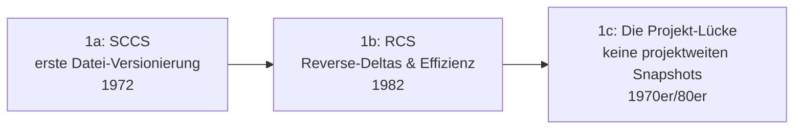

# Evolution und Architekturen digitaler Versionskontrollsysteme

Siebter Teil der Entwickler-Werkzeug-Reihe neben [Compilern](evolution-digitaler-compiler.md), [Interpretern](evolution-digitaler-interpreter.md), [Debuggern](evolution-digitaler-debugger.md), [Editoren](evolution-digitaler-editoren.md), [Build-Systemen](evolution-digitaler-build-systeme.md) und [Paketmanagern](evolution-digitaler-paketmanager.md): das **Versionskontrollsystem**, das jede Änderung am Quelltext nachvollziehbar, wiederherstellbar und mit anderen Entwicklern koordinierbar macht. Dieser Artikel ordnet die Architektur-Geschichte dieser Werkzeuggattung chronologisch nach **technologischen Generationen**: von erster Einzeldatei-Versionierung über zentrale, projektweite Systeme, verteilte Versionskontrolle, Hosting-Plattformen mit Pull-Request-Workflow bis zu Werkzeugen für große Binärdateien/Monorepo-Skalierung und schließlich KI-gestützten Commit-Workflows.

!!! note "Hinweis: Generationen überlappen sich"
    Die Zeiträume sind grobe Orientierung, keine scharfen Grenzen — Subversion (Generation 2) läuft bis heute produktiv parallel zu Git (Generation 3). Entscheidend ist die **Topologie** (zentral vs. verteilt) und das **Speichermodell** (Einzeldatei-Deltas, projektweite Snapshots, virtualisierte Checkouts), nicht allein das Erscheinungsjahr.

---

## Generation 1: Erste Einzeldatei-Versionierung — SCCS & RCS, 1972 – 1982

Die Gründergeneration eint eine Einschränkung: versioniert wird jeweils **eine einzelne Datei**, nicht ein ganzes Projekt als zusammenhängender Zustand — ein Gesamt-Snapshot über mehrere Dateien hinweg existiert noch nicht. Sie lässt sich in drei technologische Entwicklungsstufen unterteilen:

### 1a. SCCS — erste Datei-Versionierung, 1972

- **Architektur:** Marc Rochkind, Bell Labs — **S**ource **C**ode **C**ontrol **S**ystem speichert für jede Datei eine Kette von **Vorwärts-Deltas** (jede Version beschreibt die Änderung gegenüber der vorherigen).
- **Bedeutung:** das erste System überhaupt, das Änderungshistorie automatisch statt über manuell nummerierte Dateikopien verwaltet.

### 1b. RCS — Reverse-Deltas & Effizienz, 1982

- **Architektur:** Walter Tichy, Purdue University — dreht das Delta-Prinzip um: die **neueste** Version liegt vollständig vor, ältere Versionen werden als Rückwärts-Deltas rekonstruiert — schnellerer Zugriff auf den (meistgenutzten) aktuellen Stand.
- **Bedeutung:** technisch ausgereifter als SCCS, bleibt aber wie dieses auf Einzeldateien beschränkt.

### 1c. Die Projekt-Lücke — keine projektweiten Snapshots, 1970er/80er

- **Architektur:** weder SCCS noch RCS kennen den Begriff „Commit über mehrere Dateien hinweg" — ein zusammenhängender Projektzustand muss manuell aus vielen Einzeldatei-Historien rekonstruiert werden.
- **Bedeutung:** die direkte Motivation für Generation 2 — Software besteht praktisch nie aus nur einer Datei.

---

## Generation 2: Zentrale, projektweite Versionskontrolle — CVS & Subversion, 1986 – 2000

Diese Generation versioniert erstmals ein **ganzes Verzeichnis** als zusammenhängenden Zustand über einen zentralen Server — mehrere Entwickler arbeiten gegen dasselbe, kanonische Repository.

**Architektur:** ein einzelner zentraler Server hält das kanonische Repository, Clients checken eine Arbeitskopie aus und übertragen Änderungen per Netzwerkverbindung zurück — ohne Verbindung zum Server sind weder Commit noch vollständige Historie möglich.

| System | Jahr | Rolle |
|---|---|---|
| **CVS** (Concurrent Versions System) | 1986/1989 | Dick Grune, später Brian Berliner — erste breit genutzte projektweite Versionierung, erlaubt gleichzeitiges Bearbeiten statt exklusiver Dateisperren wie bei RCS. |
| **Subversion (SVN)** | ab 2000 | CollabNet, explizit als „besseres CVS" konzipiert — atomare Commits über mehrere Dateien hinweg, versionierte Verzeichnis-Umbenennungen, behebt bekannte CVS-Architekturschwächen. |

---

## Generation 3: Verteilte Versionskontrolle — Git & Mercurial, 2005

Beide prägenden Systeme dieser Generation entstehen im selben Monat aus demselben Auslöser: **BitKeeper** (1998, proprietär, seit 2002 vom Linux-Kernel genutzt) entzieht der Kernel-Community 2005 die kostenlose Lizenz — Linus Torvalds schreibt daraufhin Git in rund zehn Tagen, Matt Mackall beginnt parallel unabhängig mit Mercurial.

**Architektur:** jeder Klon enthält die **vollständige Historie** statt nur einer Arbeitskopie — kein einzelner Server ist zwingend „kanonisch", Commits, Branches und History-Abfragen laufen vollständig lokal ohne Netzwerkverbindung; Git adressiert jedes Objekt über einen Inhalts-Hash (SHA-1, später SHA-256) statt fortlaufender Versionsnummern.

| System | Jahr | Besonderheit |
|---|---|---|
| **Git** | 2005 | Linus Torvalds — inhaltsadressierter Objektspeicher, extrem billiges lokales Branching/Merging, wird zum de-facto-Standard. |
| **Mercurial** | 2005 | Matt Mackall — ähnliches verteiltes Grundmodell, andere interne Datenstruktur, bleibt vor allem bei Google/Facebook-Monorepo-Anpassungen relevant. |

---

## Generation 4: Hosting-Plattformen & Pull-Request-Workflow, 2008 – 2011

Gits ursprünglicher Kernel-Workflow (Patches per E-Mail-Liste) skaliert nicht auf die breite Entwicklergemeinschaft — diese Generation legt eine **Web-Plattform** über das reine Kommandozeilen-Werkzeug: Code-Review, Diskussion und Merge laufen fortan über eine grafische Oberfläche statt E-Mail-Patches.

**Architektur:** ein **Pull/Merge Request** bündelt einen Branch, seine Diskussion und den Review-Status als eigenständiges, webbasiertes Objekt — Merge-Entscheidung und Code-Review-Kommentare leben direkt neben dem Diff statt in einem separaten Mail-Thread.

| Plattform | Jahr | Rolle |
|---|---|---|
| **GitHub** | 2008 | Tom Preston-Werner, Chris Wanstrath, PJ Hyett — etabliert den Pull-Request als zentrale Kollaborationseinheit, macht Git zur sozialen Plattform statt reinem CLI-Werkzeug. |
| **GitLab** | 2011 | Selbst hostbare Alternative mit tief integrierter CI/CD-Pipeline im selben Produkt. |

---

## Generation 5: Große Binärdateien & Monorepo-Skalierung, 2015 – 2017

Gits Grundannahme — kleine Textdateien, vollständige Historie überall verfügbar — bricht bei sehr großen Binärdateien oder Millionen-Dateien-Monorepos zusammen. Diese Generation entkoppelt gezielt, was tatsächlich lokal materialisiert werden muss, von der vollständigen Objekt-Historie.

**Architektur:** große Binärdateien werden nur noch als Zeiger im Git-Repository geführt, der eigentliche Inhalt liegt in separatem Speicher (Git LFS); alternativ virtualisiert ein Dateisystem-Treiber den Checkout, sodass nur tatsächlich geöffnete Dateien vom Server nachgeladen werden, statt das komplette Repository lokal vorzuhalten.

| Baustein | Jahr | Rolle |
|---|---|---|
| **Git LFS** (Large File Storage) | 2015 | GitHub mit Atlassian u. a. — Zeiger-Datei im Git-Repository statt vollständiger Binärdatei-Historie. |
| **VFS for Git / Scalar** | ab 2017 | Microsoft — für das eigene Windows-Monorepo mit Millionen Dateien entwickelt, virtualisiertes On-Demand-Checkout statt vollständiger lokaler Arbeitskopie. |

---

## Generation 6: KI-gestützte Commit-Workflows, ab 2023

Generative KI wandert direkt in den Commit-/Review-Workflow — von automatisch formulierten Commit-Nachrichten bis zu Agenten, die selbstständig committen, pushen und Pull Requests öffnen.

**Architektur:** ein Agent liest den tatsächlichen Diff und generiert daraus eine beschreibende Commit-Nachricht oder einen vollständigen PR-Beschreibungstext, statt dass ein Mensch beides manuell formuliert; agentische Coding-Werkzeuge führen `git commit`/`git push` zunehmend als Teil einer autonomen Aufgabenschleife aus statt als separaten, immer manuellen Schritt.

| Baustein | Jahr | Rolle |
|---|---|---|
| **KI-generierte Commit-Nachrichten & PR-Beschreibungen** | ab 2023 | Reduziert manuellen Formulierungsaufwand, siehe [AI Agents Praxis-Handbuch](../../künstliche-intelligenz/coding/ai-agents-praxis.md). |
| **Autonome Agenten-Commits** | ab 2023 | Coding-Agenten wie Claude Code führen Commits als Teil ihrer eigenen Arbeitsschleife aus, siehe [Claude Code CLI: End-to-End-Leitfaden](../agentic-coding-curriculum/claude-code-cli-leitfaden.md) und [Generation 3 der Autonomen-KI-Agenten-Zeitachse](../../künstliche-intelligenz/evolution-digitaler-autonome-ki-agenten.md#generation-3-autonome-coding-agenten-2023-2025). |

!!! tip "Bezug zu diesem Repository"
    Dieses Repository selbst wird nach genau diesem Muster gepflegt — Commit-Nachrichten mit `Co-Authored-By`-Zeile, agentisch erstellt und direkt gepusht, siehe `CLAUDE.md`.

---

## Alternative Sortier- & Klassifikationskriterien für Versionskontrollsysteme

Neben dem chronologischen Generationenmodell lassen sich Versionskontrollsysteme nach folgenden Dimensionen einordnen:

### 1. Speichermodell

- **Einzeldatei-Deltas** — SCCS, RCS (Generation 1).
- **Projektweite Snapshots** — CVS, SVN, Git, Mercurial (Generation 2–3).
- **Virtualisiert/teilweise materialisiert** — VFS for Git, Git LFS (Generation 5).

### 2. Topologie

- **Zentral, ein Server** — CVS, SVN (Generation 2).
- **Verteilt, jeder Klon vollständig** — Git, Mercurial (Generation 3).

### 3. Kollaborationsmodell

- **Exklusive Dateisperre** — RCS (Generation 1).
- **Patch per E-Mail** — frühes Git im Linux-Kernel-Workflow (Generation 3).
- **Pull/Merge-Request mit Web-UI** — GitHub, GitLab (Generation 4).
- **Agentisch, KI-generiert** — Generation 6.

### 4. Skalierungsstrategie für große Repositories

- **Vollständige Historie überall** — klassisches Git-Grundmodell (Generation 3).
- **Zeiger statt Inhalt** — Git LFS (Generation 5).
- **Virtualisiertes On-Demand-Checkout** — VFS for Git/Scalar (Generation 5).

---

## Verwandte Themen

- [Beste Versionskontrollsysteme 2026 (Top 15)](versionskontrollsysteme-2026-topliste.md) — Momentaufnahme 2026, die diese Chronologie in eine gerankte Topliste übersetzt
- [Produktionsreife Open-Source-Versionskontrollsysteme nach Generation (Top 6)](produktionsreife-versionskontrollsysteme-generationen-2026-topliste.md) — dasselbe Generationenmodell durch ein konservatives Fünf-Filter-Sieb (Reifegrad, Betreiberbasis, Betriebs-Skala, Speicherbackend)
- [Evolution und Architekturen digitaler Build-Systeme](evolution-digitaler-build-systeme.md) — Monorepo-Skalierungsproblem, das Generation 4/5 dort und Generation 5 dieses Artikels aus komplementären Blickwinkeln lösen
- [Evolution und Architekturen digitaler Paketmanager](evolution-digitaler-paketmanager.md) — komplementäre Werkzeuggattung in derselben Entwickler-Werkzeug-Reihe
- [Evolution und Architekturen digitaler Autonomer KI-Agenten](../../künstliche-intelligenz/evolution-digitaler-autonome-ki-agenten.md) — Vertiefung zu Generation 6 dieses Artikels
- [AI Agents – Das Praxis-Handbuch & Architektur-Leitfaden](../../künstliche-intelligenz/coding/ai-agents-praxis.md) — Vertiefung zu KI-gestützten Commit-Workflows aus Generation 6 dieses Artikels
- [Claude Code CLI: End-to-End-Leitfaden](../agentic-coding-curriculum/claude-code-cli-leitfaden.md) — praktischer Leitfaden zum agentischen Git-Workflow aus Generation 6 dieses Artikels
