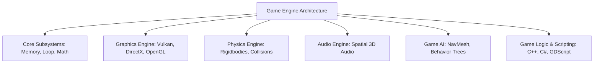
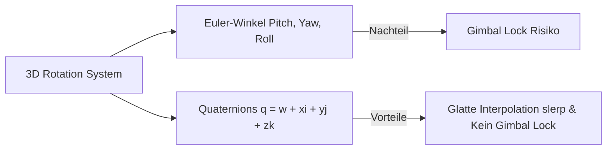
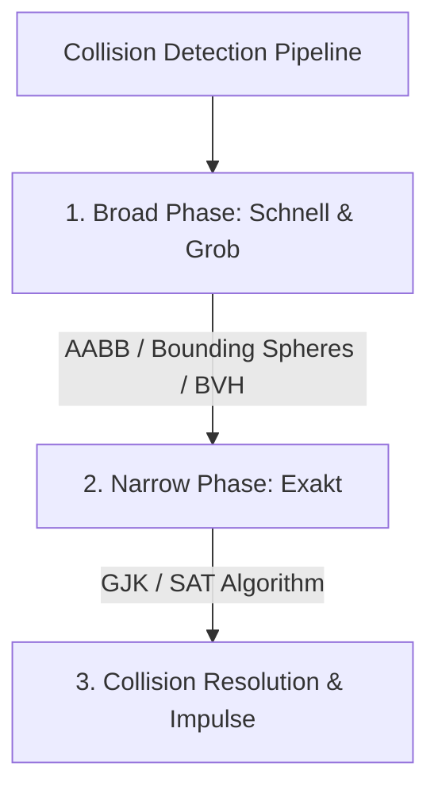

# Game Development – Das Praxis-Handbuch & Engine-Leitfaden

**Spiele-Entwicklung (Game Development)** ist eine der komplexesten Disziplinen der Informatik. Sie vereint Hochleistungs-Systemprogrammierung (C++, Rust, C#), Echtzeit-Computergrafik (Shaders, Vulkan, DirectX), Vektor- & Matrix-Mathematik, Physik-Simulationen (Rigidbodies, Kollisionen), künstliche Intelligenz (Behavior Trees, GOAP) und Audio/UI-Systeme.

Dieses Praxis-Handbuch bietet einen strukturierten Überblick über Game Engines, 3D-Mathematik (Quaternions, Vektoren), Physik-Engines (SAT, GJK, AABB), Shader-Pipelines (HLSL/GLSL), PBR-Rendering und Game-AI-Architekturen.

---

## 🚀 1. Game Engines & Programmiersprachen

### Architektur einer Game Engine



### Die wichtigsten Engines im Vergleich

| Engine | Programmiersprache | Lizenz / Modell | Hauptanwendungsfall |
|---|---|---|---|
| **Unreal Engine** | C++ & Blueprints | Proprietaer (Royalty) | AAA-Spiele, High-End Grafik, Fotorealismus |
| **Unity 3D** | C# | Proprietaer (Subskription) | Cross-Platform Mobile, Indie, 2D/3D & XR |
| **Godot Engine** | GDScript, C#, C++ | Open Source (MIT) | Leichtgewichtige 2D/3D Indie-Spiele |
| **Custom / Native Engine** | C++ / Rust (Bevy) | Eigenentwicklung | Maximale Kontrolle, Spezialisierte Grafik-Demos |

---

## 📐 2. Spiele-Mathematik (Game Mathematics)

Ohne Vektor- und Matrizenrechnung ist 3D-Grafik und Physik unmöglich:

### Vektoren & Matrizen
* **Vektor-Addition & Skalierung**: Steuerung von Position, Geschwindigkeit und Beschleunigung ($\vec{p}_{neu} = \vec{p} + \vec{v} \cdot \Delta t$).
* **Skalarprodukt (Dot Product)**: Berechnet den Winkel zwischen zwei Vektoren ($\vec{a} \cdot \vec{b} = |\vec{a}| |\vec{b}| \cos\theta$). Verwendung für Beleuchtung und Sichtfeld-Prüfungen.
* **Kreuzprodukt (Cross Product)**: Erzeugt einen Vektor, der senkrecht auf zwei Eingangsvektoren steht (Berechnung von Flächennormalen).

### Orientierung: Euler-Winkel vs. Quaternions



* **Euler-Winkel (Pitch, Yaw, Roll)**: Anschaulich, leidet jedoch unter dem **Gimbal Lock** (Verlust eines Freiheitsgrads bei 90°-Drehungen).
* **Quaternions (Vierer-Vektoren)**: Verhindern den Gimbal Lock und erlauben glatte, fehlerfreie Kugel-Interpolationen (**Slerp**).

---

## 💥 3. Spiele-Physik & Kollisionserkennung

Spiele-Physik simuliert Starre Körper (*Rigidbodies*), Kräfte, Reibung und Kollisionen in Echtzeit.

### Phasen der Kollisionserkennung



1. **Broad Phase**: Schnelles Aussortieren weit entfernter Objekte mittels einfacher Bounding Volumes (AABB - Axis-Aligned Bounding Box, BVH - Bounding Volume Hierarchy).
2. **Narrow Phase**: Präzise Schnittpunktberechnung komplexer Geometrien mittels Algorithmen wie **SAT** (Separation Axis Theorem) oder **GJK** (Gilbert-Johnson-Keerthi).
3. **CCD (Continuous Collision Detection)**: Verhindert, dass sich sehr schnelle Objekte innerhalb eines Frames durch Wände bewegen ("Tunneling").

---

## 🎨 4. Computergrafik, Shaders & Graphics APIs

### Die Graphics Pipeline
Die Grafikkarte (GPU) verarbeitet 3D-Geometrie in mehreren programmierbaren Stufen:


### Shader-Programmiersprachen & APIs
* **Shader Languages**: HLSL (DirectX), GLSL (OpenGL/Vulkan), SPIR-V (Binärformat für Vulkan).
* **Modern Low-Level APIs (Vulkan, DirectX 12, Metal)**: Bieten direkten Zugriff auf die GPU-Hardware, erfordern jedoch manuelles Befehls- & Speicher-Management.

### Beleuchtung & Materialien (PBR)
* **Physically-Based Rendering (PBR)**: Basiert auf Energieerhaltung (*Conservation of Energy*) und unterscheidet Materialien in Metallizität (*Metallic*) und Rauheit (*Roughness*).
* **Normal / Bump Mapping**: Vortäuschen feiner Oberflächenstrukturen durch Veränderung der Flächennormalen pro Pixel.
* **Cascaded Shadow Maps (CSM)**: Dynamische Schattenberechnung mit hoher Auflösung im Nahbereich und geringerer Auflösung in der Distanz.

---

## 🤖 5. Künstliche Intelligenz in Spielen (Game AI)

Game AI konzentriert sich nicht auf maschinelles Lernen, sondern auf vorhersagbares, unterhaltsames Verhalten von Nicht-Spieler-Charakteren (NPCs).

### Verhaltens-Architekturen

=== "Finite State Machines (FSM)"
    ```text
    [Patrouillieren] --(Feind gesichtet)--> [Angreifen] --(Gesundheit < 20%)--> [Flüchten]
    ```
    Einfach zu implementieren, wird aber bei komplexen Systemen schnell unübersichtlich (*State Explosion*).

=== "Behavior Trees (Verhaltensbäume)"
    ```text
    Root (Selector)
    ├── Sequence: Angriff vorbereiten
    │   ├── HasTarget?
    │   ├── InRange?
    │   └── ExecuteAttack
    └── Sequence: Patrouille
        └── MoveToNextWaypoint
    ```
    Hierarchisch, modular und gut in visuellen Editoren (Unreal/Unity) zu pflegen.

### Pfadfindung: A* & NavMesh
* **NavMesh (Navigation Mesh)**: Eine vereinfachte Polygon-Fläche, die begehbare Zonen im Level beschreibt.
* **A*-Algorithmus**: Der Standard-Pfadfindungs-Algorithmus zur Berechnung des kürzesten Wegs auf dem NavMesh.

---

## ⚡ 6. Fortgeschrittenes Rendering: Real-Time Ray Tracing

Modernes Grafik-Rendering nutzt Beschleunigungseinheiten (RT-Cores) auf Grafikkarten:
* **Real-Time Ray Tracing (DXR / Vulkan RT)**: Berechnet physikalisch korrekte Lichtstrahlen für fotorealistische Reflexionen, Brechungen und globale Beleuchtung (Global Illumination) in Echtzeit.

---

## 🔗 7. Verwandte Themen & Weiterführende Links
* [Zurück zur Systemprogrammierungs-Übersicht](index.md)
* [C++ Praxis-Handbuch](cpp-praxis.md)
* [Rust Praxis-Handbuch](rust-praxis.md)
* [Blender 3D Python Automatisierung](../../kreativ/design/blender-python-automation.md)
