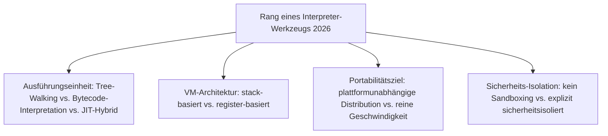
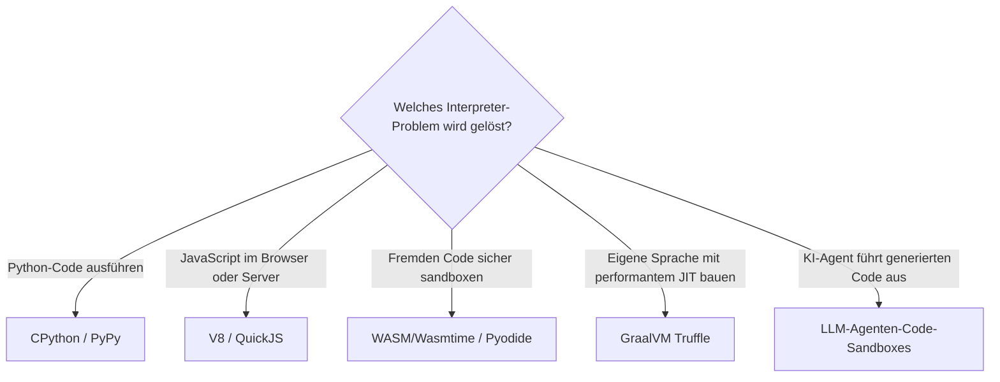

# Beste Interpreter-Werkzeuge 2026 — Top-15-Topliste

Die [Evolution und Architekturen digitaler Interpreter](evolution-digitaler-interpreter.md) ordnet diese komplementäre Ausführungsstrategie chronologisch nach Architektur-Generation — vom ersten interaktiven Lisp-REPL über portable Bytecode-VMs, den Skriptsprachen-Interpreter-Boom und JIT-Hybride bis zu registerbasierten und Tracing-JIT-Interpretern sowie sandboxed WebAssembly- und KI-Agenten-Interpretern. Diese Seite übersetzt die Chronologie in eine **Momentaufnahme 2026**: 15 Werkzeuge, die heute tatsächlich betrieben werden.

!!! note "Hinweis: komplementär zu Compilern statt konkurrierend"
    Interpreter und Compiler lösen dasselbe Grundproblem (Quellcode ausführen) mit entgegengesetzter Strategie — siehe [Beste Compiler-Werkzeuge 2026](compiler-2026-topliste.md) für die vollständige Vorab-Übersetzung.

---

## Bewertungskriterien

---

## Top 15 im Überblick

| Rang | System | Generation | Sprache/Format | Besondere Stärke |
|---|---|---|---|---|
| 1 | **CPython** | 3 (Skriptsprachen-Interpreter-Boom) | Python | Bis heute die Referenzimplementierung von Python, meistgenutzter Interpreter dieser Liste |
| 2 | **V8** | 4 (JIT-Hybride, Radikalisierung) | JavaScript | Kompiliert JavaScript-Quelltext direkt als JIT-Ausgangspunkt statt vorher erzeugtem Bytecode |
| 3 | **WebAssembly (WASM) & Wasmtime/Wasmer** | 6 (Sandbox-Interpreter für WASM & KI-Agenten) | WASM | Portables, sandboxed Bytecode-Format plus eigenständige Runtimes außerhalb des Browsers |
| 4 | **Lua** | 5 (Register-basierte VMs & Tracing-JIT) | Lua | Registerbasierte statt stackbasierte Bytecode-VM, bewusste Ausnahme vom üblichen VM-Design |
| 5 | **Java HotSpot VM** | 4 (JIT-Hybride) | Java | Interpretiert Bytecode zunächst, kompiliert nur per Laufzeit-Profiling identifizierte „heiße" Methoden nativ |
| 6 | **PyPy** | 5 (Register-basierte VMs & Tracing-JIT) | Python (Teilmenge) | Meta-Tracing-JIT verfolgt tatsächlich durchlaufene Schleifen-Pfade statt einzelner Methoden |
| 7 | **LLM-Agenten-Code-Sandboxes** | 6 (Sandbox-Interpreter für WASM & KI-Agenten) | Sprachunabhängig | Autonome KI-Agenten führen generierten Code isoliert aus, siehe [ChatGPT Code Interpreter](../../wissen/dokumentation/evolution-digitaler-notebook-systeme.md) |
| 8 | **Pyodide** | 6 (Sandbox-Interpreter für WASM & KI-Agenten) | Python zu WASM | Vollständiger Python-Interpreter läuft sandboxed direkt im Browser, ohne Server-Backend |
| 9 | **QuickJS** | Ergänzung 2026 | JavaScript | Kompakter, eingebetteter JS-Interpreter, verbreitet für Sandbox-Szenarien ohne volle V8-Größe |
| 10 | **GraalVM Truffle** | Ergänzung 2026 | Polyglot | Framework zum Bau performanter Interpreter für beliebige Sprachen auf einer gemeinsamen JIT-Infrastruktur |
| 11 | **Perl** | 3 (Skriptsprachen-Interpreter-Boom) | Perl | Kompiliert intern zu einem Op-Baum, den die Perl-VM abarbeitet, historisch prägend für Generation 3 |
| 12 | **Tcl** | 3 (Skriptsprachen-Interpreter-Boom) | Tcl | Als eingebettete Kommandosprache für andere Anwendungen konzipiert, nicht als eigenständiges Programm |
| 13 | **Smalltalk-80** | 2 (Portable Bytecode-VMs) | Smalltalk | Eigene Bytecode-VM plus persistentes „Image", konzeptioneller Vorläufer heutiger Laufzeit-Persistenz |
| 14 | **Lisp-REPL** | 1a (Lisp — der erste REPL) | Lisp | Prägt das bis heute dominante interaktive Interpreter-Interface, das praktisch jede Skriptsprache übernimmt |
| 15 | **UCSD-Pascal-P-System** | 2 (Portable Bytecode-VMs) | Pascal (p-Code) | Früher Vorläufer des „Compile once, run anywhere"-Prinzips |

---

## Highlights im Detail

### Rang 1–2, 5–6: die vier dominanten produktiven Sprach-Laufzeiten
CPython, V8, Java HotSpot VM und PyPy zeigen vier unterschiedliche Antworten auf dasselbe Geschwindigkeitsproblem reiner Bytecode-Interpretation — Referenzimplementierung, radikalisiertes JIT, hybrides Profiling-JIT und Meta-Tracing, siehe [Generation 3–5](evolution-digitaler-interpreter.md#generation-4-jit-hybride-bytecode-interpretation-trifft-laufzeitkompilierung-1995-1999).

### Rang 3, 7–10: Sandboxing als jüngstes Design-Ziel
WASM/Wasmtime, LLM-Agenten-Code-Sandboxes, Pyodide, QuickJS und GraalVM Truffle zeigen, dass Sicherheits-Isolation 2026 zum zentralen Kriterium für neue Interpreter-Infrastruktur geworden ist — Code aus nicht vertrauenswürdiger Quelle muss ausführbar sein, ohne das Host-System zu gefährden, siehe [Generation 6](evolution-digitaler-interpreter.md#generation-6-sandbox-interpreter-fur-webassembly-ki-agenten-ab-2017).

### Rang 11–15: die Gründer- und Boom-Generation bleibt architektonisch prägend
Perl, Tcl, Smalltalk-80, Lisp-REPL und das UCSD-Pascal-P-System etablierten die Grundmuster — Bytecode-Portabilität, persistente Images, den REPL selbst —, auf denen jede spätere Generation direkt aufbaut.

---

## Entscheidungshilfe nach Baustellen-Typ

!!! tip "Tipp: Compiler-Perspektive separat prüfen"
    Für vollständige Vorab-Übersetzung statt direkter Ausführung siehe [Beste Compiler-Werkzeuge 2026](compiler-2026-topliste.md) — insbesondere V8 tritt dort als JIT-Grenzfall in beiden Listen auf.

---

## 🔗 Verwandte Themen

- [Startseite](../../index.md) — zurück zur Dokumentations-Zentrale
- [Evolution und Architekturen digitaler Interpreter](evolution-digitaler-interpreter.md) — chronologisches Generationenmodell, dessen aktuellen Stand diese Topliste zusammenfasst
- [Produktionsreife Open-Source-Interpreter-Werkzeuge nach Generation (Top 8)](produktionsreife-interpreter-werkzeuge-generationen-2026-topliste.md) — dieselbe Chronologie durch das konservative Fünf-Filter-Sieb (produktionsreif, jahrelang stabil, große Betreiberbasis, sehr große Skala, dateibasiert oder PostgreSQL)
- [Beste Compiler-Werkzeuge 2026 (Top 15)](compiler-2026-topliste.md) — komplementäre Ausführungsstrategie
- [Shell & Bash Praxis-Handbuch](shell-bash-praxis.md) — Bash selbst als alltäglich genutzter Interpreter
- [Beste Notebook-Systeme 2026 (Top 20)](../../wissen/dokumentation/notebook-systeme-2026-topliste.md) — ChatGPT Code Interpreter als Produktbeispiel aus Rang 7
- [Evolution und Architekturen digitaler Autonomer KI-Agenten](../../künstliche-intelligenz/evolution-digitaler-autonome-ki-agenten.md) — Vertiefung zu den Code-Sandboxes aus Rang 7
