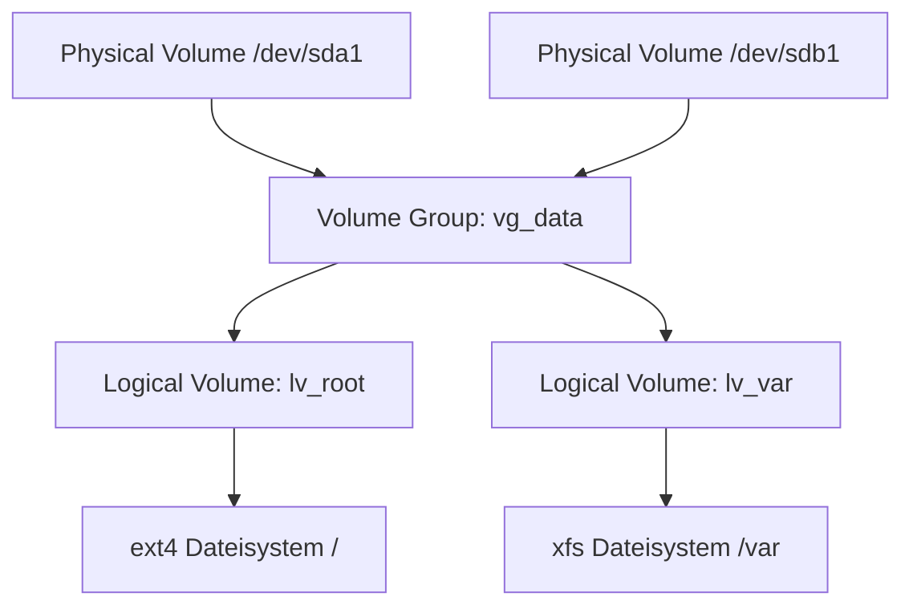

# Linux Administration & CLI – Das Praxis-Handbuch

**Linux** ist das fundamentale Betriebssystem moderner Server-Infrastrukturen, Cloud-Plattformen, Container-Umgebungen und Entwickler-Workstations. Die Beherrschung der Linux-Kommandozeile (CLI), des Dateisystems, der Prozess- und Benutzerverwaltung, von `systemd`, Netzwerk-Tools, Shell-Skripten und Systemdiagnosen bildet das Rückgrat jeder erfolgreichen IT-Engineering-Arbeit.

Dieses Handbuch bietet eine strukturierte Übersicht über grundlegende Befehle, Textverarbeitung (`grep`, `awk`, `sed`), Rechteverwaltung, Disk- & LVM-Management, `systemd`, Netzwerkdiagnose und Shell-Scripting.

---

## 🚀 1. Dateisystem, Navigation & FHS Standard

### Der Filesystem Hierarchy Standard (FHS)
Unter Linux ist alles eine Datei ("Everything is a file"). Die Ordnerstruktur folgt einem festen Standard:

```mermaid
graph TD
    Root[/ Root Directory] --> etc[/etc - Konfigurationsdateien]
    Root --> var[/var - Logdateien & Variable Daten]
    Root --> usr[/usr - Binaries & Bibliotheken]
    Root --> home[/home - Benutzer-Heimatverzeichnisse]
    Root --> dev[/dev - Gerätedateien Hardware]
    Root --> proc[/proc - Virtuelles Prozess-Dateisystem]
    Root --> sys[/sys - Virtuelles Kernel- & Hardware-System]
    Root --> tmp[/tmp - Temporäre Dateien]
```

### Die wichtigsten Navigations-Befehle

=== "Datei- & Ordnerverwaltung"
    ```bash
    # Navigation & Verzeichnisanzeige
    pwd                        # Aktuelles Verzeichnis anzeigen
    ls -la                     # Ausführliche Liste inkl. versteckter Dateien
    cd /var/log                # Verzeichnis wechseln

    # Erstellen & Löschen
    mkdir -p projekt/src       # Verschachtelte Ordner erstellen
    touch projekt/README.md    # Leere Datei anlegen / Zeitstempel aktualisieren
    cp -r projekt/ projekt_bkp # Ordner rekursiv kopieren
    mv projekt_bkp /tmp/       # Verschieben oder Umbenennen
    rm -rf /tmp/projekt_bkp    # Rekursiv und erzwungen löschen
    ```

=== "Umgebungsvariablen & Hilfe"
    ```bash
    echo $PATH                 # Suchpfad für ausführbare Befehle
    export MY_VAR="Wert"       # Umgebungs-Variable setzen
    man systemctl              # Handbuch-Seite eines Befehls öffnen
    which python3              # Pfad eines installierten Programms anzeigen
    ```

---

## 🔒 2. Rechteverwaltung, Links & Textverarbeitung

### Dateirechte & Ownership (`chmod`, `chown`)

```bash
# Rechte im Detail: r (Read=4), w (Write=2), x (Execute=1)
# Beispiel: rwxr-xr-- (Owner: 7, Group: 5, Others: 4)
chmod 755 script.sh        # Owner: Full, Group/Others: Read+Execute
chmod +x script.sh         # Ausführrecht hinzufügen

# Eigentümer und Gruppe ändern
chown nginx:www-data /var/www/html -R
```

### Soft Links (`symlink`) vs. Hard Links
* **Soft Link (`ln -s target link`)**: Ein Zeiger auf den Dateipfad. Funktioniert auch über Dateisystemgrenzen hinweg.
* **Hard Link (`ln target link`)**: Ein zweiter Inode-Eintrag, der direkt auf dieselben Datenblöcke auf der Festplatte zeigt.

### Die Linux Textverarbeitungs-Pipeline (`pipe`)

```mermaid
graph LR
    Input[Input File / Log] -->|cat / tail| Stream[stdout Stream]
    Stream -->|grep 'ERROR'| Filter[Gefilterte Zeilen]
    Filter -->|awk '{print $1, $4}'| Transform[Spalten-Extraktion]
    Transform -->|sort | uniq -c| Count[Häufigkeits-Zählung]
```

=== "Praxisbeispiele Text-Tools"
    ```bash
    # grep: Nach Mustern suchen (case-insensitive & Zeilennummern)
    grep -rnI "database_password" /etc/

    # awk: Spaltenbasierte Extraktion (Zeige IP-Adresse aus Access-Logs)
    awk '{print $1}' /var/log/nginx/access.log | sort | uniq -c | sort -nr | head -n 10

    # sed: Suchen und Ersetzen in Dateien
    sed -i 's/PORT=8080/PORT=9000/g' config.env

    # tail & tee: Echtzeit-Logs verfolgen und gleichzeitig in Datei schreiben
    journalctl -fu docker.service | tee /tmp/docker_debug.log
    ```

---

## ⚡ 3. Prozess- Management & Server-Review

### Prozesskontrolle (`ps`, `top`, `kill`)
Jeder laufende Prozess besitzt eine eindeutige **PID (Process ID)**:

```bash
# Prozesse finden und auflisten
ps aux | grep python3       # Alle laufenden Python-Prozesse anzeigen
htop                        # Interaktiver Prozess-Manager (CPU, RAM, Swap)
pgrep -l nginx              # PIDs eines bestimmten Prozesses finden

# Signale an Prozesse senden
kill -15 <PID>              # SIGTERM: Gefälliges Beenden (Sauberes Aufräumen)
kill -9 <PID>               # SIGKILL: Sofortiges hartes Beenden
pkill -f "node server.js"   # Alle Prozesse nach Namensmuster beenden
```

### Server Review & Systemressourcen
* **`uptime` / `w`**: Zeigt die Systemlaufzeit und die **Load Average** (1, 5, 15 Minuten) an.
* **`free -h`**: Übersicht des belegten und freien Arbeitsspeichers (RAM & Swap).
* **`df -h`**: Speicherauslastung aller gemounteten Dateisysteme.
* **`du -sh /var/*`**: Speicherverbrauch einzelner Ordner ermitteln.

---

## ⚙️ 4. Service Management mit `systemd`

`systemd` ist das Standard-Init-System moderner Linux-Distributionen (Ubuntu, Debian, RHEL, Arch).

### Erstellen eines benutzerdefinierten Systemd-Dienstes
Legen Sie eine Datei unter `/etc/systemd/system/mein-dienst.service` an:

```ini
[Unit]
Description=Mein Python Backend Service
After=network.target postgresql.service

[Service]
Type=simple
User=www-data
WorkingDirectory=/var/www/backend
ExecStart=/var/www/backend/.venv/bin/python main.py
Restart=always
RestartSec=5
Environment=PORT=8080

[Install]
WantedBy=multi-user.target
```

### Befehle zur Steuerung

```bash
sudo systemctl daemon-reload           # Neue Unit-Dateien einlesen
sudo systemctl enable --now mein-dienst # Dienst aktivieren & sofort starten
sudo systemctl status mein-dienst       # Status & letzte Logzeilen prüfen
sudo journalctl -u mein-dienst -f -n 100# Echtzeit-Logs verfolgen
```

---

## 💽 5. Speichermedien, Dateisysteme & LVM

### LVM (Logical Volume Manager) Struktur



### Festplatten einbinden (`fdisk`, `mkfs`, `mount`)

```bash
# Partitionierung & Dateisystem erstellen
fdisk /dev/sdb             # Neue Partition anlegen
mkfs.ext4 /dev/sdb1        # ext4 Dateisystem formatieren

# Mounten und automatisieren via /etc/fstab
mkdir -p /mnt/data
mount /dev/sdb1 /mnt/data

# /etc/fstab Eintrag für dauerhaften Reboot-Schutz:
# UUID=xxxx-xxxx-xxxx-xxxx  /mnt/data  ext4  defaults  0  2
```

---

## 🌐 6. Netzwerk, Firewall & SSH

### Netzwerkdiagnose & Routing
* **`ip addr` / `ip route`**: IP-Adressen und Schnittstellen bzw. Routing-Tabelle anzeigen.
* **`ss -tulnp`**: Alle lauschenden Ports und dazugehörigen Prozesse anzeigen.
* **`dig domain.com` / `nslookup`**: DNS-Auflösung überprüfen.
* **`ping` & `traceroute`**: Erreichbarkeit und Paketlaufzeiten im Netzwerk prüfen.

### SSH & Sichere Dateiübertragung

```bash
# SSH-Schlüsselpaar generieren & auf Server kopieren
ssh-keygen -t ed25519 -C "admin@unternehmen.de"
ssh-copy-id -i ~/.ssh/id_ed25519.pub user@server-ip

# Dateien sicher synchronisieren via rsync
rsync -avz --progress /lokaler/ordner/ user@remote-server:/remote/ziel/
```

---

## 📜 7. Shell-Skripting (Bash Automation)

Ein sauberes Bash-Skript erfordert Fehlerbehandlung und Variablen-Validierung:

```bash
#!/bin/bash
set -euo pipefail # Stoppt bei Fehlern (e), ungesetzten Variablen (u) & Pipe-Fehlern (pipefail)

LOG_FILE="/var/log/backup.log"
BACKUP_DIR="/var/backups/db"

log() {
    echo "[$(date +'%Y-%m-%d %H:%M:%S')] $1" | tee -a "$LOG_FILE"
}

log "Starte Datenbanksicherung..."
mkdir -p "$BACKUP_DIR"

if pg_dumpall -U postgres > "$BACKUP_DIR/db_backup_$(date +%F).sql"; then
    log "Backup erfolgreich abgeschlossen."
else
    log "FEHLER: Backup fehlgeschlagen!" >&2
    exit 1
fi
```

---

## 🔗 8. Verwandte Themen & Weiterführende Links
* [Zurück zur Systemprogrammierungs-Übersicht](index.md)
* [Linux-Systemprogrammierung](linux-systemprogrammierung.md)
* [Systemd Service Creation](systemd-service-creation.md)
* [Linux Cgroups v2 Limits](linux-cgroups-limits.md)
* [Linux eBPF Performance Profiling](linux-ebpf-performance.md)
