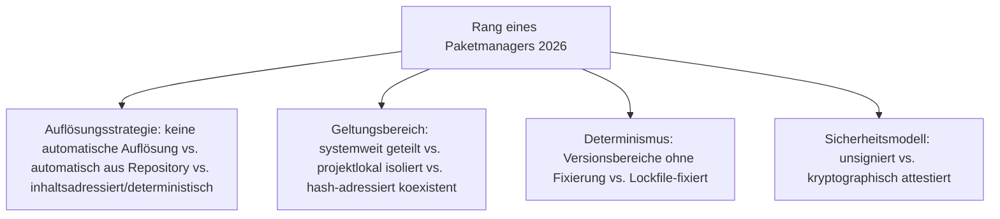
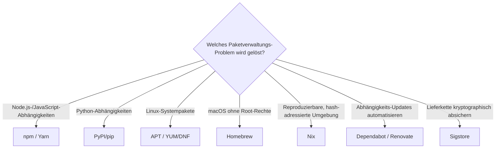

# Beste Paketmanager 2026 — Top-15-Topliste

Die [Evolution und Architekturen digitaler Paketmanager](evolution-digitaler-paketmanager.md) ordnet diese Werkzeuggattung chronologisch nach Architektur-Generation — von ersten OS-Paketformaten ohne automatische Abhängigkeitsauflösung über deren Lösung, sprachspezifische Registries, funktionale/hermetische Paketmanager, Lockfiles bis zu automatisierter Abhängigkeitspflege und kryptographischer Lieferketten-Sicherheit. Diese Seite übersetzt die Chronologie in eine **Momentaufnahme 2026**: 15 Werkzeuge, die heute tatsächlich betrieben werden.

!!! note "Hinweis: Abgrenzung zu Build-Systemen"
    Diese Liste rankt Werkzeuge, die entscheiden, *woher* Software/Abhängigkeiten kommen — *wie* daraus ein Programm entsteht, behandelt [Beste Build-Systeme 2026](build-systeme-2026-topliste.md). Cargo vereint beide Rollen und taucht daher in beiden Listen auf.

---

## Bewertungskriterien

---

## Top 15 im Überblick

| Rang | System | Generation | Ökosystem | Besondere Stärke |
|---|---|---|---|---|
| 1 | **npm** | 3 (Sprachspezifische Paketmanager & zentrale Registries) | Node.js/JavaScript | Größtes Paket-Registry überhaupt, meistgenutzter Paketmanager weltweit |
| 2 | **APT** (Advanced Package Tool) | 2 (Automatische Abhängigkeitsauflösung) | Debian/Ubuntu | Löst „Dependency Hell" für `.deb`-Pakete, bis heute Standard-Werkzeug (`apt install`) |
| 3 | **PyPI / pip** | 3 (Sprachspezifische Paketmanager & zentrale Registries) | Python | Zentrales Python-Registry, Standard-Installationsweg trotz wachsender uv-Konkurrenz |
| 4 | **Nix** | 4 (Funktionale, hermetische Paketmanager) | Sprachagnostisch | Rein funktionaler Paketmanager, adressiert jedes Paket über einen Hash aller Build-Eingaben |
| 5 | **Homebrew** | 5 (Lockfiles & plattformunabhängige User-Space-Manager) | macOS | Füllt die fehlende native Paketverwaltung auf macOS, Installation ohne `sudo` |
| 6 | **Cargo** | 3 (Sprachspezifische Paketmanager & zentrale Registries) | Rust | Direkt in die Rust-Toolchain integriert, crates.io als zentrales Registry |
| 7 | **Dependabot / Renovate** | 6 (Automatisierte Abhängigkeitspflege & Lieferketten-Sicherheit) | Sprachagnostisch | Automatisierte Update-Pull-Requests über praktisch jedes Registry-Ökosystem hinweg |
| 8 | **Yarn** | 5 (Lockfiles & plattformunabhängige User-Space-Manager) | Node.js/JavaScript | Reaktion auf npms damalige Geschwindigkeits- und Determinismus-Schwächen |
| 9 | **YUM / DNF** | 2 (Automatische Abhängigkeitsauflösung) | Red Hat/Fedora/SUSE | Analoges Auflösungswerkzeug für RPM-Pakete, DNF als technischer Nachfolger seit 2015 |
| 10 | **RubyGems** | 3 (Sprachspezifische Paketmanager & zentrale Registries) | Ruby | Frühes sprachspezifisches Registry, Vorbild für spätere Manifest-basierte Systeme |
| 11 | **Composer** | 3 (Sprachspezifische Paketmanager & zentrale Registries) | PHP | Zentrale PHP-Paketverwaltung, Fundament u. a. von Laravels Ökosystem |
| 12 | **Sigstore** | 6 (Automatisierte Abhängigkeitspflege & Lieferketten-Sicherheit) | Sprachagnostisch | „Keyless Signing" — kurzlebige Zertifikate statt dauerhafter privater Schlüssel gegen Supply-Chain-Angriffe |
| 13 | **Bundler** | 5 (Lockfiles & plattformunabhängige User-Space-Manager) | Ruby | Führt das `Gemfile.lock`-Konzept ein, direktes Vorbild für spätere Lockfile-Formate |
| 14 | **dpkg** | 1a (dpkg — das Debian-Paketformat) | Debian | Eines der ersten strukturierten Paketformate für Linux, Fundament der Debian-/Ubuntu-Paketwelt |
| 15 | **RPM** | 1b (RPM — das Red-Hat-Paketformat) | Red Hat | Analoges Konzept zu dpkg, etabliert das bis heute parallele RPM-Paketformat-Ökosystem |

---

## Highlights im Detail

### Rang 1, 3, 6, 8, 10–11: sprachspezifische Registries bleiben der Alltagsfall
npm, PyPI/pip, Cargo, Yarn, RubyGems und Composer verwalten Abhängigkeiten projektlokal statt systemweit — das mit Abstand am häufigsten genutzte Grundmuster 2026, siehe [Generation 3](evolution-digitaler-paketmanager.md#generation-3-sprachspezifische-paketmanager-zentrale-registries-1995-2010).

### Rang 4: Nix als konzeptioneller Vorläufer hermetischer Build-Systeme
Nix adressiert jedes Paket über einen Hash aller Build-Eingaben — dieselbe Grundidee, die [Generation 4 der Build-Systeme-Zeitachse](build-systeme-2026-topliste.md) später auf ganze Build-Prozesse überträgt, siehe [Generation 4](evolution-digitaler-paketmanager.md#generation-4-funktionale-hermetische-paketmanager-nix-ab-2003).

### Rang 7, 12: die Sicherheits- und Automatisierungs-Ebene des Ökosystems
Dependabot/Renovate und Sigstore lösen zwei unterschiedliche Probleme — automatisiertes Update-Vorschlagen und kryptographischer Herkunftsnachweis —, beide als direkte Antwort auf zunehmende Supply-Chain-Risiken, siehe [Generation 6](evolution-digitaler-paketmanager.md#generation-6-automatisierte-abhangigkeitspflege-lieferketten-sicherheit-ab-2017).

---

## Entscheidungshilfe nach Baustellen-Typ

!!! tip "Tipp: Build-System-Perspektive separat prüfen"
    Wie aus Quellcode ein Programm entsteht, statt woher Abhängigkeiten kommen, behandelt [Beste Build-Systeme 2026](build-systeme-2026-topliste.md).

---

## 🔗 Verwandte Themen

- [Startseite](../../index.md) — zurück zur Dokumentations-Zentrale
- [Evolution und Architekturen digitaler Paketmanager](evolution-digitaler-paketmanager.md) — chronologisches Generationenmodell, dessen aktuellen Stand diese Topliste zusammenfasst
- [Produktionsreife Open-Source-Paketmanager nach Generation (Top 13)](produktionsreife-paketmanager-generationen-2026-topliste.md) — dieselbe Chronologie durch das konservative Fünf-Filter-Sieb; einzige Systemprogrammierungs-Kategorie mit lückenloser Generationsabdeckung inklusive Generation 6
- [Beste Build-Systeme 2026 (Top 15)](build-systeme-2026-topliste.md) — verwandte, aber nicht deckungsgleiche Achse
- [Beste Batteries-Included-Web-Frameworks 2026 (Top 15)](../webentwicklung/batteries-included-frameworks-2026-topliste.md) — Composer als Laravels Paketverwaltungs-Baustein
- [Rust in der Praxis](rust-praxis.md) — Cargo als integrierter Build-/Paketmanager
- [Linux Praxis-Handbuch](linux-praxis.md) — praktische APT-Nutzung
