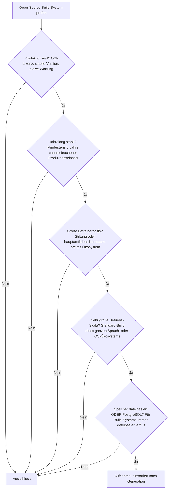
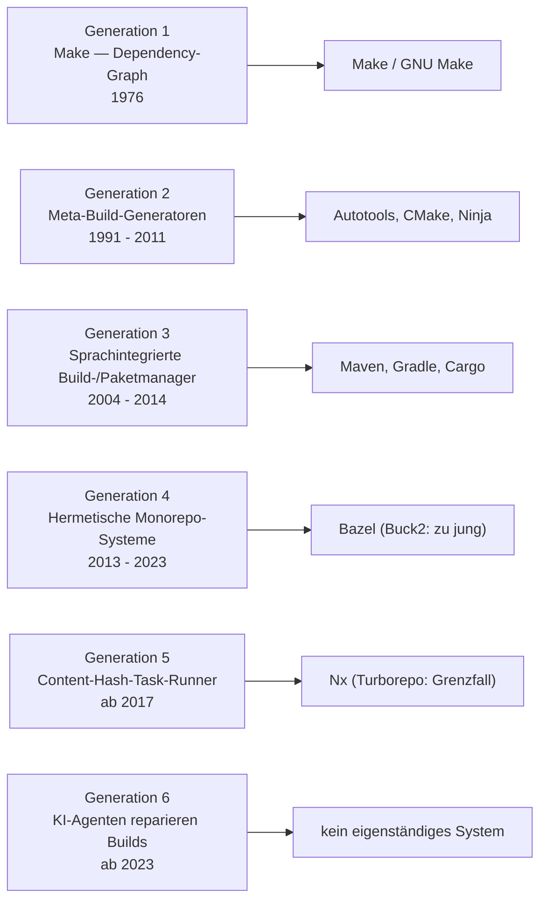

# Produktionsreife Open-Source-Build-Systeme nach Generation — Reifegrad, Evaluation & Betriebs-Skala (Top 9)

Die [Evolution und Architekturen digitaler Build-Systeme](evolution-digitaler-build-systeme.md) ordnet die Kategorie chronologisch in sechs Generationen — von der ersten dependency-graph-basierten Automatisierung über plattformübergreifende Meta-Build-Generatoren, sprachintegrierte Build-/Paketmanager und hermetische Monorepo-Systeme bis zu content-hash-basierten Task-Runnern und KI-Agenten, die Builds autonom reparieren. Die [Topliste bester Build-Systeme 2026](build-systeme-2026-topliste.md) rankt die gesamte Kategorie. Diese Seite kombiniert alle Achsen — parallel zur [Compiler-](produktionsreife-compiler-werkzeuge-generationen-2026-topliste.md), [Versionskontroll-](produktionsreife-versionskontrollsysteme-generationen-2026-topliste.md) und [Paketmanager-Schwesterseite](produktionsreife-paketmanager-generationen-2026-topliste.md) — zu einem bewusst **konservativen** Fünf-Filter-Sieb: produktionsreif · jahrelang stabil · große Betreiberbasis · sehr große Betriebs-Skala · Speicher dateibasiert oder PostgreSQL. Sortiert nach Generation, nicht nach Rang.

!!! warning "Achtung: Eine überreif besetzte Liste — Generation 6 leer"
    Neun Build-Systeme über fünf Generationen bestehen alle fünf Filter; die Kategorie gehört zu den reifsten des Repos. Der Speicherfilter greift nicht — ein Build-System liest Build-Dateien und schreibt Artefakte, es gibt keine Laufzeit-Datenbank ([Speicher-Fazit](#dateibasiert-oder-postgresql)). **Generation 6** (KI-Agenten reparieren Builds) ist keine eigenständige Software, sondern ein Modus etablierter Coding-Agenten — kein Vertreter. **Buck2** (Rust-Rewrite, 2023) ist noch zu jung.

---

## Die fünf harten Filter

!!! note "Hinweis: Cargo und Gradle sind Doppelbürger"
    **Cargo**, **Gradle** und **Maven** vereinen Build-Logik und Paketverwaltung in einem Werkzeug — sie erscheinen sowohl hier als auch auf der [Paketmanager-Schwesterseite](produktionsreife-paketmanager-generationen-2026-topliste.md). KI-Agenten, die CI-Fehler reparieren, sind ein Anwendungsmodus etablierter Werkzeuge, kein eigenständiges Build-System.

---

## Ergebnis: neun Build-Systeme über fünf Generationen

---

## Systeme nach Generation

### Generation 1 — Make: dependency-graph-basierte Automatisierung (1976)

| # | System | Sprache | Speicher | Lizenz | Seit | Skala-Nachweis |
|---|---|---|---|---|---|---|
| 1 | **Make / GNU Make** | C | dateibasiert (`Makefile`) | GPL-3.0+ (GNU Make) | 1976 / 1988 | Baut den Linux-Kernel und unzählige C-Projekte; POSIX-standardisiert, in jeder Distribution |

**Make** definierte die Werkzeugkategorie und ist nach fast 50 Jahren weiterhin allgegenwärtig — zeitstempelbasiertes Caching, `Makefile` als reine Textdatei. GNU Make wird von der FSF gepflegt.

### Generation 2 — Plattformübergreifende Meta-Build-Generatoren (1991 – 2011)

| # | System | Sprache | Speicher | Lizenz | Seit | Skala-Nachweis |
|---|---|---|---|---|---|---|
| 2 | **Autoconf / Automake** (Autotools) | M4/Shell | dateibasiert | GPL-3.0+ | 1991 | GNU-Projekt; baut den Großteil des klassischen GNU-/Linux-Userlands (`./configure && make`) |
| 3 | **CMake** | C++ | dateibasiert (`CMakeLists.txt`) | BSD-3-Clause | 2000 | Kitware; De-facto-Standard für plattformübergreifende C/C++-Projekte, von KDE bis LLVM |
| 4 | **Ninja** | C++ | dateibasiert (`build.ninja`) | Apache-2.0 | 2011 | ursprünglich für Chromium; Standard-Ausführungsziel von CMake, extrem schnelle inkrementelle Builds |

**CMake + Ninja** ist die heute übliche C/C++-Kombination — CMake generiert, Ninja führt aus. **Autotools** ist der Legacy-Fall: schwerfällig, aber weiterhin GNU-gepflegt und unter dem klassischen Linux-Userland allgegenwärtig.

### Generation 3 — Sprachintegrierte Build- & Paketmanager (2004 – 2014)

| # | System | Sprache | Speicher | Lizenz | Seit | Skala-Nachweis |
|---|---|---|---|---|---|---|
| 5 | **Maven** | Java | dateibasiert (`pom.xml`) | Apache-2.0 | 2004 | Apache-Software-Foundation; jahrzehntelanger Standard-Build im Java-Enterprise-Umfeld |
| 6 | **Gradle** | Java/Kotlin/Groovy | dateibasiert (`build.gradle[.kts]`) | Apache-2.0 | 2007 | Gradle Inc.; offizielles Android-Build-System, inkrementelles Caching ab Werk |
| 7 | **Cargo** | Rust | dateibasiert (`Cargo.toml` / `Cargo.lock`) | MIT / Apache-2.0 | 2014 | rust-lang; Build, Test, Paketverwaltung und crates.io-Registry aus einem Werkzeug |

Diese Generation ist der heutige Standardfall für neue Sprachökosysteme: **Maven** und **Gradle** im JVM-Umfeld, **Cargo** als vielgelobtes Vorbild integrierter Toolchains.

### Generation 4 — Hermetische, cachefähige Monorepo-Build-Systeme (2013 – 2023)

| # | System | Sprache | Speicher | Lizenz | Seit | Skala-Nachweis |
|---|---|---|---|---|---|---|
| 8 | **Bazel** | Java | dateibasiert (`BUILD`, `MODULE.bazel`; Remote-Cache optional) | Apache-2.0 | 2015 | Google; Open-Source-„Blaze", verbreitetstes hermetisches System, produktiv in vielen Großunternehmen |

**Bazel** garantiert hermetische Builds: Das Ergebnis hängt nur von deklarierten Eingaben ab, ein Inhalts-Hash dient als geteilter Remote-Cache-Schlüssel. Nach zehn Jahren das einzige reife System seiner Generation — **Buck2** (Metas Rust-Rewrite, 2023) ist zu jung, das ursprüngliche **Buck** eingestellt.

### Generation 5 — Content-Hash-basierte JS-Monorepo-Task-Runner (ab 2017)

| # | System | Sprache | Speicher | Lizenz | Seit | Skala-Nachweis |
|---|---|---|---|---|---|---|
| 9 | **Nx** | TypeScript | dateibasiert (`nx.json`; Remote-Cache optional) | MIT | 2017 | Nx (ehem. Nrwl); breit genutzte Monorepo-Task-Orchestrierung mit Abhängigkeitsgraph und Computation-Caching |

**Nx** cacht Task-Ergebnisse per Inhalts-Hash, ohne Bazels vollständige Sandbox-Isolation — der leichtgewichtige Ansatz für JS-/TS-Monorepos. **Turborepo** (2021, Vercel) verfolgt dasselbe Ziel, erreicht 2026 gerade fünf Jahre und bleibt vorerst Grenzfall.

### Generation 6 — warum hier nichts steht

- **KI-Agenten, die Build-Fehler autonom reparieren**, sind 2026 Alltag (dieses Repository wird so gepflegt), aber kein eigenständiges Build-System — sie sind ein Anwendungsmodus etablierter Coding-Agenten auf den Werkzeugen der Generationen 1–5. Vertiefung: [AI Agents Praxis-Handbuch](../../künstliche-intelligenz/coding/ai-agents-praxis.md).

---

## Dateibasiert oder PostgreSQL?

Der Speicherfilter ist **strukturell bedeutungslos**:

- Ein Build-System liest Build-Beschreibungen (`Makefile`, `CMakeLists.txt`, `pom.xml`, `BUILD`) und schreibt Artefakte ins Dateisystem. Es gibt keine Laufzeit-Datenbank.
- Der einzige Grenzbereich ist der **Remote-Cache** von Bazel/Nx/Turborepo — ein optionaler, meist objektspeicher- oder dateibasierter Dienst, kein Pflicht-Zweitsystem. Lokale Builds funktionieren ohne ihn.
- Eine „PostgreSQL-Variante" existiert nicht.

Fazit: Der Filter trennt nichts — er bestätigt, dass Build-Systeme auf Dateien arbeiten, die Compiler und Paketmanager bereitstellen.

!!! warning "Achtung: Momentaufnahme, Stand August 2026"
    **Buck2** und **Turborepo** überschreiten in den nächsten Jahren die Reife-/Stabilitätsschwelle. Sollte ein KI-Build-Reparatur-Werkzeug als eigenständiges Produkt reifen, füllt sich Generation 6. Make, CMake, Cargo und Bazel sind die unverrückbaren Konstanten.

---

## Was bewusst nicht auf dieser Liste steht

| System | Erfüllt nicht | Anmerkung |
|---|---|---|
| **Buck2** | Reifezeit | Metas Rust-Rewrite von Buck, erst 2023 |
| **Buck** | Kontinuität | Von Buck2 abgelöst |
| **Turborepo** | Reifezeit | JS-Monorepo-Task-Runner (Vercel), erreicht 2026 gerade fünf Jahre |
| **KI-Agenten in CI-Pipelines** | Kategorie | Anwendungsmodus etablierter Coding-Agenten, kein eigenständiges Build-System |
| **SCons, Meson, Waf** | Betriebs-Skala | Aktiv gepflegt (Meson wächst), aber deutlich hinter CMake/Ninja |
| **sbt, Leiningen, Rake** | Betriebs-Skala | Sprachspezifische Build-Werkzeuge kleinerer Ökosysteme |
| **Manuelle Compiler-Skripte** | Kategorie | Fester Shell-Ablauf ohne inkrementelles Bauen — Generation 1a, historisch |

---

## 🔗 Verwandte Themen

- [Evolution und Architekturen digitaler Build-Systeme](evolution-digitaler-build-systeme.md) — das sechsstufige Generationenmodell, nach dem diese Liste sortiert ist
- [Beste Build-Systeme 2026 (Top 15)](build-systeme-2026-topliste.md) — breiteste Basis-Topliste
- [Produktionsreife Open-Source-Paketmanager nach Generation (Top 13)](produktionsreife-paketmanager-generationen-2026-topliste.md) — verwandte Achse; Cargo, Maven und Gradle erscheinen in beiden Listen
- [Produktionsreife Open-Source-Compiler-Werkzeuge nach Generation (Top 8)](produktionsreife-compiler-werkzeuge-generationen-2026-topliste.md) — die Werkzeuge, deren Aufrufe hier orchestriert werden
- [Produktionsreife Open-Source-Versionskontrollsysteme nach Generation (Top 6)](produktionsreife-versionskontrollsysteme-generationen-2026-topliste.md) — Monorepo-Skalierung aus komplementärem Blickwinkel (Git LFS)
- [C++20 Modules & Modern CMake](cpp20-modules-cmake.md) — praktische Vertiefung zu CMake
- [Rust in der Praxis](rust-praxis.md) — praktische Vertiefung zu Cargo
