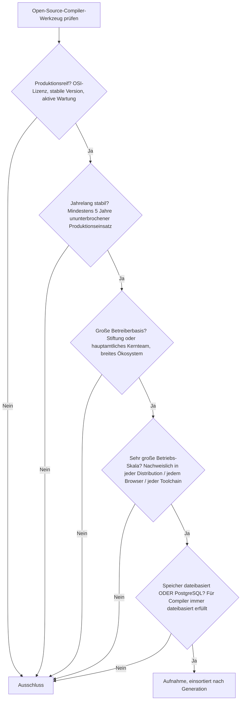
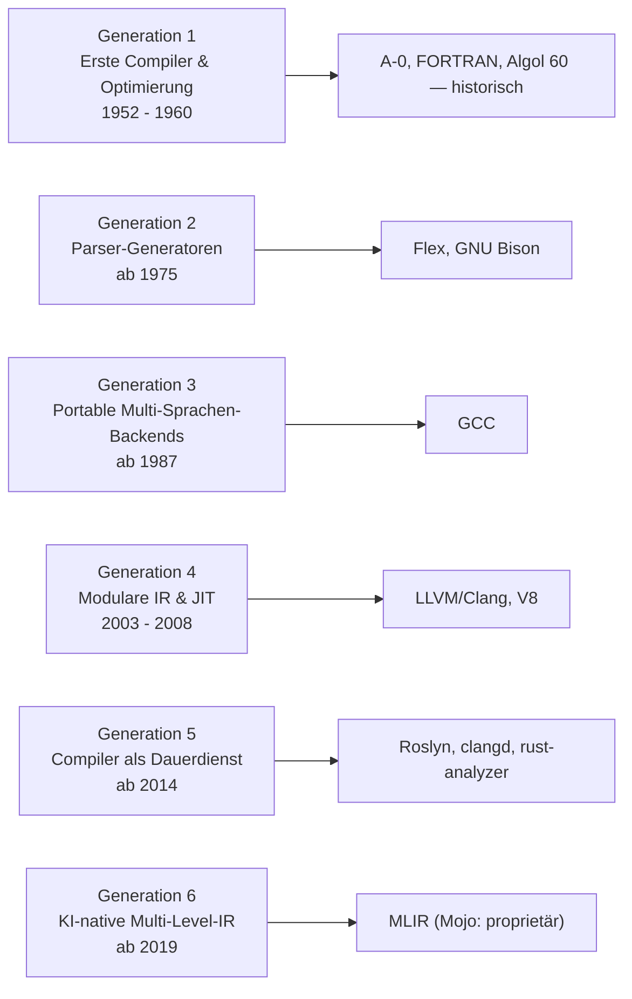

# Produktionsreife Open-Source-Compiler-Werkzeuge nach Generation — Reifegrad, Evaluation & Betriebs-Skala (Top 8)

Die [Evolution und Architekturen digitaler Compiler](evolution-digitaler-compiler.md) ordnet die Kategorie chronologisch in sechs Generationen — von den ersten handgeschriebenen Übersetzern über generierte Parser, portable Multi-Sprachen-Backends und modulare, JIT-fähige Infrastruktur bis zum Compiler als Dauerdienst und KI-nativer Multi-Level-IR. Die [Topliste bester Compiler-Werkzeuge 2026](compiler-2026-topliste.md) rankt die gesamte Kategorie. Diese Seite kombiniert alle Achsen — parallel zur [Versionskontroll-](produktionsreife-versionskontrollsysteme-generationen-2026-topliste.md), [Web-Framework-](../webentwicklung/produktionsreife-webframeworks-generationen-2026-topliste.md) und [Static-Site-Generatoren-Schwesterseite](../../wissen/dokumentation/produktionsreife-static-site-generatoren-generationen-2026-topliste.md) — zu einem bewusst **konservativen** Fünf-Filter-Sieb: produktionsreif · jahrelang stabil · große Betreiberbasis · sehr große Betriebs-Skala · Speicher dateibasiert oder PostgreSQL. Sortiert nach Generation, nicht nach Rang.

!!! warning "Achtung: Eine überreif besetzte Liste — Speicherfilter bedeutungslos, ein proprietärer Ausschluss"
    Acht Werkzeuge über fünf Generationen bestehen alle fünf Filter; die Compiler-Infrastruktur ist die *reifste* Werkzeuggattung des Repos. Der Speicherfilter greift nicht — ein Compiler übersetzt Dateien in Dateien, es gibt keine Laufzeit-Datenbank ([Speicher-Fazit](#dateibasiert-oder-postgresql)). Die einzigen echten Ausschlüsse: **Generation 1** (historisch), **Mojo** aus Generation 6 (die Standardbibliothek ist quelloffen, der *Compiler selbst* ist proprietär) und junge Rust-Backends wie **Cranelift**.

---

## Die fünf harten Filter

!!! note "Hinweis: OSI-Lizenzen und was als „Werkzeug" zählt"
    Aufgenommen werden Werkzeuge unter anerkannter Open-Source-Lizenz (GPL, Apache-2.0-mit-LLVM-Ausnahme, BSD, MIT). Das **Language Server Protocol** ist eine Spezifikation, kein betreibbares Programm — es wird als Fundament von Generation 5 in Prosa geführt, gerankt werden die Implementierungen (Roslyn, clangd, rust-analyzer). **Mojo** fällt an der Lizenz: Modular hat die Mojo-Standardbibliothek unter Apache-2.0 geöffnet, der Compiler bleibt geschlossen.

---

## Ergebnis: acht Werkzeuge über fünf Generationen

---

## Systeme nach Generation

### Generation 2 — Parser-Generatoren aus formaler Grammatik (ab 1975)

| # | Werkzeug | Sprache | Speicher | Lizenz | Seit | Skala-Nachweis |
|---|---|---|---|---|---|---|
| 1 | **Flex / GNU Bison** | C | dateibasiert (Grammatik-Datei → Parser-Quellcode) | GPL-3.0+ (Bison), BSD (Flex) | 1987 / 1985 | GNU-Projekt; die freien Nachfolger von Lex/Yacc stecken im Build jedes größeren C-Projekts, von Bash bis PostgreSQL |

**Flex** und **GNU Bison** sind die aktiv gewarteten freien Implementierungen des Lex/Yacc-Prinzips von 1975 — Bison-Releases erscheinen weiterhin (3.8, 2021). Sie erzeugen Parser-Quellcode aus einer Grammatik-Datei und laufen damit vollständig dateibasiert. **ANTLR** (v4, 2013) ist die moderne, mehrsprachige Alternative und würde das Sieb ebenfalls bestehen — als jüngeres Werkzeug derselben Generation hier als Ergänzung geführt.

### Generation 3 — Portable Multi-Sprachen-Backends (ab 1987)

| # | Werkzeug | Sprache | Speicher | Lizenz | Seit | Skala-Nachweis |
|---|---|---|---|---|---|---|
| 2 | **GCC** (GNU Compiler Collection) | C/C++ | dateibasiert | GPL-3.0+ mit Runtime-Ausnahme | 1987 | Standard-Systemcompiler jeder Linux-Distribution; GCC Steering Committee, hunderte Firmen-Beitragende, baut den Linux-Kernel |

**GCC** trennte als Erstes Frontend und Backend über eine sprachneutrale Zwischendarstellung und ist nach 38 Jahren weiterhin der Compiler, der die meiste Systemsoftware der Welt übersetzt. Getragen von FSF/GNU mit breiter Industriebeteiligung — der klarste denkbare Filter-Treffer.

### Generation 4 — Modulare Zwischendarstellung & Just-in-Time (2003 – 2008)

| # | Werkzeug | Sprache | Speicher | Lizenz | Seit | Skala-Nachweis |
|---|---|---|---|---|---|---|
| 3 | **LLVM / Clang** | C++ | dateibasiert (LLVM IR als Datei oder Bitcode) | Apache-2.0 mit LLVM-Ausnahme | 2003 / 2007 | LLVM Foundation; geteiltes Backend für Rust, Swift, Julia, Zig; Standard-Toolchain auf macOS/BSD, Android NDK |
| 4 | **V8** | C++ | dateibasiert (kein Persistenzmodell) | BSD-3-Clause | 2008 | Google; JIT-Engine hinter Chrome, Node.js, Deno, Cloudflare Workers — Milliarden Installationen |

**LLVM** machte die Zwischendarstellung selbst zum wiederverwendbaren Produkt und ist heute das gemeinsame Backend fast jeder neuen Systemsprache. **V8** verschob die Kompilierung in die Laufzeit und ist als Kern von Node.js und Chrome eine der meistausgeführten Codebasen überhaupt. Beide unter Industrie-Trägerschaft, beide zwei Jahrzehnte alt.

### Generation 5 — Der Compiler als Dauerdienst (ab 2014)

| # | Werkzeug | Sprache | Speicher | Lizenz | Seit | Skala-Nachweis |
|---|---|---|---|---|---|---|
| 5 | **Roslyn** (.NET Compiler Platform) | C# | dateibasiert | MIT | 2014 | Microsoft; „Compiler as a Service" für jedes C#/VB-Projekt, Grundlage von Visual Studio & OmniSharp |
| 6 | **clangd** | C++ | dateibasiert (`compile_commands.json`) | Apache-2.0 mit LLVM-Ausnahme | 2018 | Teil von LLVM; De-facto-Standard-Sprachserver für C/C++ in VS Code, (Neo)vim, Emacs |
| 7 | **rust-analyzer** | Rust | dateibasiert | MIT / Apache-2.0 | 2018 | rust-lang-Organisation; seit 2022 der offizielle Rust-Sprachserver, Standard in jeder Rust-IDE-Einrichtung |

**Roslyn** war 2014 der Pionier des „Compiler as a Service" — der Compiler als dauerhaft abfragbare API statt Einmalprozess —, zwei Jahre vor dem **Language Server Protocol** (Microsoft, 2016), das dieses Muster editorübergreifend standardisierte. **clangd** und **rust-analyzer** sind die beiden reifsten LSP-Sprachserver: inkrementelle Compiler-Frontends, die bei jedem Tastenanschlag nur den geänderten Teil neu analysieren.

### Generation 6 — KI-native Multi-Level-IR (ab 2019)

| # | Werkzeug | Sprache | Speicher | Lizenz | Seit | Skala-Nachweis |
|---|---|---|---|---|---|---|
| 8 | **MLIR** (Multi-Level Intermediate Representation) | C++ | dateibasiert (`.mlir`-Textformat) | Apache-2.0 mit LLVM-Ausnahme | 2019 | Teil des LLVM-Monorepos; IR-Fundament von TensorFlow/XLA, IREE, Triton, ONNX-MLIR und faktisch jeder ML-Compiler-Toolchain |

**MLIR** verallgemeinert LLVMs IR-Idee auf mehrere gleichzeitige Abstraktionsebenen — von High-Level-Tensor-Operationen bis zu Hardware-Details — und ist der einzige Generation-6-Vertreter, der das Sieb besteht: nicht als Startup-Produkt, sondern als integraler Teil von LLVM mit dessen Betreiberbasis. **Mojo**, die direkt auf MLIR aufgebaute Sprache desselben Architekten, fällt am Lizenzfilter — der Compiler ist proprietär.

### Generation 1 — warum hier nichts steht

- **A-0 System** (1952), der **FORTRAN-Compiler** (1957) und **Algol 60 / BNF** (1960) sind die konzeptionellen Wurzeln jedes späteren Werkzeugs, aber als betriebene Compiler seit Jahrzehnten irrelevant. Historische Einordnung: [Generation 1 der Compiler-Chronologie](evolution-digitaler-compiler.md#generation-1-erste-compiler-die-geburt-der-optimierung-1952-1960).

---

## Dateibasiert oder PostgreSQL?

Diese Kategorie ist — gemeinsam mit den [Static-Site-Generatoren](../../wissen/dokumentation/produktionsreife-static-site-generatoren-generationen-2026-topliste.md) — ein **Endpunkt der „dateibasiert"-Achse** der ganzen Familie:

- Ein Compiler liest Quelltext-Dateien und schreibt Objektdateien, Bitcode oder ein Binary. **Zur Übersetzungszeit läuft ein Prozess, danach nichts** — keine Datenbank, kein Dienst.
- Selbst die Dauerdienst-Generation (Roslyn, clangd, rust-analyzer) hält ihren Index nur im Arbeitsspeicher bzw. in einem lokalen Cache-Verzeichnis — die Projektwahrheit bleibt der Quelltext im Dateisystem.
- Eine „PostgreSQL-Variante" gibt es strukturell nicht; der Filter ist immer auf der „dateibasiert"-Seite erfüllt.

Fazit: Der Speicherfilter unterscheidet in dieser Kategorie nichts — er bestätigt nur, dass Compiler-Infrastruktur per Bauart die maximale Betriebsdisziplin hat.

!!! warning "Achtung: Momentaufnahme, Stand August 2026"
    Mojo kann seinen Compiler noch öffnen — dann wäre Generation 6 doppelt besetzt. Cranelift und der Zig-Compiler überschreiten in den nächsten Jahren die Reife-/Stabilitätsschwelle. GCC, LLVM/Clang und V8 sind die unverrückbaren Konstanten.

---

## Was bewusst nicht auf dieser Liste steht

| Werkzeug | Erfüllt nicht | Anmerkung |
|---|---|---|
| **Mojo** | Open-Source-Lizenz | Standardbibliothek Apache-2.0, Compiler selbst proprietär (Modular Inc.) |
| **Cranelift** | Reifezeit / Betreiberbasis | Rust-natives Codegen-Backend (Bytecode Alliance), jünger und enger fokussiert als LLVM |
| **Zig-Compiler** | Produktionsreife | Selbst-hostend, aber weiterhin 0.x ohne stabiles Release |
| **GraalVM** | Betreiberbasis / Kontinuität | Polyglot-VM/Compiler, Lizenz- und Trägerschaftsmodell mehrfach umgestellt |
| **Emscripten** | Kategorie | LLVM-basierte Toolchain — unter LLVM/Clang subsumiert |
| **TCC (Tiny C Compiler)** | Betreiberbasis | Weitgehend Einzelmaintainer, Nischennutzung |
| **Language Server Protocol** | Kategorie | Spezifikation, kein betreibbares Programm — als Fundament von Generation 5 in Prosa geführt |
| **A-0, FORTRAN-Compiler, Algol 60 / BNF** | Betriebs-Skala | Historische Generation-1-Werkzeuge |

---

## 🔗 Verwandte Themen

- [Evolution und Architekturen digitaler Compiler](evolution-digitaler-compiler.md) — das sechsstufige Generationenmodell, nach dem diese Liste sortiert ist
- [Beste Compiler-Werkzeuge 2026 (Top 15)](compiler-2026-topliste.md) — breiteste Basis-Topliste inklusive historischer und proprietärer Werkzeuge
- [Compiler: Übersetzen von Hochsprachen zu Maschinencode](compiler.md) — praktische Vertiefung: Phasen, GCC/Clang/Rustc im Vergleich
- [Produktionsreife Open-Source-Versionskontrollsysteme nach Generation (Top 6)](produktionsreife-versionskontrollsysteme-generationen-2026-topliste.md) — Schwesterseite derselben Entwickler-Werkzeug-Reihe
- [Beste Interpreter-Werkzeuge 2026 (Top 15)](interpreter-2026-topliste.md) — komplementäre Ausführungsstrategie
- [Beste Debugger-Werkzeuge 2026 (Top 15)](debugger-2026-topliste.md) — DWARF-Debug-Symbole als geteilter Berührungspunkt
- [Beste Build-Systeme 2026 (Top 15)](build-systeme-2026-topliste.md) — orchestriert die hier gerankten Compiler-Aufrufe
- [Rust in der Praxis](rust-praxis.md) — Vertiefung zu Rustc und rust-analyzer aus Generation 5
