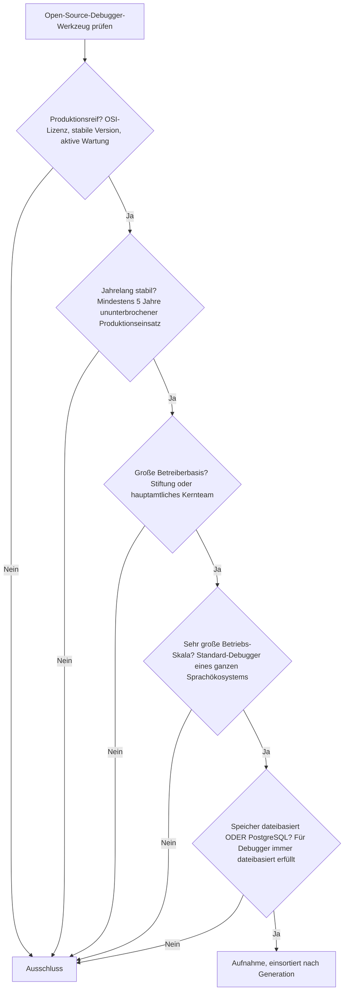

# Produktionsreife Open-Source-Debugger-Werkzeuge nach Generation — Reifegrad, Evaluation & Betriebs-Skala (Top 5)

Die [Evolution und Architekturen digitaler Debugger](evolution-digitaler-debugger.md) ordnet die Kategorie chronologisch in sechs Generationen — von den ersten interaktiven Speicher-Inspektoren über symbolische Quellcode-Debugger, grafische IDE-Integration und Remote-/Post-Mortem-Analyse bis zu Reverse-Debugging, protokoll-standardisierter Anbindung und verteiltem sowie KI-gestütztem Debugging. Die [Topliste bester Debugger-Werkzeuge 2026](debugger-2026-topliste.md) rankt die gesamte Kategorie. Diese Seite kombiniert alle Achsen — parallel zur [Compiler-](produktionsreife-compiler-werkzeuge-generationen-2026-topliste.md) und [Interpreter-Schwesterseite](produktionsreife-interpreter-werkzeuge-generationen-2026-topliste.md) — zu einem bewusst **konservativen** Fünf-Filter-Sieb: produktionsreif · jahrelang stabil · große Betreiberbasis · sehr große Betriebs-Skala · Speicher dateibasiert oder PostgreSQL. Sortiert nach Generation, nicht nach Rang.

!!! warning "Achtung: Eine kurze Liste — und das ist die Aussage"
    Nur fünf Werkzeuge über drei Generationen bestehen alle fünf Filter. Der Kern der Kategorie ist schmal: **GDB**, **LLDB**, ein sprachspezifischer Debugger je Ökosystem (**Delve** für Go), *ein* reifer Reverse-Debugger (**rr**) und die verteilte Tracing-Ebene (**OpenTelemetry**). Alles Neuere ist entweder proprietär (**Sentry** unter BSL, **UndoDB**), eine Praxis statt eines Werkzeugs (Print-Debugging, KI-Root-Cause-Analyse) oder ein Protokoll ohne betreibbares Programm (**DAP**). Der Speicherfilter ist bedeutungslos ([Speicher-Fazit](#dateibasiert-oder-postgresql)).

---

## Die fünf harten Filter



!!! note "Hinweis: Praxis und Protokoll zählen nicht als Werkzeug"
    **Print-Statement-Debugging** und **KI-gestützte Root-Cause-Analyse** sind Techniken, keine betreibbaren Programme. Das **Debug Adapter Protocol** ist eine Spezifikation — es wird als Fundament von Generation 5 in Prosa geführt. **Sentry** ist seit 2019 unter der nicht-OSI-konformen Business Source License und fällt am Lizenzfilter.

---

## Ergebnis: fünf Werkzeuge über drei Generationen

```mermaid
graph LR
    G1["Generation 1<br/>Erste interaktive Debugger<br/>1961 - 1970er"] --> G1R["DDT — historisch"]
    G2["Generation 2<br/>Symbolische Quellcode-Debugger<br/>1979 - 1986"] --> G2R["GDB, LLDB, Delve"]
    G3["Generation 3<br/>Grafische, integrierte Debugger<br/>1985 - 1988"] --> G3R["nur in IDEs — kein eigenständiges OSS-Werkzeug"]
    G4["Generation 4<br/>Remote & Post-Mortem<br/>1990er"] --> G4R["gdbserver — Teil von GDB"]
    G5["Generation 5<br/>Reverse-Debugging & Protokolle<br/>2005 - 2018"] --> G5R["rr (DAP: Spezifikation)"]
    G6["Generation 6<br/>Verteiltes & KI-Debugging<br/>ab 2019"] --> G6R["OpenTelemetry (Sentry: BSL)"]
```

---

## Systeme nach Generation

### Generation 2 — Symbolische Quellcode-Debugger (1979 – 1986)

| # | Werkzeug | Sprache | Speicher | Lizenz | Seit | Skala-Nachweis |
|---|---|---|---|---|---|---|
| 1 | **GDB** (GNU Debugger) | C | dateibasiert (Binary + DWARF, Core Dumps) | GPL-3.0+ | 1986 | GNU-Projekt; De-facto-Standard-Debugger für C/C++ auf Unix/Linux, in jeder Distribution |
| 2 | **LLDB** | C++ | dateibasiert (Binary + DWARF) | Apache-2.0 mit LLVM-Ausnahme | ~2010 | Teil von LLVM; Standard-Debugger von Xcode, Standard für Rust/Swift-Toolchains |
| 3 | **Delve** (`dlv`) | Go | dateibasiert | MIT | 2014 | Go-Community; De-facto-Standard-Debugger für Go, wo GDB die Runtime-Interna nur unzureichend abbildet |

**GDB** und **LLDB** sind die beiden tragenden symbolischen Debugger — GDB im GNU-/GCC-Umfeld, LLDB im LLVM-/Apple-/Rust-Umfeld. **Delve** zeigt das Muster der Kategorie: Jedes große Sprachökosystem betreibt seinen eigenen Backend-Debugger, weil generische Werkzeuge Runtime-Details (Goroutinen, GC) nicht sauber abbilden. `gdbserver` (Generation 4) ist Teil von GDB und deckt Remote-/Embedded-Debugging mit ab.

### Generation 5 — Reverse-Debugging & Protokoll-Standardisierung (2005 – 2018)

| # | Werkzeug | Sprache | Speicher | Lizenz | Seit | Skala-Nachweis |
|---|---|---|---|---|---|---|
| 4 | **rr** | C++ | dateibasiert (deterministische Ausführungs-Aufzeichnung) | MIT | 2015 | ursprünglich Mozilla, heute breit community-getragen; Standard-Werkzeug für nicht reproduzierbare Heisenbugs unter Linux |

**rr** zeichnet eine Ausführung deterministisch auf und macht sie beliebig oft vor- und rückwärts durchsuchbar — der einzige quelloffene Reverse-Debugger mit breiter Adoption und über zehn Jahren Reife. Das kommerzielle **UndoDB** aus derselben Generation ist proprietär. Das **Debug Adapter Protocol** (Microsoft, 2016) standardisierte die Editor-Anbindung analog zum LSP, ist aber eine Spezifikation, kein betreibbares Programm.

### Generation 6 — Verteiltes & KI-gestütztes Debugging (ab 2019)

| # | Werkzeug | Sprache | Speicher | Lizenz | Seit | Skala-Nachweis |
|---|---|---|---|---|---|---|
| 5 | **OpenTelemetry** | Go/Java/u. a. | dateibasiert (Collector-Konfiguration; Backend frei wählbar) | Apache-2.0 | 2019 | CNCF; De-facto-Standard für verteiltes Tracing, von praktisch jeder Cloud-Plattform unterstützt |

**OpenTelemetry** verschiebt „Debugging" von einem einzelnen Prozessstopp zu einer zusammenhängenden Zeitleiste über Dutzende Microservices — genau genommen Observability statt klassisches Debugging, aber die einzige Generation-6-Antwort mit Stiftungs-Trägerschaft (CNCF) und sehr großer Betriebs-Skala. **Sentry** löst ein ähnliches Problem, ist aber seit 2019 unter der Business Source License und damit nicht OSI-konform. **KI-gestützte Root-Cause-Analyse** ist 2026 noch kein eigenständiges, reifes Open-Source-System.

### Generation 1 & 3 — warum hier nichts steht

- **Generation 1**: **DDT** (1961) begründete den interaktiven Debugger; **Print-Statement-Debugging** ist die nie verschwundene informelle Technik — kein Werkzeug im Sinne dieser Liste.
- **Generation 3**: Grafische Debugger existieren 2026 fast ausschließlich **als Teil einer IDE** (VS Code + DAP, JetBrains, Visual Studio). Es gibt kein eigenständiges, quelloffenes, breit betriebenes GUI-Debugger-Produkt — die Generation ist in den Editor gewandert.

---

## Dateibasiert oder PostgreSQL?

Der Speicherfilter ist auch hier **strukturell bedeutungslos**:

- Ein Debugger liest ein Binary, dessen DWARF-Debug-Symbole und optional einen Core Dump — alles Dateien. `rr` schreibt seine Aufzeichnung in ein lokales Verzeichnis.
- OpenTelemetry ist die einzige Ausnahme mit nennenswerter Speicherfrage: Der Collector selbst ist datei-/konfigurationsbasiert, das Trace-Backend ist frei wählbar (Jaeger, Tempo, eine PostgreSQL-Tabelle) — kein Pflicht-Zweitsystem.
- Eine „PostgreSQL-Variante" der klassischen Debugger existiert nicht.

Fazit: Der Filter trennt nichts. Er bestätigt, dass Debugger auf denselben Dateien arbeiten, die Compiler erzeugen.

!!! warning "Achtung: Momentaufnahme, Stand August 2026"
    Sollte Sentry je zu einer OSI-Lizenz zurückkehren, käme ein Generation-6-Treffer hinzu. KI-Root-Cause-Werkzeuge könnten in wenigen Jahren die Reifeschwelle erreichen. GDB und LLDB sind die unverrückbaren Konstanten.

---

## Was bewusst nicht auf dieser Liste steht

| Werkzeug | Erfüllt nicht | Anmerkung |
|---|---|---|
| **Sentry** | Open-Source-Lizenz | Seit 2019 Business Source License — nicht OSI-konform |
| **UndoDB** | Open-Source-Lizenz | Kommerzielles Reverse-Debugging-Werkzeug |
| **Debug Adapter Protocol** | Kategorie | Spezifikation, kein betreibbares Programm — Fundament von Generation 5 in Prosa |
| **KI-gestützte Root-Cause-Analyse** | Produktionsreife / Kategorie | 2026 kein eigenständiges, reifes Open-Source-System |
| **Valgrind** | Kategorie | Dynamische Analyse (Memory/Threads) statt interaktiver Debugger — eigene Werkzeuggattung |
| **Print-Statement-Debugging** | Kategorie | Informelle Technik, kein Werkzeug |
| **dbx, CodeView, Turbo Debugger, DDT** | Betriebs-Skala | Historische Generation-1–3-Debugger |

---

## 🔗 Verwandte Themen

- [Evolution und Architekturen digitaler Debugger](evolution-digitaler-debugger.md) — das sechsstufige Generationenmodell, nach dem diese Liste sortiert ist
- [Beste Debugger-Werkzeuge 2026 (Top 15)](debugger-2026-topliste.md) — breiteste Basis-Topliste inklusive proprietärer und historischer Werkzeuge
- [Produktionsreife Open-Source-Compiler-Werkzeuge nach Generation (Top 8)](produktionsreife-compiler-werkzeuge-generationen-2026-topliste.md) — DWARF-Debug-Symbole als geteilter Berührungspunkt
- [Produktionsreife Open-Source-Interpreter-Werkzeuge nach Generation (Top 8)](produktionsreife-interpreter-werkzeuge-generationen-2026-topliste.md) — die Laufzeiten, die diese Debugger beobachtbar machen
- [C in der Praxis](c-praxis.md) — praktische GDB-Nutzung
- [AI Agents – Das Praxis-Handbuch & Architektur-Leitfaden](../../künstliche-intelligenz/coding/ai-agents-praxis.md) — Vertiefung zu KI-gestützter Fehleranalyse aus Generation 6
