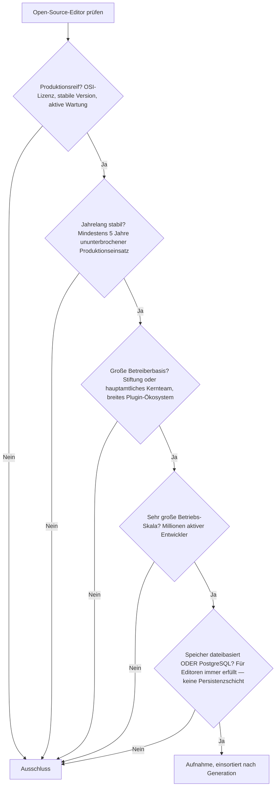
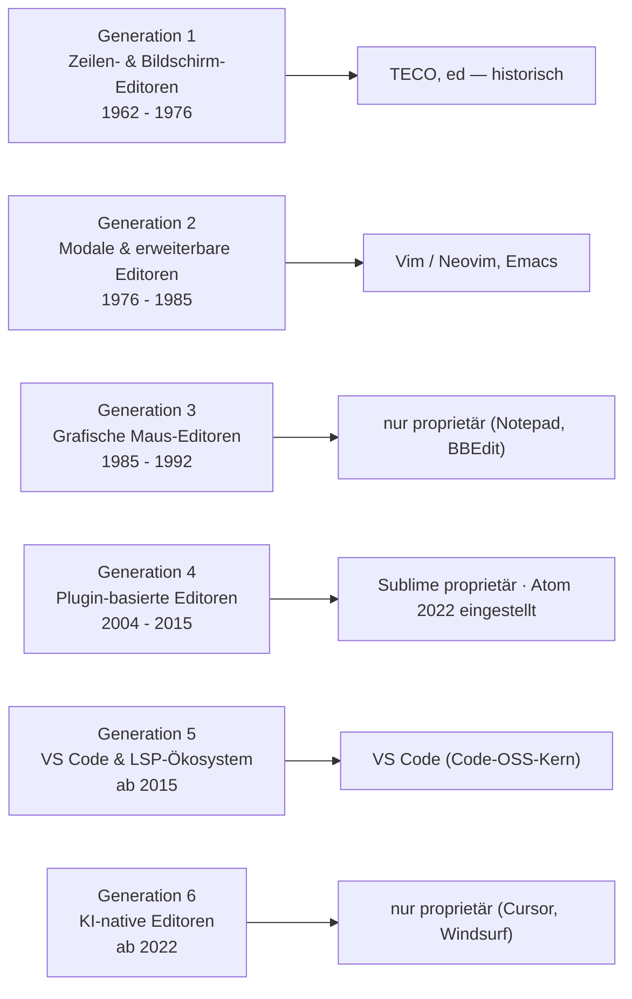

# Produktionsreife Open-Source-Editoren nach Generation — Reifegrad, Evaluation & Betriebs-Skala (Top 3)

Die [Evolution und Architekturen digitaler Editoren](evolution-digitaler-editoren.md) ordnet die Kategorie chronologisch in sechs Generationen — von zeilenweisen Kommandozeilen-Editoren über die modale/erweiterbare Ära (vi vs. Emacs), grafische Maus-Editoren und Plugin-Ökosysteme bis zum Language-Server-basierten VS-Code-Zeitalter und KI-nativen Editoren. Die [Topliste bester Editoren 2026](editoren-2026-topliste.md) rankt die gesamte Kategorie. Diese Seite kombiniert alle Achsen — parallel zur [Compiler-](produktionsreife-compiler-werkzeuge-generationen-2026-topliste.md) und [Versionskontroll-Schwesterseite](produktionsreife-versionskontrollsysteme-generationen-2026-topliste.md) — zu einem bewusst **konservativen** Fünf-Filter-Sieb: produktionsreif · jahrelang stabil · große Betreiberbasis · sehr große Betriebs-Skala · Speicher dateibasiert oder PostgreSQL. Sortiert nach Generation, nicht nach Rang.

!!! warning "Achtung: Nur drei Treffer — und die Lücke ist die eigentliche Geschichte"
    Genau drei Editoren bestehen alle fünf Filter: **Vim/Neovim** und **Emacs** aus der modalen Ära von 1976, plus **VS Code** (Code-OSS-Kern) aus 2015. Die Generationen 3, 4 und 6 liefern **keinen einzigen** quelloffenen, reifen, breit betriebenen Vertreter: Generation 3 war immer proprietär (Notepad, BBEdit), Generation 4 ging entweder proprietär (Sublime Text) oder wurde eingestellt (**Atom**, 2022), Generation 6 ist bislang vollständig proprietär (Cursor, Windsurf). Der Speicherfilter entfällt — ein Editor hat keine Persistenzschicht ([Speicher-Fazit](#dateibasiert-oder-postgresql-es-gibt-keine-persistenzschicht)).

---

## Die fünf harten Filter

!!! note "Hinweis: Der Editor-Kern muss quelloffen sein"
    **VS Code** wird über den MIT-lizenzierten Kern (`Code - OSS` / VSCodium) aufgenommen; das offizielle Microsoft-Binary enthält proprietäre Zusätze. **Cursor**, **Windsurf** und die **JetBrains-IDEs** sind vollständig proprietär, ihre VS-Code-Basis ändert daran nichts. **Sublime Text** ist proprietäre Shareware.

---

## Ergebnis: drei Editoren über zwei Generationen

---

## Systeme nach Generation

### Generation 2 — Modale & erweiterbare Editoren (1976 – 1985)

| # | Editor | Sprache | Speicher | Lizenz | Seit | Skala-Nachweis |
|---|---|---|---|---|---|---|
| 1 | **Vim / Neovim** | C / C + Lua | dateibasiert (reine Textdateien) | Vim License (charityware) / Apache-2.0 (Neovim) | 1991 / 2014 | Auf praktisch jedem Unix-System vorinstalliert; Neovim mit sehr aktiver Plugin-/LSP-Community |
| 2 | **GNU Emacs** | C / Emacs Lisp | dateibasiert | GPL-3.0+ | 1985 | GNU-Projekt; vollständig in Emacs Lisp skriptbar, ununterbrochene Wartung seit vier Jahrzehnten |

Die „Editor Wars" von 1976 sind 2026 unentschieden — **Vim** (mit dem aktiv weiterentwickelten Fork **Neovim**) und **Emacs** sind beide weiterhin in täglichem Produktionseinsatz, beide mit großem Ökosystem und institutioneller bzw. breiter Community-Trägerschaft. Nach Bram Moolenaars Tod 2023 wird Vim community-gepflegt fortgeführt.

### Generation 5 — VS Code & das Language-Server-Ökosystem (ab 2015)

| # | Editor | Sprache | Speicher | Lizenz | Seit | Skala-Nachweis |
|---|---|---|---|---|---|---|
| 3 | **Visual Studio Code** (Code-OSS-Kern) | TypeScript | dateibasiert | MIT (Kern) | 2015 | Microsoft; mit Abstand meistgenutzter Editor 2026, riesiger Extensions-Marketplace, LSP-Miterfinder |

**VS Code** setzte sich über tiefe Sprachintelligenz per **Language Server Protocol** durch — demselben Standard, der heute editorübergreifendes Fundament ist. Der MIT-lizenzierte Kern (`Code - OSS`, ausgeliefert als VSCodium) besteht das Sieb; über zehn Jahre alt, unangefochtene Betriebs-Skala.

### Generation 1, 3, 4 & 6 — warum hier nichts steht

- **Generation 1**: **TECO** (1962), **ed** (1969) und **ex/vi** (1976) begründeten die Kategorie. `ed` ist bis heute POSIX-Standard und überall installiert, wird aber praktisch nicht mehr als täglicher Editor *betrieben*.
- **Generation 3**: **Notepad** (Microsoft) und **BBEdit** (Bare Bones) sind beide proprietär und an einen einzelnen Hersteller gebunden — kein quelloffener Vertreter.
- **Generation 4**: Die Plugin-Ökosystem-Generation ist die einzige mit einem **kompletten Produkt-Ende** in dieser Chronologie-Familie: **TextMate 2** ist quelloffen, aber faktisch unbetreut; **Sublime Text** blieb proprietär; **Atom** wurde 2022 von GitHub vollständig eingestellt.
- **Generation 6**: **Cursor** (Anysphere) und **Windsurf** (Codeium) sind proprietäre VS-Code-Forks. **Zeds** agentische Funktionen sind quelloffen (GPL), aber Zed selbst ist mit ~4 Jahren zu jung.

---

## Dateibasiert oder PostgreSQL? — Es gibt keine Persistenzschicht

Diese Kategorie ist — wie die [SPA-Frameworks](../webentwicklung/produktionsreife-spa-frameworks-generationen-2026-topliste.md) — ein Fall, in dem der Speicherfilter **strukturell entfällt**:

- Ein Editor bearbeitet reine Textdateien im Dateisystem. Er hat keine Datenbank, kein Laufzeit-Backend, keinen Serverprozess.
- Konfiguration (`.vimrc`, `init.lua`, `settings.json`), Sitzungszustand und Plugin-Caches liegen als Dateien vor.
- Eine „PostgreSQL-Variante" ergibt für einen Editor keinen Sinn — der Filter ist trivial auf der „dateibasiert"-Seite.

Fazit: Der Speicherfilter unterscheidet nichts. Entscheidend waren hier die Filter **Open-Source-Lizenz** und **Kontinuität** — und an denen scheitern drei von sechs Generationen vollständig.

!!! warning "Achtung: Momentaufnahme, Stand August 2026"
    **Zed** überschreitet 2027 die Fünf-Jahres-Marke und wäre dann der erste Generation-5/6-Nachrücker mit nativem Rust-Kern. **Helix** (Rust, modal) ist auf demselben Weg, aber noch vor 1.0. Sollte ein KI-nativer Editor mit OSI-Lizenz breite Adoption erreichen, füllt sich Generation 6. Vim/Neovim und Emacs sind die unverrückbaren Konstanten.

---

## Was bewusst nicht auf dieser Liste steht

| Editor | Erfüllt nicht | Anmerkung |
|---|---|---|
| **Sublime Text** | Open-Source-Lizenz | Proprietäre Shareware |
| **Cursor** | Open-Source-Lizenz | Proprietärer VS-Code-Fork (Anysphere) |
| **Windsurf** | Open-Source-Lizenz | Proprietärer VS-Code-Fork (Codeium) |
| **JetBrains IDEs** | Open-Source-Lizenz | Kommerzielle IDE-Familie |
| **Notepad, BBEdit** | Open-Source-Lizenz | Herstellergebundene GUI-Editoren |
| **Atom** | Kontinuität | 2022 von GitHub vollständig eingestellt |
| **TextMate** | Aktive Wartung | TextMate 2 quelloffen, aber faktisch unbetreut |
| **Zed** | Reifezeit | Nativer Rust-Editor mit KI-Funktionen, erst 2022 — aussichtsreichster Nachrücker |
| **Helix** | Produktionsreife | Modaler Rust-Editor, weiterhin vor 1.0 |
| **TECO, ed, ex/vi** | Betriebs-Skala | Historische Generation-1-Editoren |

---

## 🔗 Verwandte Themen

- [Evolution und Architekturen digitaler Editoren](evolution-digitaler-editoren.md) — das sechsstufige Generationenmodell, nach dem diese Liste sortiert ist
- [Beste Editoren 2026 (Top 15)](editoren-2026-topliste.md) — breiteste Basis-Topliste inklusive proprietärer und eingestellter Editoren
- [Beste IDEs & Editoren mit Rust-Unterstützung (Top 20)](rust-ide-topliste.md) — Zed, Cursor und Windsurf im praktischen Rust-Vergleich
- [Produktionsreife Open-Source-Compiler-Werkzeuge nach Generation (Top 8)](produktionsreife-compiler-werkzeuge-generationen-2026-topliste.md) — LSP als Fundament der hier gerankten Generation 5
- [Produktionsreife Open-Source-Enterprise-UI-Bibliotheken nach Generation](../webentwicklung/produktionsreife-enterprise-ui-bibliotheken-generationen-2026-topliste.md) — Schwesterseite mit demselben Muster des Open-Source-Rückzugs
- [IDE & Tools: Übersicht](../ide/index.md) — produkt-/tool-orientierte Gesamtübersicht
