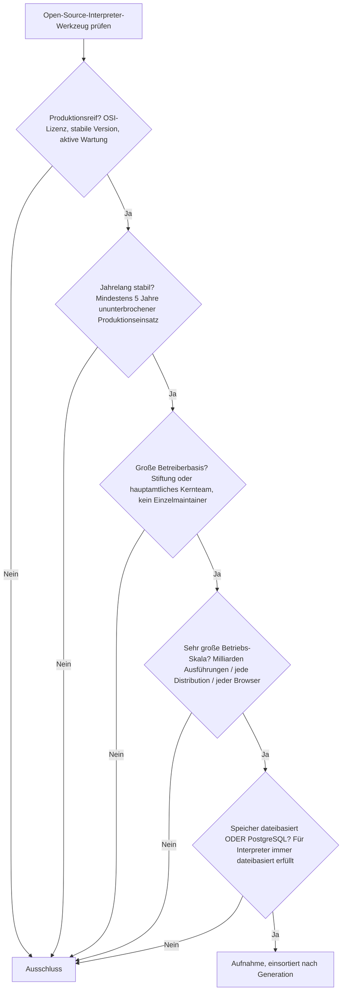
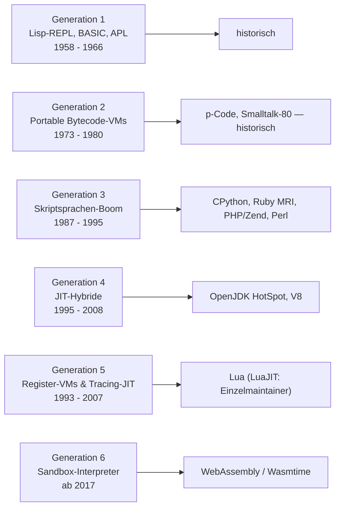

# Produktionsreife Open-Source-Interpreter-Werkzeuge nach Generation — Reifegrad, Evaluation & Betriebs-Skala (Top 8)

Die [Evolution und Architekturen digitaler Interpreter](evolution-digitaler-interpreter.md) ordnet die Kategorie chronologisch in sechs Generationen — vom ersten Lisp-REPL über portable Bytecode-VMs, den Skriptsprachen-Boom und JIT-Hybride bis zu registerbasierten VMs und sandboxed WebAssembly-/KI-Agenten-Interpretern. Die [Topliste bester Interpreter-Werkzeuge 2026](interpreter-2026-topliste.md) rankt die gesamte Kategorie. Diese Seite kombiniert alle Achsen — parallel zur [Compiler-](produktionsreife-compiler-werkzeuge-generationen-2026-topliste.md) und [Versionskontroll-Schwesterseite](produktionsreife-versionskontrollsysteme-generationen-2026-topliste.md) — zu einem bewusst **konservativen** Fünf-Filter-Sieb: produktionsreif · jahrelang stabil · große Betreiberbasis · sehr große Betriebs-Skala · Speicher dateibasiert oder PostgreSQL. Sortiert nach Generation, nicht nach Rang.

!!! warning "Achtung: Fast jede große Sprach-Laufzeit besteht — das Interessante ist der Rand"
    Acht Interpreter über vier Generationen bestehen alle fünf Filter; praktisch jede etablierte Skriptsprachen-Laufzeit ist überreif. Der Speicherfilter greift nicht — ein Interpreter liest Quelltext bzw. Bytecode aus Dateien ([Speicher-Fazit](#dateibasiert-oder-postgresql)). Die Spannung liegt an zwei Rändern: **Generation 6** (WASM-Sandboxing) erreicht 2026 gerade die Reifeschwelle, und mehrere hochskalierte Laufzeiten hängen an **einem einzigen Maintainer** (LuaJIT, QuickJS) und fallen am Betreiberbasis-Filter.

---

## Die fünf harten Filter

!!! note "Hinweis: Laufzeit, nicht Sprache"
    Bewertet wird die **Interpreter-Implementierung** (CPython, nicht „Python"; V8, nicht „JavaScript"). Reine Konzepte (Lisp-REPL, Print-Debugging-Äquivalent) und Spezifikationen ohne betreibbares Programm bleiben Prosa. Der WebAssembly-Standard selbst ist eine W3C-Spezifikation — gerankt werden die Runtimes (Wasmtime).

---

## Ergebnis: acht Interpreter über vier Generationen

---

## Systeme nach Generation

### Generation 3 — Skriptsprachen-Interpreter-Boom (1987 – 1995)

| # | Interpreter | Sprache | Speicher | Lizenz | Seit | Skala-Nachweis |
|---|---|---|---|---|---|---|
| 1 | **CPython** | C | dateibasiert (`.pyc`-Bytecode) | PSF License | 1991 | Referenzimplementierung von Python, Python Software Foundation; meistgenutzte Laufzeit dieser Liste |
| 2 | **Ruby MRI / YARV** | C | dateibasiert | BSD-2-Clause / Ruby License | 1995 | Ruby-Core-Team; trägt Rails und einen Großteil der Startup-Web-Landschaft |
| 3 | **PHP (Zend Engine)** | C | dateibasiert | PHP License / Zend Engine License | 1995 | PHP Foundation (seit 2021); führt weiterhin den größten Anteil serverseitiger Websites aus |
| 4 | **Perl 5** | C | dateibasiert | Artistic / GPL | 1987 | Perl-5-Porters; riesige Bestandsbasis in System- und Bioinformatik-Skripten, weiterhin regelmäßige Releases |

Der Skriptsprachen-Boom brachte gleich vier überreife Laufzeiten hervor. **CPython**, **Ruby MRI** und die **Zend Engine** tragen zusammen einen Großteil des heutigen Webs. **Perl 5** ist der Legacy-Fall — schrumpfende Neunutzung, aber ungebrochene Wartung und Milliarden Zeilen produktiven Bestandscodes. **Tcl** besteht das Sieb ebenfalls (stabil, eingebettet), ist als eigenständig betriebene Sprache aber deutlich kleiner.

### Generation 4 — JIT-Hybride (1995 – 2008)

| # | Interpreter | Sprache | Speicher | Lizenz | Seit | Skala-Nachweis |
|---|---|---|---|---|---|---|
| 5 | **OpenJDK / HotSpot VM** | C++/Java | dateibasiert (`.class`/`.jar`) | GPL-2.0 mit Classpath-Ausnahme | 1999 | Oracle plus Eclipse Adoptium, Red Hat, Azul; Rückgrat der gesamten Enterprise-JVM-Welt |
| 6 | **V8** | C++ | dateibasiert | BSD-3-Clause | 2008 | Google; JIT-Kern von Chrome, Node.js, Deno, Cloudflare Workers — Milliarden Installationen |

**HotSpot** (heute als OpenJDK) etablierte das Profiling-JIT: erst interpretieren, nur „heiße" Methoden nativ kompilieren. **V8** radikalisierte das Prinzip, indem es JavaScript-Quelltext direkt als JIT-Ausgangspunkt nimmt. Beide unter breiter Industrie-Trägerschaft, beide über 15 Jahre alt.

### Generation 5 — Register-basierte VMs & Tracing-JIT (1993 – 2007)

| # | Interpreter | Sprache | Speicher | Lizenz | Seit | Skala-Nachweis |
|---|---|---|---|---|---|---|
| 7 | **Lua** | C | dateibasiert | MIT | 1993 (Register-VM ab 5.0, 2003) | PUC-Rio; eingebettet in Redis, Nginx/OpenResty, Neovim, unzählige Spiele-Engines |

**Lua** ist die bewusste Ausnahme vom stackbasierten VM-Design und durch seine Rolle als *eingebettete* Sprache eine der am häufigsten ausgeführten Laufzeiten überhaupt. Das Kernteam ist klein, aber institutionell verankert (PUC-Rio) und seit über 30 Jahren stabil. **LuaJIT** (Mike Pall) und **PyPy** bleiben außen vor: LuaJIT hängt praktisch an einem einzigen Maintainer, PyPys Betreiberbasis und Produktionsanteil sind zu schmal.

### Generation 6 — Sandbox-Interpreter für WebAssembly & KI-Agenten (ab 2017)

| # | Interpreter | Sprache/Format | Speicher | Lizenz | Seit | Skala-Nachweis |
|---|---|---|---|---|---|---|
| 8 | **WebAssembly / Wasmtime** | WASM | dateibasiert (`.wasm`-Module) | Apache-2.0 mit LLVM-Ausnahme | 2019 | Bytecode Alliance (Mozilla, Fastly, Intel, Microsoft); WASM ist W3C-Standard, produktiv bei Fastly, Shopify, Cloudflare |

**WebAssembly** verbindet die Portabilitätsidee des p-Systems mit Sicherheits-Isolation als Kernziel. Der Standard ist seit 2019 W3C-Empfehlung, **Wasmtime** wird von einem breiten Firmenkonsortium getragen und produktiv im Edge-Computing betrieben — 2026 gerade an der Fünf-Jahres-Schwelle, deshalb ein *knapper* Treffer. **Pyodide** (CPython zu WASM) und **QuickJS** stehen dahinter: Pyodide reifezeitknapp, QuickJS ursprünglich Einzelautor-Projekt.

### Generation 1 & 2 — warum hier nichts steht

- **Generation 1**: Der **Lisp-REPL** (1958), **BASIC** (1964) und **APL** (1966) prägen bis heute das interaktive Interface, sind als betriebene Interpreter aber historisch. Moderne Common-Lisp-Implementierungen wie SBCL bestünden das Sieb, bleiben aber eine kleine Nische.
- **Generation 2**: **p-Code** und **Smalltalk-80** begründeten die Bytecode-VM. Lebende Smalltalks (Pharo, Squeak) haben zu kleine Betreiberbasis; das Konzept selbst lebt in jeder späteren Generation weiter.

---

## Dateibasiert oder PostgreSQL?

Wie bei den [Compilern](produktionsreife-compiler-werkzeuge-generationen-2026-topliste.md) ist der Speicherfilter hier **strukturell bedeutungslos**:

- Ein Interpreter liest Quelltext oder vorab erzeugten Bytecode (`.pyc`, `.class`, `.wasm`) aus dem Dateisystem und führt ihn aus. Es gibt keine Laufzeit-Datenbank, kein Pflicht-Zweitsystem.
- Bytecode-Caches (`__pycache__`, JIT-Code-Caches) liegen als Dateien vor; die Programmwahrheit bleibt der Quelltext.
- Eine „PostgreSQL-Variante" existiert nicht — der Filter ist immer auf der „dateibasiert"-Seite erfüllt.

Fazit: Der Speicherfilter trennt in dieser Kategorie nichts. Er bestätigt nur, dass Sprach-Laufzeiten per Bauart datenbankfrei sind.

!!! warning "Achtung: Momentaufnahme, Stand August 2026"
    Wasmtime/WASM festigen 2026/2027 ihren Reifestatus. PyPys Finanzierung bleibt fragil. LuaJIT und QuickJS würden bei einem Wechsel zu echter Team-Wartung nachrücken. CPython, V8 und OpenJDK sind die unverrückbaren Konstanten.

---

## Was bewusst nicht auf dieser Liste steht

| Interpreter | Erfüllt nicht | Anmerkung |
|---|---|---|
| **LuaJIT** | Betreiberbasis | Massiv deployt (OpenResty, Spiele), aber praktisch Einzelmaintainer |
| **QuickJS** | Betreiberbasis | Ursprünglich Einzelautor (Fabrice Bellard); `quickjs-ng`-Fork erst im Aufbau |
| **PyPy** | Betreiberbasis / Betriebs-Skala | Meta-Tracing-JIT technisch reif, aber schmale Trägerschaft und Minderheiten-Produktionsanteil |
| **Pyodide** | Reifezeit | CPython-zu-WASM, breite Nutzung (JupyterLite), aber knapp an der Fünf-Jahres-Marke |
| **GraalVM Truffle** | Betreiberbasis / Kontinuität | Polyglot-Interpreter-Framework, Oracle-Lizenz- und Trägerschaftsmodell mehrfach umgestellt |
| **Node.js / Deno / Bun (als Runtime)** | Kategorie | Runtimes *um* V8 bzw. JavaScriptCore — die Interpreter-Ebene ist V8 |
| **Smalltalk-80, p-System, Lisp-REPL, BASIC, APL** | Betriebs-Skala | Historische Generation-1/2-Interpreter |

---

## 🔗 Verwandte Themen

- [Evolution und Architekturen digitaler Interpreter](evolution-digitaler-interpreter.md) — das sechsstufige Generationenmodell, nach dem diese Liste sortiert ist
- [Beste Interpreter-Werkzeuge 2026 (Top 15)](interpreter-2026-topliste.md) — breiteste Basis-Topliste
- [Produktionsreife Open-Source-Compiler-Werkzeuge nach Generation (Top 8)](produktionsreife-compiler-werkzeuge-generationen-2026-topliste.md) — komplementäre Ausführungsstrategie, V8 als geteilter Berührungspunkt
- [Produktionsreife Open-Source-Versionskontrollsysteme nach Generation (Top 6)](produktionsreife-versionskontrollsysteme-generationen-2026-topliste.md) — Schwesterseite derselben Entwickler-Werkzeug-Reihe
- [Shell & Bash Praxis-Handbuch](shell-bash-praxis.md) — Bash als alltäglich genutzter Interpreter
- [Evolution und Architekturen digitaler Autonomer KI-Agenten](../../künstliche-intelligenz/evolution-digitaler-autonome-ki-agenten.md) — Vertiefung zu den Code-Sandboxes aus Generation 6
