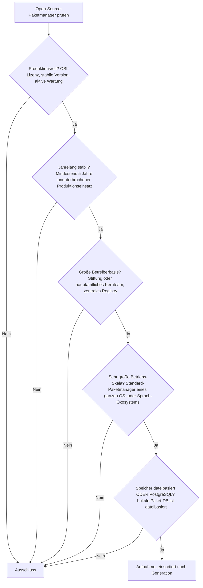
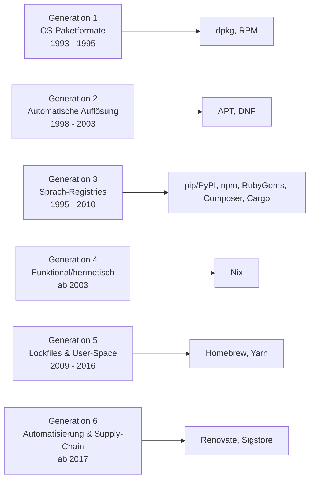

# Produktionsreife Open-Source-Paketmanager nach Generation — Reifegrad, Evaluation & Betriebs-Skala (Top 13)

Die [Evolution und Architekturen digitaler Paketmanager](evolution-digitaler-paketmanager.md) ordnet die Kategorie chronologisch in sechs Generationen — von ersten OS-Paketformaten ohne Abhängigkeitsauflösung über deren Lösung, sprachspezifische Registries, funktionale/hermetische Paketmanager, Lockfiles bis zu automatisierter Abhängigkeitspflege und kryptographischer Lieferketten-Sicherheit. Die [Topliste bester Paketmanager 2026](paketmanager-2026-topliste.md) rankt die gesamte Kategorie. Diese Seite kombiniert alle Achsen — parallel zur [Build-System-](produktionsreife-build-systeme-generationen-2026-topliste.md), [Compiler-](produktionsreife-compiler-werkzeuge-generationen-2026-topliste.md) und [Versionskontroll-Schwesterseite](produktionsreife-versionskontrollsysteme-generationen-2026-topliste.md) — zu einem bewusst **konservativen** Fünf-Filter-Sieb: produktionsreif · jahrelang stabil · große Betreiberbasis · sehr große Betriebs-Skala · Speicher dateibasiert oder PostgreSQL. Sortiert nach Generation, nicht nach Rang.

!!! warning "Achtung: Die überreifste Kategorie der ganzen Familie — Generation 6 diesmal besetzt"
    Dreizehn Paketmanager über **alle sechs Generationen** bestehen alle fünf Filter — als einzige Systemprogrammierungs-Kategorie mit lückenloser Generationsabdeckung. Fast jeder OS- und Sprach-Paketmanager ist überreif. Der Speicherfilter greift nicht — ein Paketmanager pflegt eine lokale Paket-Datenbank aus Dateien; das zentrale Registry ist ein *entfernter Dienst*, kein Pflicht-Zweitsystem ([Speicher-Fazit](#dateibasiert-oder-postgresql)). Anders als bei Editoren, Debuggern oder Build-Systemen hat auch **Generation 6** reife Vertreter: Renovate und Sigstore.

---

## Die fünf harten Filter

!!! note "Hinweis: das Registry zählt nicht als Speicher-Zweitsystem"
    Ein Paketmanager (`apt`, `npm`, `cargo`) führt lokal eine dateibasierte Datenbank installierter Pakete plus einen Cache. Das zentrale Registry (PyPI, npm-Registry, crates.io) ist ein *externer Dienst*, kein Backend, das der Nutzer betreibt — der Filter bleibt auf der „dateibasiert"-Seite. **Cargo** ist Doppelbürger und erscheint auch auf der [Build-System-Schwesterseite](produktionsreife-build-systeme-generationen-2026-topliste.md).

---

## Ergebnis: dreizehn Paketmanager über sechs Generationen

---

## Systeme nach Generation

### Generation 1 — OS-Paketformate (1993 – 1995)

| # | System | Ökosystem | Speicher | Lizenz | Seit | Skala-Nachweis |
|---|---|---|---|---|---|---|
| 1 | **dpkg** | Debian/Ubuntu | dateibasiert (lokale Paket-DB) | GPL-2.0+ | 1993 | Fundament jeder Debian-/Ubuntu-Installation weltweit |
| 2 | **RPM** | Red Hat/Fedora/SUSE | dateibasiert | GPL-2.0+ | 1995 | Fundament der gesamten RPM-Distributionsfamilie |

### Generation 2 — Automatische Abhängigkeitsauflösung (1998 – 2003)

| # | System | Ökosystem | Speicher | Lizenz | Seit | Skala-Nachweis |
|---|---|---|---|---|---|---|
| 3 | **APT** | Debian/Ubuntu | dateibasiert | GPL-2.0+ | 1998 | Standard-Werkzeug (`apt install`) auf hunderten Millionen Systemen |
| 4 | **DNF** (Nachfolger von YUM) | Fedora/RHEL | dateibasiert | GPL-2.0+ | 2015 | Standard-Auflöser der RPM-Welt; YUM historisch, DNF5 aktuell |

**APT** und **DNF** lösten die „Dependency Hell" der Generation 1 — ein Solver berechnet die vollständige Installationsmenge aus einem Repository-Index.

### Generation 3 — Sprachspezifische Paketmanager & zentrale Registries (1995 – 2010)

| # | System | Ökosystem | Speicher | Lizenz | Seit | Skala-Nachweis |
|---|---|---|---|---|---|---|
| 5 | **pip / PyPI** | Python | dateibasiert (`site-packages`, Wheel-Cache) | MIT / PSF | 2008 | Python Packaging Authority; Standard-Installationsweg trotz wachsender uv-Konkurrenz |
| 6 | **npm** | Node.js/JavaScript | dateibasiert (`node_modules`, `package-lock.json`) | Artistic-2.0 | 2010 | GitHub/Microsoft; größtes Paket-Registry überhaupt |
| 7 | **RubyGems** (inkl. Bundler) | Ruby | dateibasiert (`Gemfile.lock`) | MIT / Ruby | 2004 | Ruby-Core; Bundler seit Jahren integraler Bestandteil |
| 8 | **Composer** | PHP | dateibasiert (`composer.lock`) | MIT | 2011 | Fundament des gesamten modernen PHP-Ökosystems (Laravel, Symfony) |
| 9 | **Cargo** | Rust | dateibasiert (`Cargo.lock`) | MIT / Apache-2.0 | 2014 | rust-lang; crates.io als zentrales Registry, Build und Paketverwaltung vereint |

Die am häufigsten genutzte Generation — jede große Sprache betreibt ihr eigenes projektlokales Registry mit Manifest und Lockfile. **CPAN** (Perl, 1995) besteht das Sieb ebenfalls, ist als aktiv genutztes Ökosystem aber deutlich kleiner.

### Generation 4 — Funktionale, hermetische Paketmanager (ab 2003)

| # | System | Ökosystem | Speicher | Lizenz | Seit | Skala-Nachweis |
|---|---|---|---|---|---|---|
| 10 | **Nix** | sprachagnostisch | dateibasiert (`/nix/store`, inhaltsadressiert) | LGPL-2.1+ | 2003 | NixOS-Foundation; über 20 Jahre, stark wachsende Community, größtes Paketset überhaupt (nixpkgs) |

**Nix** adressiert jedes Paket über einen Hash aller Build-Eingaben — mehrere Versionen koexistieren konfliktfrei, Upgrades und Rollbacks sind atomar. Konzeptioneller Vorläufer der hermetischen Build-Systeme.

### Generation 5 — Lockfiles & plattformunabhängige User-Space-Manager (2009 – 2016)

| # | System | Ökosystem | Speicher | Lizenz | Seit | Skala-Nachweis |
|---|---|---|---|---|---|---|
| 11 | **Homebrew** | macOS (+ Linux) | dateibasiert | BSD-2-Clause | 2009 | De-facto-Standard-Paketmanager auf macOS, Installation ohne `sudo` |
| 12 | **Yarn** | Node.js/JavaScript | dateibasiert (`yarn.lock`) | BSD-2-Clause | 2016 | Ursprünglich Facebooks Antwort auf npms Determinismus-Schwächen; weiterhin breit im Einsatz |

**Homebrew** füllte die fehlende native macOS-Paketverwaltung. **Yarn** etablierte striktes Lockfile-Verhalten im JS-Ökosystem; **pnpm** (2017) verfolgt dasselbe Ziel und rückt nach.

### Generation 6 — Automatisierte Abhängigkeitspflege & Lieferketten-Sicherheit (ab 2017)

| # | System | Ökosystem | Speicher | Lizenz | Seit | Skala-Nachweis |
|---|---|---|---|---|---|---|
| 13 | **Renovate** | sprachagnostisch | dateibasiert (Repo-Konfiguration) | AGPL-3.0 | 2017 | Mend; automatisierte Update-Pull-Requests über praktisch jedes Registry-Ökosystem hinweg |

**Renovate** ist der reife quelloffene Dependency-Update-Bot (Dependabot Core ist ebenfalls MIT, aber enger an GitHub gebunden). **Sigstore** (Linux Foundation / OpenSSF, 2021) — „keyless signing" gegen Supply-Chain-Angriffe — erreicht 2026 die Reifeschwelle und ist der zweite Generation-6-Treffer. Dies ist die **einzige** Systemprogrammierungs-Kategorie, in der Generation 6 nicht leer bleibt: Die Automatisierungs- und Sicherheits-Ebene reifte schneller als KI-native Werkzeuge in den Nachbarkategorien.

---

## Dateibasiert oder PostgreSQL?

Der Speicherfilter ist **strukturell bedeutungslos**, aber aus einem interessanteren Grund als bei Compilern oder Editoren:

- Der Paketmanager **selbst** führt lokal eine dateibasierte Datenbank installierter Pakete (`/var/lib/dpkg`, `node_modules`, `/nix/store`) plus einen Download-Cache.
- Das **zentrale Registry** (PyPI, npm, crates.io) ist ein entfernter Dienst mit eigener Infrastruktur — für den Nutzer ein API-Endpunkt, kein Backend, das er betreibt. Es zählt nicht als Pflicht-Zweitsystem.
- Selbst wer ein eigenes Registry spiegelt, nutzt meist einen dateibasierten Mirror (`apt-mirror`, `verdaccio`, `devpi`).

Fazit: Der Filter trennt nichts. Er bestätigt, dass die lokale Paketverwaltung datei- und cache-basiert bleibt, egal wie groß das Ökosystem dahinter ist.

!!! warning "Achtung: Momentaufnahme, Stand August 2026"
    **uv** (Python, Astral) und **pnpm** wachsen rasant und rücken bei Erreichen der Fünf-Jahres-Marke nach. **Sigstore** festigt 2026/2027 seinen Reifestatus. dpkg/RPM, APT/DNF, npm und Cargo sind die unverrückbaren Konstanten.

---

## Was bewusst nicht auf dieser Liste steht

| System | Erfüllt nicht | Anmerkung |
|---|---|---|
| **uv** | Reifezeit | Rust-basierter Python-Paketmanager (Astral), erst 2024 — schnellster Aufsteiger |
| **pnpm** | Reifezeit | Content-addressierbarer npm-Ersatz, erreicht 2026 gerade fünf Jahre |
| **Poetry / PDM** | Betriebs-Skala | Aktiv, aber pip bleibt der Standard-Installationsweg |
| **YUM** | Kontinuität | Von DNF technisch abgelöst |
| **Bower** | Kontinuität | JS-Frontend-Paketmanager, seit Jahren eingestellt |
| **Sigstore** | (knapp) Reifezeit | Als Generation-6-Zweittreffer im Text geführt — erreicht 2026 die Schwelle |
| **Dependabot** | Betreiberbasis-Nuance | Dependabot Core ist MIT, aber eng an GitHub gebunden — Renovate ist der plattformneutrale Vertreter |
| **CPAN** | Betriebs-Skala | Besteht das Sieb, aber als aktiv genutztes Ökosystem klein — im Text erwähnt |

---

## 🔗 Verwandte Themen

- [Evolution und Architekturen digitaler Paketmanager](evolution-digitaler-paketmanager.md) — das sechsstufige Generationenmodell, nach dem diese Liste sortiert ist
- [Beste Paketmanager 2026 (Top 15)](paketmanager-2026-topliste.md) — breiteste Basis-Topliste
- [Produktionsreife Open-Source-Build-Systeme nach Generation (Top 9)](produktionsreife-build-systeme-generationen-2026-topliste.md) — verwandte Achse; Cargo, Maven und Gradle erscheinen in beiden Listen
- [Produktionsreife Open-Source-Versionskontrollsysteme nach Generation (Top 6)](produktionsreife-versionskontrollsysteme-generationen-2026-topliste.md) — Schwesterseite derselben Entwickler-Werkzeug-Reihe
- [Linux Praxis-Handbuch](linux-praxis.md) — praktische APT-/Paketverwaltungs-Nutzung
- [Rust in der Praxis](rust-praxis.md) — Cargo als integrierter Build-/Paketmanager
