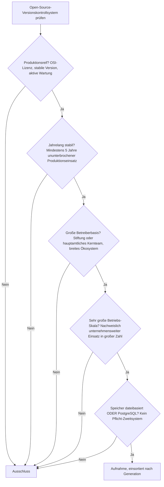
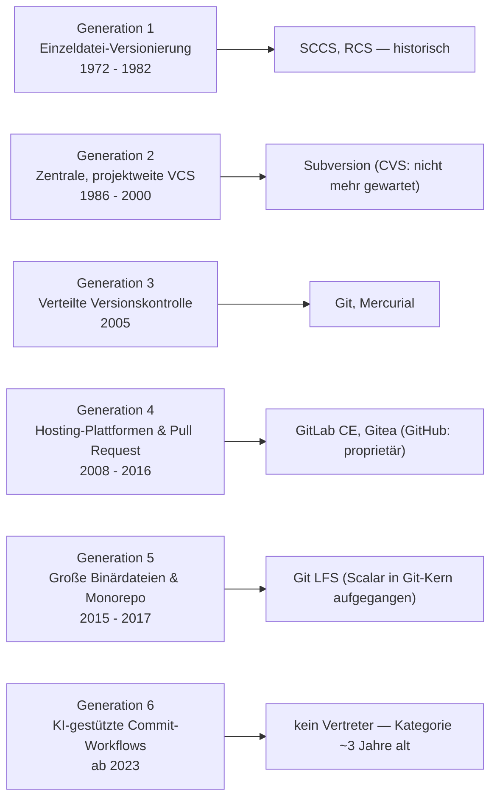

# Produktionsreife Open-Source-Versionskontrollsysteme nach Generation — Reifegrad, Evaluation & Betriebs-Skala (Top 6)

Die [Evolution und Architekturen digitaler Versionskontrollsysteme](evolution-digitaler-versionskontrollsysteme.md) ordnet die Kategorie chronologisch in sechs Generationen — von erster Einzeldatei-Versionierung über zentrale, projektweite Systeme, verteilte Versionskontrolle, Hosting-Plattformen mit Pull-Request-Workflow bis zu Monorepo-Skalierungswerkzeugen und KI-gestützten Commit-Workflows. Die [Topliste bester Versionskontrollsysteme 2026](versionskontrollsysteme-2026-topliste.md) rankt die gesamte Kategorie. Diese Seite kombiniert alle Achsen — parallel zur [Web-Framework-](../webentwicklung/produktionsreife-webframeworks-generationen-2026-topliste.md), [Static-Site-Generatoren-](../../wissen/dokumentation/produktionsreife-static-site-generatoren-generationen-2026-topliste.md) und [Docs-as-Code-Schwesterseite](../../wissen/dokumentation/produktionsreife-docs-as-code-generationen-2026-topliste.md) — zu einem bewusst **konservativen** Fünf-Filter-Sieb: produktionsreif · jahrelang stabil · große Betreiberbasis · sehr große Betriebs-Skala · Speicher dateibasiert oder PostgreSQL. Sortiert nach Generation, nicht nach Rang.

!!! warning "Achtung: Git dominiert — aber der interessante Filter ist „Open Source", nicht der Speicher"
    Sechs Systeme über vier Generationen bestehen alle fünf Filter. Der Speicherfilter ist für das Versionskontrollsystem selbst bedeutungslos — ein Repository *ist* ein Dateibaum ([Speicher-Fazit](#dateibasiert-oder-postgresql)). Er greift erst bei den Hosting-Plattformen darüber, und dort hat **GitLab** (nur PostgreSQL) bzw. **Gitea** (SQLite oder PostgreSQL) die richtige Wahl getroffen. Der einzige echte Ausschluss auf höchster Ebene: **GitHub** — die größte Plattform der Welt, aber proprietär, fällt damit sofort aus der Open-Source-Liste. Generation 6 (KI-Commit-Workflows) ist mit ~3 Jahren schlicht zu jung.

---

## Die fünf harten Filter

!!! note "Hinweis: OSI-Lizenzen und die Trennung VCS / Hosting-Plattform"
    Aufgenommen werden nur Systeme unter anerkannter Open-Source-Lizenz (GPL-2.0, Apache-2.0, MIT). Das schließt **GitHub** und **Bitbucket** als proprietäre Plattformen aus. Die verteilte Versionskontrolle (Git, Mercurial) und die Hosting-Schicht darüber (GitLab, Gitea) werden als zwei Ebenen derselben Generation-3/4-Linie geführt — die Plattform bringt den Pull-Request-Workflow, nicht das Speichermodell.

---

## Ergebnis: sechs Systeme über vier Generationen

---

## Systeme nach Generation

### Generation 2 — Zentrale, projektweite Versionskontrolle (1986 – 2000)

| # | System | Sprache | Speicher | Lizenz | Seit | Skala-Nachweis |
|---|---|---|---|---|---|---|
| 1 | **Subversion (SVN)** | C | dateibasiert (FSFS-Repository-Format) | Apache-2.0 | 2000 | Apache-Software-Foundation-Projekt, LTS-Linie 1.14 mit Wartungs-Releases bis 2025; riesige Bestandsbasis in Unternehmen und bei der ASF selbst |

**Subversion** ist das einzige zentrale System, das den Sprung schafft: aktiv von der Apache-Foundation gewartet, atomare Multi-Datei-Commits, und in großen Unternehmens- und Behörden-Codebasen weiterhin produktiv. Das FSFS-Format legt jede Revision als Datei im Dateisystem ab — kein Datenbankserver nötig. **CVS** aus derselben Generation fällt am Wartungsfilter: letzte Freigabe 2008.

### Generation 3 — Verteilte Versionskontrolle (2005)

| # | System | Sprache | Speicher | Lizenz | Seit | Skala-Nachweis |
|---|---|---|---|---|---|---|
| 2 | **Git** | C | dateibasiert (inhaltsadressierter Objektspeicher im `.git`-Verzeichnis) | GPL-2.0 | 2005 | De-facto-Weltstandard; von Software Freedom Conservancy getragen, hunderte Beitragende, praktisch jede professionelle Codebasis |
| 3 | **Mercurial** | Python/Rust | dateibasiert (Revlog-Format) | GPL-2.0 | 2005 | 20 Jahre aktive Freigaben, Rust-Kern (`rhg`); jahrzehntelang bei Mozilla und Facebook im Millionen-Commit-Bereich betrieben |

**Git** ist der überreife Anker der ganzen Liste — nach 20 Jahren praktisch konkurrenzlos, mit inhaltsadressiertem Objektspeicher direkt im Dateisystem. **Mercurial** teilt das verteilte Grundmodell, wird weiter aktiv entwickelt (Rust-Neuimplementierung des Kerns) und war jahrzehntelang das VCS hinter Mozilla und Facebooks Monorepo. Seine sichtbarsten Großnutzer sind allerdings abgewandert — Mozilla auf Git, Meta auf das eigene (2022 quelloffene, aber noch junge) **Sapling** — weshalb Mercurial in der nächsten Momentaufnahme zum Grenzfall werden kann.

### Generation 4 — Hosting-Plattformen & Pull-Request-Workflow (2008 – 2016)

| # | System | Sprache | Speicher | Lizenz | Seit | Skala-Nachweis |
|---|---|---|---|---|---|---|
| 4 | **GitLab CE** | Ruby/Go | **PostgreSQL** (MySQL-Unterstützung 2019 entfernt) | MIT | 2011 | Selbstverwaltete Instanzen bei zehntausenden Organisationen; integrierte CI/CD im selben Produkt |
| 5 | **Gitea** | Go | dateibasiert (SQLite) **oder** PostgreSQL | MIT | 2016 | Leichtgewichtiges Single-Binary-Hosting, sehr breite Self-Hosting-Verbreitung; Grundlage von Codeberg |

**GitLab CE** ist der klarste PostgreSQL-Treffer der Kategorie: Die MySQL-Unterstützung wurde 2019 gestrichen, seither ist PostgreSQL das einzige Backend — kein Pflicht-Zweitsystem, das Sieb greift sauber. **Gitea** bringt den Pull-Request-Workflow als 100-MB-Binary mit und läuft wahlweise gegen eine einzelne SQLite-Datei oder PostgreSQL. **GitHub** — die mit Abstand größte Plattform — ist proprietär und fällt damit vor allen anderen Filtern aus. **Forgejo** (Gitea-Fork, 2022) ist mit vier Jahren noch zu jung.

### Generation 5 — Große Binärdateien & Monorepo-Skalierung (2015 – 2017)

| # | System | Sprache | Speicher | Lizenz | Seit | Skala-Nachweis |
|---|---|---|---|---|---|---|
| 6 | **Git LFS** | Go | dateibasiert (Zeiger-Datei im Repo + separater Objektspeicher) | MIT | 2015 | Von GitHub mit Atlassian u. a. entwickelt, von allen großen Hosting-Plattformen unterstützt, Standard für versionierte Binär-Assets |

**Git LFS** ersetzt große Binärdateien durch schlanke Zeiger-Dateien im Git-Repository; der eigentliche Inhalt liegt in getrenntem Objektspeicher. Nach zehn Jahren ist es die etablierte Antwort auf Gits Schwäche bei großen Assets. **VFS for Git** ist von Microsoft eingestellt, **Scalar** wurde 2022 in den Git-Kern übernommen (`git scalar`) und ist damit kein eigenständiges Werkzeug mehr — die Monorepo-Skalierung ist in Generation 3 aufgegangen.

### Generation 1 & 6 — warum hier nichts steht

- **Generation 1**: **SCCS** (1972) und **RCS** (1982) versionieren nur einzelne Dateien, kein Projekt als Ganzes. GNU RCS wird noch minimal gepflegt, hat aber als Projekt-VCS praktisch keine Betreiberbasis mehr.
- **Generation 6**: **KI-generierte Commit-Nachrichten** und **autonome Agenten-Commits** sind 2026 zwar Alltag (dieses Repository wird so gepflegt), aber kein eigenständiges Open-Source-„System" mit fünf Jahren Reife — die Kategorie ist seit rund drei Jahren existent. Sie erreicht man heute, indem man Git mit einem etablierten Coding-Agenten kombiniert, siehe [AI Agents Praxis-Handbuch](../../künstliche-intelligenz/coding/ai-agents-praxis.md).

---

## Dateibasiert oder PostgreSQL?

Die Kategorie zerfällt beim Speicherfilter in zwei Ebenen:

- **Das Versionskontrollsystem selbst** (Git, Mercurial, Subversion) ist *strukturell* dateibasiert — ein Repository ist ein Verzeichnisbaum mit Objekten, Deltas oder Revisionsdateien. Es gibt keinen Datenbankserver, keinen Prozess, nichts zu betreiben. Der Filter ist immer auf der „dateibasiert"-Seite erfüllt.
- **Die Hosting-Plattform darüber** (GitLab, Gitea) braucht eine relationale Datenbank für Nutzer, Issues, Merge Requests, CI-Läufe. Genau hier greift das Sieb: **GitLab CE** unterstützt seit 2019 ausschließlich PostgreSQL, **Gitea** läuft gegen eine einzelne SQLite-Datei oder PostgreSQL. Beide brauchen kein zweites Pflichtsystem. **GitHub Enterprise** setzt intern auf MySQL — aber als proprietäres Produkt ist es ohnehin außen vor.

Fazit: Wer nur Versionskontrolle will, hat mit Git automatisch die maximale Betriebsdisziplin — ein Dateibaum, kein Server. Wer die Kollaborationsschicht selbst hostet, wählt GitLab (PostgreSQL) oder Gitea (SQLite/PostgreSQL) und bleibt trotzdem innerhalb des Siebs.

!!! warning "Achtung: Momentaufnahme, Stand August 2026"
    Mercurials Großnutzer sind zu Git bzw. Sapling abgewandert — die Betreiberbasis schrumpft, ein Rückstufung zum Grenzfall ist denkbar. Forgejo überschreitet 2027 die Fünf-Jahres-Marke und rückt dann nach. Sapling (Meta) und Jujutsu (`jj`, Google-nah) sind die aussichtsreichsten Generation-3-Nachrücker, beide noch keine fünf Jahre alt. Git, Subversion und GitLab sind die stabilen Konstanten.

---

## Was bewusst nicht auf dieser Liste steht

| System | Erfüllt nicht | Anmerkung |
|---|---|---|
| **GitHub** | Open-Source-Lizenz | Größte Hosting-Plattform der Welt, aber proprietär — fällt vor allen weiteren Filtern aus |
| **Bitbucket** | Open-Source-Lizenz | Proprietäre Atlassian-Plattform |
| **CVS** | Aktive Wartung | Letzte Freigabe 2008; von Subversion abgelöst |
| **Forgejo** | Reifezeit | Gitea-Fork von 2022 — erreicht 2027 fünf Jahre, dann aussichtsreicher Nachrücker |
| **Sapling** | Reifezeit | Meta-eigenes VCS, 2022 quelloffen — noch keine fünf Jahre öffentlich |
| **Jujutsu (`jj`)** | Reifezeit / Produktionsreife | Vielversprechendes Git-kompatibles VCS, aber noch 0.x und wenige Jahre alt |
| **Fossil** | Betriebs-Skala | Elegantes Single-File-Design (alles in einer SQLite-Datei), aber Betreiberbasis ist praktisch das SQLite-Team; große Deployments jenseits von SQLite/Tcl selten |
| **Pijul** | Produktionsreife | Patch-theoretisches Rust-VCS, weiterhin Beta |
| **Bazaar / Breezy** | Betreiberbasis | Canonical stellte Bazaar 2016 ein; Breezy-Fork mit sehr kleiner Basis |
| **Darcs** | Betriebs-Skala | Weiter gepflegt, aber nur noch Nischen-Nutzung |
| **Gogs** | Betreiberbasis | Weitgehend Einzelmaintainer; Gitea ist der aktivere Fork |
| **VFS for Git** | Kontinuität | Von Microsoft eingestellt; Scalar 2022 in den Git-Kern übernommen |
| **SCCS, RCS** | Betriebs-Skala / Kategorie | Historische Generation-1-Einzeldatei-Versionierung |

---

## 🔗 Verwandte Themen

- [Evolution und Architekturen digitaler Versionskontrollsysteme](evolution-digitaler-versionskontrollsysteme.md) — das sechsstufige Generationenmodell, nach dem diese Liste sortiert ist
- [Beste Versionskontrollsysteme 2026 (Top 15)](versionskontrollsysteme-2026-topliste.md) — breiteste Basis-Topliste inklusive proprietärer Plattformen
- [Beste Build-Systeme 2026 (Top 15)](build-systeme-2026-topliste.md) — Monorepo-Skalierungsproblem aus komplementärem Blickwinkel
- [Beste Paketmanager 2026 (Top 15)](paketmanager-2026-topliste.md) — komplementäre Werkzeuggattung derselben Entwickler-Werkzeug-Reihe
- [Produktionsreife Open-Source-Web-Frameworks & -Bibliotheken nach Generation](../webentwicklung/produktionsreife-webframeworks-generationen-2026-topliste.md) — Schwesterseite mit demselben Fünf-Filter-Sieb
- [Produktionsreife Open-Source-Static-Site-Generatoren nach Generation (Top 8)](../../wissen/dokumentation/produktionsreife-static-site-generatoren-generationen-2026-topliste.md) — ebenfalls eine Kategorie ohne Laufzeit-Datenbank
- [Produktionsreife Open-Source-Docs-as-Code-Werkzeuge nach Generation (Top 10)](../../wissen/dokumentation/produktionsreife-docs-as-code-generationen-2026-topliste.md) — Git als gemeinsame Grundlage des Docs-as-Code-Workflows
- [AI Agents – Das Praxis-Handbuch & Architektur-Leitfaden](../../künstliche-intelligenz/coding/ai-agents-praxis.md) — Vertiefung zu Generation 6 (KI-gestützte Commit-Workflows)
