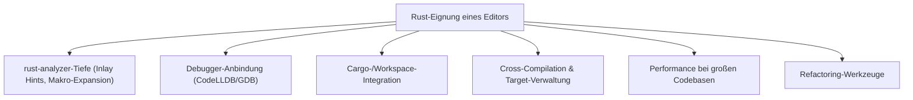
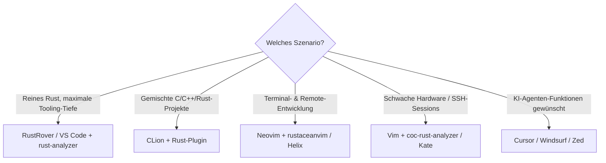

# Beste IDEs & Editoren mit Rust-Unterstützung — Top-20-Topliste

Rust bringt mit `rust-analyzer` einen eigenen Language Server mit, der theoretisch jeden LSP-fähigen Editor auf ein ähnliches Funktionsniveau heben kann. In der Praxis unterscheiden sich Editoren trotzdem deutlich — bei Makro-Expansion, Debugger-Anbindung, Cargo-Workspace-Handling und dem Umgang mit sehr großen Multi-Crate-Projekten zeigen sich schnell Qualitätsunterschiede. Diese Seite ordnet die verbreiteten IDEs und Editoren danach ein, wie gut sie Rust im Alltag unterstützen — unabhängig von KI-Funktionen (dazu siehe die separate [Topliste der KI-Coding-Agenten für Rust](../../künstliche-intelligenz/coding/ki-agenten-rust-topliste.md)).

!!! warning "Achtung: Editor-Wahl ist Geschmackssache, Tooling-Tiefe nicht"
    Ob Vim-Bindings oder eine vollwertige GUI bevorzugt werden, ist reine Präferenz. Bewertet wird hier ausschließlich, wie vollständig und stabil `rust-analyzer`, Debugger und Cargo-Integration eingebunden sind — nicht die Bedienphilosophie. **Stand: Juli 2026.**

---

## Bewertungskriterien

!!! note "Hinweis: rust-analyzer als gemeinsamer Nenner"
    Fast alle Positionen dieser Liste nutzen denselben Language Server (`rust-analyzer`) im Hintergrund — der Qualitätsunterschied entsteht primär dadurch, wie vollständig der jeweilige Editor dessen Fähigkeiten (Inlay Hints, Code Lenses, Semantic Highlighting, `cargo expand`-Integration) tatsächlich anbindet, und durch die Qualität der Debugger-Erweiterung obendrauf.

---

## Top 20 im Überblick

| Rang | IDE / Editor | Typ | Anbieter | Rust-Einschätzung | Besondere Stärke | Schwäche |
|---|---|---|---|---|---|---|
| 1 | **RustRover** | IDE (dediziert) | JetBrains | Sehr stark | Einzige Rust-spezifische Voll-IDE: eigener Rust-Compiler-Unterbau zusätzlich zu rust-analyzer, exzellentes Debugging & Refactoring | Ressourcenhungriger als schlanke Editoren |
| 2 | **VS Code + rust-analyzer** | Editor + Extension | Microsoft / Community | Sehr stark | Größte Verbreitung, sehr ausgereiftes offizielles `rust-analyzer`-Plugin, riesiges Extension-Ökosystem (CodeLLDB, crates, Even Better TOML) | Erfordert manuelle Zusammenstellung mehrerer Extensions für volle Rust-Erfahrung |
| 3 | **Zed** | Editor (nativ) | Zed Industries | Sehr stark | Selbst in Rust geschrieben, extrem niedrige Latenz, sehr gute native rust-analyzer-Integration ohne Plugin-Umweg | Debugger-Unterstützung jünger/weniger ausgereift als bei VS Code/RustRover |
| 4 | **Neovim + rustaceanvim** | Editor + Plugin | Community | Stark | Sehr tiefe rust-analyzer-Integration inkl. Inlay Hints, Makro-Expansion und `cargo`-Kommandos direkt im Editor | Setup & Konfiguration erfordert Lua-Kenntnisse |
| 5 | **CLion + Rust-Plugin** | IDE | JetBrains | Stark | Für Teams mit gemischten C/C++/Rust-Projekten (siehe [Rust, C & C++ Integration](rust-c-cpp-integration.md)) praktisch, gemeinsame CMake-/Debugger-Infrastruktur | RustRover mittlerweile die spezialisiertere Wahl für reine Rust-Projekte |
| 6 | **IntelliJ IDEA Ultimate + Rust-Plugin** | IDE | JetBrains | Stark | Sinnvoll bei Polyglot-Projekten (Rust + Kotlin/Java im selben Repo) | Kein eigenständiger Rust-Compiler-Unterbau wie bei RustRover |
| 7 | **Helix** | Editor (modal, nativ) | Community | Stark | LSP-Unterstützung „out of the box" ohne Plugin-Installation, sehr gute Performance | Kein grafischer Debugger integriert, weniger Erweiterbarkeit als Neovim |
| 8 | **Emacs + rustic-mode + eglot/lsp-mode** | Editor + Paket | Community | Stark | Sehr flexibel konfigurierbar, gute Integration mit `cargo-mode` und Flycheck/Flymake | Einstiegshürde bei der Konfiguration am höchsten in dieser Liste |
| 9 | **Vim + coc-rust-analyzer** | Editor + Plugin | Community | Solide bis stark | Leichtgewichtig, läuft auch auf minimaler Hardware/Remote-Servern | Debugger-Integration nur über Zusatz-Plugins möglich |
| 10 | **Fleet** | IDE (leichtgewichtig) | JetBrains | Solide | Schnellerer Einstieg als volle JetBrains-IDEs, gute Remote-Development-Unterstützung | Funktionsumfang für Rust noch schmaler als bei RustRover/CLion |
| 11 | **Lapce** | Editor (nativ) | Community | Solide | Ebenfalls in Rust geschrieben, modernes Plugin-System (WASI-basiert) | Kleinere Community/Plugin-Auswahl als VS Code oder Zed |
| 12 | **Sublime Text + LSP-rust-analyzer** | Editor + Plugin | Sublime HQ | Solide | Sehr geringer Ressourcenverbrauch, schnelle Startzeit | Debugger-Setup manuell und weniger dokumentiert |
| 13 | **Visual Studio 2022 + rust-analyzer-Extension** | IDE | Microsoft | Solide | Guter nativer Windows-Debugger (WinDbg-Unterbau), praktisch bei Windows-/FFI-lastigen Projekten | Rust-Unterstützung spürbar weniger poliert als die restliche VS-Toolchain |
| 14 | **Kate** | Editor | KDE | Solide | Schlanker LSP-Client, gute Integration ins KDE-Ökosystem unter Linux | Weniger Rust-spezifisches Tooling (Debugging, Makro-Expansion) als Top 10 |
| 15 | **GNOME Builder** | IDE | GNOME-Projekt | Solide | Native Linux-IDE mit eingebauter Flatpak-/Build-Pipeline-Unterstützung | Rust-Fokus geringer als bei plattformübergreifenden Alternativen |
| 16 | **Cursor** | IDE (Fork, KI-Agent) | Anysphere | Solide | rust-analyzer-Basis identisch zu VS Code, zusätzlich Agent-Funktionen (siehe [Agenten-Topliste](../../künstliche-intelligenz/coding/ki-agenten-rust-topliste.md)) | Für reine Editor-Nutzung ohne KI kein Vorteil gegenüber VS Code |
| 17 | **Windsurf** | IDE (Fork, KI-Agent) | Codeium | Solide | Ebenfalls VS-Code-Basis mit rust-analyzer, zusätzlich „Cascade"-Agentenmodus | Reine Editor-Tiefe wie bei Cursor nicht über VS-Code-Niveau hinaus |
| 18 | **Nova** | IDE (leichtgewichtig, macOS) | Panic | Ausreichend bis solide | Native macOS-Oberfläche, LSP-Unterstützung über Erweiterung | Nur macOS, kleinere Rust-spezifische Nutzerbasis |
| 19 | **Eclipse + Corrosion** | IDE | Eclipse Foundation | Ausreichend | Sinnvoll nur bei bestehender Eclipse-Infrastruktur im Team (z. B. Java-Altprojekte) | Deutlich weniger gepflegt als die JetBrains-/VS-Code-Alternativen |
| 20 | **Geany** | Editor (leichtgewichtig) | Community | Grundlegend | Minimaler Ressourcenbedarf, schnelle Startzeit für kurze Skript-Edits | Kein natives LSP, Rust-Unterstützung nur über Basis-Syntax-Highlighting |

!!! tip "Tipp: Rang ≠ einzige Entscheidungsgröße"
    Für **große Produktions-Workspaces mit vielen Crates** zahlen sich die Top 3 durch tiefere Debugger- und Refactoring-Unterstützung aus. Für **Remote-Entwicklung auf schwacher Hardware** (SSH-Sessions, Cloud-VMs) sind Terminal-Editoren wie Neovim, Helix oder Vim oft die praktischere Wahl trotz niedrigerer Rangnummer.

---

## Die Top 5 im Detail

### 1. RustRover (JetBrains)

Die einzige dedizierte Rust-IDE in dieser Liste: JetBrains kombiniert `rust-analyzer` mit einem eigenen ergänzenden Rust-Compiler-Unterbau für präzisere Typinferenz-Anzeigen und Fehlerhervorhebung, bevor `cargo check` überhaupt läuft. Debugger-Integration (GDB/LLDB), Testrunner-UI und Refactoring-Werkzeuge (Rename, Extract Function/Trait) gehören zu den ausgereiftesten am Markt. Details zur Sprache selbst im [Rust Praxis-Handbuch](rust-praxis.md).

### 2. VS Code + rust-analyzer

Die mit Abstand am weitesten verbreitete Kombination — das offizielle `rust-analyzer`-Team entwickelt die VS-Code-Extension als primäre Referenzimplementierung, neue Sprach-Features landen dort meist zuerst. In Kombination mit `CodeLLDB` (Debugging) und `Even Better TOML` (Cargo-Manifeste) praktisch gleichwertig zu einer dedizierten IDE, bei deutlich geringerem Ressourcenverbrauch.

### 3. Zed

Selbst vollständig in Rust geschrieben, was der nativen Editor-Performance und der Tiefe der rust-analyzer-Anbindung sichtbar zugutekommt — kein Plugin-Overhead, LSP-Kommunikation direkt im Kernprozess. Kollaborations-Funktionen (gemeinsames Editing) sind ein zusätzlicher Pluspunkt für Teams. Debugger-Unterstützung ist vorhanden, aber noch nicht so ausgereift wie bei den beiden Spitzenreitern.

### 4. Neovim + rustaceanvim

Für Terminal-affine Entwickler die tiefste verfügbare rust-analyzer-Integration: `rustaceanvim` bündelt Inlay Hints, Makro-Expansion (`cargo expand` direkt im Buffer), Runnables und Debug-Adapter-Anbindung (via `nvim-dap`) in einer Konfiguration. Der Einstieg erfordert Lua-Grundkenntnisse, danach ist die Anpassbarkeit unübertroffen.

### 5. CLion + Rust-Plugin

Besonders stark, wenn Rust nicht isoliert, sondern im Verbund mit C/C++ entwickelt wird — etwa bei FFI-Bindings oder gemischten Codebasen (siehe [Rust, C & C++ Integration](rust-c-cpp-integration.md) und [Rust & Python Bindings (PyO3)](rust-python-bindings.md)). Der gemeinsame CMake-/Debugger-Unterbau von CLion erleichtert das Springen zwischen Sprachgrenzen gegenüber getrennten Editoren für jede Sprache.

---

## Empfehlung nach Einsatzszenario

!!! note "Hinweis: KI-Agenten-Funktionen separat bewertet"
    Cursor, Windsurf und Zed erscheinen hier primär wegen ihrer rust-analyzer-Basis. Für den Vergleich ihrer agentischen Fähigkeiten (autonome `cargo build`/`clippy`-Schleifen, Modellwahl) siehe die [Topliste der KI-Coding-Agenten für Rust](../../künstliche-intelligenz/coding/ki-agenten-rust-topliste.md) — dort schneiden reine Editor-Kriterien wie Debugger-Tiefe bewusst nicht mit ein.

---

## 🔗 Verwandte Themen

- [Startseite](../../index.md) — zurück zur Dokumentations-Zentrale
- [Rust Praxis-Handbuch](rust-praxis.md) — Sprachgrundlagen, Ownership, Async, Makros
- [Rust, C & C++ Integration](rust-c-cpp-integration.md) — relevant für CLion/IntelliJ-Einsatz
- [Rust & Python Bindings (PyO3)](rust-python-bindings.md) — relevant bei Polyglot-Tooling
- [Beste Sprachmodelle für Rust-Programmierung (Top 20)](../../künstliche-intelligenz/coding/llm-rust-topliste.md)
- [Beste lokale Sprachmodelle für Rust-Programmierung (Self-Hosting, Top 20)](../../künstliche-intelligenz/coding/lokale-sprachmodelle-rust-topliste.md)
- [Beste Aggregatoren & Multi-Modell-Provider für Rust-Programmierung (Top 20)](../../künstliche-intelligenz/coding/llm-aggregatoren-rust-topliste.md)
- [Beste Direkt-Anbieter (Offizielle Entwickler-APIs) für Rust-Programmierung (Top 20)](../../künstliche-intelligenz/coding/llm-direktanbieter-rust-topliste.md)
- [Beste Abo-basierte Direkt-Anbieter (Offizielle Entwickler-Abos) für Rust-Programmierung (Top 20)](../../künstliche-intelligenz/coding/llm-abo-anbieter-rust-topliste.md)
- [Beste Cloud-Provider für GPU-Hosting eigener Rust-Coding-Modelle (Top 20)](../../künstliche-intelligenz/coding/cloud-gpu-provider-rust-topliste.md)
- [Beste Rust-Frameworks & Web-Backends mit KI-Unterstützung (Top 20)](../../künstliche-intelligenz/coding/rust-web-frameworks-ki-topliste.md)
- [Beste KI-Coding-Agenten für Rust-Programmierung (Top 20)](../../künstliche-intelligenz/coding/ki-agenten-rust-topliste.md)
- [Beste KI-Assistenten & Code-Editoren für Rust-Programmierung (Top 20)](../../künstliche-intelligenz/coding/ki-assistenten-rust-topliste.md)
