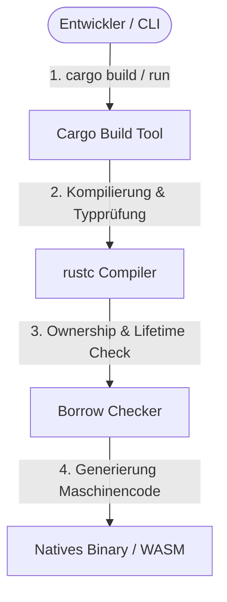
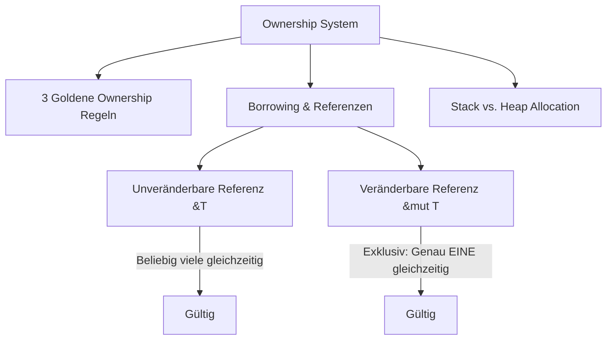

# Rust – Das Praxis-Handbuch & Sprach-Leitfaden

**Rust** ist eine moderne Systemprogrammierungssprache, die maximale Ausführungsgeschwindigkeit und Speichereffizienz bietet, ohne auf ein Garbage-Collection-System (GC) angewiesen zu sein. Durch ihr einzigartiges **Ownership- und Borrowing-Konzept** garantiert Rust Speicher- und Thread-Sicherheit bereits zur Kompilierzeit (*Compile-Time Safety*).

Dieses Handbuch bietet eine strukturierte Übersicht über die Sprachgrundlagen, Ownership-Regeln, Lifetimes, Asynchronität, Makros, Testen sowie das moderne Rust-Ökosystem (Axum, Tokio, Serde, SQLx, Tauri, WASM).

---

## 🚀 1. Einführung & Setup

### Warum Rust?
* **Zero-Cost Abstractions**: Abstrakte Konzepte (wie Generics, Iteratoren und Async/Await) verursachen keine zusätzlichen Laufzeit-Overheads.
* **Speichersicherheit ohne GC**: Keine Dank Dangling Pointer, Null-Pointer-Exceptions, Double Frees oder Data Races.
* **Hervorragendes Tooling**: Integrierter Paketmanager und Build-Tool (`cargo`), Linter (`clippy`), Formatter (`rustfmt`) und Language Server (`rust-analyzer`).



### Entwicklungsumgebung einrichten

=== "Installation (rustup)"
    ```bash
    # Installation der offiziellen Rust Toolchain
    curl --proto '=https' --tlsv1.2 -sSf https://sh.rustup.rs | sh

    # Überprüfung der Installation
    rustc --version
    cargo --version

    # Projekt erstellen & ausführen
    cargo new mein_projekt
    cd mein_projekt
    cargo run
    ```

=== "Nützliche Tools"
    * `rustup update`: Aktualisiert die Rust-Toolchain auf die neueste stabile Version.
    * `cargo clippy`: Führt statische Code-Analysen durch und schlägt Best Practices vor.
    * `cargo fmt`: Formatiert den Code automatisch nach offiziellen Standards.

---

## 🔒 2. Das Ownership- & Borrowing-System

Das **Ownership-Modell** ist das zentralste Alleinstellungsmerkmal von Rust:



### Die 3 goldenen Ownership-Regeln
1. Jeder Wert in Rust hat genau **einen Eigentümer** (Owner, Variablenname).
2. Es kann zu jedem Zeitpunkt immer nur **einen Eigentümer** geben.
3. Wenn der Eigentümer den Gültigkeitsbereich (*Scope*) verlässt, wird der Speicher automatisch freigegeben (`drop`).

### Borrowing (Ausleihen) & Slices
Um Werte zu nutzen, ohne das Eigentum zu übertragen (*Move Semantics*), werden Referenzen ausgeliehen:

* **Unveränderbare Referenz (`&T`)**: Es dürfen beliebig viele Lese-Referenzen gleichzeitig existieren.
* **Veränderbare Referenz (`&mut T`)**: Es darf zu einem Zeitpunkt genau **eine** Schreib-Referenz existieren (*Keine Data Races*).
* **Slices (`&str`, `&[T]`)**: Referenzen auf eine zusammenhängende Sequenz von Elementen ohne Kopieren.

---

## 🛠️ 3. Fehlerbehandlung (Error Handling)

Rust verzichtet auf klassische Exceptions und nutzt ausdrucksstarke Enums:

### `Option<T>` und `Result<T, E>`

=== "Result & Der ?-Operator"
    ```rust
    use std::fs::File;
    use std::io::{self, Read};

    // Liest den Inhalt einer Datei oder gibt einen Fehler zurück
    fn read_username_from_file() -> Result<String, io::Error> {
        let mut file = File::open("hello.txt")?; // Der ?-Operator bricht bei Fehler ab und gibt ihn zurück
        let mut username = String::new();
        file.read_to_string(&mut username)?;
        Ok(username)
    }
    ```

=== "Fehlerbehandlung Bibliotheken"
    * **`anyhow`**: Für Anwendungscode (Anwendungs-Entwicklung, CLI-Tools) – einfaches Handling beliebiger Fehler.
    * **`thiserror`**: Für Bibliotheks-Entwicklung – typsicheres Ableiten von benutzerdefinierten Fehler-Enums via `#[derive(Error)]`.

---

## 🧬 4. Traits, Generics & Lifetimes

### Traits & Generics
Traits definieren gemeinsames Verhalten (ähnlich wie Interfaces in Java/C#).

```rust
pub trait Summary {
    fn summarize(&self) -> String;
}

// Trait Bound: Funktion akzeptiert jeden Typen, der Summary implementiert
pub fn notify<T: Summary>(item: &T) {
    println!("Breaking News: {}", item.summarize());
}
```

### Lifetimes & Borrow Checker
Lifetimes stellen sicher, dass Referenzen niemals länger leben als die Daten, auf die sie verweisen (*No Use-After-Free*).

```rust
// 'a signalisiert, dass die zurückgegebene Referenz solange gültig ist wie die kürzeste der beiden Eingangs-Referenzen
fn longest<'a>(x: &'a str, y: &'a str) -> &'a str {
    if x.len() > y.len() { x } else { y }
}
```

---

## ⚡ 5. Nebenläufigkeit & Asynchronität (Async & Concurrency)

### Threads & Channels (Synchron)
Rust garantiert durch das Typsystem (*Send* & *Sync* Traits) sichere Multi-Threading-Ausführung:

* **Channels (`mpsc`)**: Thread-übergreifende Nachrichtenübermittlung (*"Do not communicate by sharing memory; share memory by communicating"*).
* **Shared State (`Arc<Mutex<T>>`)**: Atomic Reference Counting (`Arc`) kombiniert mit Mutexes für sicheren gemeinsamen Speicherzugriff.

### Asynchrone Programmierung (Async/Await & Tokio)

```rust
use tokio::time::{sleep, Duration};

#[tokio::main]
async fn main() {
    let handle = tokio::spawn(async {
        sleep(Duration::from_millis(500)).await;
        "Task abgeschlossen"
    });

    let result = handle.await.unwrap();
    println!("{}", result);
}
```

---

## 📦 6. Das Rust Ökosystem & Frameworks

Das Rust-Ökosystem bietet spezialisierte Crates für nahezu jeden Bereich:

| Kategorie | Crate / Framework | Beschreibung |
|---|---|---|
| **Web Development** | **Axum**, Actix-web, Leptos | Hochperformante REST APIs, WebSockets & Fullstack SSR |
| **Async Runtime** | **Tokio**, async-std, smol | Event-getriebene asynchrone I/O Laufzeitumgebung |
| **Networking & HTTP** | **reqwest**, hyper, quinn | HTTP-Clients, Low-Level HTTP Server & QUIC/UDP Protocol |
| **Serialization** | **Serde** (`serde_json`) | Der De-facto Standard für JSON, TOML und BSON Serialisierung |
| **Databases & ORM** | **SQLx**, Diesel, Rusqlite | Kompilierzeit-geprüfte SQL-Abfragen & SQLite-Einbindung |
| **CLI Utilities** | **clap**, structopt | Deklarative Erstellung von mächtigen CLI-Argument-Parsern |
| **GUI & WASM** | **Tauri**, `wasm-bindgen` | Leichtgewichtige Desktop-Apps (Tauri) & WebAssembly im Browser |
| **Testing & Benchmarking**| **Criterion.rs**, proptest | Statistisch präzises Benchmarking & Property-based Testing |

---

## 🧪 7. Testen & Qualitätssicherung

Rust besitzt eine eingebaute Test-Suite:

```rust
#[cfg(test)]
mod tests {
    use super::*;

    #[test]
    fn test_addition() {
        assert_eq!(2 + 2, 4);
    }

    #[test]
    #[should_panic]
    fn test_error() {
        panic!("Fehler provoziert");
    }
}
```

* **Unit-Tests**: Verbleiben direkt in der Quelldatei im `tests`-Modul.
* **Integrationstests**: Liegen im separaten Ordner `tests/` im Projektverzeichnis.
* **Dokumentations-Tests (Doctests)**: Codebeispiele in `///` Doc-Kommentaren werden automatisch bei `cargo test` mitgebaut und ausgeführt.

---

## 🔗 8. Verwandte Themen & Weiterführende Links
* [Zurück zur Systemprogrammierungs-Übersicht](index.md)
* [Rust, C & C++ Integration](rust-c-cpp-integration.md)
* [Rust & Python Bindings (PyO3)](rust-python-bindings.md)
* [Beste IDEs & Editoren mit Rust-Unterstützung (Top 20)](rust-ide-topliste.md)
* [Beste Sprachmodelle für Rust-Programmierung (Top 20)](../../künstliche-intelligenz/coding/llm-rust-topliste.md)
* [Beste Aggregatoren & Multi-Modell-Provider für Rust-Programmierung (Top 20)](../../künstliche-intelligenz/coding/llm-aggregatoren-rust-topliste.md)
* [Beste KI-Coding-Agenten für Rust-Programmierung (Top 20)](../../künstliche-intelligenz/coding/ki-agenten-rust-topliste.md)
* [Beste KI-Assistenten & Code-Editoren für Rust-Programmierung (Top 20)](../../künstliche-intelligenz/coding/ki-assistenten-rust-topliste.md)
