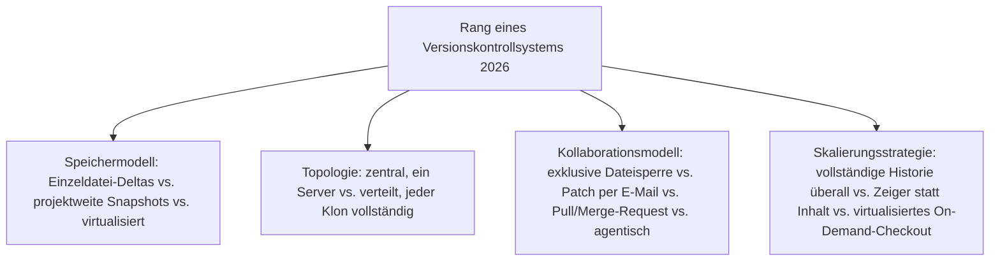
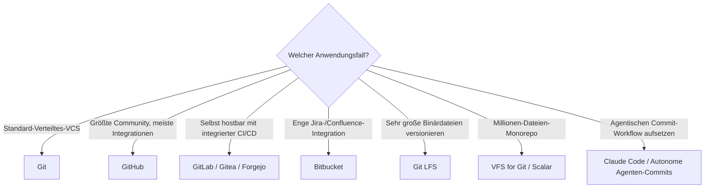

# Beste Versionskontrollsysteme 2026 — Top-15-Topliste

Die [Evolution und Architekturen digitaler Versionskontrollsysteme](evolution-digitaler-versionskontrollsysteme.md) ordnet diese Werkzeuggattung chronologisch nach Architektur-Generation — von erster Einzeldatei-Versionierung über zentrale, projektweite Systeme, verteilte Versionskontrolle, Hosting-Plattformen mit Pull-Request-Workflow bis zu Werkzeugen für große Binärdateien/Monorepo-Skalierung und KI-gestützten Commit-Workflows. Diese Seite übersetzt die Chronologie in eine **Momentaufnahme 2026**: 15 Systeme und Plattformen, die heute tatsächlich betrieben werden.

!!! note "Hinweis: dieses Repository selbst ist Teil von Generation 6"
    Wie in der Quellchronologie festgehalten, wird dieses Repository nach genau dem Muster aus [Generation 6](evolution-digitaler-versionskontrollsysteme.md#generation-6-ki-gestutzte-commit-workflows-ab-2023) gepflegt — Commit-Nachrichten mit `Co-Authored-By`-Zeile, agentisch erstellt und direkt gepusht, siehe `CLAUDE.md`.

---

## Bewertungskriterien

---

## Top 15 im Überblick

| Rang | System | Generation | Rolle | Besondere Stärke |
|---|---|---|---|---|
| 1 | **Git** | 3 (Verteilte Versionskontrolle) | Versionskontrollsystem | Inhaltsadressierter Objektspeicher, extrem billiges lokales Branching/Merging, de-facto-Standard weltweit |
| 2 | **GitHub** | 4 (Hosting-Plattformen & Pull-Request-Workflow) | Hosting-Plattform | Etabliert den Pull Request als zentrale Kollaborationseinheit, größte Hosting-Plattform überhaupt |
| 3 | **GitLab** | 4 (Hosting-Plattformen & Pull-Request-Workflow) | Hosting-Plattform | Selbst hostbare Alternative mit tief integrierter CI/CD-Pipeline im selben Produkt |
| 4 | **Autonome Agenten-Commits** | 6 (KI-gestützte Commit-Workflows) | Agentischer Workflow | Coding-Agenten wie Claude Code führen Commits als Teil ihrer eigenen Arbeitsschleife aus |
| 5 | **KI-generierte Commit-Nachrichten & PR-Beschreibungen** | 6 (KI-gestützte Commit-Workflows) | Agentischer Workflow | Reduziert manuellen Formulierungsaufwand, ein Agent liest den Diff und generiert die Beschreibung |
| 6 | **Bitbucket** | Ergänzung 2026 (Weiterentwicklung von Generation 4) | Hosting-Plattform | Atlassian-eigene Hosting-Plattform mit tiefer Jira-/Confluence-Integration |
| 7 | **Mercurial** | 3 (Verteilte Versionskontrolle) | Versionskontrollsystem | Ähnliches verteiltes Grundmodell wie Git, bleibt bei Google-/Facebook-Monorepo-Anpassungen relevant |
| 8 | **Gitea / Forgejo** | Ergänzung 2026 (Weiterentwicklung von Generation 4) | Hosting-Plattform | Leichtgewichtige, selbst hostbare Open-Source-Alternativen zu GitHub/GitLab |
| 9 | **Git LFS** (Large File Storage) | 5 (Große Binärdateien & Monorepo-Skalierung) | Skalierungswerkzeug | Zeiger-Datei im Git-Repository statt vollständiger Binärdatei-Historie |
| 10 | **VFS for Git / Scalar** | 5 (Große Binärdateien & Monorepo-Skalierung) | Skalierungswerkzeug | Virtualisiertes On-Demand-Checkout für Millionen-Dateien-Monorepos, ursprünglich für Windows entwickelt |
| 11 | **Subversion (SVN)** | 2 (Zentrale, projektweite Versionskontrolle) | Versionskontrollsystem | Atomare Commits über mehrere Dateien hinweg, in vielen Bestandsprojekten weiterhin aktiv |
| 12 | **SourceHut** | Ergänzung 2026 (Weiterentwicklung von Generation 4) | Hosting-Plattform | Minimalistische, E-Mail-Patch-nahe Hosting-Alternative für FOSS-Projekte |
| 13 | **CVS** (Concurrent Versions System) | 2 (Zentrale, projektweite Versionskontrolle) | Versionskontrollsystem (historisch) | Erste breit genutzte projektweite Versionierung, erlaubt gleichzeitiges Bearbeiten statt exklusiver Sperren |
| 14 | **RCS** | 1b (RCS — Reverse-Deltas & Effizienz) | Versionskontrollsystem (historisch) | Dreht das Delta-Prinzip um, schnellerer Zugriff auf den aktuellen Stand als SCCS |
| 15 | **SCCS** | 1a (SCCS — erste Datei-Versionierung) | Versionskontrollsystem (historisch) | Erstes System überhaupt, das Änderungshistorie automatisch statt über manuell nummerierte Kopien verwaltet |

---

## Highlights im Detail

### Rang 1–3, 6, 8, 12: Git als universelles Fundament, Hosting als eigentliches Differenzierungsmerkmal
Git selbst ist praktisch konkurrenzlos, aber GitHub, GitLab, Bitbucket, Gitea/Forgejo und SourceHut zeigen fünf unterschiedliche Antworten auf dieselbe Frage — wie Pull-Request-Workflow, CI/CD und Hosting-Modell kombiniert werden, siehe [Generation 4](evolution-digitaler-versionskontrollsysteme.md#generation-4-hosting-plattformen-pull-request-workflow-2008-2011).

### Rang 4–5: agentische Commit-Workflows sind 2026 bereits Alltag
Autonome Agenten-Commits und KI-generierte Commit-Nachrichten sind keine Zukunftsvision mehr, sondern der Modus, in dem dieses Repository selbst gepflegt wird, siehe [Generation 6](evolution-digitaler-versionskontrollsysteme.md#generation-6-ki-gestutzte-commit-workflows-ab-2023).

### Rang 9–10: Skalierungslösungen für die Grenzen von Gits Grundannahme
Git LFS und VFS for Git/Scalar entkoppeln gezielt, was tatsächlich lokal materialisiert werden muss, von der vollständigen Objekt-Historie — notwendig, sobald Repositories Millionen Dateien oder sehr große Binärdateien enthalten, siehe [Generation 5](evolution-digitaler-versionskontrollsysteme.md#generation-5-groe-binardateien-monorepo-skalierung-2015-2017).

---

## Entscheidungshilfe nach Anwendungsfall

!!! tip "Tipp: Build-System-Perspektive separat prüfen"
    Das Monorepo-Skalierungsproblem lösen Build-Systeme aus komplementärer Richtung — siehe [Beste Build-Systeme 2026](build-systeme-2026-topliste.md), Generation 4–5.

---

## 🔗 Verwandte Themen

- [Startseite](../../index.md) — zurück zur Dokumentations-Zentrale
- [Evolution und Architekturen digitaler Versionskontrollsysteme](evolution-digitaler-versionskontrollsysteme.md) — chronologisches Generationenmodell, dessen aktuellen Stand diese Topliste zusammenfasst
- [Beste Build-Systeme 2026 (Top 15)](build-systeme-2026-topliste.md) — Monorepo-Skalierungsproblem aus komplementärem Blickwinkel
- [Beste Paketmanager 2026 (Top 15)](paketmanager-2026-topliste.md) — komplementäre Werkzeuggattung in derselben Entwickler-Werkzeug-Reihe
- [AI Agents – Das Praxis-Handbuch & Architektur-Leitfaden](../../künstliche-intelligenz/coding/ai-agents-praxis.md) — Vertiefung zu KI-gestützten Commit-Workflows
- [Claude Code CLI: End-to-End-Leitfaden](../agentic-coding-curriculum/claude-code-cli-leitfaden.md) — praktischer Leitfaden zum agentischen Git-Workflow
