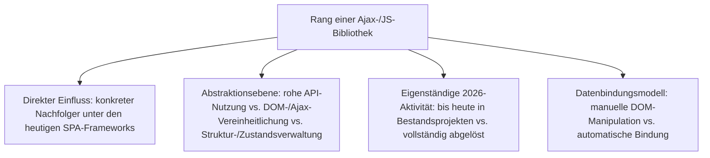
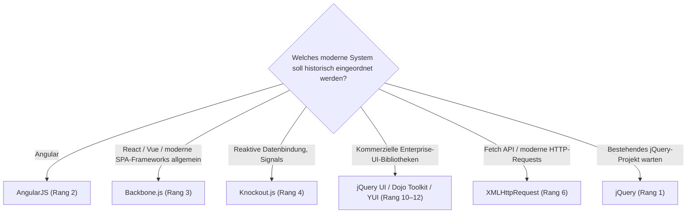

# Einflussreichste Ajax- & JavaScript-Bibliotheken — Top-15-Topliste

Die [Evolution und Architekturen digitaler Ajax- & JavaScript-Bibliotheken](evolution-digitaler-ajax-js-bibliotheken.md) ordnet diese Kategorie chronologisch nach Architektur-Generation — von der Erfindung von XMLHttpRequest über konkurrierende DOM-Abstraktionsbibliotheken und kompilierte Ansätze bis zu Template-Engines und den ersten MV*-Mustern im Browser, die direkt in SPA-Frameworks münden. Diese Seite übersetzt die Chronologie in eine **nach historischem Einfluss gerankte Top-15-Liste** — anders als bei den übrigen Web-Framework-Toplisten dieses Clusters ist der Maßstab hier nicht Marktanteil 2026, sondern die Frage, wie stark eine Bibliothek die spätere SPA-/Meta-Framework-Architektur tatsächlich geprägt hat.

!!! note "Hinweis: Rankingmaßstab weicht von den übrigen Web-Framework-Toplisten ab"
    Die meisten Bibliotheken dieser Liste sind vollständig von SPA-Frameworks abgelöst (Prototype.js, MooTools, YUI, Dojo Toolkit) oder nur noch in Bestandsprojekten aktiv (jQuery) — ein Ranking nach aktueller Nutzerzahl wäre daher wenig aussagekräftig. Diese Seite rankt stattdessen nach **direktem architektonischem Einfluss auf spätere, noch heute genutzte SPA-Frameworks**, analog zu [Einflussreichste Literate-Programming-Vorläufer](../../wissen/dokumentation/literate-programming-vorlaeufer-topliste.md).

---

## Bewertungskriterien

---

## Top 15 im Überblick

| Rang | Bibliothek | Generation | Status 2026 | Historische Bedeutung |
|---|---|---|---|---|
| 1 | **jQuery** | 2 (jQuery vereinheitlicht die DOM) | Aktiv in Bestandsprojekten | Jahrelang meistgenutzte JS-Bibliothek weltweit, bis heute in unzähligen bestehenden Projekten produktiv |
| 2 | **AngularJS** | 6 (Der Übergang zu vollwertigen SPA-Frameworks) | Historisch | Prägte den Begriff „SPA" für eine breite Entwicklergemeinde, direkter Vorläufer von Angular 2+ |
| 3 | **Backbone.js** | 6 (Der Übergang zu vollwertigen SPA-Frameworks) | Historisch | Erste vollständige Client-Architektur statt einzelner Hilfsfunktionen, direkter Vorläufer heutiger SPA-Frameworks |
| 4 | **Knockout.js** | 5 (Template-Engines & erste MV*-Muster) | Historisch | Erstes populäres MVVM-Muster im Browser — Observable-Datenmodelle mit automatischer UI-Aktualisierung |
| 5 | **Handlebars.js** | 5 (Template-Engines & erste MV*-Muster) | Aktiv in Bestandsprojekten | Erweitert Mustache um Helper-Funktionen, bis heute verbreitet in Server- und Build-Toolchains |
| 6 | **XMLHttpRequest** | 1a (XMLHttpRequest wird erfunden) | Aktiv als Browser-API | Technische Grundlage aller folgenden Ajax-Anwendungen, bis heute Fundament der Fetch-API-Ära |
| 7 | **Google Web Toolkit (GWT)** | 4 (Kompilierte Ansätze) | Historisch | Kompilierte Java-zu-JavaScript-Ansatz, früher Vorläufer heutiger Build-Toolchains |
| 8 | **Mustache** | 5 (Template-Engines & erste MV*-Muster) | Aktiv in Bestandsprojekten | Logikfreie Templates, sprachübergreifend implementiert, Vorbild für zahlreiche spätere Template-Engines |
| 9 | **CoffeeScript** | 4 (Kompilierte Ansätze) | Historisch | Vorläufer vieler Sprachfeatures, die später direkt in ES6 übernommen wurden |
| 10 | **jQuery UI** | 2 (jQuery vereinheitlicht die DOM) | Historisch | Fertige interaktive Widgets auf jQuery-Basis, direkter Vorläufer kommerzieller Enterprise-UI-Bibliotheken |
| 11 | **Dojo Toolkit** | 3 (Konkurrierende Abstraktionsbibliotheken) | Historisch | Modulsystem und Widget-Bibliothek für Enterprise-Anwendungen, Vorläufer moderner Modul-Bundler |
| 12 | **YUI** (Yahoo User Interface) | 3 (Konkurrierende Abstraktionsbibliotheken) | Historisch | Starker Fokus auf getestete, dokumentierte Komponenten, Vorbild für spätere Enterprise-UI-Bibliotheken |
| 13 | **Prototype.js** | 1c/3 (Konkurrierende Abstraktionsbibliotheken) | Historisch | Erweitert native JavaScript-Objekte direkt, früheste ernstzunehmende jQuery-Alternative |
| 14 | **MooTools** | 3 (Konkurrierende Abstraktionsbibliotheken) | Historisch | Objektorientierter Ansatz mit Klassenvererbung, beliebt für komplexere Anwendungen |
| 15 | **Gmail / Google Maps** (als Showcases) | 1c (Der Begriff „Ajax" & erste Showcases) | Historisch | Demonstrierten 2004/2005 erstmals einem Massenpublikum reaktionsschnelle Web-Anwendungen ohne vollständigen Reload |

---

## Highlights im Detail

### Rang 1: jQuery als einzige Bibliothek mit echter 2026-Restaktivität
jQuery ist die einzige Bibliothek dieser Liste, die nicht nur historisch bedeutsam, sondern bis heute in unzähligen Bestandsprojekten produktiv im Einsatz ist — anders als etwa Prototype.js oder YUI, die vollständig abgelöst wurden.

### Rang 2–4: die direkten Brücken zu heutigen SPA-Frameworks
AngularJS, Backbone.js und Knockout.js sind die drei Bibliotheken dieser Liste mit dem klarsten dokumentierten Pfad in die [SPA-Frameworks-Topliste](spa-frameworks-2026-topliste.md) — AngularJS zu Angular 2+, Backbone.js als erste vollständige Client-Architektur, Knockout.js als MVVM-Vorbild.

### Rang 10–12: die direkten Vorläufer kommerzieller Enterprise-UI-Bibliotheken
jQuery UI, Dojo Toolkit und YUI liefern bereits Modulsysteme und getestete Widget-Bibliotheken, die spätere kommerzielle Anbieter zum Geschäftsmodell machen, siehe [Beste Enterprise-UI-Bibliotheken 2026, Generation 1](enterprise-ui-bibliotheken-2026-topliste.md).

---

## Wegweiser: von Bibliothek zu heutigem Nachfolgesystem

!!! tip "Tipp: die tatsächlich heute genutzten Nachfolger"
    Für den produktiven Einsatz 2026 sind die Nachfolgesysteme relevant, nicht die hier gerankten Bibliotheken selbst — siehe [Beste SPA-Frameworks 2026](spa-frameworks-2026-topliste.md) und [Beste Enterprise-UI-Bibliotheken 2026](enterprise-ui-bibliotheken-2026-topliste.md). Einzige Ausnahme mit echter eigenständiger 2026-Relevanz: jQuery (Rang 1) in Bestandsprojekten.

---

## 🔗 Verwandte Themen

- [Startseite](../../index.md) — zurück zur Dokumentations-Zentrale
- [Evolution und Architekturen digitaler Ajax- & JavaScript-Bibliotheken](evolution-digitaler-ajax-js-bibliotheken.md) — chronologisches Generationenmodell, dessen historischen Einfluss diese Topliste zusammenfasst
- [Beste Web-Frameworks 2026 (Top 20)](webframeworks-2026-topliste.md) — Gesamtmarkt-Topliste über alle Generationen hinweg
- [Beste SPA-Frameworks 2026 (Top 20)](spa-frameworks-2026-topliste.md) — nachfolgende Generation
- [Beste Enterprise-UI-Bibliotheken 2026 (Top 15)](enterprise-ui-bibliotheken-2026-topliste.md) — direkte Fortsetzung von Rang 10–12
- [Einflussreichste Literate-Programming-Vorläufer (Top 10)](../../wissen/dokumentation/literate-programming-vorlaeufer-topliste.md) — analoge, nach historischem Einfluss gerankte Topliste für Notebook-Vorläufer
