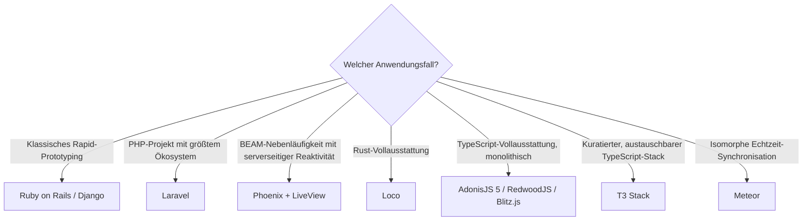

# Beste Batteries-Included-Web-Frameworks 2026 — Top-15-Topliste

Die [Evolution und Architekturen digitaler Batteries-Included-Web-Frameworks](evolution-digitaler-batteries-included-frameworks.md) verfolgt die Vollausstattungs-Philosophie — ORM, Auth, Admin-Oberfläche und Scaffolding gebündelt im Framework-Kern — als **quer zu allen sechs Generationen der allgemeinen Web-Frameworks-Zeitachse liegende Design-Achse**, von Rails und Django über PHP- und JavaScript-Vollausstattungs-Frameworks bis zu Elixir und Rust. Diese Seite übersetzt diese Achse in eine **Momentaufnahme 2026**: 15 Frameworks, die heute tatsächlich betrieben werden.

!!! note "Hinweis: Gegenbewegung der Microframeworks separat"
    Die Microframework-Gegenbewegung (Flask, Sinatra, Express) behandelt [Beste Server-Monolith-Frameworks 2026](monolith-frameworks-2026-topliste.md) — diese Seite bleibt strikt auf die Vollausstattungs-Philosophie beschränkt.

---

## Bewertungskriterien

```mermaid
graph TD
    Start["Rang eines Batteries-Included-Frameworks 2026"] --> A["Bündelungsgrad: monolithisches Vollausstattungs-Framework vs. kuratierter, austauschbarer Stack"]
    Start --> B["Enthaltene Komponenten: ORM/Datenzugriff vs. Admin-Oberfläche vs. Echtzeit-/Reaktivitätsschicht"]
    Start --> C["Sprach-/Runtime-Ökosystem: dynamisch typisiert vs. JavaScript/TypeScript vs. BEAM vs. Rust"]
    Start --> D["Zielgruppen-Framing: „Rails für X" vs. eigenständiger Markenanspruch"]
```

---

## Top 15 im Überblick

| Rang | Framework | Generation | Sprache | Besondere Stärke |
|---|---|---|---|---|
| 1 | **Ruby on Rails** | 1a (Ruby on Rails — Convention over Configuration) | Ruby | Prägt „Convention over Configuration" als Leitprinzip für eine ganze Framework-Generation, weit über Ruby hinaus |
| 2 | **Django** | Vorläufer (parallel zu Generation 1a) | Python | Übernimmt „batteries included" wörtlich aus der Python-Standardbibliothek, Namensgeber der gesamten Architekturlinie |
| 3 | **Laravel** | 2 (PHP-Batterie-Nachzügler & Micro-Framework-Gegenbewegung) | PHP | Vereint Vollausstattung mit moderner, ausdrucksstarker Syntax — verdrängt ältere PHP-Frameworks als De-facto-Standard |
| 4 | **Symfony** | 1c (Symfony — Komponentenbasiertes Enterprise-PHP) | PHP | Zeigt, dass „batteries included" und Modularität kein Widerspruch sein müssen — Komponenten auch einzeln nutzbar |
| 5 | **Phoenix** (+ LiveView) | 5 (Batterien jenseits von Ruby/Python/JS) | Elixir | Rails-inspiriert auf der BEAM-Concurrency-Basis, LiveView ergänzt Reaktivität ganz ohne eigenen Client-JavaScript-Code |
| 6 | **Loco** | 5 (Batterien jenseits von Ruby/Python/JS) | Rust | „Rails für Rust" auf Axum-Basis, Vollausstattung trifft auf Typsicherheit und Performance |
| 7 | **AdonisJS 5** | 4 (TypeScript-Batterie-Meta-Frameworks) | TypeScript | TypeScript-Neufassung eines an Laravel/Rails angelehnten Node-Frameworks, eingebautes Lucid-ORM |
| 8 | **T3 Stack** | 4 (TypeScript-Batterie-Meta-Frameworks) | TypeScript | Kuratiertes „Battery Pack" (Next.js + tRPC + Prisma + NextAuth) statt monolithischem Framework-Zwang |
| 9 | **RedwoodJS** | 4 (TypeScript-Batterie-Meta-Frameworks) | TypeScript | „Integriertes, serverloses Full-Stack-Framework" — bündelt GraphQL-API, Prisma-ORM und React-Frontend |
| 10 | **Blitz.js** | 4 (TypeScript-Batterie-Meta-Frameworks) | TypeScript | „Rails-artiges Framework auf Next.js-Basis", „Zero-API"-Datenschicht ruft Backend-Funktionen direkt aus React auf |
| 11 | **CakePHP** | 2 (PHP-Batterie-Nachzügler) | PHP | Direkt Rails-inspiriertes „Convention over Configuration" für PHP, erste PHP-Antwort auf Generation 1 |
| 12 | **Meteor** | 3 (Full-Stack-JavaScript-Batterien) | JavaScript | Isomorpher Code, eingebaute Echtzeit-Synchronisation zwischen MongoDB und Browser ohne manuelles WebSocket-Handling |
| 13 | **Sails.js** | 3 (Full-Stack-JavaScript-Batterien) | JavaScript | Explizit als „Rails für Node.js" positioniert, Blueprint-APIs generieren REST-Endpunkte automatisch |
| 14 | **Silex / Slim** | 2 (PHP-Batterie-Nachzügler) | PHP | Micro-Framework-Gegenbewegung auf Symfony-Komponenten-Basis — bewusst minimal statt vollausgestattet |
| 15 | **SeaORM** | Ergänzung 2026 | Rust | Async-first Rust-ORM, häufig als Datenzugriffsschicht neben oder anstelle von Locos eingebautem ORM eingesetzt |

---

## Highlights im Detail

### Rang 1–2, 4–6: die fünf Gründer- und Sprachexpansions-Systeme
Ruby on Rails, Django, Symfony, Phoenix und Loco zeigen dieselbe Grundphilosophie über fünf völlig unterschiedliche Sprach-/Runtime-Ökosysteme hinweg — dynamisch typisiert, BEAM-Concurrency und Rust-Typsicherheit teilen sich dasselbe Kernversprechen, siehe [Generation 1 und 5](evolution-digitaler-batteries-included-frameworks.md#generation-1-geburt-der-batteries-included-philosophie-ca-2004-2005).

### Rang 7–10: die TypeScript-Batterie-Welle mit zwei unterschiedlichen Bündelungsgraden
AdonisJS 5, T3 Stack, RedwoodJS und Blitz.js zeigen zwei Lager — monolithische Frameworks (AdonisJS, RedwoodJS, Blitz.js) versus kuratierter, austauschbarer Stack (T3) —, siehe [Generation 4](evolution-digitaler-batteries-included-frameworks.md#generation-4-typescript-batterie-meta-frameworks-kuratierte-stacks-2020-2022).

### Rang 12–13: der isomorphe JavaScript-Sonderweg
Meteor und Sails.js übertragen das Rails-Versprechen erstmals auf Node.js — Meteor mit einem radikalen isomorphen Echtzeit-Ansatz, Sails.js näher am klassischen REST-Muster, siehe [Generation 3](evolution-digitaler-batteries-included-frameworks.md#generation-3-full-stack-javascript-batterien-2012-2014).

---

## Entscheidungshilfe nach Anwendungsfall



!!! tip "Tipp: Enterprise-Perspektive separat prüfen"
    Verwandt, aber nicht deckungsgleich: Enterprise-Tauglichkeit (Langzeit-Support, DI, Hersteller-Backing) statt reiner Vollausstattung behandelt [Beste Enterprise-Web-Frameworks 2026](enterprise-webframeworks-2026-topliste.md).

---

## 🔗 Verwandte Themen

- [Startseite](../../index.md) — zurück zur Dokumentations-Zentrale
- [Evolution und Architekturen digitaler Batteries-Included-Web-Frameworks](evolution-digitaler-batteries-included-frameworks.md) — chronologisches Generationenmodell, dessen aktuellen Stand diese Topliste zusammenfasst
- [Beste Web-Frameworks 2026 (Top 20)](webframeworks-2026-topliste.md) — Gesamtmarkt-Topliste über alle Generationen hinweg
- [Beste Server-Monolith-Frameworks 2026 (Top 20)](monolith-frameworks-2026-topliste.md) — Generation 1 dieser Achse im Kontext der breiteren Monolith-Zeitachse
- [Beste Rust-Webframeworks 2026 (Top 15)](rust-webframeworks-2026-topliste.md) — Loco als Rust-spezifischer Vertreter, vollständige Rust-Zeitachse
- [Beste Enterprise-Web-Frameworks 2026 (Top 15)](enterprise-webframeworks-2026-topliste.md) — verwandte, aber nicht deckungsgleiche Achse
