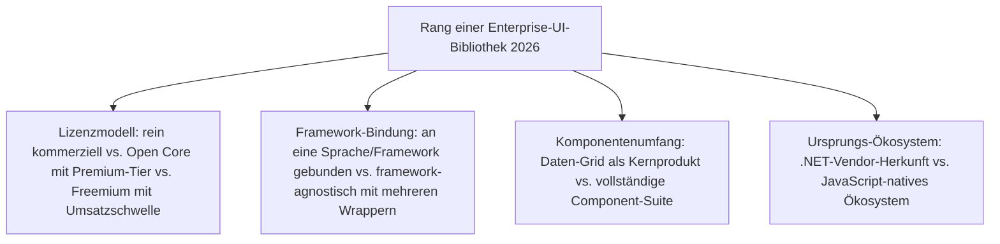
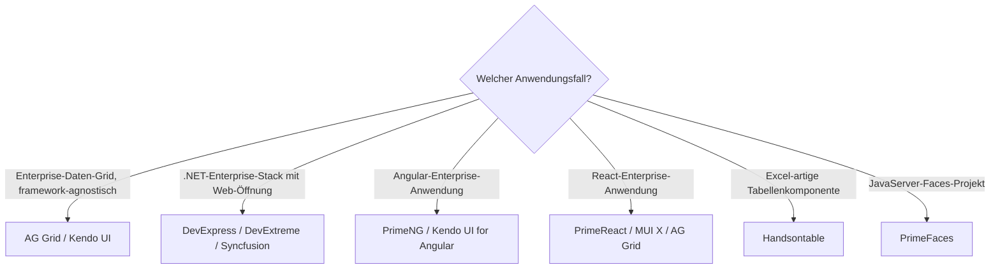

# Beste Enterprise-UI-Bibliotheken 2026 — Top-15-Topliste

Die [Evolution und Architekturen digitaler Enterprise-UI-Bibliotheken](evolution-digitaler-enterprise-ui-bibliotheken.md) ordnet diese Kategorie chronologisch nach Architektur-Generation — von den ersten Enterprise-tauglichen JavaScript-Widget-Bibliotheken über breite .NET/JS-Portfolios bis zu Open-Core-Bibliotheken mit bezahltem Enterprise-Support und reinen .NET-Komponentenherstellern, die sich zum Web hin öffnen. Diese Seite übersetzt die Chronologie in eine **Momentaufnahme 2026**: 15 Komponenten-Bibliotheken, die heute tatsächlich lizenziert und eingesetzt werden.

!!! note "Hinweis: Komponenten-Bibliotheken statt vollständiger Frameworks"
    Diese Liste rankt Daten-Grids, Formulare, Diagramme und Scheduler, die sich in ein beliebiges Frontend-Framework einklinken — vollständige Enterprise-Frameworks mit eigener Backend-Architektur behandelt [Beste Enterprise-Web-Frameworks 2026](enterprise-webframeworks-2026-topliste.md).

---

## Bewertungskriterien

---

## Top 15 im Überblick

| Rang | Bibliothek | Anbieter | Generation | Besondere Stärke |
|---|---|---|---|---|
| 1 | **AG Grid** | AG Grid Ltd. | Ergänzung 2026 | Meistgenutzte Enterprise-Daten-Grid-Bibliothek, framework-agnostisch mit React-/Angular-/Vue-Wrappern |
| 2 | **Kendo UI** | Progress Software (vormals Telerik) | 2 (Kendo UI / Telerik) | Gemeinsamer Komponentenkern mit separaten, framework-spezifischen Wrapper-Paketen seit 2011 |
| 3 | **Ext JS** | Sencha | 1c (Ext JS — erste vollkommerzielle Suite) | Erste Bibliothek dieser Kategorie mit explizit kommerziellem Lizenzmodell, seit 2010 bei Sencha |
| 4 | **PrimeNG** | PrimeTek | 3 (PrimeFaces → PrimeNG/PrimeReact) | Überträgt die „Prime"-Komponenten-Designsprache in die TypeScript-first-Angular-Welt |
| 5 | **Syncfusion Essential Studio** | Syncfusion | 4 (Syncfusion) | Ungewöhnlich freizügiges Freemium-Modell — kostenlos für Einzelentwickler unter einer Umsatzschwelle |
| 6 | **DevExpress .NET-Komponenten** | DevExpress | 5 (DevExpress / DevExtreme) | Am engsten an .NET gebundener Ansatz dieser Liste, tief in Visual Studio integriert |
| 7 | **DevExtreme** | DevExpress | 5 (DevExpress / DevExtreme) | Framework-agnostische Web-Komponenten für Teams außerhalb des reinen .NET-Ökosystems |
| 8 | **MUI X** | MUI | Ergänzung 2026 | Kommerzielle Enterprise-Erweiterung von Material UI — Daten-Grid, Diagramme, Datumsauswahl mit React-Fokus |
| 9 | **PrimeReact** | PrimeTek | 3 (PrimeFaces → PrimeNG/PrimeReact) | Weitet dieselbe Prime-Designsprache auf das React-Ökosystem aus |
| 10 | **PrimeVue** | PrimeTek | 3 (PrimeFaces → PrimeNG/PrimeReact) | Weitet dieselbe Prime-Designsprache auf das Vue-Ökosystem aus |
| 11 | **PrimeFaces** | PrimeTek | 3 (PrimeFaces → PrimeNG/PrimeReact) | Ursprung des gesamten „Prime"-Ökosystems, gebunden an JavaServer Faces (JSF) |
| 12 | **Handsontable** | Handsoncode | Ergänzung 2026 | Spezialisiert auf Excel-artige Tabellen-/Spreadsheet-Komponenten mit Enterprise-Lizenzmodell |
| 13 | **jQuery UI** | jQuery Foundation | 1b (jQuery UI — offenes, themebares Widget-Set) | Kostenlose Widget-Erweiterung von jQuery, prägte das Muster „fertige Widgets statt DOM-Logik" |
| 14 | **Dojo Toolkit** | Community (ehem. IBM-Sponsoring) | 1a (YUI & Dojo Toolkit) | Modulsystem und Widget-Bibliothek ausdrücklich auf Enterprise-Anwendungen ausgelegt |
| 15 | **YUI** (Yahoo User Interface) | Historisch (Yahoo, eingestellt) | 1a (YUI & Dojo Toolkit) | Starker Fokus auf getestete, dokumentierte Komponenten — Vorbild für spätere kommerzielle Anbieter |

---

## Highlights im Detail

### Rang 1–3, 5–7: die fünf dominanten kommerziellen Anbieter
AG Grid, Kendo UI, Ext JS, Syncfusion und DevExpress/DevExtreme zeigen unterschiedliche Lizenzmodelle für dasselbe Grundversprechen — geschäftskritische UI-Bausteine mit Support-Vertrag statt reiner Community-Pflege, siehe [Generation 2, 4–5](evolution-digitaler-enterprise-ui-bibliotheken.md#generation-2-kendo-ui-telerik-breites-netjs-portfolio-2011).

### Rang 4, 9–11: dieselbe Designsprache über vier Frontend-Ökosysteme
PrimeNG, PrimeReact, PrimeVue und PrimeFaces übertragen dasselbe Open-Core-Komponenten-Design von der ursprünglichen Java-Server-Bibliothek auf drei moderne JavaScript-Frameworks, siehe [Generation 3](evolution-digitaler-enterprise-ui-bibliotheken.md#generation-3-primefaces-primengprimereact-open-core-mit-enterprise-support-2009-2016).

### Rang 13–15: die kostenlosen Enterprise-Widget-Fundamente der Gründergeneration
jQuery UI, Dojo Toolkit und YUI etablierten bereits Qualitäts- und Dokumentationsansprüche, die spätere kommerzielle Anbieter zum eigenen Geschäftsmodell machten — YUI selbst wurde eingestellt, Dojo Toolkit lebt nur noch in Nischen fort.

---

## Entscheidungshilfe nach Anwendungsfall

!!! tip "Tipp: vollständige Framework-Perspektive separat prüfen"
    Diese Liste rankt reine Komponenten-Bibliotheken — vollständige Enterprise-Frameworks mit eigener DI-/Routing-Architektur behandelt [Beste Enterprise-Web-Frameworks 2026](enterprise-webframeworks-2026-topliste.md).

---

## 🔗 Verwandte Themen

- [Startseite](../../index.md) — zurück zur Dokumentations-Zentrale
- [Evolution und Architekturen digitaler Enterprise-UI-Bibliotheken](evolution-digitaler-enterprise-ui-bibliotheken.md) — chronologisches Generationenmodell, dessen aktuellen Stand diese Topliste zusammenfasst
- [Beste Web-Frameworks 2026 (Top 20)](webframeworks-2026-topliste.md) — Gesamtmarkt-Topliste über alle Generationen hinweg
- [Beste Enterprise-Web-Frameworks 2026 (Top 15)](enterprise-webframeworks-2026-topliste.md) — verwandte, aber nicht deckungsgleiche Achse für vollständige Frameworks
- [Einflussreichste Ajax- & JavaScript-Bibliotheken (Top 15)](ajax-js-bibliotheken-topliste.md) — YUI, Dojo Toolkit und jQuery UI dort als Teil der allgemeinen Ajax-Chronologie
- [Beste SPA-Frameworks 2026 (Top 20)](spa-frameworks-2026-topliste.md) — Angular/React/Vue als Ziel-Frameworks der Prime-/Kendo-Wrapper
