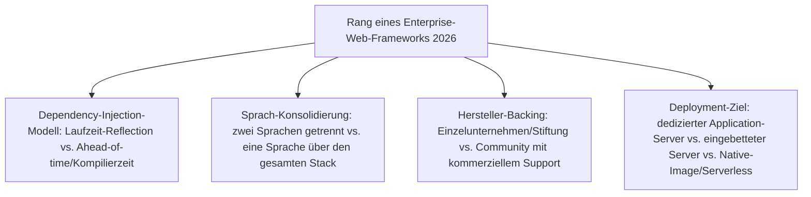
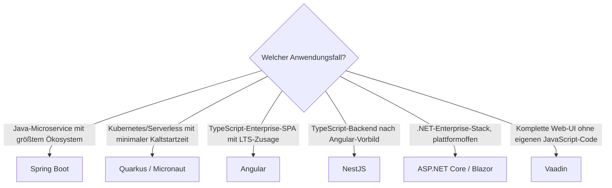

# Beste Enterprise-Web-Frameworks 2026 — Top-15-Topliste

Die [Evolution und Architekturen digitaler Enterprise-Web-Frameworks](evolution-digitaler-enterprise-webframeworks.md) verfolgt das Enterprise-Versprechen — Langzeit-Support, eingebaute Dependency Injection, Hersteller-Backing statt Community-Projekt ohne Ansprechpartner — als eigenständige Zeitachse quer durch die allgemeine Web-Frameworks-Chronologie: von frühen Java-EE-/.NET-Portalen über cloud-native Java- und .NET-Frameworks bis zu TypeScript-first-Enterprise-SPAs, Enterprise-Node.js und serverseitigen Java-UI-Frameworks ganz ohne eigenen JavaScript-Code. Diese Seite übersetzt diese Achse in eine **Momentaufnahme 2026**: 15 Frameworks, die heute tatsächlich betrieben werden.

!!! note "Hinweis: Enterprise-Tauglichkeit ≠ Vollausstattung"
    Diese Liste rankt nach Langzeit-Support-Zusagen und Hersteller-Backing, nicht nach reiner ORM-/Auth-Bündelung — die verwandte, aber nicht deckungsgleiche Vollausstattungs-Philosophie behandelt [Beste Batteries-Included-Web-Frameworks 2026](batteries-included-frameworks-2026-topliste.md).

---

## Bewertungskriterien

---

## Top 15 im Überblick

| Rang | Framework | Generation | Sprache | Besondere Stärke |
|---|---|---|---|---|
| 1 | **Spring Boot** | 2 (Cloud-natives Java) | Java | „Convention over Configuration" plus eingebetteter Server, ein Befehl startet die gesamte Anwendung |
| 2 | **Angular** | 4 (TypeScript-first Enterprise-SPA) | TypeScript | Vollständiges, Google-gestütztes Framework mit eingebauter DI und strikter LTS-Zusage |
| 3 | **ASP.NET Core** | 3 (Plattformoffenes .NET) | C#/.NET | Vollständiger Open-Source-Rewrite, cross-platform statt Windows-exklusiv |
| 4 | **NestJS** | 5 (Enterprise-Node.js) | TypeScript | Bringt Java/Spring- und Angular-artige Modul-/DI-Struktur explizit in die Node.js-Backend-Welt |
| 5 | **Spring Framework** | 1b (Spring — leichtgewichtige Alternative zu EJB) | Java | De-facto-Standard-Fundament für Java-Enterprise-Anwendungen seit 2003 |
| 6 | **Quarkus** | 2 (Cloud-natives Java) | Java | Red Hat, für GraalVM-Native-Image optimiert, Millisekunden-Kaltstart für Kubernetes/Serverless |
| 7 | **Blazor** | 3 (Plattformoffenes .NET) | C#/.NET | C# läuft über WebAssembly direkt im Browser — eine Sprache über den gesamten Stack |
| 8 | **Micronaut** | 2 (Cloud-natives Java) | Java | Dependency Injection zur Kompilierzeit statt Laufzeit-Reflection, schnellerer Start als klassisches Spring |
| 9 | **Vaadin** (Flow) | 6 (Serverseitiges Java-UI ohne JavaScript) | Java | Komplette Web-UIs allein in Java, automatische WebSocket-Synchronisation mit dem Browser |
| 10 | **Spring Cloud** | 2 (Cloud-natives Java) | Java | Ergänzt Microservice-Muster (Service Discovery, Circuit Breaker) direkt auf Spring-Boot-Basis |
| 11 | **Jakarta EE** | Ergänzung 2026 (Nachfolge von Generation 1) | Java | Community-getragene Fortsetzung der Java-EE-Spezifikation nach der Übergabe von Oracle an die Eclipse Foundation |
| 12 | **JavaServer Faces (JSF)** | 1c (JSF — Java-EE-Standard, komponentenbasiert) | Java | Standardisiert komponentenbasierte UI-Entwicklung als offizieller Teil der Java-EE-Spezifikation |
| 13 | **GraalVM Native Image** | Ergänzung 2026 (Infrastruktur zu Generation 2) | Java (Kompilierungs-Tooling) | Kompiliert JVM-Anwendungen zu nativen Binärdateien, technisches Fundament hinter Quarkus' Kaltstartzeiten |
| 14 | **Struts** | 1a (Struts — frühes Java-MVC) | Java | Prägt das MVC-Muster für eine ganze Generation von Java-Enterprise-Entwicklern, heute überwiegend Legacy |
| 15 | **ASP.NET Web Forms** | 1c (Enterprise-Java/.NET & Portal-Architekturen) | .NET | Historisch prägend für komponentenbasiertes, stateful Enterprise-Rendering, von ASP.NET Core abgelöst |

---

## Highlights im Detail

### Rang 1, 3–4, 6, 8: die dominanten Cloud-nativen Enterprise-Stacks
Spring Boot, ASP.NET Core, NestJS, Quarkus und Micronaut zeigen, wie Java-, .NET- und Node.js-Ökosysteme unabhängig voneinander auf dieselbe Anforderung reagieren — eingebetteter Server statt dediziertem Application-Server, Kubernetes-taugliches Startverhalten statt XML-lastiger Legacy-Konfiguration, siehe [Generation 2–3](evolution-digitaler-enterprise-webframeworks.md#generation-2-cloud-natives-java-spring-boot-microservices-2014-2019).

### Rang 2, 4: dieselbe DI-Architektur auf Frontend und Backend
Angular und NestJS teilen bewusst dasselbe Modul-/Decorator-/DI-Muster — NestJS überträgt es explizit von Angular auf die Node.js-Backend-Seite, siehe [Generation 5](evolution-digitaler-enterprise-webframeworks.md#generation-5-enterprise-nodejs-nestjs-2017).

### Rang 9: der Gegenentwurf zur JavaScript-Fragmentierung
Vaadin schließt den Kreis zurück zum Hypermedia-Comeback aus [Generation 6 der Server-Monolith-Zeitachse](monolith-frameworks-2026-topliste.md) — komplette UI-Logik in Java statt getrenntem JavaScript-Frontend, konzeptionell verwandt, aber für das Java-Enterprise-Ökosystem statt Rails/PHP.

---

## Entscheidungshilfe nach Anwendungsfall

!!! tip "Tipp: Enterprise-UI-Komponenten separat prüfen"
    Für kommerzielle UI-Komponentenbibliotheken, die sich in diese Frameworks einklinken (Grids, Charts, Scheduler), siehe [Beste Enterprise-UI-Bibliotheken 2026](enterprise-ui-bibliotheken-2026-topliste.md).

---

## 🔗 Verwandte Themen

- [Startseite](../../index.md) — zurück zur Dokumentations-Zentrale
- [Evolution und Architekturen digitaler Enterprise-Web-Frameworks](evolution-digitaler-enterprise-webframeworks.md) — chronologisches Generationenmodell, dessen aktuellen Stand diese Topliste zusammenfasst
- [Beste Web-Frameworks 2026 (Top 20)](webframeworks-2026-topliste.md) — Gesamtmarkt-Topliste über alle Generationen hinweg
- [Beste Server-Monolith-Frameworks 2026 (Top 20)](monolith-frameworks-2026-topliste.md) — Generation 1 dieser Achse im Kontext der breiteren Monolith-Zeitachse
- [Beste SPA-Frameworks 2026 (Top 20)](spa-frameworks-2026-topliste.md) — Angulars vollständiger Rewrite als eigene Generation dort
- [Beste Batteries-Included-Web-Frameworks 2026 (Top 15)](batteries-included-frameworks-2026-topliste.md) — verwandte, nicht enterprise-exklusive Vollausstattungs-Philosophie
- [Beste Enterprise-UI-Bibliotheken 2026 (Top 15)](enterprise-ui-bibliotheken-2026-topliste.md) — verwandte, aber nicht deckungsgleiche Achse für reine UI-Komponenten
- [Beste Programmiersprachen für Enterprise-Software (Top 10)](../enterprise-programmiersprachen-topliste.md) — Sprachebene hinter den hier genannten Frameworks
