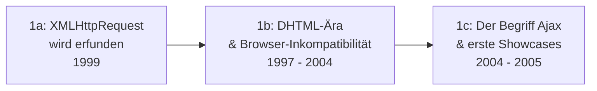

# Evolution und Architekturen digitaler Ajax- & JavaScript-Bibliotheken

Die Ajax-Ära und ihre JavaScript-Bibliotheken bilden Generation 2 der [Evolution digitaler Web-Frameworks](evolution-digitaler-webframeworks.md). Diese eigenständige Zeitachse zoomt in genau diese Architekturlinie hinein: von der Erfindung von XMLHttpRequest über konkurrierende DOM-Abstraktionsbibliotheken und kompilierte Ansätze bis zu den ersten Template-Engines und MV*-Mustern im Browser, die direkt in die Single-Page-Application-Frameworks der nächsten Generation münden.

!!! note "Hinweis: Generationen überlappen sich"
    Die Zeiträume sind grobe Orientierung, keine scharfen Grenzen — jQuery (Generation 2) wird bis heute in unzähligen bestehenden Projekten produktiv eingesetzt. Entscheidend ist die **Architektur** (der Server bleibt Templating-Quelle, JavaScript ergänzt nur Fragmente), nicht allein das Erscheinungsjahr.

---

## Generation 1: Pre-Ajax-Experimente & die Prägung des Begriffs, 1999 – 2005

Die Gründergeneration eint drei Prinzipien: **asynchrone Nachladefähigkeit** ohne vollständigen Seiten-Reload, ein **noch server-zentriertes Backend** (unverändert aus [Generation 1 der Web-Frameworks-Zeitachse](evolution-digitaler-webframeworks.md#generation-1-serverseitige-monolithische-web-frameworks-cgi-mvc-templates)) und **browserübergreifende Inkompatibilität** als Hauptentwicklungshürde. Sie lässt sich in drei technologische Entwicklungsstufen unterteilen:

### 1a. XMLHttpRequest wird erfunden, 1999

- **Architektur:** Microsoft führt das `XMLHttpRequest`-Objekt in Internet Explorer 5 ein, ursprünglich für Outlook Web Access — Daten lassen sich damit erstmals ohne Seiten-Reload nachladen.
- **Bedeutung:** technische Grundlage aller folgenden Ajax-Anwendungen, zunächst jedoch kaum verbreitet genutzt.

### 1b. DHTML-Ära & Browser-Inkompatibilität, 1997 – 2004

- **Architektur:** „Dynamic HTML" kombiniert HTML, CSS und JavaScript für clientseitige Effekte, muss aber für jeden Browser separat angepasst werden — keine einheitliche DOM-API.
- **Fokus:** visuelle Effekte statt echter Datenaktualisierung, hoher Wartungsaufwand durch Browser-Fragmentierung.

### 1c. Der Begriff „Ajax" & erste Showcases, 2004 – 2005

- **Architektur:** Jesse James Garrett prägt 2005 den Begriff „Ajax" (Asynchronous JavaScript and XML) für das bereits existierende XMLHttpRequest-Muster.
- **Vertreter:** **Gmail** (2004) und **Google Maps** (2005) demonstrieren erstmals einem Massenpublikum, wie viel reaktionsschneller Web-Anwendungen ohne vollständigen Reload sein können.

---

## Generation 2: jQuery vereinheitlicht die DOM, 2006

**jQuery** löst das zentrale Problem der Vorgängergeneration: eine einzige API für DOM-Manipulation, Ajax-Aufrufe und Animationen, die browserübergreifend funktioniert.

**Architektur:** Selector-basierte DOM-Abfrage (`$(...)`-Syntax), Method-Chaining, Plugin-Ökosystem für wiederkehrende UI-Muster.

| Baustein | Rolle |
|---|---|
| **jQuery Core** | Vereinheitlichte DOM-Manipulation und Ajax-Aufrufe — jahrelang die meistgenutzte JavaScript-Bibliothek weltweit. |
| **jQuery UI** | Fertige interaktive Widgets (Datepicker, Sortable, Dialoge) auf jQuery-Basis. |
| **jQuery-Plugin-Ökosystem** | Tausende community-gepflegte Erweiterungen für Slider, Formulare, Validierung. |

---

## Generation 3: Konkurrierende Abstraktionsbibliotheken, 2005 – 2010

Parallel zu jQuery entstehen mehrere alternative Bibliotheken mit unterschiedlichen Philosophien — keine erreicht jQuerys Verbreitung, prägen aber einzelne spätere Konzepte.

| System | Jahr | Besonderheit |
|---|---|---|
| **Prototype.js** | 2005 | Erweitert native JavaScript-Objekte direkt, ähnlicher Fokus wie jQuery auf DOM/Ajax. |
| **MooTools** | 2006 | Objektorientierter Ansatz mit Klassenvererbung, beliebt für komplexere Anwendungen. |
| **Dojo Toolkit** | 2005 | Modulsystem und Widget-Bibliothek für Enterprise-Anwendungen. |
| **YUI** (Yahoo User Interface) | 2006 | Yahoo-eigene Bibliothek mit starkem Fokus auf getestete, dokumentierte Komponenten. |

---

## Generation 4: Kompilierte Ansätze — GWT & CoffeeScript, 2006 – 2011

Statt JavaScript direkt zu schreiben, kompilieren diese Ansätze aus einer anderen Sprache oder Syntax — ein früher Vorläufer heutiger Build-Toolchains.

| System | Jahr | Prinzip |
|---|---|---|
| **Google Web Toolkit (GWT)** | 2006 | Kompiliert Java-Code zu browserübergreifend kompatiblem JavaScript — komplexe Ajax-Anwendungen ohne direktes JS-Schreiben. |
| **CoffeeScript** | 2009 | Kompakte Syntax, die zu JavaScript kompiliert — Vorläufer vieler Sprachfeatures, die später direkt in ES6 übernommen wurden. |

---

## Generation 5: Template-Engines & erste MV*-Muster im Browser, 2009 – 2011

Statt HTML-Strings manuell zusammenzusetzen, trennen Template-Engines Struktur von Daten — der erste Schritt zu strukturierten Frontend-Architekturen statt reiner DOM-Manipulation.

| System | Jahr | Prinzip |
|---|---|---|
| **Mustache** | 2009 | Logikfreie Templates, sprachübergreifend implementiert (auch serverseitig nutzbar). |
| **Handlebars.js** | 2010 | Erweitert Mustache um Helper-Funktionen und Blockausdrücke. |
| **Knockout.js** | 2010 | Erstes populäres MVVM-Muster im Browser — Observable-Datenmodelle mit automatischer UI-Aktualisierung. |

---

## Generation 6: Der Übergang zu vollwertigen SPA-Frameworks, 2010

Aus Bibliotheken, die einzelne Seitenfragmente verwalten, werden vollständige Frameworks, die Routing, Zustand und Rendering der gesamten Anwendung übernehmen — der direkte Übergang zu [Generation 3 der übergeordneten Web-Frameworks-Zeitachse](evolution-digitaler-webframeworks.md#generation-3-single-page-application-frameworks-spa-ca-2010-2016).

| Baustein | Rolle |
|---|---|
| **Backbone.js** (2010) | Minimalistisches MV*-Muster, oft mit jQuery kombiniert — erste vollständige Client-Architektur statt einzelner Hilfsfunktionen. |
| **AngularJS** (2010) | Zwei-Wege-Datenbindung und Dependency Injection direkt im Browser, prägte den Begriff „SPA" für eine breite Entwicklergemeinde. |

!!! tip "Übergang zur nächsten Generation"
    Mit Backbone.js und AngularJS endet die reine Ajax-Bibliotheks-Ära — [Generation 3 der Web-Frameworks-Zeitachse](evolution-digitaler-webframeworks.md#generation-3-single-page-application-frameworks-spa-ca-2010-2016) beschreibt die volle Ausdifferenzierung zu React, Vue und Ember als eigenständige SPA-Frameworks.

---

## Alternative Sortier- & Klassifikationskriterien für Ajax- & JS-Bibliotheken

### 1. Abstraktionsebene

- **Rohe API-Nutzung** — direkter `XMLHttpRequest`-Aufruf ohne Bibliothek (Generation 1).
- **DOM-/Ajax-Vereinheitlichung** — einheitliche API über Browser-Unterschiede hinweg (jQuery, Prototype.js).
- **Struktur-/Zustandsverwaltung** — Templates und MV*-Muster (Knockout.js, Backbone.js).

### 2. Ausführungsform

- **Direkt geschriebenes JavaScript** — jQuery, Prototype.js.
- **Kompiliert aus anderer Sprache/Syntax** — GWT (aus Java), CoffeeScript (eigene Syntax).

### 3. Datenbindungsmodell

- **Manuelle DOM-Manipulation** — Entwickler aktualisiert das DOM explizit bei Datenänderung (jQuery-Ära).
- **Automatische Bindung** — UI aktualisiert sich automatisch bei Datenänderung (Knockout.js, AngularJS).

---

## Verwandte Themen

- [Evolution und Architekturen digitaler Web-Frameworks](evolution-digitaler-webframeworks.md) — übergeordnetes Generationenmodell, Generation 2 dort entspricht diesem Artikel im Ganzen
- [Evolution und Architekturen digitaler Server-Monolith-Frameworks](evolution-digitaler-monolith-frameworks.md) — vorausgehende Generation, deren Backend unverändert blieb
- [Evolution und Architekturen digitaler Enterprise-UI-Bibliotheken](evolution-digitaler-enterprise-ui-bibliotheken.md) — YUI, Dojo Toolkit und jQuery UI aus Generation 2/3 dieses Artikels als direkte Vorläufer kommerzieller Enterprise-Komponentenbibliotheken
- [Frontend mit KI](frontend-ki.md) — Vertiefung Frontend-Frameworks mit KI-Unterstützung
- [Websites entwickeln mit KI](ki-webentwicklung.md) — praktischer Lernpfad HTML/CSS bis Deployment mit KI
