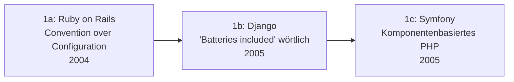

# Evolution und Architekturen digitaler Batteries-Included-Web-Frameworks

„Batteries included" — der Vollausstattungs-Anspruch aus der Python-Standardbibliothek — ist als **quer liegende Design-Philosophie** in praktisch jeder Sprachgeneration von Web-Frameworks wieder aufgetaucht: ORM, Auth, Admin-Oberfläche, Migrationen und Scaffolding gebündelt im Framework-Kern statt einzeln zusammengesteckter Bibliotheken. Dieser Artikel verfolgt diese Philosophie als eigenständige, sprachübergreifende Zeitachse quer durch [Evolution und Architekturen digitaler Web-Frameworks](evolution-digitaler-webframeworks.md) — von Rails und Django über PHP- und JavaScript-Vollausstattungs-Frameworks bis zu Elixir und Rust. Die Gegenbewegung der Microframeworks (Flask, Sinatra, Express) behandelt [Generation 3 der Server-Monolith-Zeitachse](evolution-digitaler-monolith-frameworks.md#generation-3-python-microframeworks-2010-2018).

!!! note "Hinweis: Generationen überlappen sich"
    Die Zeiträume sind grobe Orientierung, keine scharfen Grenzen — Rails und Django (Generation 1) laufen bis heute produktiv, parallel zu Loco (Generation 5). Entscheidend ist der **Bündelungsgrad** (wie viel Infrastruktur liefert das Framework selbst statt externer Pakete), nicht allein das Erscheinungsjahr.

---

## Generation 1: Geburt der „Batteries-included"-Philosophie, ca. 2004 – 2005

Drei Frameworks in drei Sprachen prägen innerhalb eines einzigen Jahres den Vollausstattungs-Anspruch, der spätere Generationen bis heute referenzieren — jeweils mit demselben Kernversprechen: ORM, Templating, Routing und Auth aus einer Hand statt manuell zusammengestellter Bibliotheken. Eine tiefere Betrachtung dieser drei Systeme als Teil von Generation 1 der übergeordneten Zeitachse bietet [Evolution und Architekturen digitaler Server-Monolith-Frameworks](evolution-digitaler-monolith-frameworks.md#1b-full-stack-mvc-frameworks-2000-2010):

### 1a. Ruby on Rails — Convention over Configuration, 2004

- **Architektur:** integrierter ORM (ActiveRecord), Scaffolding-Generatoren, Testing-Framework und Asset-Pipeline im selben Paket — der Entwickler folgt Namenskonventionen statt Konfigurationsdateien zu schreiben.
- **Bedeutung:** prägt „Convention over Configuration" als Leitprinzip für eine ganze Framework-Generation, weit über Ruby hinaus.

### 1b. Django — „Batteries included" wörtlich, 2005

- **Architektur:** ORM, Admin-Oberfläche (automatisch aus Modellen generiert), Formular-Validierung, Auth-System und Migrations-Werkzeug direkt im Kern.
- **Bedeutung:** übernimmt den Slogan „batteries included" direkt aus der Python-Standardbibliothek und macht ihn zum Namensgeber dieser gesamten Architekturlinie.

### 1c. Symfony — Komponentenbasiertes Enterprise-PHP, 2005

- **Architektur:** volle Ausstattung wie Rails/Django, zusätzlich in einzeln wiederverwendbare Komponenten zerlegt — später Grundlage vieler weiterer PHP-Projekte (u. a. Teile von Drupal, Laravel).
- **Bedeutung:** zeigt, dass „batteries included" und Modularität kein Widerspruch sein müssen — die Komponenten lassen sich auch außerhalb des Gesamtframeworks einzeln nutzen.

---

## Generation 2: PHP-Batterie-Nachzügler & Micro-Framework-Gegenbewegung, 2006 – 2015

Während CakePHP dem Rails-Vorbild direkt folgt, entsteht parallel eine Gegenbewegung schlanker PHP-Microframeworks (Silex, Slim) als Reaktion auf die wahrgenommene Schwergewichtigkeit früher Vollausstattungs-Frameworks — bevor Laravel beide Lager 2011 versöhnt und zum neuen PHP-Standard wird.

**Architektur:** integriertes ORM (Eloquent bei Laravel), eigenes Paketverwaltungs-Ökosystem (Composer) statt manuell eingebundener Bibliotheken, elegante, ausdrucksstarke Syntax als expliziter Design-Anspruch.

| Framework | Jahr | Rolle |
|---|---|---|
| **CakePHP** | 2005 | Direkt Rails-inspiriertes „Convention over Configuration" für PHP, erste PHP-Antwort auf Generation 1. |
| **Silex / Slim** | 2010/2011 | Micro-Framework-Gegenbewegung auf Symfony-Komponenten-Basis — bewusst minimal statt vollausgestattet. |
| **Laravel** | 2011 | Vereint Vollausstattung (Eloquent-ORM, Auth, Queues, Scheduler) mit moderner, ausdrucksstarker Syntax — verdrängt ältere PHP-Frameworks als De-facto-Standard, siehe auch [Generation 2 der Monolith-Zeitachse](evolution-digitaler-monolith-frameworks.md#generation-2-php-okosystem-reife-laravel-2005-2015). |

---

## Generation 3: Full-Stack-JavaScript-Batterien, 2012 – 2014

Node.js überträgt das Rails-Versprechen erstmals auf JavaScript — inklusive eines eigenen, isomorphen Sonderwegs, der Frontend und Backend über Echtzeit-Synchronisation statt klassischer HTTP-Requests koppelt.

**Architektur:** integriertes ORM/ODM, Scaffolding-Generatoren und (bei Meteor) eine eigene Build-Pipeline sowie Echtzeit-Datenbank-Synchronisation direkt im Framework-Kern statt separat verdrahteter Bibliotheken.

| Framework | Jahr | Prinzip |
|---|---|---|
| **Sails.js** | 2012 | Explizit als „Rails für Node.js" positioniert — Blueprint-APIs generieren REST-Endpunkte automatisch aus dem Datenmodell (Waterline-ORM). |
| **Meteor** | 2012 | Isomorpher Code (derselbe JavaScript-Code läuft im Client und auf dem Server), eingebaute Echtzeit-Synchronisation zwischen MongoDB und Browser ohne manuelles WebSocket-Handling. |

---

## Generation 4: TypeScript-Batterie-Meta-Frameworks & kuratierte Stacks, 2020 – 2022

Auf Basis der SPA-/Meta-Framework-Fundamente aus [Generation 4 der Web-Frameworks-Zeitachse](evolution-digitaler-webframeworks.md#generation-4-full-stack-javascript-meta-frameworks-ssrssg-hybrid-ca-2016-2022) entsteht eine neue Welle typsicherer Vollausstattungs-Frameworks — parallel dazu ein **hybrider Gegenentwurf**: statt eines monolithischen Frameworks eine kuratierte, aber lose gekoppelte Sammlung typsicherer Einzelbausteine.

**Architektur:** integriertes ORM, Auth und Datenzugriffsschicht direkt auf React-/Next.js-Basis, End-to-End-Typsicherheit vom Datenbankschema bis zur UI-Komponente.

| System | Jahr | Besonderheit |
|---|---|---|
| **RedwoodJS** | 2020 | „Integriertes, serverloses Full-Stack-Framework" — bündelt GraphQL-API, Prisma-ORM und React-Frontend in einem Projekt-Layout. |
| **Blitz.js** | 2020 | Explizit als „Rails-artiges Framework auf Next.js-Basis" positioniert, „Zero-API"-Datenschicht ruft Backend-Funktionen direkt aus React-Komponenten auf. |
| **AdonisJS 5** | 2020 | TypeScript-Neufassung eines an Laravel/Rails angelehnten Node-Frameworks — Lucid-ORM, eingebautes Auth- und Validierungssystem. |
| **T3 Stack** | 2022 | Kein monolithisches Framework, sondern ein kuratiertes „Battery Pack" (Next.js + tRPC + Prisma + NextAuth) — Vollausstattung durch bewusste Werkzeugauswahl statt durch Framework-Zwang. |

!!! note "Hinweis: T3 Stack als Hybrid-Fall"
    Der T3 Stack markiert eine dritte Position zwischen „monolithisches Batterie-Framework" und „Microframework plus Einzelpakete": ein von einer Autorität kuratiertes, aber jederzeit austauschbares Set typsicherer Bausteine — Vollausstattung als Empfehlung statt als Zwang.

---

## Generation 5: Batterien jenseits von Ruby/Python/JS — Elixir & Rust, ab 2014

Der Rails-Anspruch wandert in Sprachen mit anderem Concurrency- bzw. Sicherheitsmodell — jeweils mit demselben Kernversprechen an neu ankommende Entwickler: sofort produktiv, ohne Dutzende Einzelpakete selbst zusammenzustellen.

| System | Sprache | Jahr | Prinzip |
|---|---|---|---|
| **Phoenix** | Elixir | 2014 | Rails-inspiriertes Vollausstattungs-Framework auf der BEAM-Concurrency-Basis von Erlang/OTP; **Phoenix LiveView** (2019) ergänzt serverseitig gerenderte Reaktivität ganz ohne eigenen Client-JavaScript-Code — konzeptionell verwandt mit [Generation 6 der Monolith-Zeitachse (Hypermedia-Comeback)](evolution-digitaler-monolith-frameworks.md#generation-6-das-monolith-comeback-hypermedia-statt-spa-ab-2020). |
| **Loco** | Rust | 2023 | Explizit als „Rails für Rust" positioniert, baut auf Axum auf — Vollausstattung trifft auf Rusts Typsicherheit und Performance, siehe [Generation 5 der Rust-Webframeworks-Zeitachse](evolution-digitaler-rust-webframeworks.md#generation-5-full-stack-rust-ssrwasm-komponentenbasierte-uis-2021-2023). |

---

## Alternative Sortier- & Klassifikationskriterien für Batteries-Included-Frameworks

Neben dem chronologischen Generationenmodell lassen sich Batteries-Included-Frameworks nach folgenden Dimensionen einordnen:

### 1. Bündelungsgrad

- **Monolithisches Vollausstattungs-Framework** — ORM, Auth, Admin-UI im festen Framework-Kern, kaum austauschbar (Rails, Django, Laravel, Phoenix, Loco).
- **Kuratierter, austauschbarer Stack** — Vollausstattung durch empfohlene, aber lose gekoppelte Einzelbausteine (T3 Stack).
- **Microframework + Erweiterungen** — Gegenmodell, siehe [Generation 3 der Monolith-Zeitachse](evolution-digitaler-monolith-frameworks.md#generation-3-python-microframeworks-2010-2018).

### 2. Enthaltene Komponenten

- **ORM/Datenzugriff** — praktisch immer enthalten (ActiveRecord, Eloquent, Prisma, Lucid, Ecto, SeaORM).
- **Admin-Oberfläche** — automatisch aus Datenmodellen generiert (Django-Admin als prägendes Vorbild, ohne direkte Entsprechung bei den meisten JS-Nachfolgern).
- **Echtzeit-/Reaktivitätsschicht** — eingebaut statt nachgerüstet (Meteor-DDP, Phoenix LiveView).

### 3. Sprach-/Runtime-Ökosystem

- **Dynamisch typisiert** — Ruby, Python, PHP (Generation 1–2).
- **JavaScript/TypeScript** — Generation 3–4, mit wachsendem Fokus auf End-to-End-Typsicherheit.
- **BEAM/Erlang-VM** — Phoenix, Nebenläufigkeit als Kernstärke statt Zusatzfeature.
- **Rust** — Loco, Typsicherheit und Performance als Zusatzversprechen zur Vollausstattung.

### 4. Zielgruppen-Framing

- **„Rails für X"** — explizite Selbstpositionierung als Rails-Analogie in einer anderen Sprache (Sails.js, Loco, teilweise AdonisJS/Phoenix).
- **Eigenständiger Markenanspruch** — kein direkter Rails-Vergleich im Marketing (Django, Symfony, Laravel, RedwoodJS).

---

## Verwandte Themen

- [Evolution und Architekturen digitaler Web-Frameworks](evolution-digitaler-webframeworks.md) — übergeordnetes, sprachübergreifendes Generationenmodell
- [Evolution und Architekturen digitaler Server-Monolith-Frameworks](evolution-digitaler-monolith-frameworks.md) — Generation 1 dieses Artikels im Kontext der breiteren Monolith-Zeitachse, inkl. Microframework-Gegenbewegung
- [Evolution und Architekturen digitaler Full-Stack-Meta-Frameworks](evolution-digitaler-meta-frameworks.md) — Next.js/Nuxt.js als technisches Fundament der JS-Batterie-Frameworks aus Generation 4
- [Evolution und Architekturen digitaler Rust-Webframeworks](evolution-digitaler-rust-webframeworks.md) — Loco als Rust-spezifischer Vertreter aus Generation 5, vollständige Rust-Zeitachse
- [Evolution und Architekturen digitaler Content-Management-Systeme](../../wissen/dokumentation/evolution-digitaler-cms.md) — Django-Admin als konzeptioneller Vorläufer automatisch generierter CMS-Oberflächen
- [Backend-Integration mit KI](backend-integration.md) — Vertiefung Backend-Frameworks mit KI-Unterstützung
- [Websites entwickeln mit KI](ki-webentwicklung.md) — praktischer Lernpfad HTML/CSS bis Deployment mit KI
- [Evolution und Architekturen digitaler Programmiersprachen für Wissenssysteme](../../wissen/dokumentation/evolution-digitaler-wissenssystem-programmiersprachen.md) — nutzt Rails' „Convention over Configuration"-Philosophie aus Generation 1a dieses Artikels als Referenzpunkt für Rubys Sprachwahl-Logik
- [Evolution und Architekturen digitaler Programmiersprachen](../evolution-digitaler-programmiersprachen.md) — Erlang (Generation 5 dort) als Vorfahre von Phoenix aus Generation 5 dieses Artikels
- [Evolution und Architekturen digitaler Enterprise-Web-Frameworks](evolution-digitaler-enterprise-webframeworks.md) — verwandte, aber nicht deckungsgleiche Achse: Enterprise-Tauglichkeit statt reiner Vollausstattung, Spring Boot dort als konkrete Anwendung des Prinzips aus Generation 1a dieses Artikels
