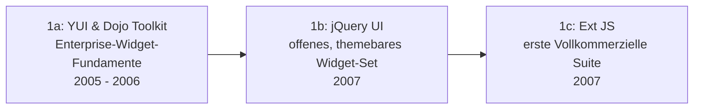

# Evolution und Architekturen digitaler Enterprise-UI-Bibliotheken

Neben vollständigen [Enterprise-Web-Frameworks](evolution-digitaler-enterprise-webframeworks.md) (Backend-Architektur, Dependency Injection, Routing) existiert eine eigenständige Kategorie: **Komponenten-Bibliotheken**, die sich in ein beliebiges Frontend-Framework einklinken und fertige, geschäftskritische UI-Bausteine liefern — Daten-Grids mit Server-seitiger Paginierung, komplexe Formulare, Diagramme, Gantt-Charts und Scheduler, meist gegen einen kommerziellen Lizenz- und Support-Vertrag statt rein community-gepflegt. Dieser Artikel verfolgt diese Kategorie als eigenständige Zeitachse — von den ersten Enterprise-tauglichen JavaScript-Widget-Bibliotheken über breite .NET/JS-Portfolios bis zu Open-Core-Bibliotheken mit bezahltem Enterprise-Support und reinen .NET-Komponentenherstellern, die sich zum Web hin öffnen.

!!! note "Hinweis: Generationen überlappen sich"
    Die Zeiträume sind grobe Orientierung, keine scharfen Grenzen — Kendo UI (Generation 2) wird bis heute aktiv weiterentwickelt, parallel zu DevExpress (Generation 5). Entscheidend ist das **Geschäftsmodell** (rein kommerziell, Open-Core, Freemium-Lizenzschwelle) und der **Framework-Bezug** (an eine Sprache gebunden versus mehrere Frontend-Frameworks gleichzeitig bedient), nicht allein das Erscheinungsjahr.

---

## Generation 1: Frühe kommerzielle Web-Komponentenbibliotheken, 2005 – 2007

Die Gründergeneration eint den Übergang von einfachen DOM-Hilfsfunktionen zu fertigen, wiederverwendbaren UI-Widgets — vom kostenlosen Yahoo-Fundament über offene, themebare Widgets bis zur ersten vollständig kommerziellen Komponenten-Suite. Sie lässt sich in drei technologische Entwicklungsstufen unterteilen:

### 1a. YUI & Dojo Toolkit — Enterprise-Widget-Fundamente, 2005 – 2006

- **Architektur:** Yahoos **YUI** und der **Dojo Toolkit** liefern bereits ein Modulsystem plus getestete, dokumentierte Widget-Bibliotheken — ausdrücklich auf Enterprise-Anwendungen ausgelegt, siehe [Generation 3 der Ajax- & JavaScript-Bibliotheken-Zeitachse](evolution-digitaler-ajax-js-bibliotheken.md#generation-3-konkurrierende-abstraktionsbibliotheken-2005-2010).
- **Bedeutung:** kostenlos und offen, aber bereits mit dem Qualitäts- und Dokumentationsanspruch, den spätere kommerzielle Anbieter zum Geschäftsmodell machen.

### 1b. jQuery UI — offenes, themebares Widget-Set, 2007

- **Architektur:** offizielle Widget-Erweiterung von jQuery (Datepicker, Sortable, Dialoge) mit austauschbaren visuellen Themes, siehe [Generation 2 der Ajax- & JavaScript-Bibliotheken-Zeitachse](evolution-digitaler-ajax-js-bibliotheken.md#generation-2-jquery-vereinheitlicht-die-dom-2006).
- **Bedeutung:** bleibt kostenlos, etabliert aber das Muster „fertige Widgets statt selbst gebauter DOM-Logik", das die folgenden kommerziellen Anbieter übernehmen.

### 1c. Ext JS — erste vollkommerzielle Komponenten-Suite, 2007

- **Architektur:** entsteht ursprünglich als Erweiterung zu YUI, wird jedoch schnell zu einer eigenständigen, umfassenden Komponenten-Bibliothek mit Daten-Grids, Formularen und Layout-Management — 2010 von **Sencha** übernommen.
- **Bedeutung:** erste Bibliothek dieser Kategorie mit explizit kommerziellem Lizenzmodell und Enterprise-Support-Vertrag statt reiner Open-Source-Pflege.

---

## Generation 2: Kendo UI / Telerik — breites .NET/JS-Portfolio, 2011

**Telerik** (2002 gegründet, ursprünglich .NET-Komponentenhersteller) bringt mit **Kendo UI** sein Portfolio explizit in die JavaScript-Welt — zunächst jQuery-basiert, später mit dedizierten Wrappern für einzelne Frontend-Frameworks.

**Architektur:** ein gemeinsamer Komponentenkern (Grids, Charts, Scheduler) mit separaten, framework-spezifischen Wrapper-Paketen (Kendo UI for jQuery, Angular, React, Vue) statt einer einzigen, framework-gebundenen Implementierung.

| Meilenstein | Jahr | Bedeutung |
|---|---|---|
| **Kendo UI** | 2011 | Erstes JS-natives Produkt des .NET-Herstellers Telerik — Brückenschlag zwischen dem bestehenden .NET-Kundenstamm und der wachsenden JavaScript-Frontend-Welt. |
| **Übernahme durch Progress Software** | 2014 | Telerik samt Kendo UI wird Teil von Progress Software — Konsolidierung des kommerziellen UI-Bibliotheken-Markts unter größeren Software-Konzernen. |

---

## Generation 3: PrimeFaces → PrimeNG/PrimeReact — Open-Core mit Enterprise-Support, 2009 – 2016

Startpunkt ist keine JavaScript-, sondern eine **Java-Server-Komponentenbibliothek** — das „Prime"-Ökosystem überträgt dasselbe Komponenten-Design später auf mehrere moderne Frontend-Frameworks gleichzeitig.

**Architektur:** Open-Source-Kern kostenlos nutzbar, zusätzliche Premium-Templates und priorisierter Support gegen Lizenzgebühr („Open Core") — dieselbe Komponenten-Designsprache über mehrere Frontend-Frameworks hinweg statt eines einzigen Ökosystems.

| System | Jahr | Framework-Bindung |
|---|---|---|
| **PrimeFaces** | 2009 | JavaServer Faces (JSF) — Ursprung des gesamten „Prime"-Ökosystems, siehe [Generation 1c der allgemeinen Web-Frameworks-Zeitachse](evolution-digitaler-webframeworks.md#1c-enterprise-javanet-frameworks-portal-architekturen-ca-2002-2012) für JSF als Standard. |
| **PrimeNG** | 2016 | Angular — überträgt dieselbe Komponenten-Designsprache in die TypeScript-first-Enterprise-SPA-Welt, siehe [Generation 4 der Enterprise-Web-Frameworks-Zeitachse](evolution-digitaler-enterprise-webframeworks.md#generation-4-typescript-first-enterprise-spa-angular-2016). |
| **PrimeReact / PrimeVue** | ab 2019 | React/Vue — weitet dasselbe Prinzip auf die übrigen großen SPA-Ökosysteme aus. |

---

## Generation 4: Syncfusion — kostenlose Community-Lizenz + Enterprise-Tier, ab 2014

**Syncfusion** (2001 gegründet, ursprünglich .NET-Steuerelemente für WinForms/WPF) bringt sein Portfolio als **Essential Studio** ins Web und etabliert dabei ein für die Branche ungewöhnliches Lizenzmodell.

**Architektur:** derselbe Komponentenkern (Grids, Diagramme, Scheduler, PDF/Excel-Export) sowohl als reine JavaScript-Bibliothek als auch mit Wrappern für Angular/React/Vue/Blazor.

| Meilenstein | Jahr | Bedeutung |
|---|---|---|
| **Essential Studio for JavaScript** | ab 2014 | Überträgt das etablierte .NET-Komponentenportfolio in die Web-Welt. |
| **Community License** | 2016 | Vollständig kostenlose Nutzung für Einzelentwickler und Unternehmen unter einer Umsatzschwelle — ein Freemium-Modell, das sich deutlich von Kendo UIs und DevExpress' rein kommerziellem Ansatz unterscheidet. |

---

## Generation 5: DevExpress / DevExtreme — .NET-natives Enterprise-Komponenten-Portfolio, ab ca. 2010

**DevExpress** (1998 gegründet) verfolgt historisch den am engsten an .NET gebundenen Ansatz dieser Zeitachse, öffnet sich aber mit **DevExtreme** ebenfalls zu framework-agnostischen Web-Komponenten.

**Architektur:** eng mit dem .NET-Ökosystem verzahnte Komponenten (WinForms, WPF, ASP.NET, Blazor) als Kerngeschäft, ergänzt um **DevExtreme** als separate, reine JavaScript/HTML5-Komponentenbibliothek mit React-/Angular-/Vue-Wrappern für Projekte außerhalb des .NET-Stacks.

| Baustein | Rolle |
|---|---|
| **DevExpress .NET-Komponenten** | Tief in Visual Studio und den .NET-Enterprise-Stack integriert, siehe [Generation 4 der Enterprise-Programmiersprachen-Zeitachse](../evolution-digitaler-enterprise-programmiersprachen.md#generation-4-cnet-microsofts-enterprise-okosystem-2000-2015). |
| **DevExtreme** | Framework-agnostische Web-Komponenten für Teams außerhalb des reinen .NET-Ökosystems — dieselbe Öffnungsstrategie wie Kendo UI (Generation 2) und Syncfusion (Generation 4). |

---

## Alternative Sortier- & Klassifikationskriterien für Enterprise-UI-Bibliotheken

Neben dem chronologischen Generationenmodell lassen sich diese Bibliotheken nach folgenden Dimensionen einordnen:

### 1. Lizenzmodell

- **Rein kommerziell, gestaffelt nach Entwicklerzahl** — Kendo UI, DevExpress (Generation 2, 5).
- **Open Core mit bezahltem Premium-Tier** — PrimeFaces/PrimeNG-Familie (Generation 3).
- **Freemium mit Umsatzschwelle** — Syncfusion Community License (Generation 4).

### 2. Framework-Bindung

- **Ursprünglich an eine einzelne Sprache/Framework gebunden** — PrimeFaces an JSF, DevExpress historisch an .NET (Generation 3, 5).
- **Von Anfang an framework-agnostisch mit mehreren Wrappern** — Ext JS, Kendo UI, DevExtreme, Syncfusion (Generation 1, 2, 4, 5).

### 3. Komponentenumfang

- **Fokus auf Daten-Grid als Kernprodukt** — Ext JS' ursprüngliches Alleinstellungsmerkmal (Generation 1).
- **Vollständige Component-Suite** — Grids, Charts, Scheduler, Diagramme, PDF-/Excel-Export in einem Portfolio (Generation 2–5).

### 4. Ursprungs-Ökosystem

- **.NET-Vendor-Herkunft, später Web-geöffnet** — Telerik/Kendo UI, Syncfusion, DevExpress (Generation 2, 4, 5).
- **JavaScript-natives Ökosystem von Anfang an** — Ext JS, PrimeFaces-Familie (Generation 1, 3).

---

## Verwandte Themen

- [Beste Enterprise-UI-Bibliotheken 2026 (Top 15)](enterprise-ui-bibliotheken-2026-topliste.md) — Momentaufnahme 2026, die diese Chronologie in eine gerankte Topliste übersetzt
- [Evolution und Architekturen digitaler Enterprise-Web-Frameworks](evolution-digitaler-enterprise-webframeworks.md) — verwandte, aber nicht deckungsgleiche Achse: vollständige Frameworks statt reiner UI-Komponentenbibliotheken
- [Evolution und Architekturen digitaler Ajax- & JavaScript-Bibliotheken](evolution-digitaler-ajax-js-bibliotheken.md) — YUI, Dojo Toolkit und jQuery UI als direkte Vorläufer aus Generation 1 dieses Artikels
- [Evolution und Architekturen digitaler SPA-Frameworks](evolution-digitaler-spa-frameworks.md) — Angular als Ziel-Framework von PrimeNG und Kendo UI for Angular aus Generation 2/3 dieses Artikels
- [Evolution und Architekturen digitaler Web-Frameworks](evolution-digitaler-webframeworks.md) — JSF als Ursprungs-Standard von PrimeFaces aus Generation 3 dieses Artikels
- [Evolution und Architekturen digitaler Enterprise-Programmiersprachen](../evolution-digitaler-enterprise-programmiersprachen.md) — .NET/C# als gemeinsame Herkunft von Telerik, Syncfusion und DevExpress aus Generation 2, 4 und 5 dieses Artikels
- [Frontend mit KI](frontend-ki.md) — Vertiefung Frontend-Frameworks mit KI-Unterstützung
