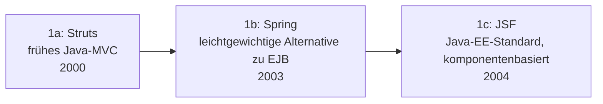

# Evolution und Architekturen digitaler Enterprise-Web-Frameworks

„Enterprise-tauglich" heißt bei Web-Frameworks etwas anderes als reine technische Modernität: Langzeit-Support-Zusagen statt schneller Breaking Changes, eingebaute Dependency Injection statt loser Bibliotheks-Kombination, Hersteller-Backing (Google, Microsoft, Red Hat) statt Community-Projekt ohne Ansprechpartner, und Konventionen, die auch in großen, wechselnden Teams über Jahre konsistent bleiben. Dieser Artikel verfolgt diese Anforderungslinie als eigenständige Zeitachse quer durch [Evolution und Architekturen digitaler Web-Frameworks](evolution-digitaler-webframeworks.md) — von den frühen Java-EE-/.NET-Portalen über cloud-native Java- und .NET-Frameworks bis zu TypeScript-first-Enterprise-SPAs, Enterprise-Node.js und schließlich serverseitigen Java-UI-Frameworks ganz ohne eigenen JavaScript-Code. Die sprachliche Enterprise-Perspektive dazu bietet [Evolution und Architekturen digitaler Enterprise-Programmiersprachen](../evolution-digitaler-enterprise-programmiersprachen.md); die Vollausstattungs-Philosophie (nicht enterprise-spezifisch, aber verwandt) behandelt [Evolution und Architekturen digitaler Batteries-Included-Web-Frameworks](evolution-digitaler-batteries-included-frameworks.md).

!!! note "Hinweis: Generationen überlappen sich"
    Die Zeiträume sind grobe Orientierung, keine scharfen Grenzen — Spring (Generation 1) läuft bis heute produktiv, meist bereits als Spring Boot (Generation 2), parallel zu Angular- und NestJS-Stacks (Generation 4/5). Entscheidend ist das **Enterprise-Versprechen** (Langzeit-Support, eingebaute Konventionen, Hersteller-Backing), nicht allein das Erscheinungsjahr.

---

## Generation 1: Java-EE- & .NET-Portale — die Enterprise-Grundgeneration, 2000 – 2004

Die Gründergeneration eint drei Prinzipien: **Dependency Injection** als eingebautes Architekturmuster statt manueller Objekterzeugung, **XML-lastige Konfiguration** statt Konvention, und Deployment auf einem dedizierten **Application-Server** (WebLogic, WebSphere, JBoss) statt eines einfachen Prozesses. Details zu dieser Generation bietet bereits [Generation 1c der Server-Monolith-Zeitachse](evolution-digitaler-monolith-frameworks.md#1c-enterprise-javanet-portal-architekturen-2002-2012) — dieser Artikel ordnet sie zusätzlich chronologisch innerhalb der Java-Enterprise-Linie selbst ein:

### 1a. Struts — frühes Java-MVC, 2000

- **Architektur:** eines der ersten Java-MVC-Frameworks, XML-Konfiguration für Action-Mappings statt Annotationen.
- **Bedeutung:** prägt das MVC-Muster für eine ganze Generation von Java-Enterprise-Entwicklern, bevor leichtgewichtigere Alternativen entstehen.

### 1b. Spring — leichtgewichtige Alternative zu EJB, 2003

- **Architektur:** Dependency Injection und Aspektorientierte Programmierung als Kernkonzepte, bewusst als Reaktion auf die als zu schwergewichtig empfundenen **Enterprise JavaBeans (EJB)** positioniert.
- **Bedeutung:** wird zum de-facto Standard-Fundament für Java-Enterprise-Anwendungen, siehe [Generation 3 der Enterprise-Programmiersprachen-Zeitachse](../evolution-digitaler-enterprise-programmiersprachen.md#generation-3-java-write-once-run-anywhere-1995-2005).

### 1c. JSF — Java-EE-Standard, komponentenbasiert, 2004

- **Architektur:** **JavaServer Faces** standardisiert komponentenbasierte UI-Entwicklung als offizieller Teil der Java-EE-Spezifikation, im Gegensatz zu Springs Community-getriebenem Ansatz.
- **Parallel dazu:** **ASP.NET Web Forms** (2002, Microsoft) verfolgt dasselbe komponentenbasierte, stateful Enterprise-Modell im .NET-Ökosystem, siehe [Generation 4 der Enterprise-Programmiersprachen-Zeitachse](../evolution-digitaler-enterprise-programmiersprachen.md#generation-4-cnet-microsofts-enterprise-okosystem-2000-2015).

---

## Generation 2: Cloud-natives Java — Spring Boot & Microservices, 2014 – 2019

Springs eigene XML-Konfiguration wird zum neuen Reibungsproblem — diese Generation eliminiert sie fast vollständig zugunsten von „Convention over Configuration" und Kubernetes-tauglichem Startverhalten.

**Architektur:** eingebetteter Anwendungsserver (kein separates Deployment auf externen Application-Server nötig), Konvention statt XML, bei den jüngeren Vertretern zusätzlich Ahead-of-time-Kompilierung für minimale Kaltstartzeiten in Container-Umgebungen.

| Framework | Jahr | Besonderheit |
|---|---|---|
| **Spring Boot** | 2014 | „Convention over Configuration" plus eingebetteter Tomcat/Jetty-Server — ein Kommandozeilenbefehl startet die gesamte Anwendung, siehe [Generation 1a der Batteries-Included-Zeitachse](evolution-digitaler-batteries-included-frameworks.md#1a-ruby-on-rails-convention-over-configuration-2004) für dieselbe Design-Philosophie in Ruby. |
| **Spring Cloud** | 2015 | Ergänzt Microservice-Muster (Service Discovery, Circuit Breaker) direkt auf Spring-Boot-Basis. |
| **Micronaut** | 2018 | Dependency Injection zur Kompilierzeit statt Laufzeit-Reflection — schnellerer Start, geringerer Speicherverbrauch als klassisches Spring. |
| **Quarkus** | 2019 | Red Hat, „Supersonic Subatomic Java" — für GraalVM-Native-Image-Kompilierung optimiert, Millisekunden-Kaltstart für Kubernetes/Serverless-Enterprise-Workloads. |

---

## Generation 3: Plattformoffenes .NET — ASP.NET Core & Blazor, 2016 – 2020

Microsofts Antwort auf dieselbe Herausforderung wie Generation 2: Der schwergewichtige, Windows-gebundene Vorgänger wird durch einen schlanken, plattformoffenen Nachfolger ersetzt.

**Architektur:** vollständiger Open-Source-Rewrite mit dem leichtgewichtigen **Kestrel**-Webserver statt IIS-Bindung, cross-platform (Linux/macOS/Windows) statt Windows-exklusiv.

| Framework | Jahr | Besonderheit |
|---|---|---|
| **ASP.NET Core** | 2016 | Vollständiger Rewrite von ASP.NET, siehe [Generation 4 der Enterprise-Programmiersprachen-Zeitachse](../evolution-digitaler-enterprise-programmiersprachen.md#generation-4-cnet-microsofts-enterprise-okosystem-2000-2015) für die zugrundeliegende .NET-Core-Plattformöffnung. |
| **Blazor** | 2018 (Preview), 2020 (WebAssembly GA) | C# läuft über WebAssembly direkt im Browser statt JavaScript — Enterprise-Teams behalten dieselbe Sprache über den gesamten Stack, analog zum isomorphen JavaScript-Vorteil aus [Generation 5 der Wissenssystem-Programmiersprachen-Zeitachse](../../wissen/dokumentation/evolution-digitaler-wissenssystem-programmiersprachen.md#generation-5-javascripttypescript-clojure-vollstack-und-funktionale-sprachen-moderner-pkm-web-apps-ab-2012). |

---

## Generation 4: TypeScript-first Enterprise-SPA — Angular, 2016

Statt eines unopinionated Frontend-Kerns wie React liefert Angular ein vollständiges, Google-gestütztes Framework mit eingebauter Dependency Injection — eine bewusste Brücke zwischen SPA-Modernität und der DI-Tradition aus Generation 1 dieses Artikels.

**Architektur:** vollständiger Rewrite gegenüber AngularJS (siehe [Generation 5 der SPA-Frameworks-Zeitachse](evolution-digitaler-spa-frameworks.md#generation-5-angular-2-kompletter-rewrite-2016)), TypeScript-first statt optionale Typisierung, eingebaute Dependency Injection statt externer State-Management-Bibliotheken, strikter LTS-Release-Zyklus mit klaren Deprecation-Fristen.

| Merkmal | Enterprise-Rolle |
|---|---|
| **Eingebaute Dependency Injection** | Dieselbe Architektur-Idee wie Spring (Generation 1), diesmal im Frontend statt Backend. |
| **Angular CLI** | Einheitliches Scaffolding, Build- und Test-Tooling ab Werk — reduziert Konfigurationsentscheidungen in großen Teams. |
| **Langzeit-Support-Zusage** | Google veröffentlicht feste Major-Release-Zyklen mit klar kommunizierten LTS-Fenstern — Planbarkeit als explizites Verkaufsargument gegenüber React. |

---

## Generation 5: Enterprise-Node.js — NestJS, 2017

NestJS überträgt Angulars Architektur-Philosophie explizit auf die Backend-Seite — dieselbe Modul-/Decorator-/DI-Struktur, diesmal für Node.js-APIs statt Browser-UIs.

**Architektur:** Module, Decorators und Dependency Injection nach Angular-Vorbild, wahlweise auf Express oder Fastify als zugrundeliegendem HTTP-Layer aufbauend statt eines eigenen Servers.

| Baustein | Rolle |
|---|---|
| **NestJS** (2017, Kamil Myśliwiec) | Bringt die aus Java/Spring und Angular bekannte Enterprise-Struktur (Module, DI, Decorators) explizit in die Node.js-Backend-Welt — eine direkte Antwort auf die als zu unstrukturiert empfundene Minimalität von Express.js. |

---

## Generation 6: Serverseitiges Java-UI ohne JavaScript — Vaadin, ab 2006

Der Kreis schließt sich: Statt JavaScript-Frontend und Java-Backend zu trennen, hält diese Generation die **gesamte UI-Logik in Java** — der Framework-Server synchronisiert automatisch mit dem Browser, ohne dass Entwickler selbst JavaScript schreiben.

**Architektur:** UI-Komponentenbaum wird serverseitig in Java gehalten, Zustandsänderungen werden automatisch über WebSockets an den Browser synchronisiert — konzeptionell verwandt mit dem Hypermedia-Comeback aus [Generation 6 der Server-Monolith-Zeitachse](evolution-digitaler-monolith-frameworks.md#generation-6-das-monolith-comeback-hypermedia-statt-spa-ab-2020), hier jedoch für das Java-Enterprise-Ökosystem statt Rails/PHP.

| Baustein | Rolle |
|---|---|
| **Vaadin** (ab 2006, heutige Form seit **Vaadin Flow**, 2018) | Enterprise-Teams ohne dediziertes Frontend-Know-how bauen komplette Web-UIs allein in Java — bewusster Gegenentwurf zur JavaScript-Fragmentierung der Generationen 4/5. |

---

## Alternative Sortier- & Klassifikationskriterien für Enterprise-Web-Frameworks

Neben dem chronologischen Generationenmodell lassen sich diese Frameworks nach folgenden Dimensionen einordnen:

### 1. Dependency-Injection-Modell

- **Laufzeit-Reflection-basiert** — klassisches Spring, JSF (Generation 1).
- **Ahead-of-time/Kompilierzeit** — Micronaut, Angular Ivy-Compiler (Generation 2, 4).
- **Framework-übergreifend übernommen** — NestJS adaptiert Angulars DI-Modell fürs Backend (Generation 5).

### 2. Sprach-Konsolidierung über den Stack

- **Zwei Sprachen (Backend/Frontend getrennt)** — Spring-Boot-Backend plus separates SPA-Frontend (Generation 2 plus 4).
- **Eine Sprache über den gesamten Stack** — TypeScript bei Angular+NestJS (Generation 4/5), C# bei Blazor (Generation 3), Java bei Vaadin (Generation 6).

### 3. Hersteller-Backing

- **Einzelunternehmen/Stiftung** — Google (Angular), Microsoft (ASP.NET Core/Blazor), Red Hat (Quarkus), Pivotal/VMware (Spring).
- **Community mit kommerziellem Support-Anbieter** — Vaadin Ltd. als Firma hinter dem gleichnamigen Open-Source-Framework.

### 4. Deployment-Ziel

- **Dedizierter Application-Server** — WebLogic/WebSphere/JBoss (Generation 1).
- **Eingebetteter Server, container-tauglich** — Spring Boot, ASP.NET Core (Generation 2–3).
- **Native-Image/Serverless-optimiert** — Quarkus, Micronaut (Generation 2).

---

## Verwandte Themen

- [Evolution und Architekturen digitaler Web-Frameworks](evolution-digitaler-webframeworks.md) — übergeordnetes, sprachübergreifendes Generationenmodell
- [Evolution und Architekturen digitaler Server-Monolith-Frameworks](evolution-digitaler-monolith-frameworks.md) — Generation 1 dieses Artikels im Kontext der breiteren Monolith-Zeitachse
- [Evolution und Architekturen digitaler SPA-Frameworks](evolution-digitaler-spa-frameworks.md) — Angulars vollständiger Rewrite als Generation 5 dieser Zeitachse, hier als Generation 4 aus Enterprise-Perspektive vertieft
- [Evolution und Architekturen digitaler Batteries-Included-Web-Frameworks](evolution-digitaler-batteries-included-frameworks.md) — verwandte, nicht enterprise-exklusive Vollausstattungs-Philosophie
- [Evolution und Architekturen digitaler Enterprise-Programmiersprachen](../evolution-digitaler-enterprise-programmiersprachen.md) — Sprachebene hinter den hier genannten Frameworks (Java, C#)
- [Evolution und Architekturen digitaler Programmiersprachen für Wissenssysteme](../../wissen/dokumentation/evolution-digitaler-wissenssystem-programmiersprachen.md) — isomorphe Sprachkonsolidierung als verwandtes Prinzip aus Generation 3 dieses Artikels
- [Evolution und Architekturen digitaler Enterprise-UI-Bibliotheken](evolution-digitaler-enterprise-ui-bibliotheken.md) — verwandte, aber nicht deckungsgleiche Achse: reine UI-Komponentenbibliotheken statt vollständiger Frameworks
- [Backend-Integration mit KI](backend-integration.md) — Vertiefung Backend-Frameworks mit KI-Unterstützung
- [Websites entwickeln mit KI](ki-webentwicklung.md) — praktischer Lernpfad HTML/CSS bis Deployment mit KI
