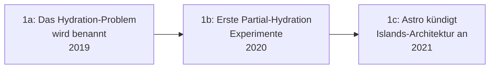

# Evolution und Architekturen digitaler Islands- & Edge-Architekturen

Server Components, Edge und Islands-Architektur bilden Generation 5 der [Evolution digitaler Web-Frameworks](evolution-digitaler-webframeworks.md). Diese eigenständige Zeitachse zoomt in genau diese Architekturlinie hinein: von der Hydration-Kritik über den React-Server-Components-RFC, Qwiks radikal anderes Resumability-Konzept und signal-basierte Reaktivität bis zu Edge-Runtimes und Islands-Frameworks auf alternativen JavaScript-Laufzeiten.

!!! note "Hinweis: Generationen überlappen sich"
    Die Zeiträume sind grobe Orientierung, keine scharfen Grenzen — vollständige Hydration (Generation 4 der Web-Frameworks-Zeitachse) läuft bis heute parallel zu Islands-Architekturen produktiv weiter. Entscheidend ist die **Architektur** (wie viel JavaScript tatsächlich beim Client ankommt und ausgeführt wird), nicht allein das Erscheinungsjahr.

---

## Generation 1: Die Hydration-Kritik & erste Partial-Hydration-Ideen, 2019 – 2021

Die Gründergeneration eint drei Prinzipien: die **Erkenntnis**, dass vollständige Hydration (das gesamte serverseitig gerenderte HTML wird im Browser erneut komplett initialisiert) enorme Rechenzeit für größtenteils nicht-interaktive Inhalte verschwendet, erste **experimentelle Partial-Hydration-Ansätze** und schließlich ein **benannter Architekturbegriff**. Sie lässt sich in drei technologische Entwicklungsstufen unterteilen:

### 1a. Das Hydration-Problem wird benannt, 2019

- **Beobachtung:** eine Nachrichtenseite mit 95 % statischem Text und nur einem interaktiven Kommentarfeld hydratisiert dennoch die gesamte Seite — unnötiger JavaScript-Download und -Ausführung für den größten Teil des Inhalts.

### 1b. Erste Partial-Hydration-Experimente, 2020

- **Architektur:** einzelne Frameworks experimentieren damit, nur explizit markierte Komponenten zu hydratisieren, statt die gesamte Seite — noch ohne einheitlichen Namen oder breite Adaption.

### 1c. Astro kündigt Islands-Architektur an, 2021

- **Architektur:** **Astro** benennt und systematisiert das Prinzip als „Islands-Architektur" — standardmäßig null JavaScript, Interaktivität nur gezielt pro Komponente zugeschaltet („Insel" im ansonsten statischen HTML-„Meer").
- **Bedeutung:** wird zum Referenzbegriff für die gesamte Generation.

---

## Generation 2: React Server Components — RFC & Implementierung, 2020 – 2023

Statt Hydration zu optimieren, verschiebt dieser Ansatz Teile des Komponentenbaums so, dass sie **niemals** an den Client gesendet werden — Server- und Client-Komponenten werden zu explizit unterschiedenen Bausteinen im selben Framework.

| Meilenstein | Jahr | Bedeutung |
|---|---|---|
| **React-Server-Components-RFC** | Dezember 2020 | Formalisiert das Konzept getrennter Server-/Client-Komponenten innerhalb von React selbst. |
| **Next.js App Router** | 2023 | Erste breit produktive Implementierung — Server-Komponenten ohne Client-JavaScript für nicht-interaktive Teile, Streaming statt vollständigem Warten. |

---

## Generation 3: Resumability statt Hydration — Qwik, 2021

**Qwik** verfolgt einen fundamental anderen Ansatz als Partial Hydration: Statt die App im Browser erneut zu initialisieren, wird der bereits vom Server berechnete Ausführungszustand **serialisiert und fortgesetzt**.

**Architektur:** feingranulare Code-Auslagerung (jede Event-Handler-Funktion wird einzeln nachgeladen, erst wenn sie tatsächlich gebraucht wird), kein Hydration-Schritt im klassischen Sinn.

| Baustein | Rolle |
|---|---|
| **Resumability** | Der Browser lädt und führt nur genau den JavaScript-Code aus, der für eine konkrete Nutzerinteraktion nötig ist — nicht die gesamte Seiten-Logik im Voraus. |

---

## Generation 4: Signal-basierte feingranulare Reaktivität, 2021 – 2024

Statt eines Virtual-DOM-Diffings über den gesamten Komponentenbaum aktualisieren Signals gezielt nur die tatsächlich betroffenen DOM-Knoten — eine Weiterentwicklung der [compiler-basierten Ansätze aus Generation 4 der Meta-Frameworks-Zeitachse](evolution-digitaler-meta-frameworks.md#generation-4-compiler-basierte-frameworks-ohne-virtual-dom-2016-2020).

| System | Jahr | Prinzip |
|---|---|---|
| **SolidJS/SolidStart** | 2021/2022 | Signals als Grundprimitiv, kein Virtual DOM, feingranulare Updates auf DOM-Ebene. |
| **Vue 3 Reactivity** | 2020 | Proxy-basiertes reaktives System als interne Grundlage, auch ohne Signal-Terminologie. |
| **Svelte 5 Runes** | 2024 | Führt explizite Signal-artige Primitive („Runes") in Sveltes Compiler-Modell ein. |

---

## Generation 5: Edge-Runtimes statt zentralem Server, 2021 – 2022

Rendering wandert geografisch näher an den Nutzer — statt eines zentralen Rechenzentrums laufen Funktionen auf einem global verteilten Netzwerk von Edge-Standorten.

| System | Jahr | Anbieter |
|---|---|---|
| **Cloudflare Workers** | 2017 (breite Web-Framework-Adaption ab 2021) | Cloudflare. |
| **Vercel Edge Functions** | 2021 | Vercel — direkt in Next.js integriert. |
| **Deno Deploy** | 2021 | Deno — Edge-Hosting nativ für Deno-basierte Anwendungen. |

---

## Generation 6: Islands auf alternativen Runtimes — Deno Fresh, 2022

Statt Node.js als Laufzeitumgebung nutzt diese Generation **Deno** von Grund auf — ein natives Islands-Framework ohne Node.js-Altlasten oder Build-Schritt.

| Baustein | Rolle |
|---|---|
| **Deno Fresh** | Islands-Architektur nativ auf Deno, kein Build-Schritt nötig — JIT-Kompilierung zur Laufzeit statt vorgelagertem Bundling. |

---

## Alternative Sortier- & Klassifikationskriterien für Islands- & Edge-Architekturen

### 1. Hydration-Strategie

- **Vollständige Hydration** — gesamte Seite wird im Browser reinitialisiert (Vorgänger-Generation).
- **Partial Hydration/Islands** — nur markierte Komponenten werden hydratisiert (Astro).
- **Resumability** — kein Hydration-Schritt, Zustand wird fortgesetzt (Qwik).

### 2. Update-Granularität

- **Komponentenbaum-Diffing** — Virtual DOM über den gesamten Baum (React Server Components).
- **Signal-basiert** — gezielte Aktualisierung einzelner DOM-Knoten (SolidJS, Svelte 5).

### 3. Ausführungsort

- **Zentraler Server** — ein Rechenzentrum pro Deployment (klassisches SSR).
- **Edge-Netzwerk** — global verteilte Ausführung nahe am Nutzer (Cloudflare Workers, Vercel Edge).

---

## Verwandte Themen

- [Beste Islands- & Edge-Architekturen 2026 (Top 15)](islands-edge-architektur-2026-topliste.md) — Momentaufnahme 2026, die diese Chronologie in eine gerankte Topliste übersetzt
- [Evolution und Architekturen digitaler Web-Frameworks](evolution-digitaler-webframeworks.md) — übergeordnetes Generationenmodell, Generation 5 dort entspricht diesem Artikel im Ganzen
- [Evolution und Architekturen digitaler Full-Stack-Meta-Frameworks](evolution-digitaler-meta-frameworks.md) — vorausgehende Generation, deren Hydration-Modell hier verfeinert wird
- [Evolution und Architekturen digitaler KI-nativer Web-Frameworks](evolution-digitaler-ki-native-webframeworks.md) — nachfolgende Generation
- [Frontend mit KI](frontend-ki.md) — Vertiefung Frontend-Frameworks mit KI-Unterstützung
