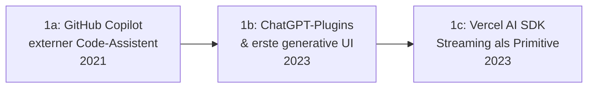

# Evolution und Architekturen digitaler KI-nativer Web-Frameworks

KI-native & agentengestützte Web-Frameworks bilden Generation 6 — die aktuelle und letzte Generation — der [Evolution digitaler Web-Frameworks](evolution-digitaler-webframeworks.md). Diese eigenständige Zeitachse zoomt in genau diese Architekturlinie hinein: vom externen Code-Assistenten über Text-zu-UI-Generatoren, terminal-native LLM-Erweiterungen bestehender Frameworks und vollständige App-Generatoren bis zu agentischer Browsersteuerung und Framework-Kernen mit eingebauten Agenten-Primitiven.

!!! note "Hinweis: Generationen überlappen sich"
    Die Zeiträume sind grobe Orientierung, keine scharfen Grenzen — GitHub Copilot (Generation 1) läuft parallel zu vollständigen App-Generatoren (Generation 4) bis heute produktiv weiter. Entscheidend ist die **Architektur** (KI als externe Ergänzung vs. als Framework-Primitive), nicht allein das Erscheinungsjahr.

---

## Generation 1: Von externen Code-Assistenten zu eingebetteten UI-Primitiven, 2021 – 2023

Die Gründergeneration eint drei Prinzipien: KI beginnt als **externer Assistent** im Editor, wandert dann in **experimentelle Produktfeatures** und schließlich direkt in **Framework-eigene Primitive**. Sie lässt sich in drei technologische Entwicklungsstufen unterteilen:

### 1a. GitHub Copilot — externer Code-Assistent, 2021

- **Architektur:** Code-Vervollständigung im Editor, vollständig getrennt vom Ziel-Framework — kein Framework-eigenes KI-Feature.
- **Bedeutung:** erste breit adoptierte LLM-Integration direkt im Entwickler-Editor, siehe [Generation 5 der KI-Anwendungen](../../künstliche-intelligenz/evolution-digitaler-rag-werkzeug-anwendungen.md#generation-3-ki-gestutzte-coding-assistenten-mit-werkzeugzugriff-2021-2023).

### 1b. ChatGPT-Plugins & erste generative UI, 2023

- **Architektur:** experimentelle Erweiterungen erlauben LLMs, strukturierte UI-Elemente statt reinen Text auszugeben — noch kein eigenständiges Web-Framework-Feature.

### 1c. Vercel AI SDK — Streaming als Framework-Primitive, 2023

- **Architektur:** Token-für-Token-Streaming, Tool-Calling und generative UI werden zu direkt in React/Next.js einsetzbaren Hooks und Komponenten statt selbst gebauter Wrapper um eine LLM-API.
- **Bedeutung:** der Moment, in dem KI-Fähigkeiten erstmals als Framework-Primitive statt externer Dienst behandelt werden.

---

## Generation 2: Text-zu-UI-Generatoren, 2023 – 2024

Statt Code zeilenweise zu vervollständigen, generieren diese Werkzeuge **vollständige UI-Komponenten** aus einer Textbeschreibung oder einem Screenshot.

| System | Anbieter | Prinzip |
|---|---|---|
| **v0.dev** | Vercel | Generiert vollständige React/Next.js-Komponenten aus Textbeschreibungen oder Screenshots. |
| **Bolt.new** | StackBlitz | Generiert und führt vollständige Web-Anwendungen direkt im Browser aus, ohne lokale Entwicklungsumgebung. |

---

## Generation 3: Terminal- und editor-native KI-Erweiterung bestehender Frameworks, 2023

Statt eines neuen Frameworks wird **jedes bestehende Framework** — von Vanilla JS bis Next.js — durch ein lokales oder cloud-basiertes LLM erweitert, das direkten Datei- und Terminalzugriff hat.

| System | Prinzip |
|---|---|
| **Aider + Ollama** | Terminal-natives Werkzeug, lokales LLM erzeugt direkt Git-Commits aus Änderungen. |
| **Continue.dev** | Editor-Erweiterung, die beliebige LLMs (lokal oder Cloud) in den Entwicklungsworkflow einbindet, siehe [Software – Open Source zuerst](ki-webentwicklung.md#13-thema-entwicklungsumgebung-mit-ki-aufsetzen). |

---

## Generation 4: KI-gestützte Full-Stack-App-Generatoren, 2024

Aus Komponenten-Generatoren (Generation 2) werden vollständige Anwendungsgeneratoren — Datenbank, Backend und Frontend aus einem einzigen Prompt statt einzelner UI-Bausteine.

| System | Prinzip |
|---|---|
| **Bolt.new** (Ausbau) | Vollständige Full-Stack-Anwendungen inklusive Backend-Logik aus Textbeschreibung. |
| **Lovable** | Generiert komplette Web-Anwendungen mit Datenbank-Anbindung aus natürlichsprachigen Anforderungen. |
| **Replit Agent** | Kombiniert App-Generierung mit sofortigem Hosting in derselben Umgebung. |

---

## Generation 5: Agentische Browser- & Computer-Use-Steuerung für Web-UIs, ab 2024

Statt nur Code zu generieren, steuern Agenten die generierte (oder bestehende) Web-Anwendung direkt über die grafische Oberfläche — dieselbe Architekturlinie wie [Generation 4 der Autonomen-KI-Agenten-Zeitachse](../../künstliche-intelligenz/evolution-digitaler-autonome-ki-agenten.md#generation-4-computer-use-browser-agenten-ab-2024), hier angewendet auf selbst gebaute Web-Frontends.

| Baustein | Rolle |
|---|---|
| **Anthropic Computer Use** | Analysiert Screenshots und steuert Maus/Tastatur direkt — testet und bedient Web-UIs wie ein Mensch. |
| **OpenAI Operator** | Browsergesteuerter Agent für webbasierte Mehrschrittaufgaben. |

---

## Generation 6: Framework-Kerne mit eingebauten Agenten-Primitiven, ab 2025

Die aktuelle Generation verankert Agent-Loops, standardisierten Werkzeugzugriff und generative UI **direkt im Framework-Kern** statt als externe Bibliothek oder Drittanbieter-Dienst.

| Baustein | Rolle |
|---|---|
| **Vercel AI SDK** (Weiterentwicklung) | Erweitert Streaming-Primitive um vollwertige Agenten-Orchestrierung direkt im Framework. |
| **Agent Client Protocol (ACP)** | Standardisierte Schnittstelle zwischen Agenten und Editor-/Framework-Umgebungen, siehe [Agent Client Protocol](../../künstliche-intelligenz/coding/agent-client-protocol-acp.md). |

!!! warning "Achtung: Vibe Coding ersetzt kein Architekturverständnis"
    Wie in [Vibe Coding – was steckt dahinter?](ki-webentwicklung.md#21-konzept-der-ki-gestutzte-entwicklungsworkflow) beschrieben, senkt generative UI-Erstellung die Einstiegshürde, erzeugt aber ohne Codeverständnis leicht technische Schulden und unbemerkte Sicherheitslücken — das gilt für jede Generation dieser Zeitachse.

---

## Alternative Sortier- & Klassifikationskriterien für KI-native Web-Frameworks

### 1. Integrationstiefe

- **Externer Assistent** — vollständig getrennt vom Zielframework (GitHub Copilot).
- **Framework-Primitive** — direkt als Hook/Komponente nutzbar (Vercel AI SDK).
- **Framework-Kern-Feature** — Agenten-Fähigkeiten sind Teil der Kernarchitektur (Generation 6).

### 2. Generierungsumfang

- **Einzelne Komponente** — v0.dev.
- **Vollständige Anwendung** — Bolt.new, Lovable.
- **Laufende Bedienung bestehender UIs** — Computer-Use-Agenten.

### 3. Ausführungsort des Agenten

- **Lokal** — Aider + Ollama.
- **Cloud-gehostet** — Replit Agent, v0.dev.

---

## Verwandte Themen

- [Evolution und Architekturen digitaler Web-Frameworks](evolution-digitaler-webframeworks.md) — übergeordnetes Generationenmodell, Generation 6 dort entspricht diesem Artikel im Ganzen
- [Evolution und Architekturen digitaler Islands- & Edge-Architekturen](evolution-digitaler-islands-edge-architektur.md) — vorausgehende Generation
- [Evolution und Architekturen digitaler Autonomer KI-Agenten](../../künstliche-intelligenz/evolution-digitaler-autonome-ki-agenten.md) — allgemeine Agenten-Zeitachse, Generation 4/5 dort entspricht Generation 5 dieses Artikels
- [Evolution und Architekturen digitaler RAG- & Werkzeug-Anwendungen](../../künstliche-intelligenz/evolution-digitaler-rag-werkzeug-anwendungen.md) — Generation 3 dort vertieft Coding-Assistenten
- [Websites entwickeln mit KI](ki-webentwicklung.md) — praktischer Lernpfad HTML/CSS bis Deployment mit KI
