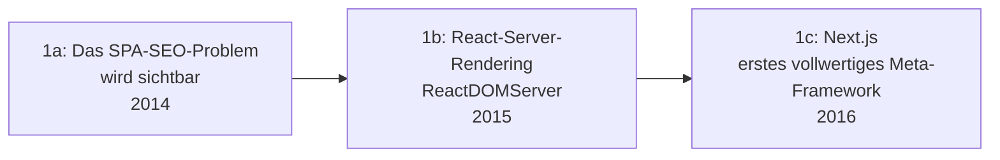

# Evolution und Architekturen digitaler Full-Stack-Meta-Frameworks

Full-Stack-JavaScript & Meta-Frameworks bilden Generation 4 der [Evolution digitaler Web-Frameworks](evolution-digitaler-webframeworks.md). Diese eigenständige Zeitachse zoomt in genau diese Architekturlinie hinein: von der SEO-Krise reiner SPAs über die ersten SSR-Lösungen und Next.js als Referenzimplementierung bis zu GraphQL-gestützter Static-Site-Generation, dem Vue-Pendant Nuxt.js, compiler-basierten Ansätzen ohne Virtual DOM und schließlich feingranularer Rendering-Strategie-Wahl pro Seite.

!!! note "Hinweis: Generationen überlappen sich"
    Die Zeiträume sind grobe Orientierung, keine scharfen Grenzen — Gatsby (Generation 2) wird parallel zu Remix (Generation 5) bis heute produktiv eingesetzt. Entscheidend ist die **Architektur** (wo wird gerendert, wie viel Kontrolle pro Seite), nicht allein das Erscheinungsjahr.

---

## Generation 1: Die SEO-Krise der SPAs & erste SSR-Lösungen, 2014 – 2016

Die Gründergeneration eint drei Prinzipien: die **Erkenntnis**, dass reine Client-Rendering-SPAs (vgl. [Generation 3 der Web-Frameworks-Zeitachse](evolution-digitaler-spa-frameworks.md)) für Suchmaschinen und Ladezeit-kritische Anwendungen ungeeignet sind, erste **Server-Rendering-Bibliotheken** für bestehende SPA-Frameworks und schließlich ein **eigenständiges Meta-Framework**, das SSR als Kernfeature statt Zusatzbibliothek anbietet. Sie lässt sich in drei technologische Entwicklungsstufen unterteilen:

### 1a. Das SPA-SEO-Problem wird sichtbar, 2014

- **Beobachtung:** Suchmaschinen-Crawler und Social-Media-Vorschaubilder erhalten bei reinen Client-Rendering-SPAs oft nur ein leeres HTML-Gerüst statt Inhalt — ein wachsendes Praxisproblem für öffentliche Webseiten.

### 1b. React-Server-Rendering, 2015

- **Architektur:** `ReactDOMServer` ermöglicht das Rendern von React-Komponenten zu HTML-Strings auf dem Server — noch ohne integriertes Routing oder Datenabruf-Konzept.
- **Fokus:** technische Machbarkeit demonstrieren, nicht produktionsreife Entwicklerergonomie.

### 1c. Next.js — das erste vollwertige Meta-Framework, 2016

- **Architektur:** File-based Routing, automatisches Server-Rendering pro Seite, Zero-Config-Setup — Vercel bündelt SSR erstmals zu einem eigenständigen, produktionsreifen Framework.
- **Bedeutung:** wird zur Referenzarchitektur, an der sich alle folgenden Meta-Frameworks messen.

---

## Generation 2: Static-Site-Generation mit GraphQL-Datenlayer, 2015 – 2018

Statt bei jeder Anfrage neu zu rendern, erzeugt diese Generation HTML einmalig beim Build — mit einem GraphQL-Layer, der mehrere Datenquellen einheitlich abfragbar macht.

| System | Jahr | Besonderheit |
|---|---|---|
| **Gatsby** | 2015 (Durchbruch ab 2017) | Primär SSG, GraphQL-Datenlayer zur Zusammenführung mehrerer Content-Quellen — direkte Schnittmenge zu [Headless-CMS-Frontends](../../wissen/dokumentation/evolution-digitaler-cms.md#generation-2-headless-decoupled-cms-api-first-ca-2015-2021). |

---

## Generation 3: Vue-Ökosystem zieht nach — Nuxt.js, 2016

Das Vue-Ökosystem überträgt dasselbe Meta-Framework-Konzept auf seine eigene Bibliothek — analoge Architektur, eigenes Konventionssystem.

| System | Basis | Prinzip |
|---|---|---|
| **Nuxt.js** | Vue.js | File-based Routing, SSR/SSG-Hybrid, Modul-Ökosystem — analoges Konzept zu Next.js für Vue-Entwickler. |

---

## Generation 4: Compiler-basierte Frameworks ohne Virtual DOM, 2016 – 2020

Statt eines Virtual-DOM-Diffings zur Laufzeit übersetzt ein Compiler die Reaktivität bereits beim Build in direkte DOM-Updates — potenziell schnellere Laufzeit-Performance bei kleinerem Bundle.

| System | Jahr | Prinzip |
|---|---|---|
| **Svelte** | 2016 | Kompiliert Komponenten zu minimalem, imperativem JavaScript ohne Framework-Laufzeit-Overhead. |
| **SvelteKit** | 2020 | Meta-Framework-Ausbau von Svelte nach dem Next.js/Nuxt.js-Vorbild — SSR/SSG auf Compiler-Basis. |

---

## Generation 5: Web-Standards statt Framework-Abstraktionen, 2021

**Remix** setzt bewusst auf native Web-APIs statt proprietärer Framework-Konzepte — Formulare und Fetch-Requests folgen dem Browser-Standardverhalten statt eigener Abstraktionen.

| Baustein | Rolle |
|---|---|
| **Remix Core** | Nutzt native `<form>`-Submits und die Fetch-API als Grundprimitive statt eigener Datenabruf-Hooks. |
| **Progressive Enhancement** | Anwendungen funktionieren auch mit deaktiviertem JavaScript grundlegend weiter — ungewöhnlich für ein SPA-Meta-Framework dieser Ära. |

---

## Generation 6: Incremental Static Regeneration & Hybrid-Rendering-Feinsteuerung, 2018 – 2021

Statt einer globalen Entscheidung „statisch oder serverseitig gerendert" erlaubt diese Generation die Rendering-Strategie **pro Seite** individuell zu wählen — und sogar statische Seiten nachträglich zu aktualisieren, ohne den gesamten Build neu auszuführen.

| Baustein | Rolle |
|---|---|
| **Incremental Static Regeneration (ISR)** | Next.js aktualisiert einzelne statische Seiten im Hintergrund nach Ablauf einer Revalidierungszeit, ohne einen kompletten Neu-Build. |
| **On-Demand Revalidation** | Erzwingt die Aktualisierung einer bestimmten statischen Seite gezielt per API-Aufruf, z. B. nach einer CMS-Änderung. |

!!! tip "Übergang zur nächsten Generation"
    Die Feinsteuerung ganzer Seiten reicht irgendwann nicht mehr aus — [Generation 5 der Web-Frameworks-Zeitachse](evolution-digitaler-webframeworks.md#generation-5-server-components-edge-islands-architektur-ab-ca-2022) beschreibt den nächsten Schritt: Feinsteuerung auf Ebene einzelner UI-Fragmente statt ganzer Seiten.

---

## Alternative Sortier- & Klassifikationskriterien für Full-Stack-Meta-Frameworks

### 1. Primäre Rendering-Strategie

- **SSR-first** — bei jeder Anfrage neu gerendert (Next.js Pages Router, Nuxt.js).
- **SSG-first** — beim Build einmalig gerendert (Gatsby).
- **Konfigurierbar pro Seite** — Next.js mit ISR, Remix.

### 2. Basis-Bibliothek

- **React** — Next.js, Gatsby, Remix.
- **Vue** — Nuxt.js.
- **Eigener Compiler ohne Virtual DOM** — SvelteKit.

### 3. Datenabruf-Philosophie

- **GraphQL-Datenlayer** — Gatsby.
- **Framework-eigene Data-Loader** — Next.js `getServerSideProps`/`getStaticProps`.
- **Native Web-APIs** — Remix (Fetch, Formulare).

---

## Verwandte Themen

- [Beste Full-Stack-Meta-Frameworks 2026 (Top 15)](meta-frameworks-2026-topliste.md) — Momentaufnahme 2026, die diese Chronologie in eine gerankte Topliste übersetzt
- [Evolution und Architekturen digitaler Web-Frameworks](evolution-digitaler-webframeworks.md) — übergeordnetes Generationenmodell, Generation 4 dort entspricht diesem Artikel im Ganzen
- [Evolution und Architekturen digitaler SPA-Frameworks](evolution-digitaler-spa-frameworks.md) — vorausgehende Generation, deren SEO-Schwäche diese Zeitachse adressiert
- [Evolution und Architekturen digitaler Content-Management-Systeme](../../wissen/dokumentation/evolution-digitaler-cms.md) — direkte Schnittmenge bei Headless-CMS-Frontends (Generation 2 dieses Artikels)
- [Frontend mit KI](frontend-ki.md) — Vertiefung Frontend-Frameworks mit KI-Unterstützung
