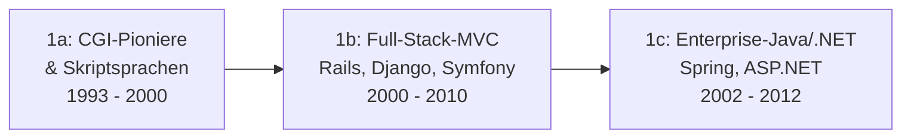

# Evolution und Architekturen digitaler Server-Monolith-Frameworks

Serverseitige, monolithische Web-Frameworks bilden Generation 1 der [Evolution digitaler Web-Frameworks](evolution-digitaler-webframeworks.md). Diese eigenständige Zeitachse verfolgt diese Architekturlinie über die im Elternartikel behandelten CGI-/MVC-/Enterprise-Stufen hinaus bis in die Gegenwart: PHP-Ökosystem-Reife, Python-Microframeworks, Go-Backends, Serverless-Funktionen und schließlich ein regelrechtes **Comeback** des Server-Monolithen als Reaktion auf SPA-Komplexität.

!!! note "Hinweis: Generationen überlappen sich"
    Die Zeiträume sind grobe Orientierung, keine scharfen Grenzen — Django und Ruby on Rails (Generation 1) laufen bis heute produktiv, parallel zum Hypermedia-Comeback (Generation 6). Entscheidend ist die **Architektur** (Rendering und Logik im selben Prozess statt getrennter Frontend-/Backend-Schichten), nicht allein das Erscheinungsjahr.

---

## Generation 1: CGI, MVC & Enterprise-Portale, 1993 – 2012

Die Gründergeneration eint drei Prinzipien: **serverseitige Verarbeitung** jeder Anfrage, **Templates** zur HTML-Ausgabe und wachsende **strukturelle Konvention**. Sie deckt sich mit [Generation 1 der übergeordneten Web-Frameworks-Zeitachse](evolution-digitaler-webframeworks.md#generation-1-serverseitige-monolithische-web-frameworks-cgi-mvc-templates) und lässt sich in dieselben drei Entwicklungsstufen unterteilen:

### 1a. CGI-Pioniere & Skriptsprachen, 1993 – 2000

- **Architektur:** Common Gateway Interface — ein Prozess pro Anfrage, zustandslos, keine Wiederverwendung des Prozessspeichers.
- **Vertreter:** Perl `CGI.pm`, **PHP/FI** (1995).

### 1b. Full-Stack-MVC-Frameworks, 2000 – 2010

- **Architektur:** serverseitiges MVC, integrierter ORM, „Convention over Configuration".
- **Vertreter:** **Ruby on Rails** (2004), **Django** (2005), **Symfony** (2005).

### 1c. Enterprise-Java/.NET & Portal-Architekturen, 2002 – 2012

- **Architektur:** Java EE/.NET, Dependency Injection, stateful Sessions.
- **Vertreter:** **Spring Framework** (2003), **ASP.NET Web Forms** (2002).

---

## Generation 2: PHP-Ökosystem-Reife & Laravel, 2005 – 2015

PHP-Frameworks konsolidieren sich von Einzellösungen zu einem reifen Ökosystem mit Paketverwaltung — **Laravel** wird zum dominanten modernen PHP-Framework.

| System | Jahr | Besonderheit |
|---|---|---|
| **CodeIgniter** | 2006 | Leichtgewichtig, minimale Konfiguration, geringe Lernkurve. |
| **CakePHP** | 2005 | Rails-inspiriertes „Convention over Configuration" für PHP. |
| **Laravel** | 2011 | Elegante Syntax, integriertes ORM (Eloquent), **Composer**-Paketverwaltung — verdrängt ältere PHP-Frameworks als De-facto-Standard. |

---

## Generation 3: Python-Microframeworks, 2010 – 2018

Statt eines „Batteries-included"-Frameworks wie Django entstehen minimalistische Kerne, die Entwickler gezielt um nur die benötigten Komponenten erweitern.

| System | Jahr | Prinzip |
|---|---|---|
| **Flask** | 2010 | Minimalistischer Kern, Erweiterungen für ORM/Auth/Validierung nach Bedarf. |
| **FastAPI** | 2018 | Async-first, automatische OpenAPI-Dokumentation aus Typannotationen, siehe [Backend & APIs mit KI entwickeln](ki-webentwicklung.md#24-thema-backend-apis-mit-ki-entwickeln). |

---

## Generation 4: Go für performante Web-Backends, 2012 – 2020

Go etabliert sich als Backend-Sprache für hochperformante, nebenläufige Web-Dienste — kompilierte Binärdateien statt interpretierter Laufzeitumgebung.

| System | Jahr | Besonderheit |
|---|---|---|
| **net/http** (Standardbibliothek) | 2012 | Produktionsreifer HTTP-Server bereits ohne externes Framework. |
| **Gin** | 2014 | Schnelles, minimalistisches Routing auf net/http aufbauend. |
| **Echo** | 2015 | Ähnliches Ziel wie Gin, mit stärkerem Fokus auf Middleware-Ökosystem. |

---

## Generation 5: Serverless-Function-Architekturen, ab 2014

Statt eines dauerhaft laufenden Framework-Prozesses wird jede Anfrage von einer kurzlebigen, isolierten Funktion beantwortet — kein Server-Management, Abrechnung nach Ausführungszeit statt Serverlaufzeit.

| System | Jahr | Rolle |
|---|---|---|
| **AWS Lambda** | 2014 | Prägte das „Function as a Service"-Modell für die breite Praxis. |
| **Serverless Framework** | 2015 | Deployment-Abstraktion über mehrere Cloud-Anbieter hinweg. |
| **Vercel/Netlify Functions** | 2016/2018 | Serverless-Funktionen direkt neben statisch gehostetem Frontend-Code. |

---

## Generation 6: Das Monolith-Comeback — Hypermedia statt SPA, ab 2020

Als Reaktion auf die gewachsene Komplexität von SPA-/Meta-Framework-Stacks (vgl. [Generation 3/4 der Web-Frameworks-Zeitachse](evolution-digitaler-webframeworks.md)) kehren mehrere Frameworks zu serverseitig gerendertem HTML zurück — mit gezielten, minimalen JavaScript-Ergänzungen statt vollständiger Client-Hydration.

| System | Jahr | Prinzip |
|---|---|---|
| **HTMX** | 2020 | Erweitert HTML um Attribute für Ajax-Anfragen, WebSockets und DOM-Swaps — kein Build-Schritt, kein Virtual DOM. |
| **Hotwire/Turbo** (Ruby on Rails) | 2020 | Sendet HTML-Fragmente statt JSON, aktualisiert gezielt Seitenteile ohne vollständigen Reload. |
| **Laravel Livewire** | 2020 | Reaktive Komponenten serverseitig gerendert, PHP-Zustand statt JavaScript-Zustand. |

!!! tip "Bezug zur übergeordneten Zeitachse"
    Generation 6 dieses Artikels ist eine direkte architektonische Antwort auf die Komplexität von [Generation 4/5 der Web-Frameworks-Zeitachse](evolution-digitaler-webframeworks.md#generation-4-full-stack-javascript-meta-frameworks-ssrssg-hybrid-ca-2016-2022) — „weniger JavaScript" statt „mehr Framework".

---

## Alternative Sortier- & Klassifikationskriterien für Server-Monolith-Frameworks

### 1. Batteries-Included-Grad

- **Vollausstattung** — ORM, Auth, Admin-Oberfläche im Kern (Django, Rails, Laravel). Eine eigene, sprachübergreifende Zeitachse speziell für diese Design-Philosophie bietet [Evolution und Architekturen digitaler Batteries-Included-Web-Frameworks](evolution-digitaler-batteries-included-frameworks.md).
- **Minimalistischer Kern** — Erweiterungen nach Bedarf (Flask, Gin).

### 2. Ausführungsmodell

- **Dauerhaft laufender Prozess** — klassisches Framework-Deployment (Generation 1–4).
- **Kurzlebige Funktion** — pro Anfrage neu instanziiert (Generation 5).

### 3. Client-Interaktivität

- **Vollständiger Seiten-Reload** — klassisches Formular-basiertes Web (Generation 1).
- **Gezielte HTML-Fragment-Updates** — Hypermedia-Ansatz ohne Virtual DOM (Generation 6).

---

## Verwandte Themen

- [Evolution und Architekturen digitaler Web-Frameworks](evolution-digitaler-webframeworks.md) — übergeordnetes Generationenmodell, Generation 1 dort entspricht diesem Artikel im Ganzen
- [Evolution und Architekturen digitaler Rust-Webframeworks](evolution-digitaler-rust-webframeworks.md) — analoge Rust-spezifische Zeitachse
- [Evolution und Architekturen digitaler Batteries-Included-Web-Frameworks](evolution-digitaler-batteries-included-frameworks.md) — vertiefende, sprachübergreifende Zeitachse speziell für die Vollausstattungs-Philosophie aus Generation 1
- [Backend-Integration mit KI](backend-integration.md) — Vertiefung Backend-Frameworks mit KI-Unterstützung
- [Websites entwickeln mit KI](ki-webentwicklung.md) — praktischer Lernpfad HTML/CSS bis Deployment mit KI
- [Evolution und Architekturen digitaler Enterprise-Programmiersprachen](../evolution-digitaler-enterprise-programmiersprachen.md) — Spring Framework (Java) und ASP.NET Web Forms (C#) als konkrete Frameworks aus Generation 1c dieses Artikels, dort im allgemeinen Sprachökosystem-Kontext eingeordnet
- [Evolution und Architekturen digitaler Enterprise-Web-Frameworks](evolution-digitaler-enterprise-webframeworks.md) — vertiefendes Generationenmodell speziell für die Enterprise-Tauglichkeits-Achse aus Generation 1c dieses Artikels
