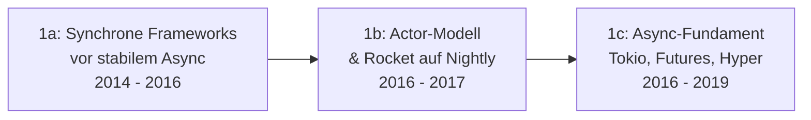

# Evolution und Architekturen digitaler Rust-Webframeworks

Rust-Web-Frameworks lassen sich — als Rust-spezifische Vertiefung von [Evolution und Architekturen digitaler Web-Frameworks](evolution-digitaler-webframeworks.md) — nach **technologischen Generationen** ordnen: von frühen synchronen Experimenten vor stabilem Async über das Actor-Modell und die Tokio-Runtime bis zu ausgereiften Tower-Middleware-Frameworks, Full-Stack-SSR/WASM-Ansätzen und schließlich KI-nativen Streaming-Backends. Wer konkrete Frameworks nach ihrer **Eignung für KI-Anwendungen** vergleichen will, findet das Ranking in [Beste Rust-Frameworks & Web-Backends mit KI-Unterstützung (Top 20)](../../künstliche-intelligenz/coding/rust-web-frameworks-ki-topliste.md) — dieser Artikel ordnet dieselben und weitere Frameworks stattdessen **chronologisch nach Architektur-Generation**.

!!! note "Hinweis: Generationen überlappen sich"
    Die Zeiträume sind grobe Orientierung, keine scharfen Grenzen — Actix-web (Generation 2) wird bis heute produktiv in Hochlast-Systemen eingesetzt, parallel zu Axum-basierten KI-Backends (Generation 6). Entscheidend ist die **Architektur** (Concurrency-Modell, Middleware-System), nicht allein das Erscheinungsjahr.

---

## Generation 1: Frühe Experimente vor stabilem Async, 2014 – 2019

Vor `async`/`await` als Sprachfeature behilft sich das junge Rust-Web-Ökosystem mit synchronen APIs, dem Actor-Modell oder experimentellen Nightly-Compiler-Features. Sie lässt sich in drei technologische Entwicklungsstufen unterteilen:

### 1a. Synchrone Frameworks vor stabilem Async, 2014 – 2016

- **Architektur:** blockierendes I/O, ein Thread pro Anfrage — dieselbe Grundarchitektur wie frühe Frameworks anderer Sprachen aus [Generation 1b der allgemeinen Web-Frameworks-Zeitachse](evolution-digitaler-webframeworks.md#1b-full-stack-mvc-frameworks-ca-2000-2010).
- **Vertreter:** **Iron** (2014, inspiriert von Express.js/Connect-Middleware-Ketten), **Nickel.rs** (2014, an Sinatra angelehnt) — beide vor Rust 1.0 (Mai 2015) entstanden und von der API-Instabilität dieser frühen Phase geprägt.

### 1b. Actor-Modell & Rocket auf Nightly, 2016 – 2017

- **Architektur:** **Actix** (2017) bringt zunächst das **Actor-Modell** (isolierte, nachrichtenbasiert kommunizierende Einheiten) als Nebenläufigkeits-Grundlage, bevor daraus später Actix-web entsteht; **Rocket** (Version 0.1, 2016) setzt auf ergonomische Makros und Type-Level-Routing, benötigt dafür aber jahrelang ausschließlich den **Nightly-Compiler** statt stabilem Rust.
- **Fokus:** Entwicklerfreundlichkeit (Rocket) bzw. robuste Nebenläufigkeit (Actix) — beide Ziele werden erst in späteren Generationen mit stabilem `async`/`await` vollständig eingelöst.

### 1c. Async-Fundament: Tokio, Futures & Hyper, 2016 – 2019

- **Architektur:** das **Tokio**-Projekt entsteht als asynchrone Runtime für Rust, **Hyper** (ursprünglich synchron) wird auf diese Runtime umgestellt — das technische Fundament, auf dem praktisch jedes spätere Rust-Web-Framework aufbaut.
- **Meilenstein:** `async`/`await` wird mit **Rust 1.39** (November 2019) als Sprachfeature stabilisiert — der entscheidende Wendepunkt, der Generation 2 erst ermöglicht.

---

## Generation 2: Erste produktionsreife Async-Web-Frameworks, 2017 – 2019

Mit Tokio als stabilisierender Unterbau entstehen die ersten Web-Frameworks, die für den produktiven Einsatz statt reiner Experimente gedacht sind.

**Architektur:** asynchrones I/O auf Tokio-Basis, eigene, framework-spezifische Middleware- und Routing-Systeme statt eines geteilten Ökosystem-Standards.

| Framework | Jahr | Besonderheit |
|---|---|---|
| **Actix-web** (2017) | 2017 | Zunächst auf dem Actor-Modell von Actix aufbauend, sehr hoher Durchsatz von Beginn an. |
| **Warp** (2018) | 2018 | Vom Hyper-Autor entwickelt, komponierbares **Filter**-System als Routing-Grundlage statt klassischer Middleware-Ketten. |

---

## Generation 3: Reife & Abkehr vom Actor-Modell, 2019 – 2021

Die Frameworks der Vorgängergeneration werden produktionsreif und vereinfachen ihre Architektur — Actix-web löst sich vom komplexeren Actor-Modell, Rocket erreicht nach Jahren endlich Unterstützung für stabiles Rust.

**Architektur:** reines `async`/`await` statt Actor-Nachrichten, direkte Rust-1.39-Kompatibilität als neue Baseline.

| Framework | Jahr | Veränderung |
|---|---|---|
| **Actix-web 2.0** | 2019 | Kehrt dem ursprünglichen Actor-Modell den Rücken zugunsten von reinem `async`/`await` — einfacheres mentales Modell bei gleichbleibend hoher Performance. |
| **Rocket 0.5** | 2021 | Erreicht nach jahrelanger Nightly-only-Abhängigkeit endlich Unterstützung für stabiles Rust — einer der am längsten erwarteten Meilensteine im Rust-Web-Ökosystem. |

---

## Generation 4: Tower-Middleware & Ergonomie-Ära, ab 2021

Statt ein eigenes Middleware-System zu erfinden, baut diese Generation auf dem geteilten **Tower**-Ökosystem auf — Middleware wird zwischen Frameworks wiederverwendbar statt an ein einzelnes Framework gebunden.

**Architektur:** **Extractor-Pattern** (Handler-Funktionsparameter beschreiben deklarativ, welche Daten aus der Anfrage extrahiert werden), Tower-Middleware-Kompatibilität statt Framework-eigener Lösungen.

| Framework | Jahr | Besonderheit |
|---|---|---|
| **Axum** (2021) | 2021 | Vom **Tokio-Team selbst** entwickelt, baut direkt auf Tower und Hyper auf — dadurch neue Async-Fähigkeiten meist zuerst hier verfügbar, siehe [Axum im KI-Eignungs-Ranking](../../künstliche-intelligenz/coding/rust-web-frameworks-ki-topliste.md#1-axum). |
| **Poem** | 2021/2022 | OpenAPI-first-Ansatz mit ähnlicher Ergonomie-Philosophie wie Axum. |

---

## Generation 5: Full-Stack-Rust — SSR/WASM & komponentenbasierte UIs, 2021 – 2023

Rust verlässt die reine Backend-Rolle: Neue Frameworks rendern UI-Komponenten sowohl serverseitig als auch als **WebAssembly** im Browser aus derselben Codebasis — die Rust-Entsprechung zu den Meta-Frameworks aus [Generation 4 der allgemeinen Web-Frameworks-Zeitachse](evolution-digitaler-webframeworks.md#generation-4-full-stack-javascript-meta-frameworks-ssrssg-hybrid-ca-2016-2022).

**Architektur:** Server-Side Rendering kombiniert mit zu WebAssembly kompilierten Client-Komponenten, feingranulare Reaktivität über Signals statt Virtual DOM.

| Framework | Prinzip |
|---|---|
| **Leptos** (2021/2022) | Signal-basierte Reaktivität, Server-Functions erlauben Backend-Aufrufe direkt aus der UI-Logik heraus. |
| **Dioxus** (2021) | React-ähnliches Komponentenmodell für Web, Desktop und Mobile aus einer gemeinsamen Codebasis. |
| **Loco** (2023) | „Rails für Rust" — Batteries-included-Framework auf Axum-Basis, priorisiert schnellen Projektstart über maximale Flexibilität. |

---

## Generation 6: KI-native Rust-Web-Backends, ab 2023

Rust-Web-Frameworks werden zur bevorzugten Grundlage für **produktionsreife KI-Backends** — Streaming-Fähigkeiten aus Generation 2–4 treffen auf neue, Rust-native KI-Anwendungsframeworks, die LLM-Aufrufe, RAG-Pipelines und Tool-Use ohne Python-Umweg abbilden.

**Architektur:** Server-Sent Events/WebSocket-Streaming für Token-für-Token-LLM-Ausgabe, Kombination aus Web-Framework (Routing/Streaming) und separater KI-Crate (LLM-Wissen) statt eines monolithischen Frameworks.

| Baustein | Rolle |
|---|---|
| **Axum / Actix-web als Streaming-Basis** | Übernehmen HTTP/WebSocket-Routing für Token-Streaming, siehe [Bewertungskriterien im KI-Ranking](../../künstliche-intelligenz/coding/rust-web-frameworks-ki-topliste.md#bewertungskriterien). |
| **Rig** | Rust-natives Pendant zu LangChain — Agents, RAG-Pipelines und Tool-Use direkt eingebaut, ohne Python-Bridge. |
| **Candle + Qdrant** | Vervollständigen den Stack für vollständig in Rust implementierte RAG-Backends, siehe [Evolution und Architekturen digitaler Rust-Wissenssysteme](../../wissen/dokumentation/evolution-digitaler-rust-wissenssysteme.md) für die Datenbank-/Inferenz-Seite dieser Architektur. |

!!! warning "Achtung: Ökosystem-Reife vor Produktiveinsatz prüfen"
    Wie im [KI-Ranking](../../künstliche-intelligenz/coding/rust-web-frameworks-ki-topliste.md) vermerkt, entwickeln sich KI-native Rust-Crates (Rig, Candle) deutlich schneller als die etablierten Web-Frameworks selbst — Versionen vor Produktiveinsatz pinnen statt automatisch zu aktualisieren.

---

## Alternative Sortier- & Klassifikationskriterien für Rust-Webframeworks

Neben dem chronologischen/technologischen Generationenmodell lassen sich Rust-Web-Frameworks nach folgenden Dimensionen einordnen:

### 1. Concurrency-Modell

- **Synchron/blockierend** — ein Thread pro Anfrage, keine Async-Runtime (Generation 1a).
- **Actor-Modell** — isolierte, nachrichtenbasiert kommunizierende Einheiten (frühes Actix, Generation 1b).
- **`async`/`await` auf Tokio** — kooperatives Multitasking über eine gemeinsame Async-Runtime (Generation 2+, heutiger Standard).

### 2. Middleware-Architektur

- **Framework-eigenes System** — Middleware nur innerhalb eines Frameworks wiederverwendbar (frühes Actix-web, Rocket).
- **Filter-Kombinatoren** — Routing/Middleware als komponierbare Filter-Funktionen (Warp).
- **Geteiltes Tower-Ökosystem** — Middleware zwischen mehreren Frameworks wiederverwendbar (Axum, Generation 4).

### 3. Reichweite

- **Reines Backend** — liefert ausschließlich JSON-/HTTP-APIs (Axum, Actix-web, Warp).
- **Full-Stack SSR/WASM** — rendert UI sowohl serverseitig als auch im Browser aus derselben Codebasis (Leptos, Dioxus).
- **Batteries-included** — bündelt ORM, Auth und Scaffolding zusätzlich zum reinen Routing (Loco).

### 4. Stabilitäts-Historie

- **Stable-first** — von Anfang an auf stabilem Rust lauffähig (Actix-web, Axum, Warp).
- **Nightly-first mit späterer Stabilisierung** — jahrelange Abhängigkeit vom Nightly-Compiler, erst später stable-kompatibel (Rocket bis Version 0.5).

---

## Verwandte Themen

- [Evolution und Architekturen digitaler Web-Frameworks](evolution-digitaler-webframeworks.md) — übergeordnetes, sprachübergreifendes Generationenmodell
- [Beste Rust-Frameworks & Web-Backends mit KI-Unterstützung (Top 20)](../../künstliche-intelligenz/coding/rust-web-frameworks-ki-topliste.md) — Ranking konkreter Frameworks nach KI-Eignung statt chronologischer Einordnung
- [Evolution und Architekturen digitaler Rust-Wissenssysteme](../../wissen/dokumentation/evolution-digitaler-rust-wissenssysteme.md) — analoge Rust-Implementierungsachse für Wissenssysteme statt Web-Frameworks
- [Evolution und Architekturen digitaler Rust-CMS](../../wissen/dokumentation/evolution-digitaler-rust-cms.md) — Axum/Actix-web als möglicher Backend-Baustein für Headless-CMS-APIs, analoge Rust-Implementierungsachse für CMS
- [Evolution und Architekturen digitaler Rust-LMS](../../wissen/e-learning/evolution-digitaler-rust-lms.md) — Axum/Actix-web als mögliche Backend-Basis für LTI-/LMS-APIs, analoge Rust-Implementierungsachse für LMS
- [Evolution und Architekturen digitaler Rust-Notebooks](../../wissen/dokumentation/evolution-digitaler-rust-notebooks.md) — Axum als mögliche Backend-Basis für Jupyter-artige Notebook-Web-Services, analoge Rust-Implementierungsachse für Notebook-Systeme
- [Rust in der Praxis](../system/rust-praxis.md) — Sprachgrundlagen inkl. Tokio/Axum
- [Beste IDEs & Editoren mit Rust-Unterstützung (Top 20)](../system/rust-ide-topliste.md)
- [PostgreSQL + pgvector](../../wissen/daten/datenbanken/pgvector-anleitung.md) — Vector-DB-Grundlage für Rust-RAG-Backends aus Generation 6
