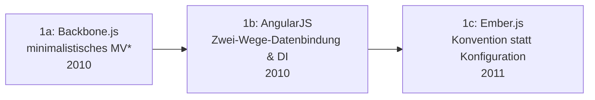

# Evolution und Architekturen digitaler SPA-Frameworks

Single-Page-Application-Frameworks bilden Generation 3 der [Evolution digitaler Web-Frameworks](evolution-digitaler-webframeworks.md). Diese eigenständige Zeitachse zoomt in genau diese Architekturlinie hinein: von den ersten vollwertigen MV*-Frameworks über React und das Virtual DOM, State-Management-Bibliotheken und Vues progressive Adaption bis zum kompletten Angular-2-Rewrite und der Build-Tooling-Reife, die SPA-Entwicklung erst praktikabel im großen Maßstab machte.

!!! note "Hinweis: Generationen überlappen sich"
    Die Zeiträume sind grobe Orientierung, keine scharfen Grenzen — Backbone.js (Generation 1) lief parallel zu React (Generation 2) noch jahrelang in bestehenden Projekten weiter. Entscheidend ist die **Architektur** (komponentenbasiertes Rendering, Zustandsverwaltung), nicht allein das Erscheinungsjahr.

---

## Generation 1: Frühe MV*-Frameworks im Browser, 2010 – 2011

Die Gründergeneration eint drei Prinzipien: **vollständiges clientseitiges Rendering** statt serverseitiger Templates, **Routing im Browser** statt Server-Redirects und ein **strukturiertes Architekturmuster** (MV*) statt loser jQuery-Skripte. Sie lässt sich in drei technologische Entwicklungsstufen unterteilen:

### 1a. Backbone.js — minimalistisches MV*, 2010

- **Architektur:** Models, Views und Collections als lose gekoppelte Bausteine, kein eigenes Templating — Entwickler kombinieren es meist mit Underscore.js/jQuery.
- **Fokus:** minimale Struktur statt eines vollständigen Frameworks — überlässt viele Entscheidungen dem Entwickler.

### 1b. AngularJS — Zwei-Wege-Datenbindung & Dependency Injection, 2010

- **Architektur:** HTML-Templates mit eigenen Direktiven, automatische Synchronisation zwischen Modell und Ansicht in beide Richtungen, eingebaute Dependency Injection.
- **Bedeutung:** prägte den Begriff „SPA" für eine breite Entwicklergemeinde.

### 1c. Ember.js — Konvention statt Konfiguration, 2011

- **Architektur:** überträgt Rails' „Convention over Configuration" auf das Frontend, eingebautes Routing und Datenschicht (Ember Data).
- **Fokus:** Vollausstattung für große Anwendungen statt minimaler Bausteine.

---

## Generation 2: React & das Virtual DOM, 2013

**React** (Facebook/Meta) führt einen fundamentalen Architekturbruch ein: eine im Speicher gehaltene Repräsentation des DOM, gegen die effizient „geplant" (diffed) wird, statt direkter Manipulation des echten DOM.

**Architektur:** Virtual DOM mit effizientem Diffing-Algorithmus, deklarative, komponentenbasierte UI-Beschreibung, **JSX** als Syntax-Erweiterung für HTML-artige Markup direkt im JavaScript-Code.

| Baustein | Rolle |
|---|---|
| **React Core** | Einführung des Komponentenmodells und Virtual DOM — bis heute dominant, siehe [Frontend-Frameworks mit KI](index.md#frontend-frameworks-mit-ki). |
| **Flux-Architektur** (2014) | Unidirektionaler Datenfluss (Action → Dispatcher → Store → View) als Antwort auf wachsende Zustandskomplexität. |

---

## Generation 3: State-Management-Bibliotheken, 2014 – 2015

Mit wachsender Anwendungsgröße wird die Verwaltung des globalen Zustands zum eigenständigen Architekturproblem — eigene Bibliotheken lösen es getrennt von der reinen UI-Rendering-Schicht.

| System | Jahr | Prinzip |
|---|---|---|
| **Flux** | 2014 | Facebooks ursprüngliches Architekturmuster, mehrere konkurrierende Implementierungen. |
| **Redux** | 2015 | Ein einziger, unveränderlicher Zustandsbaum, Änderungen ausschließlich über reine Reducer-Funktionen — setzt sich als De-facto-Standard durch. |

---

## Generation 4: Vue.js & progressive Adaption, 2014

**Vue.js** positioniert sich bewusst zwischen jQuery-Einfachheit und Angular-/React-Vollausstattung — einsetzbar als kleine Ergänzung einer bestehenden Seite oder als vollwertiges SPA-Framework.

| Baustein | Rolle |
|---|---|
| **Vue Core** | Reaktives Datenmodell mit deutlich niedrigerer Einstiegshürde als React/Angular. |
| **Single-File-Components** | Template, Skript und Styling in einer Datei — anders als Reacts reine JavaScript-/JSX-Komponenten. |

---

## Generation 5: Angular 2+ — kompletter Rewrite, 2016

Statt AngularJS schrittweise weiterzuentwickeln, ersetzt Google das gesamte Framework durch einen fundamentalen Neuanfang — vergleichbar mit dem späteren Drupal-7-zu-8-Bruch in der CMS-Welt.

**Architektur:** TypeScript-first statt reinem JavaScript, Komponenten statt `$scope`-basierter Controller, RxJS für reaktive Programmierung.

| Merkmal | AngularJS (1.x) | Angular (2+) |
|---|---|---|
| Sprache | JavaScript | TypeScript |
| Grundbaustein | Controller + `$scope` | Komponenten |
| Datenbindung | Zwei-Wege, digest-basiert | Unidirektional mit expliziten Events |

---

## Generation 6: Component-Ökosystem-Reife & Build-Tooling, 2014 – 2016

Erst mit ausgereiftem Build-Tooling wird SPA-Entwicklung im großen Maßstab praktikabel — Modul-Bundler und Compiler-Toolchains lösen das Problem wachsender Abhängigkeitsgraphen.

| System | Jahr | Rolle |
|---|---|---|
| **Webpack** | 2014 | Modul-Bundler, der JavaScript, CSS und Assets zu optimierten Produktions-Bundles zusammenführt. |
| **Babel** | 2014 | Transpiliert modernes JavaScript zu browserkompatiblem Code — Voraussetzung für JSX und neue ES6+-Syntax. |
| **Create React App** | 2016 | Bündelt Webpack/Babel-Konfiguration hinter einem einzigen Kommando — senkt die Einstiegshürde drastisch. |

!!! tip "Übergang zur nächsten Generation"
    Mit ausgereiftem Tooling und etabliertem State-Management stößt die reine Client-Rendering-Architektur an SEO- und Ladezeit-Grenzen — [Generation 4 der Web-Frameworks-Zeitachse](evolution-digitaler-webframeworks.md#generation-4-full-stack-javascript-meta-frameworks-ssrssg-hybrid-ca-2016-2022) beschreibt die Antwort darauf: Meta-Frameworks mit Server-Rendering.

---

## Alternative Sortier- & Klassifikationskriterien für SPA-Frameworks

### 1. Rendering-Mechanismus

- **Direkte DOM-Manipulation** — Backbone.js ohne eigene Rendering-Optimierung.
- **Virtual DOM mit Diffing** — React, frühes Vue (Generation 2, 4).
- **Dirty-Checking/Digest-Zyklus** — AngularJS-eigener Änderungserkennungsmechanismus.

### 2. Sprachbasis

- **Reines JavaScript** — Backbone.js, AngularJS, frühes React.
- **TypeScript-first** — Angular 2+.
- **Template-Sprache mit eingebettetem JS** — Vue Single-File-Components.

### 3. Zustandsverwaltung

- **Framework-eigen** — Ember Data, Angular Services.
- **Externe, entkoppelte Bibliothek** — Redux, unabhängig vom Rendering-Framework nutzbar.

---

## Verwandte Themen

- [Evolution und Architekturen digitaler Web-Frameworks](evolution-digitaler-webframeworks.md) — übergeordnetes Generationenmodell, Generation 3 dort entspricht diesem Artikel im Ganzen
- [Evolution und Architekturen digitaler Ajax- & JavaScript-Bibliotheken](evolution-digitaler-ajax-js-bibliotheken.md) — vorausgehende Generation, aus der Backbone.js/AngularJS hervorgingen
- [Frontend mit KI](frontend-ki.md) — Vertiefung Frontend-Frameworks mit KI-Unterstützung
- [Webentwicklung & KI: Übersicht](index.md) — Gesamtübersicht KI-Tools je Entwicklungsbereich
