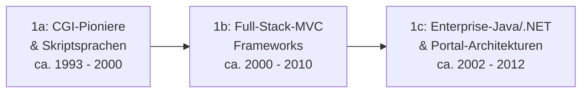

# Evolution und Architekturen digitaler Web-Frameworks

Web-Frameworks lassen sich — analog zu den Generationenmodellen für [Wissenssysteme](../../wissen/dokumentation/evolution-digitaler-wissenssysteme.md), [Content-Management-Systeme](../../wissen/dokumentation/evolution-digitaler-cms.md) und [Lernmanagement-Systeme](../../wissen/e-learning/evolution-digitaler-lms.md) — nach **technologischen Generationen** ordnen: von zustandslosen CGI-Skripten über serverseitige MVC-Frameworks und die Ajax-Ära bis zu Single-Page-Applications, Full-Stack-Meta-Frameworks, Server-Components/Islands-Architekturen und schließlich KI-nativen, generativen Web-Frameworks. Die praktische KI-Integration in den einzelnen Schichten (HTML/CSS, JavaScript, Backend/APIs, CMS) behandelt [Websites entwickeln mit KI](ki-webentwicklung.md), konkrete Framework-Tools die [Webentwicklung & KI: Übersicht](index.md#frontend-frameworks-mit-ki).

!!! note "Hinweis: Generationen überlappen sich"
    Die Zeiträume sind grobe Orientierung, keine scharfen Grenzen — Express.js (Generation 2/3) wird bis heute produktiv als API-Backend hinter modernen SPA- und Meta-Frameworks eingesetzt. Entscheidend ist die **Architektur** (wo wird gerendert, wie viel JavaScript erreicht den Client), nicht allein das Erscheinungsjahr.

---

## Generation 1: Serverseitige, monolithische Web-Frameworks — CGI, MVC, Templates

Die erste Generation eint drei Prinzipien: **serverseitige Verarbeitung** jeder Anfrage, **Templates** zur Ausgabe von HTML und ein wachsender Grad an **struktureller Konvention** statt roher Skripte. Sie lässt sich in drei technologische Entwicklungsstufen unterteilen — eine tiefergehende Betrachtung dieser Architekturlinie bis zum heutigen Hypermedia-Comeback bietet [Evolution und Architekturen digitaler Server-Monolith-Frameworks](evolution-digitaler-monolith-frameworks.md):

### 1a. CGI-Pioniere & Skriptsprachen, ca. 1993 – 2000

- **Architektur:** Common Gateway Interface (CGI) — für jede Anfrage startet der Webserver einen eigenen Skript-Prozess (Perl, C), zustandslos, keine Wiederverwendung des Prozessspeichers.
- **Fokus:** dynamische Seitengenerierung aus Formulardaten, noch keine Trennung von Logik, Struktur und Ausgabe.
- **Vertreter:** NCSA-CGI-Skripte, Perl `CGI.pm`, **PHP/FI** (1995, Rasmus Lerdorf — direkter Vorläufer der späteren PHP-Sprache).

### 1b. Full-Stack-MVC-Frameworks, ca. 2000 – 2010

- **Architektur:** serverseitiges **Model-View-Controller (MVC)**-Muster, integrierter Object-Relational Mapper (ORM), Templating-Engines statt eingebettetem HTML im Code.
- **Fokus:** „Konvention über Konfiguration" (Convention over Configuration), Rapid-Prototyping, eingebaute Datenbank-Migrationen.

| System | Sprache/Stack | Besonderheit |
|---|---|---|
| **Ruby on Rails** (2004) | Ruby | Prägte „Convention over Configuration" für eine ganze Framework-Generation. |
| **Django** (2005) | Python | „Batteries included" — Admin-Oberfläche, ORM und Auth direkt im Kern. |
| **Symfony** (2005) | PHP | Komponentenbasiertes Framework, später Basis vieler anderer PHP-Projekte (u. a. Teile von Drupal). |
| **Struts** (2000) | Java | Frühes Java-MVC-Framework, Vorläufer der Enterprise-Stufe 1c. |

### 1c. Enterprise-Java/.NET-Frameworks & Portal-Architekturen, ca. 2002 – 2012

- **Architektur:** Java EE (Servlets/JSP) bzw. .NET (ASP.NET Web Forms), Dependency Injection, Application-Server-Cluster, stateful serverseitige Sessions.
- **Fokus:** Enterprise-Integration (SOAP, JMS), Komponentenwiederverwendung, tiefgreifende Rechtekonzepte für große Organisationen.
- **Vertreter:** **Spring Framework** (2003, bis heute dominant im Java-Enterprise-Umfeld), **JavaServer Faces (JSF)**, **ASP.NET Web Forms** (2002, Microsoft).

---

## Generation 2: Ajax-Ära & JavaScript-Bibliotheken, ca. 2005 – 2012

Der Server bleibt weiterhin MVC-basiert und liefert vollständiges HTML aus — neu ist die **asynchrone Nachladefähigkeit** einzelner Seitenfragmente über `XMLHttpRequest`, ohne vollständigen Seiten-Reload. Eine eigene, tiefergehende Generationen-Zeitachse speziell für diese Architekturlinie bietet [Evolution und Architekturen digitaler Ajax- & JavaScript-Bibliotheken](evolution-digitaler-ajax-js-bibliotheken.md).

**Architektur:** DOM-Manipulation im Browser über JavaScript-Bibliotheken, Server-Backend unverändert aus Generation 1b/1c.

| System | Prinzip |
|---|---|
| **jQuery** (2006) | Vereinheitlichte DOM-Manipulation und Ajax-Aufrufe browserübergreifend, jahrelang meistgenutzte JS-Bibliothek weltweit. |
| **Prototype.js** | Frühe Alternative zu jQuery mit ähnlichem Fokus auf DOM- und Ajax-Hilfsfunktionen. |
| **Google Web Toolkit (GWT)** | Kompilierte Java-zu-JavaScript-Ansatz für komplexe Ajax-Anwendungen ohne direktes JS-Schreiben. |

---

## Generation 3: Single-Page-Application-Frameworks (SPA), ca. 2010 – 2016

Das Rendering wandert vollständig in den Browser: Das Backend wird zur reinen **JSON-API**, das Frontend übernimmt Routing, Zustandsverwaltung und komponentenbasiertes UI-Rendering. Eine eigene, tiefergehende Generationen-Zeitachse speziell für diese Architekturlinie bietet [Evolution und Architekturen digitaler SPA-Frameworks](evolution-digitaler-spa-frameworks.md).

**Architektur:** komponentenbasierte UIs, clientseitiges Routing, REST-APIs als Backend-Schnittstelle statt serverseitig gerenderter Templates.

| System | Prinzip |
|---|---|
| **AngularJS** (2010, Google) | Zwei-Wege-Datenbindung und Dependency Injection direkt im Browser — prägte den Begriff „SPA" für eine breite Entwicklergemeinde. |
| **Backbone.js** (2010) | Minimalistisches MV*-Muster für den Browser, oft mit jQuery kombiniert. |
| **Ember.js** (2011) | „Konvention über Konfiguration" (analog zu Rails) übertragen auf Frontend-Frameworks. |
| **React** (2013, Facebook/Meta) | Einführung des Virtual DOM und deklarativer, komponentenbasierter UIs — bis heute dominant, siehe [Frontend-Frameworks mit KI](index.md#frontend-frameworks-mit-ki). |
| **Vue.js** (2014) | Progressive Adaption — einsetzbar als kleine Bibliothek oder vollwertiges SPA-Framework. |

---

## Generation 4: Full-Stack-JavaScript & Meta-Frameworks (SSR/SSG-Hybrid), ca. 2016 – 2022

SPAs verlieren serverseitig gerenderten Content und damit SEO-Fähigkeit. Die Antwort: **Meta-Frameworks**, die Server-Side Rendering (SSR) und Static Site Generation (SSG) auf Basis derselben SPA-Bibliotheken zurückbringen — mit Node.js als einheitlicher Runtime für Frontend und Backend im selben Projekt. Eine eigene, tiefergehende Generationen-Zeitachse speziell für diese Architekturlinie bietet [Evolution und Architekturen digitaler Full-Stack-Meta-Frameworks](evolution-digitaler-meta-frameworks.md).

**Architektur:** File-based Routing, API-Routes im selben Projekt, Hydration (serverseitig gerendertes HTML wird im Browser um Interaktivität ergänzt).

| System | Basis | Rendering-Strategie |
|---|---|---|
| **Next.js** (2016, Vercel) | React | SSR, SSG, später ISR (Incremental Static Regeneration). |
| **Nuxt.js** (2016) | Vue | Analoges Konzept zu Next.js für das Vue-Ökosystem. |
| **Gatsby** (2015) | React | Primär SSG, GraphQL-Datenlayer zur Zusammenführung mehrerer Content-Quellen (siehe [Gatsby in der CMS-Generation 1](../../wissen/dokumentation/evolution-digitaler-cms.md#generation-1-klassische-monolithische-cms-datenbank-templates-serverseitiges-rendering)-nahes Headless-Frontend-Pairing). |
| **SvelteKit** (2020) | Svelte | Compiler-basiertes Framework ohne Virtual DOM, siehe Reaktivitätsmodell unten. |
| **Remix** (2021) | React | Fokus auf Web-Standards (Fetch, Formulare) statt Framework-eigener Abstraktionen. |

---

## Generation 5: Server Components, Edge & Islands-Architektur, ab ca. 2022

Statt eine ganze Seite zu hydratisieren, rendert diese Generation nur die tatsächlich interaktiven Fragmente im Browser — der Rest bleibt reines, serverseitig erzeugtes HTML. Rendering wandert zusätzlich an den **Edge**, näher an den Nutzer statt in ein zentrales Rechenzentrum. Eine eigene, tiefergehende Generationen-Zeitachse speziell für diese Architekturlinie bietet [Evolution und Architekturen digitaler Islands- & Edge-Architekturen](evolution-digitaler-islands-edge-architektur.md).

**Architektur:** React Server Components (RSC) ohne Client-JavaScript für nicht-interaktive Teile, Islands-Architektur (nur einzelne „Inseln" werden hydratisiert), Streaming-SSR, Edge-Runtimes statt monolithischem Node-Server.

| System | Prinzip |
|---|---|
| **Next.js App Router** (React Server Components) | Server- und Client-Komponenten explizit getrennt, Streaming statt vollständigem Warten auf die gesamte Seite. |
| **Astro** (2021) | Islands-Architektur von Grund auf — standardmäßig null JavaScript, Interaktivität nur gezielt pro Komponente zugeschaltet. |
| **Qwik** (2021) | „Resumability" statt Hydration: der Browser führt gespeicherten Ausführungszustand fort, statt die App erneut zu initialisieren. |
| **SolidStart, Deno Fresh** | Feingranulare Reaktivität (Signals) bzw. Islands-Architektur auf Deno-Basis statt Node.js. |

---

## Generation 6: KI-native & agentengestützte Web-Frameworks, ab ca. 2024

Generative KI wandert vom externen Code-Assistenten (siehe [Der KI-gestützte Entwicklungsworkflow](ki-webentwicklung.md#21-konzept-der-ki-gestutzte-entwicklungsworkflow)) direkt in den Framework-Kern: UI-Komponenten werden aus natürlicher Sprache generiert, KI-Streaming-Antworten sind eingebaute Primitive statt selbst gebauter Wrapper um eine LLM-API. Eine eigene, tiefergehende Generationen-Zeitachse speziell für diese Architekturlinie bietet [Evolution und Architekturen digitaler KI-nativer Web-Frameworks](evolution-digitaler-ki-native-webframeworks.md).

| System | Prinzip |
|---|---|
| **v0.dev** (Vercel) | Generiert vollständige React/Next.js-Komponenten aus Textbeschreibungen oder Screenshots. |
| **Vercel AI SDK** | Framework-eigene Primitive für Streaming-Antworten, Tool-Calling und generative UI direkt in React/Next.js-Komponenten. |
| **Terminal- und Editor-native Workflows** (Aider + Ollama, Continue.dev) | Statt eines eigenen Frontend-Frameworks wird jedes bestehende Framework (Vanilla JS bis Next.js) per lokalem LLM erweitert, siehe [Software – Open Source zuerst](ki-webentwicklung.md#13-thema-entwicklungsumgebung-mit-ki-aufsetzen). |

!!! warning "Achtung: Vibe Coding ersetzt kein Architekturverständnis"
    Wie in [Vibe Coding – was steckt dahinter?](ki-webentwicklung.md#21-konzept-der-ki-gestutzte-entwicklungsworkflow) beschrieben, senkt generative UI-Erstellung die Einstiegshürde, erzeugt aber ohne Codeverständnis leicht technische Schulden und unbemerkte Sicherheitslücken — das gilt für Generation-6-Frameworks genauso wie für klassisches Copy-Paste-Prompting.

---

## Alternative Sortier- & Klassifikationskriterien für Web-Frameworks

Neben dem chronologischen/technologischen Generationenmodell lassen sich Web-Frameworks nach folgenden Dimensionen einordnen:

### 1. Rendering-Strategie

- **CSR (Client-Side Rendering)** — vollständiges Rendering im Browser, klassische SPA (AngularJS, frühes React).
- **SSR (Server-Side Rendering)** — HTML wird pro Anfrage auf dem Server erzeugt (Next.js, Nuxt, Remix).
- **SSG (Static Site Generation)** — HTML wird einmalig beim Build erzeugt (Gatsby, Astro, Hugo).
- **Hybrid (Islands/RSC)** — feingranulare Mischung aus statischem HTML und gezielt hydratisierten Inseln (Astro, Next.js App Router, Qwik).

### 2. Backend-Sprache/Runtime

- **PHP** — Symfony, Laravel.
- **Python** — Django, FastAPI (siehe [Backend & APIs mit KI entwickeln](ki-webentwicklung.md#24-thema-backend-apis-mit-ki-entwickeln)).
- **Ruby** — Ruby on Rails.
- **Java/.NET** — Spring, ASP.NET.
- **Node.js/Deno/Bun** — Express.js, Next.js, SvelteKit, Deno Fresh.

### 3. Architektur-Philosophie

- **Monolithisch** — Backend und Rendering in einem System (Django, Rails).
- **Headless/API-first** — getrenntes JSON-API-Backend und SPA-Frontend (Express + React).
- **Meta-Framework** — Frontend-Bibliothek plus eingebautem Server-Rendering und Routing (Next.js, Nuxt, SvelteKit).
- **Micro-Frontend** — mehrere unabhängig deploybare Frontend-Module in einer Anwendung.

### 4. Reaktivitätsmodell

- **Virtual DOM** — Diffing eines im Speicher gehaltenen Baums (React, Vue 2).
- **Fine-grained Reactivity/Signals** — gezielte Aktualisierung einzelner DOM-Knoten ohne Virtual-DOM-Diffing (Solid, Vue 3, Svelte 5).
- **Compiler-basiert** — Reaktivität wird beim Build in reines JavaScript übersetzt statt zur Laufzeit interpretiert (Svelte).
- **Resumability** — Ausführungszustand wird serialisiert und im Browser fortgesetzt statt neu initialisiert (Qwik).

---

## Verwandte Themen

- [Webentwicklung & KI: Übersicht](index.md) — Gesamtübersicht KI-Tools je Entwicklungsbereich
- [Websites entwickeln mit KI](ki-webentwicklung.md) — praktischer Lernpfad HTML/CSS bis Deployment mit KI (2026)
- [Evolution und Architekturen digitaler Server-Monolith-Frameworks](evolution-digitaler-monolith-frameworks.md) — vertiefendes Generationenmodell speziell für Generation 1 dieses Artikels
- [Evolution und Architekturen digitaler Ajax- & JavaScript-Bibliotheken](evolution-digitaler-ajax-js-bibliotheken.md) — vertiefendes Generationenmodell speziell für Generation 2 dieses Artikels
- [Evolution und Architekturen digitaler SPA-Frameworks](evolution-digitaler-spa-frameworks.md) — vertiefendes Generationenmodell speziell für Generation 3 dieses Artikels
- [Evolution und Architekturen digitaler Full-Stack-Meta-Frameworks](evolution-digitaler-meta-frameworks.md) — vertiefendes Generationenmodell speziell für Generation 4 dieses Artikels
- [Evolution und Architekturen digitaler Islands- & Edge-Architekturen](evolution-digitaler-islands-edge-architektur.md) — vertiefendes Generationenmodell speziell für Generation 5 dieses Artikels
- [Evolution und Architekturen digitaler KI-nativer Web-Frameworks](evolution-digitaler-ki-native-webframeworks.md) — vertiefendes Generationenmodell speziell für Generation 6 dieses Artikels
- [Evolution und Architekturen digitaler Rust-Webframeworks](evolution-digitaler-rust-webframeworks.md) — vertiefendes, Rust-spezifisches Generationenmodell
- [Evolution und Architekturen digitaler Wissenssysteme](../../wissen/dokumentation/evolution-digitaler-wissenssysteme.md) — analoges Generationenmodell für Wikis & PKM-Systeme
- [Evolution und Architekturen digitaler Content-Management-Systeme](../../wissen/dokumentation/evolution-digitaler-cms.md) — analoges Generationenmodell für CMS, direkte Schnittmenge bei Headless-Frontends
- [Evolution und Architekturen digitaler LMS](../../wissen/e-learning/evolution-digitaler-lms.md) — analoges Generationenmodell für Lernmanagement-Systeme
- [Evolution und Architekturen digitaler KI-Anwendungen](../../künstliche-intelligenz/evolution-digitaler-ki-anwendungen.md) — analoges Generationenmodell für KI-Anwendungen
- [Frontend mit KI](frontend-ki.md) — Vertiefung Frontend-Frameworks mit KI-Unterstützung
- [Backend-Integration mit KI](backend-integration.md) — Vertiefung Backend-Frameworks mit KI-Unterstützung
