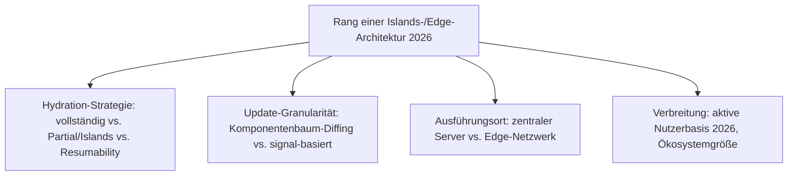
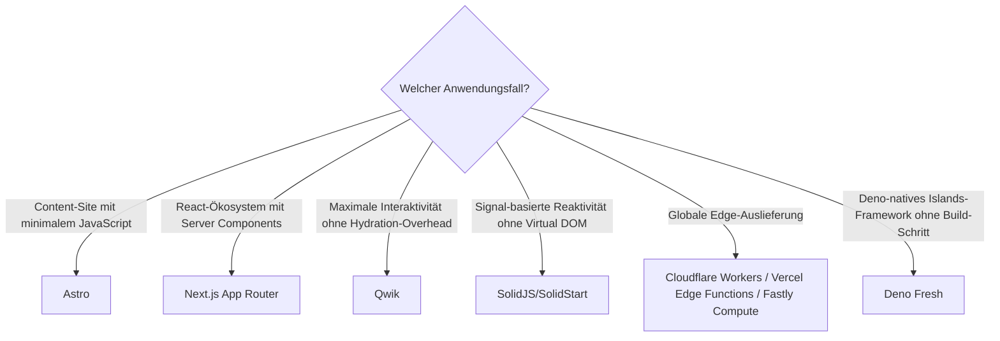

# Beste Islands- & Edge-Architekturen 2026 — Top-15-Topliste

Die [Evolution und Architekturen digitaler Islands- & Edge-Architekturen](evolution-digitaler-islands-edge-architektur.md) ordnet diese Kategorie chronologisch nach Architektur-Generation — von der Hydration-Kritik über den React-Server-Components-RFC, Qwiks Resumability-Konzept und signal-basierte Reaktivität bis zu Edge-Runtimes und Islands-Frameworks auf alternativen JavaScript-Laufzeiten. Diese Seite übersetzt die Chronologie in eine **Momentaufnahme 2026**: 15 Systeme, die heute tatsächlich betrieben werden.

!!! note "Hinweis: die jüngste, technisch heterogenste Generation der Web-Frameworks-Zeitachse"
    Anders als bei SPA- oder Meta-Frameworks mischt diese Liste bewusst UI-Frameworks (Astro, Qwik), Reaktivitätsmodelle (Signals) und Infrastruktur (Edge-Runtimes) — alle eint nur das Ziel, so wenig JavaScript wie möglich tatsächlich an den Client zu senden.

---

## Bewertungskriterien

---

## Top 15 im Überblick

| Rang | System | Generation | Besondere Stärke |
|---|---|---|---|
| 1 | **Astro** | 1c (Astro kündigt Islands-Architektur an) | Systematisiert das Prinzip als „Islands-Architektur" — standardmäßig null JavaScript |
| 2 | **Next.js App Router** (React Server Components) | 2 (React Server Components — RFC & Implementierung) | Erste breit produktive RSC-Implementierung, Streaming statt vollständigem Warten |
| 3 | **Cloudflare Workers** | 5 (Edge-Runtimes statt zentralem Server) | Größtes Edge-Netzwerk dieser Liste, breite Web-Framework-Adaption seit 2021 |
| 4 | **Qwik** | 3 (Resumability statt Hydration) | Browser führt gespeicherten Ausführungszustand fort statt die App erneut zu initialisieren |
| 5 | **SolidJS/SolidStart** | 4 (Signal-basierte feingranulare Reaktivität) | Signals als Grundprimitiv, kein Virtual DOM, feingranulare Updates auf DOM-Ebene |
| 6 | **Vercel Edge Functions** | 5 (Edge-Runtimes statt zentralem Server) | Direkt in Next.js integriert, größte Verbreitung im React-Ökosystem |
| 7 | **Svelte 5 Runes** | 4 (Signal-basierte feingranulare Reaktivität) | Führt explizite Signal-artige Primitive in Sveltes Compiler-Modell ein |
| 8 | **Vue 3 Reactivity** | 4 (Signal-basierte feingranulare Reaktivität) | Proxy-basiertes reaktives System als interne Grundlage, auch ohne Signal-Terminologie |
| 9 | **Deno Deploy** | 5 (Edge-Runtimes statt zentralem Server) | Edge-Hosting nativ für Deno-basierte Anwendungen |
| 10 | **Deno Fresh** | 6 (Islands auf alternativen Runtimes) | Islands-Architektur nativ auf Deno, kein Build-Schritt nötig |
| 11 | **React Server Components** (RFC-Grundprinzip) | 2 (React Server Components — RFC & Implementierung) | Formalisiert das Konzept getrennter Server-/Client-Komponenten innerhalb von React selbst |
| 12 | **Marko** | Ergänzung 2026 | eBay-entwickeltes Islands-Framework mit feingranularer Partial-Hydration seit vor Astro |
| 13 | **Fastly Compute** | Ergänzung 2026 (Edge-Runtime) | Rust/WASM-basierte Edge-Plattform, Alternative zu Cloudflare Workers für latenzkritische Anwendungen |
| 14 | **Preact Signals** | Ergänzung 2026 | Leichtgewichtige Signal-Implementierung, zunehmend framework-übergreifend eingesetzt |
| 15 | **Qwik City** | Ergänzung 2026 (Qwik-Meta-Framework-Ausbau) | Meta-Framework-Schicht über Qwik mit File-based Routing und Resumability-Vererbung |

---

## Highlights im Detail

### Rang 1, 4: zwei fundamental unterschiedliche Antworten auf dasselbe Hydration-Problem
Astro (Partial Hydration/Islands) und Qwik (Resumability) lösen das in [Generation 1](evolution-digitaler-islands-edge-architektur.md#generation-1-die-hydration-kritik-erste-partial-hydration-ideen-2019-2021) beschriebene Problem — unnötige JavaScript-Ausführung für nicht-interaktive Inhalte — mit zwei radikal verschiedenen Architekturen: gezielte Hydration einzelner Komponenten versus vollständiger Verzicht auf einen klassischen Hydration-Schritt.

### Rang 3, 6, 9, 13: Rendering wandert an den Edge
Cloudflare Workers, Vercel Edge Functions, Deno Deploy und Fastly Compute verlagern Ausführung geografisch näher an den Nutzer statt in ein zentrales Rechenzentrum, siehe [Generation 5](evolution-digitaler-islands-edge-architektur.md#generation-5-edge-runtimes-statt-zentralem-server-2021-2022) — dieselbe WASM-nahe Infrastruktur wie [Generation 3 der Rust-CMS-Zeitachse](../../wissen/dokumentation/evolution-digitaler-rust-cms.md#generation-3-wasm-edge-laufzeiten-fur-composable-mach-commerce-2019-2022).

### Rang 5, 7–8, 14: Signal-basierte Reaktivität setzt sich framework-übergreifend durch
SolidJS, Svelte 5 Runes, Vue 3 Reactivity und Preact Signals zeigen, dass feingranulare, signal-basierte Updates 2026 kein Nischenkonzept mehr sind, sondern in praktisch jedem großen Frontend-Ökosystem eine eigene Implementierung erhalten haben.

---

## Entscheidungshilfe nach Anwendungsfall

!!! tip "Tipp: klassische Meta-Framework-Perspektive separat prüfen"
    Für vollständige SSR-/SSG-Hybrid-Meta-Frameworks ohne feingranulare Fragment-Hydration siehe [Beste Full-Stack-Meta-Frameworks 2026](meta-frameworks-2026-topliste.md).

---

## 🔗 Verwandte Themen

- [Startseite](../../index.md) — zurück zur Dokumentations-Zentrale
- [Evolution und Architekturen digitaler Islands- & Edge-Architekturen](evolution-digitaler-islands-edge-architektur.md) — chronologisches Generationenmodell, dessen aktuellen Stand diese Topliste zusammenfasst
- [Beste Web-Frameworks 2026 (Top 20)](webframeworks-2026-topliste.md) — Gesamtmarkt-Topliste über alle Generationen hinweg
- [Beste Full-Stack-Meta-Frameworks 2026 (Top 15)](meta-frameworks-2026-topliste.md) — vorausgehende Generation
- [Beste KI-native Web-Frameworks 2026 (Top 20)](ki-native-webframeworks-2026-topliste.md) — nachfolgende Generation
- [Beste Rust-Bausteine für CMS 2026 (Top 15)](../../wissen/dokumentation/rust-cms-2026-topliste.md) — Wasmtime/WASM-Tooling dort im Composable-Commerce-Kontext, dieselbe Edge-Infrastruktur
