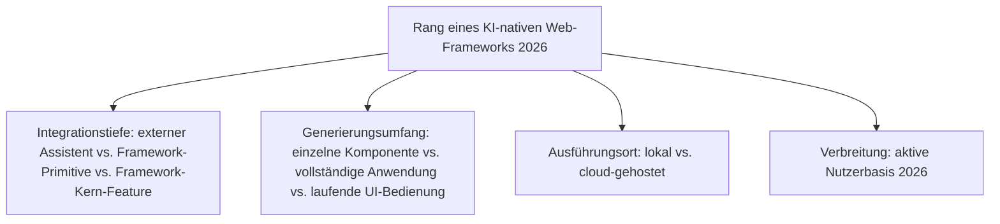
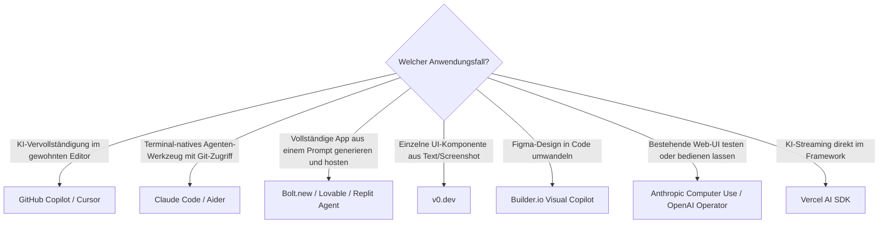

# Beste KI-native Web-Frameworks 2026 — Top-20-Topliste

Die [Evolution und Architekturen digitaler KI-nativer Web-Frameworks](evolution-digitaler-ki-native-webframeworks.md) beschreibt die jüngste, noch unreife Web-Framework-Generation — vom externen Code-Assistenten über Text-zu-UI-Generatoren, terminal-native LLM-Erweiterungen und vollständige App-Generatoren bis zu agentischer Browsersteuerung und Framework-Kernen mit eingebauten Agenten-Primitiven. Diese Seite übersetzt die Chronologie in eine **Momentaufnahme 2026**: 20 real am Markt verfügbare Werkzeuge, die mindestens einen agentischen Baustein dieser Zeitachse umsetzen.

!!! warning "Achtung: Reifegrad variiert stark zwischen den Rängen dieser Liste"
    Wie bei den agentischen Generationen der CMS-, Wissenssysteme-, Notebook- und LMS-Zeitachsen existieren für die spätesten Stufen dieser Zeitachse noch wenige vollständig ausgereifte, breit dokumentierte Referenzsysteme. **Stand: August 2026.**

---

## Bewertungskriterien

---

## Top 20 im Überblick

| Rang | System | Anbieter | Generation | Besondere Stärke |
|---|---|---|---|---|
| 1 | **GitHub Copilot** | Microsoft | 1a (Von externen Code-Assistenten...) | Breiteste Verbreitung unter den KI-Coding-Assistenten überhaupt |
| 2 | **Cursor** | Anysphere | Ergänzung 2026 | KI-native Code-Editor-Fortsetzung derselben Architekturlinie, größte Adoption unter den KI-IDEs |
| 3 | **Vercel AI SDK** | Vercel | 1c/6 (Streaming als Framework-Primitive) | Framework-eigene Primitive für Streaming, Tool-Calling und generative UI direkt in React/Next.js |
| 4 | **v0.dev** | Vercel | 2 (Text-zu-UI-Generatoren) | Generiert vollständige React/Next.js-Komponenten aus Textbeschreibungen oder Screenshots |
| 5 | **Claude Code** | Anthropic | Ergänzung 2026 | Terminal-natives Agenten-Werkzeug mit Datei-, Build- und Git-Zugriff, auch der Stack hinter diesem Repository |
| 6 | **Bolt.new** | StackBlitz | 2/4 (Text-zu-UI-Generatoren / Full-Stack-App-Generatoren) | Generiert und führt vollständige Web-Anwendungen direkt im Browser aus, ohne lokale Entwicklungsumgebung |
| 7 | **Lovable** | Lovable | 4 (KI-gestützte Full-Stack-App-Generatoren) | Generiert komplette Web-Anwendungen mit Datenbank-Anbindung aus natürlichsprachigen Anforderungen |
| 8 | **Replit Agent** | Replit | 4 (KI-gestützte Full-Stack-App-Generatoren) | Kombiniert App-Generierung mit sofortigem Hosting in derselben Umgebung |
| 9 | **Windsurf** | Codeium | Ergänzung 2026 | Agentisches IDE mit mehrstufiger, selbstständiger Aufgabenausführung über mehrere Dateien hinweg |
| 10 | **Continue.dev** | Continue | 3 (Terminal-/editor-native KI-Erweiterung) | Editor-Erweiterung, bindet beliebige LLMs (lokal oder Cloud) in den Entwicklungsworkflow ein |
| 11 | **Aider + Ollama** | Aider-Community | 3 (Terminal-/editor-native KI-Erweiterung) | Terminal-natives Werkzeug, lokales LLM erzeugt direkt Git-Commits aus Änderungen |
| 12 | **Cline** | Cline | Ergänzung 2026 | Open-Source-Agent als VS-Code-Erweiterung mit autonomem Datei- und Terminalzugriff |
| 13 | **Anthropic Computer Use** | Anthropic | 5 (Agentische Browser-/Computer-Use-Steuerung) | Analysiert Screenshots und steuert Maus/Tastatur direkt — testet und bedient Web-UIs wie ein Mensch |
| 14 | **OpenAI Operator** | OpenAI | 5 (Agentische Browser-/Computer-Use-Steuerung) | Browsergesteuerter Agent für webbasierte Mehrschrittaufgaben |
| 15 | **Agent Client Protocol (ACP)** | Zed/Community | 6 (Framework-Kerne mit eingebauten Agenten-Primitiven) | Standardisierte Schnittstelle zwischen Agenten und Editor-/Framework-Umgebungen |
| 16 | **GitHub Copilot Workspace** | Microsoft | Ergänzung 2026 | Wandelt eine Aufgabenbeschreibung in einen vollständigen, überprüfbaren Änderungsplan samt PR |
| 17 | **Devin** | Cognition | Ergänzung 2026 | Autonomer „KI-Software-Ingenieur", plant und implementiert mehrstufige Web-Entwicklungsaufgaben selbstständig |
| 18 | **Builder.io Visual Copilot** | Builder.io | Ergänzung 2026 | Wandelt Figma-Designs direkt in produktionsreifen Framework-Code (React, Vue, Svelte) um |
| 19 | **Framer AI** | Framer | Ergänzung 2026 | Generiert vollständige, produktionsreife Marketing-Websites aus Textbeschreibungen |
| 20 | **tldraw „make real"** | tldraw | Ergänzung 2026 | Wandelt handgezeichnete UI-Skizzen direkt in lauffähigen HTML/CSS-Code um |

---

## Highlights im Detail

### Rang 1–2, 5, 9–12: die IDE-/Editor-native Ebene dominiert die Liste
GitHub Copilot, Cursor, Claude Code, Windsurf, Continue.dev, Aider und Cline zeigen, dass der Großteil der real genutzten KI-nativen Web-Entwicklung 2026 nicht im Framework selbst, sondern im Editor/Terminal stattfindet — dieselbe Integrationstiefen-Unterscheidung wie in [Generation 1 und 3](evolution-digitaler-ki-native-webframeworks.md#generation-1-von-externen-code-assistenten-zu-eingebetteten-ui-primitiven-2021-2023).

### Rang 4, 6–8, 16–19: die Text-zu-App-Generatoren-Welle
v0.dev, Bolt.new, Lovable, Replit Agent, GitHub Copilot Workspace, Builder.io Visual Copilot und Framer AI decken zusammen das gesamte Spektrum von „einzelne Komponente" bis „vollständige, gehostete Anwendung" ab, siehe [Generation 2 und 4](evolution-digitaler-ki-native-webframeworks.md#generation-4-ki-gestutzte-full-stack-app-generatoren-2024).

### Rang 13–14, 17: agentische Steuerung bestehender und generierter UIs
Anthropic Computer Use, OpenAI Operator und Devin gehen über reine Code-Generierung hinaus — sie bedienen und testen Web-Oberflächen wie ein Mensch oder planen mehrstufige Entwicklungsaufgaben selbstständig, siehe [Generation 5](evolution-digitaler-ki-native-webframeworks.md#generation-5-agentische-browser-computer-use-steuerung-fur-web-uis-ab-2024).

---

## Entscheidungshilfe nach Anwendungsfall

!!! tip "Tipp: allgemeine Agenten-CLI-/IDE-Perspektive separat prüfen"
    Diese Liste fokussiert speziell auf Web-Framework-nahe Werkzeuge — den breiteren Markt an KI-Agent-CLIs und -IDEs jenseits der Webentwicklung ranken [Beste KI-Agent-CLIs](../../künstliche-intelligenz/coding/ki-agent-cli-topliste.md) und [Beste KI-Agent-IDEs](../../künstliche-intelligenz/coding/ki-agent-ide-topliste.md).

---

## 🔗 Verwandte Themen

- [Startseite](../../index.md) — zurück zur Dokumentations-Zentrale
- [Evolution und Architekturen digitaler KI-nativer Web-Frameworks](evolution-digitaler-ki-native-webframeworks.md) — chronologisches Generationenmodell, dessen aktuellen Stand diese Topliste zusammenfasst
- [Beste Web-Frameworks 2026 (Top 20)](webframeworks-2026-topliste.md) — Gesamtmarkt-Topliste über alle Generationen hinweg
- [Beste Islands- & Edge-Architekturen 2026 (Top 15)](islands-edge-architektur-2026-topliste.md) — vorausgehende Generation
- [Beste KI-agentischen Notebook-Umgebungen 2026 (Top 20)](../../wissen/dokumentation/ki-native-notebooks-2026-topliste.md) — analoge, ähnlich junge Agenten-Generation für Notebooks statt Web-Frameworks
- [Beste agentische Tutor-Ökosysteme 2026 (Top 15)](../../wissen/e-learning/agentische-tutor-oekosysteme-2026-topliste.md) — analoge junge Agenten-Generation für LMS
- [Beste KI-Agent-CLIs (Top 20)](../../künstliche-intelligenz/coding/ki-agent-cli-topliste.md) — breiterer Markt jenseits der Webentwicklung
