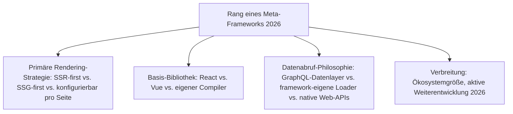
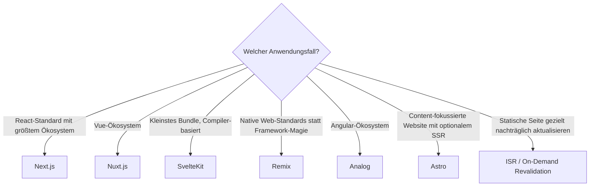

# Beste Full-Stack-Meta-Frameworks 2026 — Top-15-Topliste

Die [Evolution und Architekturen digitaler Full-Stack-Meta-Frameworks](evolution-digitaler-meta-frameworks.md) ordnet diese Kategorie chronologisch nach Architektur-Generation — von der SEO-Krise reiner SPAs über die ersten SSR-Lösungen und Next.js als Referenzimplementierung bis zu GraphQL-gestützter SSG, dem Vue-Pendant Nuxt.js, compiler-basierten Ansätzen und feingranularer Rendering-Strategie-Wahl pro Seite. Diese Seite übersetzt die Chronologie in eine **Momentaufnahme 2026**: 15 Frameworks, die heute tatsächlich betrieben werden.

!!! note "Hinweis: Abgrenzung zu Islands-/Edge-Architekturen"
    Diese Liste bleibt auf klassische SSR-/SSG-Hybrid-Meta-Frameworks beschränkt — die feingranulare Fragment-Hydration jenseits ganzer Seiten behandelt [Beste Islands- & Edge-Architekturen 2026](islands-edge-architektur-2026-topliste.md).

---

## Bewertungskriterien

---

## Top 15 im Überblick

| Rang | Framework | Generation | Basis | Besondere Stärke |
|---|---|---|---|---|
| 1 | **Next.js** | 1c (Next.js — das erste vollwertige Meta-Framework) | React | Referenzarchitektur, an der sich alle folgenden Meta-Frameworks messen |
| 2 | **Nuxt.js** | 3 (Vue-Ökosystem zieht nach) | Vue | Analoges Konzept zu Next.js für das Vue-Ökosystem, ausgereiftes Modul-Ökosystem |
| 3 | **SvelteKit** | 4 (Compiler-basierte Frameworks ohne Virtual DOM) | Svelte | Meta-Framework-Ausbau von Svelte, SSR/SSG auf Compiler-Basis ohne Laufzeit-Overhead |
| 4 | **Remix** | 5 (Web-Standards statt Framework-Abstraktionen) | React | Nutzt native Web-APIs (Fetch, Formulare) statt proprietärer Framework-Konzepte |
| 5 | **TanStack Start** | Ergänzung 2026 | React | Meta-Framework auf Basis von TanStack Router/Query, typsicher vom Routing bis zum Datenabruf |
| 6 | **Gatsby** | 2 (Static-Site-Generation mit GraphQL-Datenlayer) | React | Primär SSG, GraphQL-Datenlayer zur Zusammenführung mehrerer Content-Quellen |
| 7 | **Incremental Static Regeneration (ISR)** | 6 (ISR & Hybrid-Rendering-Feinsteuerung) | Next.js-Feature | Aktualisiert einzelne statische Seiten im Hintergrund ohne kompletten Neu-Build |
| 8 | **SolidStart** | Ergänzung 2026 | SolidJS | Signal-basiertes Meta-Framework ohne Virtual DOM, feingranulare Reaktivität |
| 9 | **Analog** | Ergänzung 2026 | Angular | Meta-Framework-Pendant zu Next.js/Nuxt.js für das Angular-Ökosystem |
| 10 | **Astro** (SSR-Modus) | Ergänzung 2026 (Schnittmenge zu Islands-Architektur) | Framework-agnostisch | Content-fokussiertes Meta-Framework mit optionalem serverseitigem Rendering |
| 11 | **React-Server-Rendering** (`ReactDOMServer`) | 1b (React-Server-Rendering) | React | Technische Grundlage, auf der Next.js und Remix aufbauen |
| 12 | **On-Demand Revalidation** | 6 (ISR & Hybrid-Rendering-Feinsteuerung) | Next.js-Feature | Erzwingt gezielte Aktualisierung einer statischen Seite per API-Aufruf, z. B. nach CMS-Änderung |
| 13 | **Progressive Enhancement in Remix** | 5 (Web-Standards statt Framework-Abstraktionen) | React | Anwendungen funktionieren auch mit deaktiviertem JavaScript grundlegend weiter |
| 14 | **Waku** | Ergänzung 2026 | React | Minimalistisches Meta-Framework mit React-Server-Components-Fokus ohne Next.js-Komplexität |
| 15 | **Nitro** | Ergänzung 2026 | Universal (Nuxt-Unterbau) | Server-Engine hinter Nuxt.js, zunehmend auch eigenständig als Deployment-Zielschicht genutzt |

---

## Highlights im Detail

### Rang 1–4: die vier großen Basis-Bibliotheks-Pendants
Next.js, Nuxt.js, SvelteKit und Remix übertragen dasselbe Grundprinzip — SSR/SSG auf Basis einer bestehenden SPA-Bibliothek — auf vier unterschiedliche Ökosysteme, siehe [Generation 1 und 3–5](evolution-digitaler-meta-frameworks.md#generation-1-die-seo-krise-der-spas-erste-ssr-losungen-2014-2016).

### Rang 5, 8–9, 14: die Meta-Framework-Welle jenseits der Chronologie
TanStack Start, SolidStart, Analog und Waku tauchen in der historischen Chronologie nicht auf, weil sie keine neue Architektur-Generation begründen — sie füllen aber 2026 die Lücken für Ökosysteme, die 2022 noch kein eigenes Meta-Framework hatten (Solid, Angular) oder radikal minimalere Alternativen suchen.

### Rang 7, 12: Rendering-Feinsteuerung ohne kompletten Neu-Build
ISR und On-Demand Revalidation erlauben es, statische Seiten nachträglich zu aktualisieren, ohne den gesamten Build erneut auszuführen — der direkte Vorläufer der noch feingranulareren Islands-/RSC-Architektur, siehe [Generation 6](evolution-digitaler-meta-frameworks.md#generation-6-incremental-static-regeneration-hybrid-rendering-feinsteuerung-2018-2021).

---

## Entscheidungshilfe nach Anwendungsfall

!!! tip "Tipp: Islands-/Edge-Perspektive separat prüfen"
    Für feingranulare Fragment-Hydration statt ganzer Seiten siehe [Beste Islands- & Edge-Architekturen 2026](islands-edge-architektur-2026-topliste.md) — die nachfolgende Generation dieses Clusters.

---

## 🔗 Verwandte Themen

- [Startseite](../../index.md) — zurück zur Dokumentations-Zentrale
- [Evolution und Architekturen digitaler Full-Stack-Meta-Frameworks](evolution-digitaler-meta-frameworks.md) — chronologisches Generationenmodell, dessen aktuellen Stand diese Topliste zusammenfasst
- [Beste Web-Frameworks 2026 (Top 20)](webframeworks-2026-topliste.md) — Gesamtmarkt-Topliste über alle Generationen hinweg
- [Beste SPA-Frameworks 2026 (Top 20)](spa-frameworks-2026-topliste.md) — vorausgehende Generation
- [Beste Islands- & Edge-Architekturen 2026 (Top 15)](islands-edge-architektur-2026-topliste.md) — nachfolgende Generation
- [Beste Headless-CMS 2026 (Top 20)](../../wissen/dokumentation/headless-cms-2026-topliste.md) — direkte Schnittmenge bei Gatsby-/Next.js-Frontends
