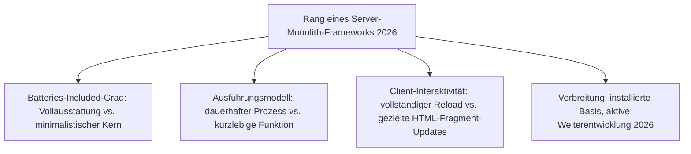
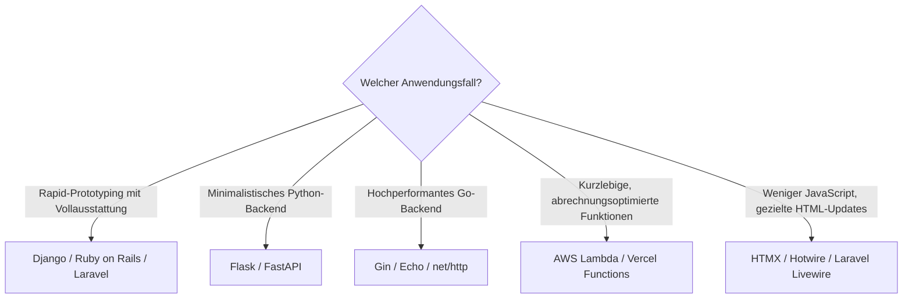

# Beste Server-Monolith-Frameworks 2026 — Top-20-Topliste

Die [Evolution und Architekturen digitaler Server-Monolith-Frameworks](evolution-digitaler-monolith-frameworks.md) ordnet diese Kategorie chronologisch nach Architektur-Generation — von CGI-/MVC-/Enterprise-Anfängen über PHP-Ökosystem-Reife, Python-Microframeworks, Go-Backends und Serverless-Funktionen bis zum Hypermedia-Comeback als Reaktion auf SPA-Komplexität. Diese Seite übersetzt die Chronologie in eine **Momentaufnahme 2026**: 20 Frameworks, die heute tatsächlich betrieben werden.

!!! note "Hinweis: die einzige Web-Framework-Generation ohne echten Nachfolgerbruch"
    Wie schon bei [klassischen LMS](../../wissen/e-learning/klassische-lms-2026-topliste.md) wurden Server-Monolith-Frameworks nie vollständig von SPA-/Meta-Frameworks verdrängt — Django, Rails, Laravel und Spring zählen 2026 weiterhin zu den meistgenutzten Backend-Frameworks überhaupt.

---

## Bewertungskriterien

---

## Top 20 im Überblick

| Rang | System | Generation | Sprache | Besondere Stärke |
|---|---|---|---|---|
| 1 | **Django** | 1b (Full-Stack-MVC-Frameworks) | Python | „Batteries included" — Admin-Oberfläche, ORM und Auth direkt im Kern |
| 2 | **Ruby on Rails** | 1b (Full-Stack-MVC-Frameworks) | Ruby | Prägte „Convention over Configuration" für eine ganze Framework-Generation |
| 3 | **Laravel** | 2 (PHP-Ökosystem-Reife & Laravel) | PHP | Elegante Syntax, Composer-Paketverwaltung, De-facto-Standard des PHP-Ökosystems |
| 4 | **Spring Framework** | 1c (Enterprise-Java/.NET & Portal-Architekturen) | Java | Bis heute dominant im Java-Enterprise-Umfeld, vertieft in [Beste Enterprise-Web-Frameworks 2026](enterprise-webframeworks-2026-topliste.md) |
| 5 | **Flask** | 3 (Python-Microframeworks) | Python | Minimalistischer Kern, Erweiterungen für ORM/Auth/Validierung nach Bedarf |
| 6 | **FastAPI** | 3 (Python-Microframeworks) | Python | Async-first, automatische OpenAPI-Dokumentation aus Typannotationen |
| 7 | **Symfony** | 1b (Full-Stack-MVC-Frameworks) | PHP | Komponentenbasiert, spätere Grundlage vieler weiterer PHP-Projekte (u. a. Teile von Drupal) |
| 8 | **HTMX** | 6 (Das Monolith-Comeback) | Framework-agnostisch | Erweitert HTML um Ajax-/WebSocket-Attribute — kein Build-Schritt, kein Virtual DOM |
| 9 | **Gin** | 4 (Go für performante Web-Backends) | Go | Schnelles, minimalistisches Routing auf `net/http` aufbauend |
| 10 | **AWS Lambda** | 5 (Serverless-Function-Architekturen) | Sprachagnostisch | Prägte das „Function as a Service"-Modell für die breite Praxis |
| 11 | **Hotwire/Turbo** | 6 (Das Monolith-Comeback) | Ruby on Rails | Sendet HTML-Fragmente statt JSON, aktualisiert gezielt Seitenteile ohne vollständigen Reload |
| 12 | **CakePHP** | 2 (PHP-Ökosystem-Reife & Laravel) | PHP | Rails-inspiriertes „Convention over Configuration" für PHP |
| 13 | **CodeIgniter** | 2 (PHP-Ökosystem-Reife & Laravel) | PHP | Leichtgewichtig, minimale Konfiguration, geringe Lernkurve |
| 14 | **Echo** | 4 (Go für performante Web-Backends) | Go | Vergleichbares Ziel wie Gin, mit stärkerem Fokus auf Middleware-Ökosystem |
| 15 | **net/http** (Standardbibliothek) | 4 (Go für performante Web-Backends) | Go | Produktionsreifer HTTP-Server bereits ohne externes Framework |
| 16 | **Laravel Livewire** | 6 (Das Monolith-Comeback) | Laravel/PHP | Reaktive Komponenten serverseitig gerendert, PHP-Zustand statt JavaScript-Zustand |
| 17 | **Vercel/Netlify Functions** | 5 (Serverless-Function-Architekturen) | Sprachagnostisch | Serverless-Funktionen direkt neben statisch gehostetem Frontend-Code |
| 18 | **Serverless Framework** | 5 (Serverless-Function-Architekturen) | Sprachagnostisch | Deployment-Abstraktion über mehrere Cloud-Anbieter hinweg |
| 19 | **Struts** | 1b (Full-Stack-MVC-Frameworks) | Java | Frühes Java-MVC-Framework, historischer Vorläufer der Enterprise-Stufe 1c |
| 20 | **ASP.NET Web Forms** | 1c (Enterprise-Java/.NET & Portal-Architekturen) | .NET | Historisch prägend für komponentenbasiertes, stateful Enterprise-Rendering |

---

## Highlights im Detail

### Rang 1–4, 7: die fünf bis heute marktführenden Generation-1-Systeme
Django, Ruby on Rails, Laravel, Spring und Symfony zeigen, dass die „Batteries-included"-Philosophie aus [Generation 1b](evolution-digitaler-monolith-frameworks.md#generation-1-cgi-mvc-enterprise-portale-1993-2012) 2026 keineswegs veraltet ist — vertiefend dazu [Beste Batteries-Included-Web-Frameworks 2026](batteries-included-frameworks-2026-topliste.md).

### Rang 5–6, 9, 14–15: die Microframework-Gegenbewegung bleibt relevant
Flask, FastAPI, Gin, Echo und `net/http` setzen bewusst auf minimale Kerne statt Vollausstattung — FastAPIs Kombination aus Async-first und automatischer OpenAPI-Dokumentation macht es 2026 zum Standard-Backend für KI-/RAG-APIs.

### Rang 8, 11, 16: das Hypermedia-Comeback als Reaktion auf SPA-Komplexität
HTMX, Hotwire/Turbo und Laravel Livewire kehren bewusst zu serverseitig gerendertem HTML zurück — „weniger JavaScript" statt „mehr Framework", siehe [Generation 6](evolution-digitaler-monolith-frameworks.md#generation-6-das-monolith-comeback-hypermedia-statt-spa-ab-2020).

---

## Entscheidungshilfe nach Anwendungsfall

!!! tip "Tipp: Vollausstattungs- und Enterprise-Perspektive separat prüfen"
    Für die sprachübergreifende Vollausstattungs-Philosophie siehe [Beste Batteries-Included-Web-Frameworks 2026](batteries-included-frameworks-2026-topliste.md); für Enterprise-Tauglichkeit siehe [Beste Enterprise-Web-Frameworks 2026](enterprise-webframeworks-2026-topliste.md).

---

## 🔗 Verwandte Themen

- [Startseite](../../index.md) — zurück zur Dokumentations-Zentrale
- [Evolution und Architekturen digitaler Server-Monolith-Frameworks](evolution-digitaler-monolith-frameworks.md) — chronologisches Generationenmodell, dessen aktuellen Stand diese Topliste zusammenfasst
- [Beste Web-Frameworks 2026 (Top 20)](webframeworks-2026-topliste.md) — Gesamtmarkt-Topliste über alle Generationen hinweg
- [Beste Batteries-Included-Web-Frameworks 2026 (Top 15)](batteries-included-frameworks-2026-topliste.md) — quer liegende Vollausstattungs-Achse zu Generation 1 dieser Zeitachse
- [Beste Enterprise-Web-Frameworks 2026 (Top 15)](enterprise-webframeworks-2026-topliste.md) — vertiefend zu Rang 4, 20
- [Beste klassische CMS 2026 (Top 20)](../../wissen/dokumentation/klassische-cms-2026-topliste.md) — analoges Marktprägungsprinzip für CMS statt Web-Frameworks
