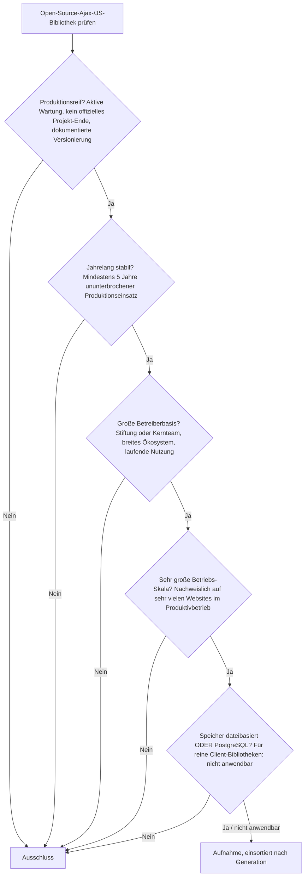
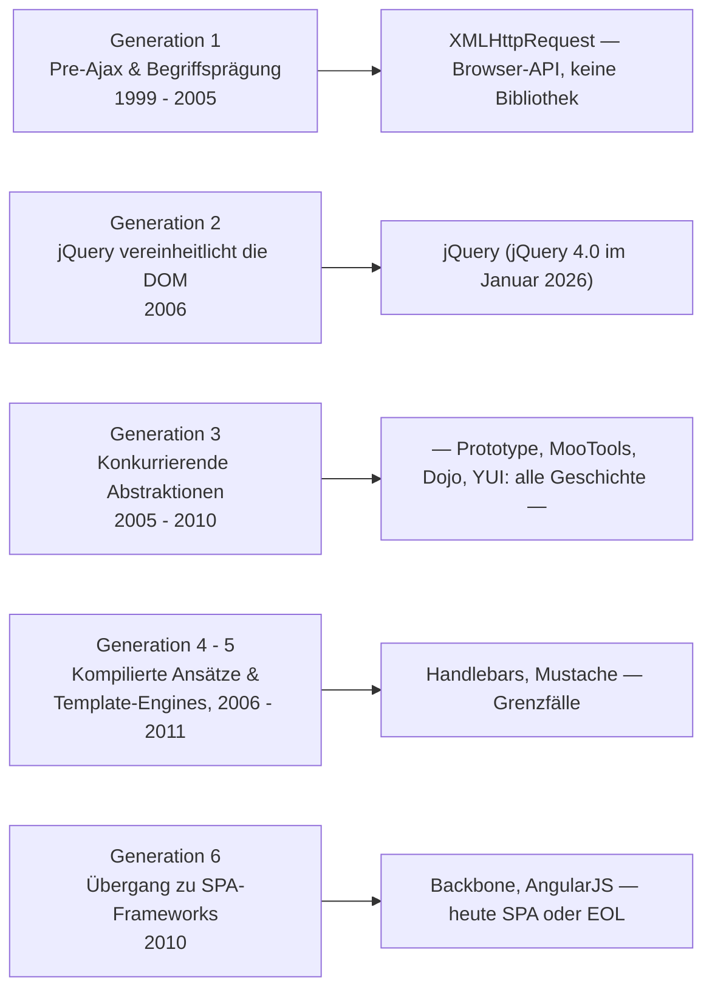

# Produktionsreife Open-Source-Ajax- & JavaScript-Bibliotheken nach Generation — Reifegrad, Evaluation & Betriebs-Skala (1 Bibliothek + Grenzfälle)

Die [Evolution und Architekturen digitaler Ajax- & JavaScript-Bibliotheken](evolution-digitaler-ajax-js-bibliotheken.md) ordnet die Ajax-Ära chronologisch in sechs technologische Generationen, die [Topliste der einflussreichsten Ajax- & JS-Bibliotheken](ajax-js-bibliotheken-topliste.md) rankt sie nach historischer Bedeutung. Diese Seite legt — parallel zur allgemeinen [Web-Framework-Variante](produktionsreife-webframeworks-generationen-2026-topliste.md), der [SPA-](produktionsreife-spa-frameworks-generationen-2026-topliste.md), [Meta-](produktionsreife-meta-frameworks-generationen-2026-topliste.md), [Server-Monolith-](produktionsreife-monolith-frameworks-generationen-2026-topliste.md), [Batteries-Included-](produktionsreife-batteries-included-frameworks-generationen-2026-topliste.md), [Islands-/Edge-](produktionsreife-islands-edge-architekturen-generationen-2026-topliste.md), [Enterprise-](produktionsreife-enterprise-webframeworks-generationen-2026-topliste.md), [Rust-](produktionsreife-rust-webframeworks-generationen-2026-topliste.md) und [KI-nativen Variante](produktionsreife-ki-native-webframeworks-generationen-2026-topliste.md) sowie den Schwesterseiten für [Wissenssysteme](../../wissen/dokumentation/produktionsreife-wissenssysteme-generationen-2026-topliste.md), [CMS](../../wissen/dokumentation/produktionsreife-cms-generationen-2026-topliste.md) und [LMS](../../wissen/e-learning/produktionsreife-lms-generationen-2026-topliste.md) — dasselbe bewusst **konservative** Fünf-Filter-Sieb an: produktionsreif · jahrelang stabil · große Betreiberbasis · sehr große Betriebs-Skala · Speicher dateibasiert oder PostgreSQL. Sortiert nach Generation.

!!! warning "Achtung: Die Kategorie hat sich aufgelöst — bis auf eine Bibliothek"
    Ajax-Bibliotheken lösten ein Problem, das die Browser-Plattform anschließend selbst gelöst hat: `querySelectorAll`, `classList`, `fetch` und `Promise` machten die meisten ihrer Aufgaben zu nativem JavaScript. Von fünfzehn einflussreichen Bibliotheken besteht **nur jQuery** alle fünf Filter — die Konkurrenten (Prototype.js, MooTools, Dojo, YUI) sind Geschichte, die MV*-Nachfolger (Backbone.js, AngularJS) wurden zu [SPA-Frameworks](produktionsreife-spa-frameworks-generationen-2026-topliste.md) oder erreichten End-of-Life. Der **Speicherfilter greift nicht** — diese Bibliotheken laufen im Browser und haben keine Persistenzschicht. Details im [Speicher-Fazit](#dateibasiert-oder-postgresql-weder-noch-und-das-ist-die-eigentliche-pointe).

---

## Die fünf harten Filter

!!! note "Hinweis: Browser-APIs und Showcases zählen nicht"
    `XMLHttpRequest` und die `fetch`-API sind **Web-Standards**, keine Open-Source-Bibliotheken; **Gmail** und **Google Maps** waren Showcases, keine Software zum Einbinden. Alle drei prägten die Ära, gehören aber nicht in dieses Sieb.

---

## Ergebnis: eine Bibliothek, aus der Kern-Generation

---

## Systeme nach Generation

### Generation 2 — jQuery vereinheitlicht die DOM (2006)

| # | System | Speicher | Lizenz | Seit | Skala-Nachweis |
|---|---|---|---|---|---|
| 1 | **[jQuery](evolution-digitaler-ajax-js-bibliotheken.md)** | Client-Bibliothek — Speicherfilter nicht anwendbar | MIT | 2006 | Seit Jahren die meistgenutzte JavaScript-Bibliothek der Welt; steckt im WordPress-Core und auf einem Großteil aller Websites |

**jQuery** ist der einzige Vertreter der Kategorie, der alle Filter besteht — und das zwanzig Jahre nach Erscheinen. **jQuery 4.0** (17. Januar 2026, erste Major-Version seit fast einem Jahrzehnt) räumte mit der Unterstützung für Internet Explorer und andere veraltete Browser auf. Die Bibliothek wird von der OpenJS Foundation gepflegt. Sie besteht das Sieb nicht wegen Modernität, sondern wegen ihrer schieren, fortdauernden Verbreitung.

!!! tip "Tipp: Für Neubau meist überflüssig"
    Was jQuery 2006 gelöst hat, kann modernes JavaScript ohne Bibliothek: `document.querySelectorAll` statt `$()`, `element.classList` statt `$.addClass`, `fetch` statt `$.ajax`, `Promise` statt Callback-Verschachtelung. jQuery besteht diese Liste als **Bestands**-Technologie, nicht als Empfehlung für neue Projekte.

### Generation 1 — Pre-Ajax & Begriffsprägung (1999 – 2005)

`XMLHttpRequest` (1999) ist die technische Grundlage der gesamten Ära und bis heute — neben `fetch` — im Browser aktiv. Als **Web-Standard** ist es aber keine Open-Source-Bibliothek und damit außerhalb dieses Siebs.

### Generation 3 — Konkurrierende Abstraktionsbibliotheken (2005 – 2010) — warum hier nichts steht

| Bibliothek | Status 2026 |
|---|---|
| **YUI** (Yahoo) | Offiziell eingestellt am 29. August 2014, letzte Version 3.18.1 |
| **Prototype.js** | Seit über einem Jahrzehnt ohne nennenswerte Entwicklung |
| **MooTools** | Historisch; die meisten Features gingen in ES6 auf |
| **Dojo Toolkit** | Technisch noch gepflegt, aber die Nutzung ist auf nahe null gesunken |

Keine dieser Bibliotheken erreichte jQuerys Verbreitung, und keine besteht heute den Betreiberbasis- oder Skala-Filter.

### Generation 4 & 5 — Kompilierte Ansätze & Template-Engines (2006 – 2011)

- **Google Web Toolkit (GWT)** und **CoffeeScript** sind historisch: GWT wird nur noch von einer kleinen Community gepflegt, CoffeeScripts Innovationen wurden von ES6/TypeScript übernommen.
- **Handlebars.js** (2010) und **Mustache** (2009) sind **Grenzfälle**: Beide werden weiter in Server- und Build-Toolchains eingesetzt (Handlebars u. a. in Ember), sind über 15 Jahre stabil, aber die Entwicklung ist sehr ruhig geworden — der Filter „große Betreiberbasis, aktive Weiterentwicklung" greift knapp nicht.
- **Knockout.js** (2010) bekommt gelegentliche Patches, ist im Neubau aber ohne Rolle.

### Generation 6 — Übergang zu SPA-Frameworks (2010)

**Backbone.js** und **AngularJS** markieren das Ende der reinen Bibliotheks-Ära. Beide werden auf der [SPA-Framework-Seite](produktionsreife-spa-frameworks-generationen-2026-topliste.md) geführt: Backbone.js nur noch Legacy, AngularJS seit dem 31. Dezember 2021 End-of-Life.

---

## Dateibasiert oder PostgreSQL? — Weder noch, und das ist die eigentliche Pointe

Eine Ajax-Bibliothek läuft im Browser und hat **keine Speicherschicht**. Bemerkenswert ist der umgekehrte Weg: **`$.ajax` war die Funktion, die asynchrone Server-Kommunikation vor der nativen `fetch`-API überhaupt praktikabel machte** — browserübergreifend, mit einheitlicher Fehlerbehandlung. Heute ist genau das ein Browser-Primitiv (`fetch`, `Promise`), und die Bibliotheks-Schicht davor ist entfallen.

Das Backend am anderen Ende des Ajax-Aufrufs ist wie üblich PostgreSQL-gestützt — über eines der [Web-Frameworks](produktionsreife-webframeworks-generationen-2026-topliste.md) oder [Server-Monolith-Frameworks](produktionsreife-monolith-frameworks-generationen-2026-topliste.md) dieser Familie. Vertiefung: [PostgreSQL DBA Praxis-Handbuch](../infrastruktur/postgresql-dba-praxis.md).

!!! warning "Achtung: Momentaufnahme, Stand August 2026"
    jQuery 4.0 ist frisch; die Nutzungszahlen sinken langsam, aber stetig, während Bestandsseiten modernisiert oder abgelöst werden. An der Einordnung „besteht das Sieb, aber als Bestands-Technologie" ändert das auf absehbare Zeit nichts.

---

## Was bewusst nicht auf dieser Liste steht

| System | Erfüllt nicht | Anmerkung |
|---|---|---|
| **XMLHttpRequest, `fetch`** | keine Bibliothek | Web-Standards, im Browser eingebaut |
| **Gmail, Google Maps** | keine Software zum Einbinden | Showcases der Ajax-Ära |
| **YUI** | Produktionsreife | Offiziell eingestellt 2014 |
| **Prototype.js, MooTools, Dojo Toolkit** | Betreiberbasis / Aktivität | Historisch bzw. Nutzung nahe null |
| **Google Web Toolkit, CoffeeScript** | Betreiberbasis | Kleine Community bzw. von ES6/TypeScript abgelöst |
| **Handlebars.js, Mustache** | Aktivität | Über 15 Jahre stabil, aber sehr ruhige Entwicklung — Grenzfälle |
| **Knockout.js** | Betreiberbasis | Gelegentliche Patches, im Neubau ohne Rolle |
| **Backbone.js, AngularJS** | Kategorie / Produktionsreife | Auf der [SPA-Framework-Seite](produktionsreife-spa-frameworks-generationen-2026-topliste.md); AngularJS EOL seit Ende 2021 |

---

## 🔗 Verwandte Themen

- [Evolution und Architekturen digitaler Ajax- & JavaScript-Bibliotheken](evolution-digitaler-ajax-js-bibliotheken.md) — das sechsstufige Generationenmodell, nach dem diese Liste sortiert ist
- [Einflussreichste Ajax- & JavaScript-Bibliotheken (Top 15)](ajax-js-bibliotheken-topliste.md) — die vollständige historische Topliste der Kategorie
- [Produktionsreife Open-Source-SPA-Frameworks nach Generation](produktionsreife-spa-frameworks-generationen-2026-topliste.md) — die direkte Nachfolge-Kategorie (React, Vue, Angular)
- [Produktionsreife Open-Source-Enterprise-UI-Bibliotheken nach Generation](produktionsreife-enterprise-ui-bibliotheken-generationen-2026-topliste.md) — die Nachfolge-Kategorie; YUI, Dojo und jQuery UI als deren Vorläufer aus Generation 1
- [Produktionsreife Open-Source-Web-Frameworks & -Bibliotheken nach Generation](produktionsreife-webframeworks-generationen-2026-topliste.md) — die übergeordnete Variante
- [PostgreSQL DBA Praxis-Handbuch](../infrastruktur/postgresql-dba-praxis.md) — die Datenbankschicht im Backend hinter jedem Ajax-Aufruf
