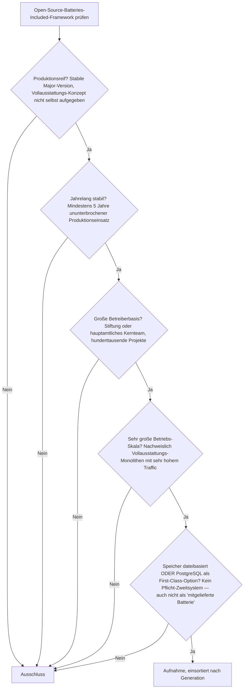
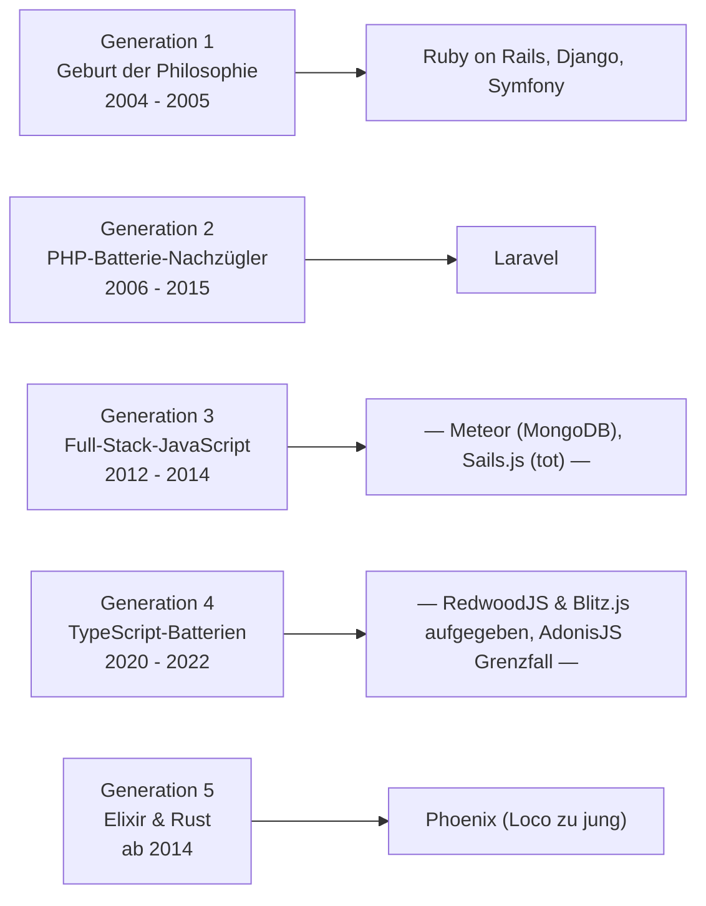

# Produktionsreife Open-Source-Batteries-Included-Web-Frameworks nach Generation — Reifegrad, Evaluation & Betriebs-Skala (Top 5)

Die [Evolution und Architekturen digitaler Batteries-Included-Web-Frameworks](evolution-digitaler-batteries-included-frameworks.md) verfolgt die Vollausstattungs-Philosophie — ORM, Auth, Admin, Migrationen und Scaffolding im Framework-Kern — als sprachübergreifende Zeitachse in fünf Generationen; die [Topliste bester Batteries-Included-Frameworks 2026](batteries-included-frameworks-2026-topliste.md) rankt die gesamte Kategorie. Diese Seite legt — parallel zur allgemeinen [Web-Framework-Variante](produktionsreife-webframeworks-generationen-2026-topliste.md), der [Server-Monolith-](produktionsreife-monolith-frameworks-generationen-2026-topliste.md), [Meta-](produktionsreife-meta-frameworks-generationen-2026-topliste.md), [SPA-](produktionsreife-spa-frameworks-generationen-2026-topliste.md), [Islands-/Edge-](produktionsreife-islands-edge-architekturen-generationen-2026-topliste.md), [Enterprise-](produktionsreife-enterprise-webframeworks-generationen-2026-topliste.md), [Rust-](produktionsreife-rust-webframeworks-generationen-2026-topliste.md) und [KI-nativen Variante](produktionsreife-ki-native-webframeworks-generationen-2026-topliste.md) sowie den Schwesterseiten für [Wissenssysteme](../../wissen/dokumentation/produktionsreife-wissenssysteme-generationen-2026-topliste.md), [CMS](../../wissen/dokumentation/produktionsreife-cms-generationen-2026-topliste.md) und [LMS](../../wissen/e-learning/produktionsreife-lms-generationen-2026-topliste.md) — dasselbe bewusst **konservative** Fünf-Filter-Sieb an: produktionsreif · jahrelang stabil · große Betreiberbasis · sehr große Betriebs-Skala · Speicher dateibasiert oder PostgreSQL. Sortiert nach Generation.

!!! warning "Achtung: Die Gründergeneration ist auch die haltbarste — und jeder JavaScript-Versuch ist gescheitert"
    Fünf Frameworks bestehen alle fünf Filter — und **drei davon** stammen aus dem Gründerjahr 2004/2005: **Ruby on Rails**, **Django**, **Symfony**. Dazu kommen **Laravel** (2011) und **Phoenix** (2014). **Kein einziges JavaScript-/TypeScript-Batteries-Included-Framework** besteht: Meteor scheitert am [Speicherfilter](#dateibasiert-oder-postgresql-und-warum-meteor-genau-hier-scheitert) (MongoDB als Pflichtsystem), Sails.js ist eingeschlafen, RedwoodJS und Blitz.js haben ihr Vollausstattungs-Konzept 2022/2025 selbst aufgegeben, der T3 Stack ist kein Framework. Die JS-Antwort auf „batteries included" wurde am Ende ein [Meta-Framework](produktionsreife-meta-frameworks-generationen-2026-topliste.md) plus kuratierte Bausteine — kein Monolith.

---

## Die fünf harten Filter

!!! note "Hinweis: Microframeworks gehören nicht hierher"
    Die Gegenbewegung der Microframeworks — **Flask**, **Sinatra**, **Slim**, **Express** — ist bewusst *nicht* batteries-included und wird auf der [Server-Monolith-Seite](produktionsreife-monolith-frameworks-generationen-2026-topliste.md) geführt. Hier zählt nur, wer ORM, Auth und Scaffolding im Kern bündelt.

---

## Ergebnis: fünf Frameworks, drei Sprachfamilien

---

## Systeme nach Generation

### Generation 1 — Geburt der „Batteries-included"-Philosophie (2004 – 2005)

| # | System | Sprache | Speicher | Lizenz | Seit | Skala-Nachweis |
|---|---|---|---|---|---|---|
| 1 | **Ruby on Rails** | Ruby | SQLite (Default ab Rails 8) **oder** PostgreSQL First-Class | MIT | 2004 | GitHub, Shopify, Basecamp |
| 2 | **Django** | Python | PostgreSQL ausdrücklich empfohlen; SQLite unterstützt | BSD-3-Clause | 2005 | Instagram, Disqus; die eingebaute Admin-Oberfläche prägte die Kategorie |
| 3 | **Symfony** | PHP | PostgreSQL First-Class über Doctrine | MIT | 2005 | Unterbau von Drupal, Shopware und großen Teilen des PHP-Enterprise-Markts |

Drei Frameworks in drei Sprachen prägten innerhalb eines Jahres den Vollausstattungs-Anspruch — und alle drei bestehen das Sieb 20 Jahre später unverändert. Django lieferte mit der automatisch generierten Admin-Oberfläche das Merkmal, das die meisten Nachfolger nie erreicht haben.

### Generation 2 — PHP-Batterie-Nachzügler (2006 – 2015)

| # | System | Sprache | Speicher | Lizenz | Seit | Skala-Nachweis |
|---|---|---|---|---|---|---|
| 4 | **Laravel** | PHP | SQLite (Default ab Laravel 11) **oder** PostgreSQL/MySQL First-Class | MIT | 2011 | Größtes PHP-Framework-Ökosystem; Eloquent-ORM, Queues, Scheduler, Auth im Kern |

**Laravel** versöhnte 2011 das Vollausstattungs- und das Microframework-Lager: volle Batterien plus ausdrucksstarke Syntax und Composer-Ökosystem. Der einzige „Nachzügler", der die Kategorie neu definiert hat. **CakePHP** (2005) wird weiter gepflegt, ist aber gegenüber Laravel stark geschrumpft.

### Generation 3 — Full-Stack-JavaScript-Batterien (2012 – 2014) — warum hier nichts steht

- **Meteor** (2012): isomorpher Code, eingebaute Echtzeit-Synchronisation — aber **MongoDB ist fest verdrahtet** und als „mitgelieferte Batterie" Teil des Kerns. Das ist der klassische Speicherfilter-Ausfall dieser Liste, das Web-Pendant zu Open edX in der [LMS-Variante](../../wissen/e-learning/produktionsreife-lms-generationen-2026-topliste.md).
- **Sails.js** (2012): „Rails für Node.js" mit Blueprint-APIs, aber die Entwicklung ist weitgehend zum Erliegen gekommen → Betreiberbasis.

### Generation 4 — TypeScript-Batterien & kuratierte Stacks (2020 – 2022) — warum hier nichts steht

- **RedwoodJS** (2020): spaltete sich im April 2025 auf — „Redwood GraphQL" nur noch im Wartungsmodus, „RedwoodSDK" ist ein kompletter Neuanfang als Cloudflare-fokussiertes React-Framework. Das ursprüngliche Vollausstattungs-Konzept ist eingefroren.
- **Blitz.js** (2020): die Maintainer kamen selbst zu dem Schluss, dass „ein Rails für JavaScript" den Rahmen eines einzelnen Frameworks sprengt, und stellten auf ein Toolkit-Modell um.
- **T3 Stack** (2022): kein Framework, sondern ein **kuratiertes Bündel** (Next.js + tRPC + Prisma + NextAuth) — kein eigener Release-Zyklus, keine Kernarchitektur.
- **AdonisJS** (v5 2020, v6 2024): das Laravel-nächste Node-Framework und der einzige lebende Gen-4-Vertreter — aktiv gepflegt, Lucid-ORM mit PostgreSQL, aber die Betreiberbasis ist noch nicht auf dem Niveau der übrigen fünf. **Grenzfall.**

### Generation 5 — Batterien jenseits von Ruby/Python/JS: Elixir & Rust (ab 2014)

| # | System | Sprache | Speicher | Lizenz | Seit | Skala-Nachweis |
|---|---|---|---|---|---|---|
| 5 | **Phoenix** (+ LiveView) | Elixir | Ecto mit PostgreSQL-Adapter als Default | MIT | 2014 | Discord und andere Echtzeit-Systeme auf der BEAM; LiveView bringt serverseitige Reaktivität ohne Client-JavaScript |

**Phoenix** trägt den Rails-Anspruch auf die Erlang-VM: `mix phx.new` erzeugt standardmäßig ein PostgreSQL-Projekt über Ecto, LiveView (2019) ergänzt Reaktivität ohne eigenen Client-Code. Zwölf Jahre Produktionshistorie. **Loco** (2023, „Rails für Rust" auf Axum) ist konzeptionell der nächste Schritt, mit drei Jahren aber deutlich unter der Reifezeit-Marke — siehe [Produktionsreife Rust-Web-Frameworks](produktionsreife-rust-webframeworks-generationen-2026-topliste.md).

---

## Dateibasiert oder PostgreSQL? — Und warum Meteor genau hier scheitert

Alle fünf bestandenen Frameworks bündeln ein ORM, das **PostgreSQL als First-Class-Ziel** führt: ActiveRecord (Rails), Django ORM, Eloquent (Laravel), Doctrine (Symfony), Ecto (Phoenix). Zwei davon — Rails und Laravel — haben SQLite seit ihren jüngsten Major-Versionen zum Default gemacht und damit **dateibasierten Produktionsbetrieb** für kleine bis mittlere Last legitimiert. Die Antwort deckt sich mit der [allgemeinen Web-Framework-Seite](produktionsreife-webframeworks-generationen-2026-topliste.md#dateibasiert-oder-postgresql-diesmal-beides).

**Meteor zeigt die Kehrseite von „batteries included":** Wenn eine der mitgelieferten Batterien ein zweites, nicht austauschbares Datenbanksystem ist — hier MongoDB für die Echtzeit-Synchronisation —, dann erbt das Framework genau dessen Betriebs- und Lizenzrisiken. Vollausstattung ist ein Vorteil, solange jede Komponente ersetzbar bleibt.

!!! warning "Achtung: Momentaufnahme, Stand August 2026"
    AdonisJS könnte bei weiterem Wachstum nachrücken; Loco erreicht 2028 die Fünf-Jahres-Marke. Ob die JavaScript-Welt noch einen ernsthaften monolithischen Vollausstattungs-Anlauf nimmt, ist nach RedwoodJS und Blitz.js offen.

---

## Was bewusst nicht auf dieser Liste steht

| System | Erfüllt nicht | Anmerkung |
|---|---|---|
| **Meteor** | Speicherfilter | MongoDB als fest verdrahtete „Batterie" im Kern |
| **Sails.js** | Betreiberbasis / Aktivität | „Rails für Node.js", Entwicklung weitgehend eingestellt |
| **RedwoodJS** | Kontinuität | 2025 in „Redwood GraphQL" (Wartung) und „RedwoodSDK" (Neuanfang) aufgespalten |
| **Blitz.js** | Produktionsreife des Konzepts | Vollausstattungs-Ansatz von den Maintainern selbst aufgegeben |
| **T3 Stack** | keine Framework | Kuratiertes Bündel ohne eigene Kernarchitektur |
| **AdonisJS** | Betreiberbasis | Lebendster Gen-4-Vertreter, aber noch nicht auf dem Niveau der fünf — Grenzfall |
| **Loco** | Reifezeit | „Rails für Rust", erst seit 2023 |
| **CakePHP, CodeIgniter** | Betreiberbasis | Weiter gepflegt, aber gegenüber Laravel stark geschrumpft |

---

## 🔗 Verwandte Themen

- [Evolution und Architekturen digitaler Batteries-Included-Web-Frameworks](evolution-digitaler-batteries-included-frameworks.md) — das fünfstufige, sprachübergreifende Generationenmodell, nach dem diese Liste sortiert ist
- [Beste Batteries-Included-Web-Frameworks 2026 (Top 15)](batteries-included-frameworks-2026-topliste.md) — breiteste Basis-Topliste der Kategorie
- [Produktionsreife Open-Source-Server-Monolith-Frameworks nach Generation (Top 11)](produktionsreife-monolith-frameworks-generationen-2026-topliste.md) — die breitere Kategorie inklusive Microframeworks (Flask, FastAPI, Go)
- [Produktionsreife Open-Source-Web-Frameworks & -Bibliotheken nach Generation](produktionsreife-webframeworks-generationen-2026-topliste.md) — die übergeordnete Variante
- [Produktionsreife Open-Source-Full-Stack-Meta-Frameworks nach Generation](produktionsreife-meta-frameworks-generationen-2026-topliste.md) — die tatsächliche JavaScript-Antwort auf „batteries included"
- [Produktionsreife Open-Source-Enterprise-Web-Frameworks nach Generation](produktionsreife-enterprise-webframeworks-generationen-2026-topliste.md) — verwandte Achse: Enterprise-Tauglichkeit statt reiner Vollausstattung
- [PostgreSQL DBA Praxis-Handbuch](../infrastruktur/postgresql-dba-praxis.md) — die Datenbankschicht hinter dem gebündelten ORM
