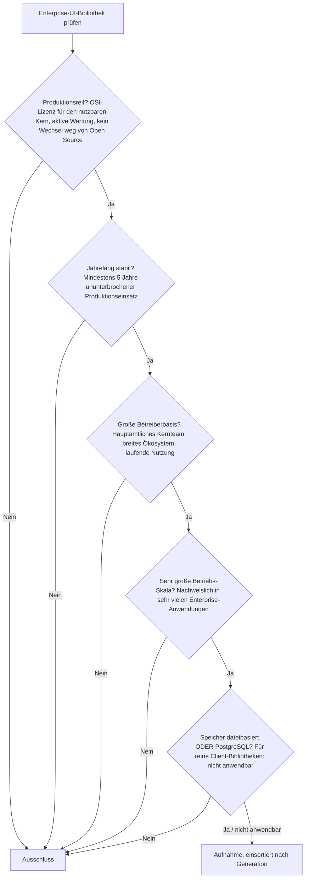
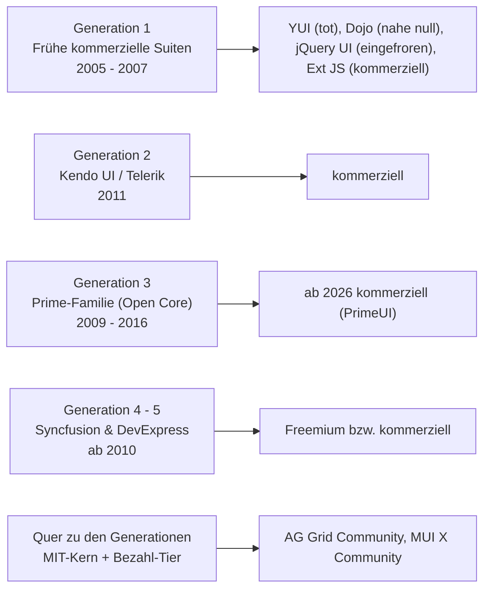

# Produktionsreife Open-Source-Enterprise-UI-Bibliotheken nach Generation — Reifegrad, Evaluation & Betriebs-Skala (2 Kerne + Grenzfälle)

Die [Evolution und Architekturen digitaler Enterprise-UI-Bibliotheken](evolution-digitaler-enterprise-ui-bibliotheken.md) ordnet diese Kategorie chronologisch in fünf Generationen — jeweils nach **Geschäftsmodell** (rein kommerziell, Open-Core, Freemium) statt allein nach Erscheinungsjahr; die [Topliste bester Enterprise-UI-Bibliotheken 2026](enterprise-ui-bibliotheken-2026-topliste.md) rankt sie insgesamt. Diese Seite legt — parallel zur allgemeinen [Web-Framework-Variante](produktionsreife-webframeworks-generationen-2026-topliste.md), der [SPA-](produktionsreife-spa-frameworks-generationen-2026-topliste.md), [Ajax-/JS-Bibliotheken-](produktionsreife-ajax-js-bibliotheken-generationen-2026-topliste.md), [Meta-](produktionsreife-meta-frameworks-generationen-2026-topliste.md), [Server-Monolith-](produktionsreife-monolith-frameworks-generationen-2026-topliste.md), [Batteries-Included-](produktionsreife-batteries-included-frameworks-generationen-2026-topliste.md), [Islands-/Edge-](produktionsreife-islands-edge-architekturen-generationen-2026-topliste.md), [Enterprise-](produktionsreife-enterprise-webframeworks-generationen-2026-topliste.md), [Rust-](produktionsreife-rust-webframeworks-generationen-2026-topliste.md) und [KI-nativen Variante](produktionsreife-ki-native-webframeworks-generationen-2026-topliste.md) sowie den Schwesterseiten für [Wissenssysteme](../../wissen/dokumentation/produktionsreife-wissenssysteme-generationen-2026-topliste.md), [CMS](../../wissen/dokumentation/produktionsreife-cms-generationen-2026-topliste.md) und [LMS](../../wissen/e-learning/produktionsreife-lms-generationen-2026-topliste.md) — dasselbe bewusst **konservative** Fünf-Filter-Sieb an: produktionsreif · jahrelang stabil · große Betreiberbasis · sehr große Betriebs-Skala · Speicher dateibasiert oder PostgreSQL. Sortiert nach Generation.

!!! warning "Achtung: Die einzige Kategorie der Familie, in der Open Source auf dem Rückzug ist"
    Kein anderes Sieb dieser Familie fällt so stark am **Lizenzfilter** aus. **Kendo UI, Ext JS, Syncfusion, DevExpress** waren nie quelloffen; **Handsontable** gab die MIT-Lizenz 2019 auf; und **PrimeNG / PrimeReact / PrimeVue** — bis vor Kurzem die quelloffene Referenz — wechseln Mitte 2026 auf die kommerzielle „PrimeUI"-Lizenz (das MIT-Repository wurde im Juni 2026 archiviert). Was das OSI-Sieb im August 2026 noch besteht, ist schmal: **AG Grid Community** und die **MUI-Familie** — jeweils der MIT-Kern, mit dem eigentlichen Enterprise-Funktionsumfang hinter der Bezahlstufe. Zur Speicherfrage: [nicht anwendbar, aber mit einer Pointe](#dateibasiert-oder-postgresql-das-server-side-row-model-ist-eine-postgresql-abfrage).

---

## Die fünf harten Filter

!!! note "Hinweis: Freemium und „kostenlos für kleine Firmen" sind keine Open-Source-Lizenz"
    Syncfusions Community License und Handsontables Non-Commercial License erlauben kostenlose Nutzung unter einer Umsatzschwelle — sie sind aber **proprietär**, nicht OSI-anerkannt. Nur ein tatsächlich MIT-/Apache-/BSD-lizenzierter Kern zählt hier.

---

## Ergebnis: zwei quelloffene Kerne, quer zu den Vendor-Generationen

---

## Systeme nach Generation

### Quer zu den Vendor-Generationen — die MIT-Kerne (ab ca. 2014 – 2016)

| # | System | Rolle | Lizenz (Kern) | Seit | Skala-Nachweis |
|---|---|---|---|---|---|
| 1 | **AG Grid Community** | framework-agnostisches Daten-Grid | MIT | 2015 | Meistgenutzte Enterprise-Grid-Bibliothek; Sortierung, Filterung, Editieren, Theming im freien Kern |
| 2 | **MUI X Community** (+ MUI Core) | React-Daten-Grid, Diagramme, Datumsauswahl | MIT | 2014 (MUI), 2021 (MUI X) | MUI ist die meistgenutzte React-Komponentenbibliothek überhaupt; das Community-Grid deckt Grundfunktionen ab |

Beide folgen demselben Modell: ein **vollständig MIT-lizenzierter Kern** mit allen Grundfunktionen, plus ein kommerzielles Pro-/Premium-Tier für den eigentlichen Enterprise-Umfang — **AG Grid Enterprise** (Pivot, Server-Side Row Model, integrierte Charts), **MUI X Pro/Premium** (Aggregation, Zeilengruppierung, Excel-Export). Der freie Kern besteht das Sieb; er ist seit rund einem Jahrzehnt in sehr vielen Produktionsanwendungen im Einsatz.

!!! warning "Achtung: auch hier Bewegung"
    MUI hat für 2026 Lizenzänderungen angekündigt — vor dem Einsatz die aktuellen Bedingungen des Community-Tiers prüfen. AG Grid Community ist bislang unverändert MIT.

### Generation 3 — Prime-Familie: PrimeFaces → PrimeNG / PrimeReact / PrimeVue (2009 – 2016)

Bis 2025 die **quelloffene Referenz** der Kategorie: MIT-lizenzierte Komponenten-Kerne für JSF (PrimeFaces, 2009), Angular (PrimeNG, 2016), React und Vue (PrimeReact/PrimeVue, ab 2019), finanziert über bezahlte Themes, Templates und Support.

**2026 kippt das Modell:** PrimeTek überführt die künftige Entwicklung von PrimeNG, PrimeReact und PrimeVue in die kommerzielle **„PrimeUI"-Lizenz**; das MIT-Repository von PrimeNG wurde am 29. Juni 2026 archiviert. Bestehende MIT-Versionen bleiben MIT, erhalten aber keine Weiterentwicklung. Damit fällt die Prime-Familie am Filter **„aktive Weiterentwicklung des quelloffenen Kerns"** — der Grenzfall der Kategorie.

### Generation 1 — Frühe kommerzielle Web-Komponentenbibliotheken (2005 – 2007) — warum hier nichts steht

| Bibliothek | Status 2026 |
|---|---|
| **YUI** (Yahoo) | Offiziell eingestellt 2014 |
| **Dojo Toolkit** | Quelloffen, aber Nutzung nahe null |
| **jQuery UI** | MIT, aber im **Wartungsmodus** — nur Kompatibilität und Sicherheitsfixes (1.14.2 im Januar 2026), keine neuen Funktionen |
| **Ext JS** (Sencha) | Rein kommerziell → Lizenzfilter |

### Generation 2, 4 & 5 — Kendo UI, Syncfusion, DevExpress — warum hier nichts steht

- **Kendo UI** (Progress Software), **DevExpress** und **DevExtreme** — rein kommerzielle, nach Entwicklerzahl gestaffelte Lizenzen.
- **Syncfusion Essential Studio** — freizügiges Freemium, aber die Community License ist proprietär, nicht OSI-anerkannt.

Diese drei prägen den Enterprise-Markt (Grids, Charts, Scheduler, PDF-/Excel-Export in einem Portfolio), fallen aber alle am Lizenzfilter.

---

## Dateibasiert oder PostgreSQL? — Das Server-Side Row Model ist eine PostgreSQL-Abfrage

Eine UI-Bibliothek läuft im Browser und hat **keine Speicherschicht**. Die Pointe liegt eine Ebene tiefer: Sobald ein Enterprise-Grid mehr Zeilen darstellen soll, als in den Browser passen, wechselt es ins **Server-Side Row Model** — Sortierung, Filterung, Gruppierung und Paginierung werden an das Backend delegiert. Das ist eine **direkte Abbildung von PostgreSQL-Abfragemustern**:

| Grid-Operation | PostgreSQL-Entsprechung |
|---|---|
| Sortierung nach Spalte | `ORDER BY` auf indizierter Spalte |
| Filter pro Spalte | `WHERE` mit passendem Index (B-Tree, GIN für Volltext) |
| Seitenweises Nachladen | Keyset-Pagination (`WHERE id > :cursor LIMIT :n`) statt `OFFSET` |
| Zeilengruppierung / Pivot | `GROUP BY`, `GROUPING SETS`, Fensterfunktionen |

Vertiefung: [PostgreSQL DBA Praxis-Handbuch](../infrastruktur/postgresql-dba-praxis.md). Das Backend selbst läuft über eines der [Web-](produktionsreife-webframeworks-generationen-2026-topliste.md) oder [Server-Monolith-Frameworks](produktionsreife-monolith-frameworks-generationen-2026-topliste.md) dieser Familie.

!!! warning "Achtung: Momentaufnahme, Stand August 2026"
    Diese Kategorie ist lizenzrechtlich in Bewegung: Die PrimeUI-Umstellung läuft gerade, MUI hat Änderungen für 2026 angekündigt. Vor der Auswahl einer Bibliothek die aktuelle Lizenz des tatsächlich genutzten Tiers prüfen — nicht die des Marketing-Materials.

---

## Was bewusst nicht auf dieser Liste steht

| System | Erfüllt nicht | Anmerkung |
|---|---|---|
| **Kendo UI, Ext JS, DevExpress, DevExtreme** | Lizenzfilter | Rein kommerziell, nach Entwicklerzahl gestaffelt |
| **Syncfusion Essential Studio** | Lizenzfilter | Freemium, aber Community License proprietär |
| **Handsontable** | Lizenzfilter | MIT-Lizenz 2019 zugunsten einer Non-Commercial License aufgegeben |
| **PrimeNG, PrimeReact, PrimeVue** | Aktivität des OSS-Kerns | Wechsel auf kommerzielle PrimeUI-Lizenz Mitte 2026, MIT-Repo archiviert — Grenzfall |
| **PrimeFaces** | Framework-Bindung / Zukunft | An JSF gebunden (Nische), ebenfalls von der PrimeUI-Umstellung betroffen |
| **jQuery UI** | Aktive Weiterentwicklung | MIT, aber im Wartungsmodus, keine neuen Funktionen |
| **YUI, Dojo Toolkit** | Produktionsreife / Betreiberbasis | Eingestellt bzw. Nutzung nahe null |

---

## 🔗 Verwandte Themen

- [Evolution und Architekturen digitaler Enterprise-UI-Bibliotheken](evolution-digitaler-enterprise-ui-bibliotheken.md) — das fünfstufige, nach Geschäftsmodell geordnete Generationenmodell
- [Beste Enterprise-UI-Bibliotheken 2026 (Top 15)](enterprise-ui-bibliotheken-2026-topliste.md) — die vollständige Topliste inklusive der kommerziellen Anbieter
- [Produktionsreife Open-Source-Ajax- & JavaScript-Bibliotheken nach Generation](produktionsreife-ajax-js-bibliotheken-generationen-2026-topliste.md) — YUI, Dojo und jQuery UI als Vorläufer aus Generation 1
- [Produktionsreife Open-Source-SPA-Frameworks nach Generation](produktionsreife-spa-frameworks-generationen-2026-topliste.md) — React, Angular und Vue als Ziel-Frameworks dieser Komponentenbibliotheken
- [Produktionsreife Open-Source-Enterprise-Web-Frameworks nach Generation](produktionsreife-enterprise-webframeworks-generationen-2026-topliste.md) — die Backend-Seite des Enterprise-Stacks
- [PostgreSQL DBA Praxis-Handbuch](../infrastruktur/postgresql-dba-praxis.md) — die Abfrageschicht hinter dem Server-Side Row Model
