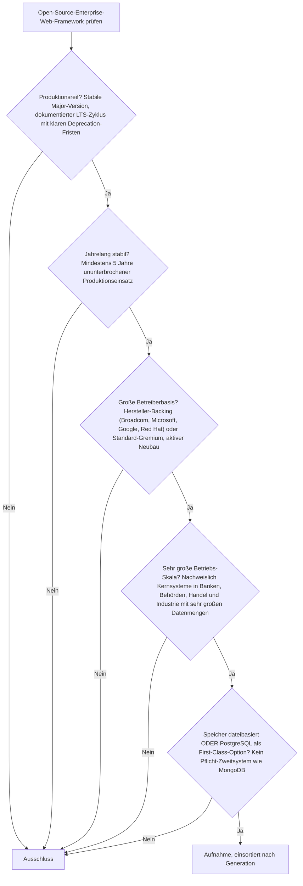
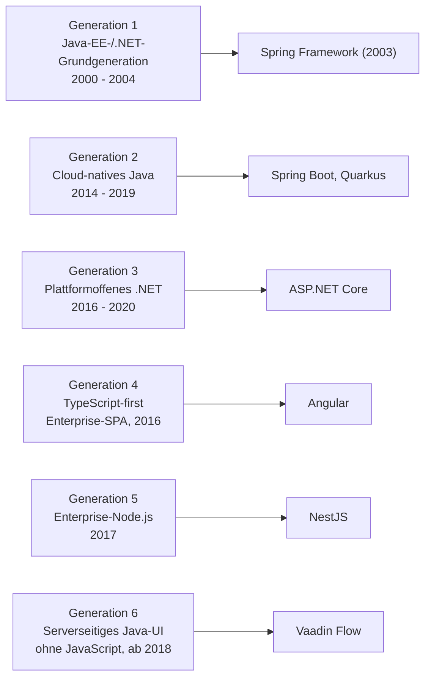
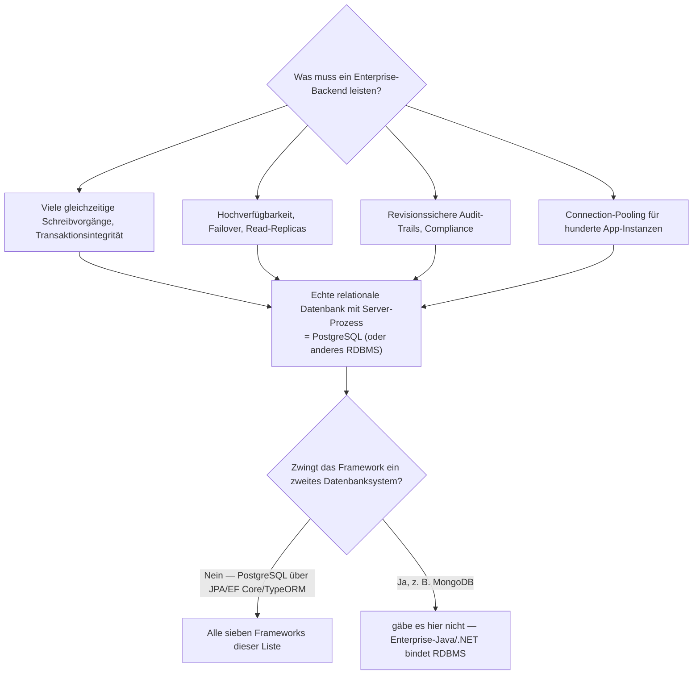

# Produktionsreife Open-Source-Enterprise-Web-Frameworks nach Generation — Reifegrad, Evaluation & Betriebs-Skala (Top 7 + Grenzfälle)

Die [Evolution und Architekturen digitaler Enterprise-Web-Frameworks](evolution-digitaler-enterprise-webframeworks.md) ordnet diese Klasse chronologisch in sechs technologische Generationen, die [Topliste bester Enterprise-Web-Frameworks 2026](enterprise-webframeworks-2026-topliste.md) rankt die gesamte Kategorie. Diese Seite legt — parallel zur allgemeinen [Web-Framework-Variante](produktionsreife-webframeworks-generationen-2026-topliste.md) und den Schwesterseiten für [Wissenssysteme](../../wissen/dokumentation/produktionsreife-wissenssysteme-generationen-2026-topliste.md), [CMS](../../wissen/dokumentation/produktionsreife-cms-generationen-2026-topliste.md) und [LMS](../../wissen/e-learning/produktionsreife-lms-generationen-2026-topliste.md) — dasselbe bewusst **konservative** Fünf-Filter-Sieb an: produktionsreif · jahrelang stabil · große Betreiberbasis · sehr große Betriebs-Skala · Speicher dateibasiert oder PostgreSQL. Sortiert nach Generation.

!!! warning "Achtung: Im Enterprise-Kontext heißt der Speicherfilter praktisch immer PostgreSQL"
    Auf der [allgemeinen Web-Framework-Seite](produktionsreife-webframeworks-generationen-2026-topliste.md) ist ein rein **dateibasierter** Betrieb (SQLite seit Rails 8 / Laravel 11) eine ernsthafte Option. Für **Enterprise-Frameworks gilt das nicht**: hohe Schreib-Nebenläufigkeit, Hochverfügbarkeit, revisionssichere Audit-Trails und Connection-Pooling im großen Maßstab verlangen eine echte relationale Datenbank. Alle sieben Systeme dieser Liste binden PostgreSQL als First-Class-Ziel über ihre ORM-Schicht an; **keines** erzwingt ein Pflicht-Zweitsystem wie MongoDB. Die Begründung steht im [Speicher-Fazit](#dateibasiert-oder-postgresql-im-enterprise-kontext-eindeutig-postgresql).

---

## Die fünf harten Filter

!!! note "Hinweis: Nur OSI-anerkannte Lizenzen"
    Es zählen nur Systeme unter einer OSI-anerkannten Open-Source-Lizenz — hier durchgängig Apache-2.0 oder MIT. Das kostet die Liste die marktprägenden proprietären Enterprise-Plattformen: **Adobe Experience Manager**, **Sitecore**, **Oracle WebCenter**, **IBM WebSphere Portal**, **SAP UI5** (Kern proprietär).

---

## Ergebnis: sieben Systeme, verteilt über alle sechs Generationen

Anders als bei LMS (2) oder CMS (12) verteilt sich das Ergebnis hier **gleichmäßig über die Zeitachse**: Jede Generation hat mindestens einen produktionsharten Vertreter, weil das Enterprise-Versprechen — Langzeit-Support, Hersteller-Backing — genau die Eigenschaften sind, die das Sieb abfragt.

---

## Systeme nach Generation

### Generation 1 — Java-EE-/.NET-Grundgeneration (2000 – 2004)

| # | System | Sprache | Speicher | Lizenz | Seit | Skala-Nachweis |
|---|---|---|---|---|---|---|
| 1 | **[Spring Framework](evolution-digitaler-enterprise-webframeworks.md)** | Java/Kotlin | datenbank-agnostisch über JPA/Hibernate; PostgreSQL First-Class | Apache-2.0 | 2003 | De-facto-Fundament fast aller Java-Enterprise-Anwendungen; Grundlage von Generation 2 |

**Spring** setzte Dependency Injection als eingebautes Architekturmuster durch und trägt seit über zwei Jahrzehnten Kernsysteme in Banken und Industrie. Im Neubau wird es praktisch immer über **Spring Boot** (Generation 2) verwendet — als eigenständiges Fundament besteht es das Sieb dennoch, weil die Betreiberbasis und Produktionshistorie konkurrenzlos sind. Backing seit 2023 bei **Broadcom** (zuvor VMware/Pivotal).

### Generation 2 — Cloud-natives Java (2014 – 2019)

| # | System | Sprache | Speicher | Lizenz | Seit | Skala-Nachweis |
|---|---|---|---|---|---|---|
| 2 | **Spring Boot** | Java/Kotlin | JPA/Hibernate; PostgreSQL First-Class | Apache-2.0 | 2014 | Das mit Abstand meistgenutzte Enterprise-Framework; Kernbanken-, Handels- und Behörden-Deployments weltweit |
| 3 | **Quarkus** | Java/Kotlin | Hibernate ORM mit Panache; PostgreSQL First-Class | Apache-2.0 | 2019 | Red Hat; produktionsbewährt für Kubernetes-Microservices und Serverless-Workloads mit Millisekunden-Kaltstart |

**Spring Boot** eliminierte Springs XML-Konfiguration zugunsten von „Convention over Configuration" und container-tauglichem Startverhalten — der Referenzfall für produktionsreif im Java-Enterprise. **Quarkus** hat 2024 die Fünf-Jahres-Marke überschritten und ist für GraalVM-Native-Image optimiert; für langlaufende Monolithen bleibt Spring Boot die konservativere Wahl.

### Generation 3 — Plattformoffenes .NET (2016 – 2020)

| # | System | Sprache | Speicher | Lizenz | Seit | Skala-Nachweis |
|---|---|---|---|---|---|---|
| 4 | **ASP.NET Core** | C# | Entity Framework Core; PostgreSQL über Npgsql First-Class | MIT | 2016 | Stack Overflow, Bing, zahlreiche Azure-Dienste; plattformübergreifend seit dem Core-Rewrite |

Vollständiger, quelloffener Rewrite des Windows-gebundenen ASP.NET — plattformoffen, container-tauglich, mit striktem Support-Zyklus je .NET-Version. PostgreSQL ist über den Npgsql-Provider ein vollwertiges EF-Core-Ziel.

### Generation 4 — TypeScript-first Enterprise-SPA (2016)

| # | System | Sprache | Speicher | Lizenz | Seit | Skala-Nachweis |
|---|---|---|---|---|---|---|
| 5 | **Angular** | TypeScript | Frontend-Framework — Speicherfilter greift über das gepaarte Backend (typ. Spring Boot / .NET / NestJS auf PostgreSQL) | MIT | 2016 | Google-intern und in Großkonzernen breit im Einsatz; strikte LTS-Zusage als explizites Verkaufsargument |

Vollständiges, Google-gestütztes Framework mit eingebauter Dependency Injection und einheitlichem CLI-Tooling — bewusst „opinionated", um Konfigurationsentscheidungen in großen Teams zu reduzieren. Der Speicher liegt beim gepaarten Backend; die typische Enterprise-Kombination ist Angular plus ein PostgreSQL-gestütztes Java- oder .NET-Backend.

### Generation 5 — Enterprise-Node.js (2017)

| # | System | Sprache | Speicher | Lizenz | Seit | Skala-Nachweis |
|---|---|---|---|---|---|---|
| 6 | **NestJS** | TypeScript | TypeORM/Prisma; PostgreSQL First-Class | MIT | 2017 | Größtes strukturiertes Node-Backend-Framework; breite Nutzung in SaaS und Konzern-IT |

Bringt die aus Spring und Angular bekannte Modul-/DI-/Decorator-Struktur explizit in die Node.js-Backend-Welt — die direkte Antwort auf die als zu unstrukturiert empfundene Minimalität von Express.js. Das Hersteller-Backing ist schwächer institutionalisiert als bei Spring oder .NET, die Community-Basis dafür sehr groß.

### Generation 6 — Serverseitiges Java-UI ohne JavaScript (ab 2018)

| # | System | Sprache | Speicher | Lizenz | Seit | Skala-Nachweis |
|---|---|---|---|---|---|---|
| 7 | **Vaadin Flow** | Java | JPA/Hibernate; PostgreSQL First-Class | Apache-2.0 | 2018 (Vaadin seit 2006) | Enterprise-Java-Häuser ohne dediziertes Frontend-Team; kommerzielles Backing durch Vaadin Ltd |

Die gesamte UI-Logik bleibt in Java, der Framework-Server synchronisiert automatisch über WebSockets mit dem Browser. Bewusster Gegenentwurf zur JavaScript-Fragmentierung der Generationen 4/5 — konzeptionell verwandt mit dem [Hypermedia-Comeback](evolution-digitaler-monolith-frameworks.md) im Rails-/PHP-Umfeld.

---

## Dateibasiert oder PostgreSQL? — Im Enterprise-Kontext eindeutig PostgreSQL

Die SQLite-in-Produktion-Entwicklung, die auf der [allgemeinen Web-Framework-Seite](produktionsreife-webframeworks-generationen-2026-topliste.md#dateibasiert-oder-postgresql-diesmal-beides) eine echte Option ist, **überträgt sich nicht** auf den Enterprise-Maßstab: Diese Workloads sind genau der Fall, für den eine einzelne Datei mit einem Schreiber nicht ausgelegt ist. Konkret:

- **PostgreSQL ist die Standardwahl** für alle sieben — über JPA/Hibernate (Java), Entity Framework Core mit Npgsql (.NET) und TypeORM/Prisma (NestJS). Vertiefung: [PostgreSQL DBA Praxis-Handbuch](../infrastruktur/postgresql-dba-praxis.md).
- **Dateibasiert nur am Rand** — statischer Angular-Build, gecachte Templates, Konfigurations- und Migrationsdateien im Repo; die Geschäftsdaten liegen in der Datenbank.
- **MongoDB-Bindung ist in dieser Kategorie kein Thema** — das Java-/.NET-Enterprise-Ökosystem ist historisch relational; der MongoDB-Grenzfall (Meteor, MEAN) betrifft nur die Nicht-Enterprise-Node-Welt.

!!! warning "Achtung: Momentaufnahme, Stand August 2026"
    Support-Fenster verschieben sich mit jeder Major-Version — insbesondere im .NET-Umfeld (feste 3-Jahres-Zyklen je Version) und bei Angular (halbjährliche Majors mit definiertem LTS-Ende). Vor dem Produktivstart den aktuellen Support-Kalender der Zielversion prüfen.

---

## Was bewusst nicht auf dieser Liste steht

| System | Erfüllt nicht | Anmerkung |
|---|---|---|
| **Micronaut** | Betreiberbasis | Technisch reif (Kompilierzeit-DI, seit 2018), aber Adoption und Ökosystem deutlich kleiner als Spring Boot oder Quarkus |
| **Blazor** | Reifezeit / Skala-Nachweis | WebAssembly-Modell erst seit 2020 GA; Microsoft-Backing stark, Großbetriebs-Nachweis noch dünner als bei ASP.NET Core |
| **Jakarta EE / Jakarta Faces (JSF)** | Betreiberbasis (Neubau) | Spezifikation lebt unter der Eclipse Foundation weiter (Faces 4.1, 2024), im Neubau aber eine Nische |
| **Apache Struts 6/7** | Aktivität im Neubau | Wird weiter gepflegt (7.1.1, Oktober 2025), doch Neubau findet praktisch nicht mehr statt; die real verbreitete Linie 2.5.x ist seit April 2024 End-of-Life |
| **ASP.NET Web Forms** | Produktionsreife (Upgrade-Pfad) | Eingefroren auf .NET Framework, kein Pfad zu .NET 5+ |
| **Spring Cloud** | eigenständiges Framework | Microservice-Ergänzung auf Spring-Boot-Basis, kein eigener Framework-Kern |
| **GraalVM Native Image** | eigenständiges Framework | Kompilierungs-Tooling, technisches Fundament hinter Quarkus |
| **Play Framework, Grails** | Betreiberbasis / Aktivität | Beide waren im Java/Scala- bzw. Groovy-Umfeld verbreitet, die Adoption ist stark rückläufig |
| **Adobe Experience Manager, Sitecore, Oracle WebCenter, IBM WebSphere Portal** | Lizenzfilter | Proprietäre Enterprise-Plattformen |

---

## 🔗 Verwandte Themen

- [Evolution und Architekturen digitaler Enterprise-Web-Frameworks](evolution-digitaler-enterprise-webframeworks.md) — das sechsstufige Generationenmodell, nach dem diese Liste sortiert ist
- [Beste Enterprise-Web-Frameworks 2026 (Top 15)](enterprise-webframeworks-2026-topliste.md) — breiteste Basis-Topliste der Kategorie
- [Produktionsreife Open-Source-Web-Frameworks & -Bibliotheken nach Generation](produktionsreife-webframeworks-generationen-2026-topliste.md) — die übergeordnete Variante über alle Web-Frameworks; dort ist dateibasierter Betrieb eine echte Option
- [Evolution und Architekturen digitaler Enterprise-Programmiersprachen](../evolution-digitaler-enterprise-programmiersprachen.md) — Java- und .NET-Sprachlinien hinter diesen Frameworks
- [Evolution und Architekturen digitaler Server-Monolith-Frameworks](evolution-digitaler-monolith-frameworks.md) — Generation 1 und das Hypermedia-Comeback, das Vaadin (Generation 6) im Java-Umfeld aufgreift
- [Produktionsreife Open-Source-Wissenssysteme nach Generation (Top 12)](../../wissen/dokumentation/produktionsreife-wissenssysteme-generationen-2026-topliste.md) — Schwester-Topliste mit demselben Fünf-Filter-Sieb
- [Produktionsreife Open-Source-CMS nach Generation (Top 12)](../../wissen/dokumentation/produktionsreife-cms-generationen-2026-topliste.md) — dasselbe Sieb für Content-Management-Systeme
- [Produktionsreife Open-Source-LMS nach Generation](../../wissen/e-learning/produktionsreife-lms-generationen-2026-topliste.md) — dasselbe Sieb für Lernmanagement-Systeme
- [PostgreSQL DBA Praxis-Handbuch](../infrastruktur/postgresql-dba-praxis.md) — die Datenbankschicht hinter der PostgreSQL-Empfehlung dieser Liste
