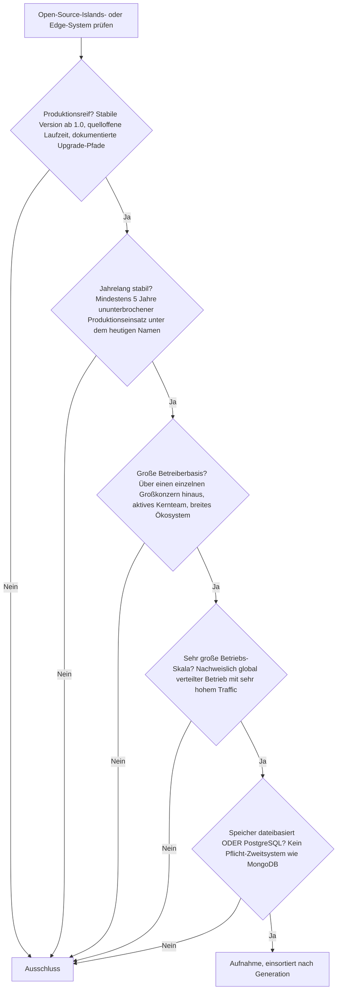
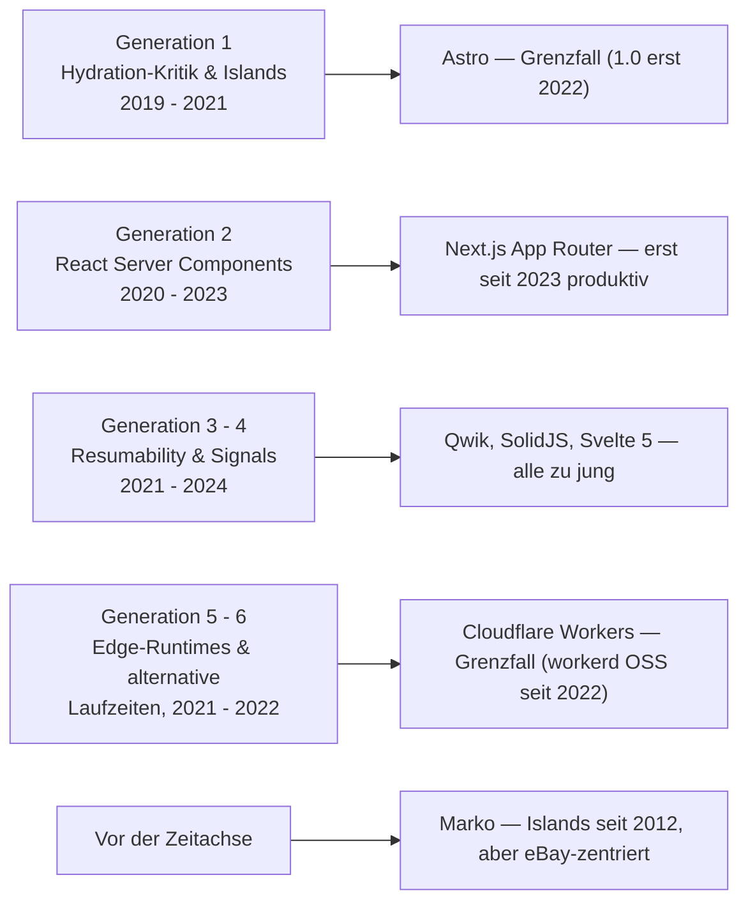
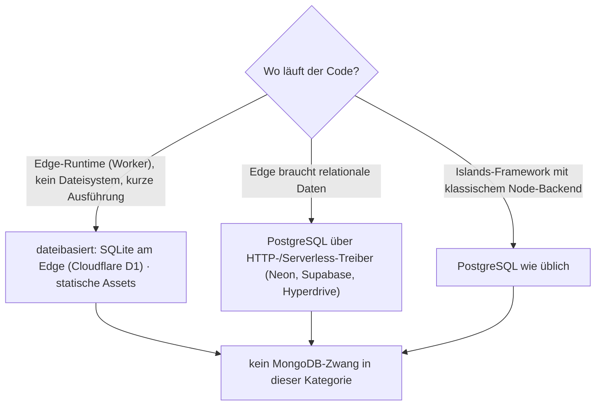

# Produktionsreife Open-Source-Islands- & Edge-Architekturen nach Generation — Reifegrad, Evaluation & Betriebs-Skala (noch kein voller Treffer)

Die [Evolution und Architekturen digitaler Islands- & Edge-Architekturen](evolution-digitaler-islands-edge-architektur.md) ordnet diese Linie chronologisch in sechs technologische Generationen, die [Topliste bester Islands- & Edge-Architekturen 2026](islands-edge-architektur-2026-topliste.md) rankt die gesamte Kategorie. Diese Seite legt — parallel zur allgemeinen [Web-Framework-Variante](produktionsreife-webframeworks-generationen-2026-topliste.md), der [Meta-Framework-](produktionsreife-meta-frameworks-generationen-2026-topliste.md), [SPA-](produktionsreife-spa-frameworks-generationen-2026-topliste.md), [Enterprise-](produktionsreife-enterprise-webframeworks-generationen-2026-topliste.md) und [Rust-Variante](produktionsreife-rust-webframeworks-generationen-2026-topliste.md) sowie den Schwesterseiten für [Wissenssysteme](../../wissen/dokumentation/produktionsreife-wissenssysteme-generationen-2026-topliste.md), [CMS](../../wissen/dokumentation/produktionsreife-cms-generationen-2026-topliste.md) und [LMS](../../wissen/e-learning/produktionsreife-lms-generationen-2026-topliste.md) — dasselbe bewusst **konservative** Fünf-Filter-Sieb an: produktionsreif · jahrelang stabil · große Betreiberbasis · sehr große Betriebs-Skala · Speicher dateibasiert oder PostgreSQL. Sortiert nach Generation.

!!! warning "Achtung: Die jüngste Kategorie der Familie — noch besteht kein Vertreter alle fünf Filter"
    „Islands-Architektur" ist als benannte Bauform erst 2021 entstanden, die Edge-Runtime-Welle 2021–2022. Am Filter **„mindestens fünf Jahre ununterbrochener Produktionseinsatz"** scheitert praktisch die gesamte Kategorie: **Astro** (1.0 im August 2022), **Qwik**, **SolidJS**, **Deno Fresh** sind alle jünger. Der stille Vorläufer **[Marko](#grenzfall-marko)** (eBay, seit 2012) hätte die Reifezeit, aber nicht die Betreiberbasis. Auf der Edge-Seite ist **[Cloudflare Workers](#grenzfall-cloudflare-workers-workerd)** die größte Plattform, deren quelloffene Laufzeit `workerd` aber erst seit 2022 offen liegt. In der Praxis erreicht man Islands & Edge heute über den Islands-Modus eines **reifen** Frameworks — siehe [Fazit](#der-pragmatische-weg-islands-modus-eines-reifen-frameworks).

---

## Die fünf harten Filter

!!! note "Hinweis: quelloffene Laufzeit, kommerzielles Netz ist erlaubt"
    Bei Edge-Plattformen zählt die **Laufzeit** als Open-Source-Kriterium (`workerd`, Deno, die Islands-Frameworks unter MIT). Das global verteilte Hosting-Netz darf kommerziell betrieben werden — dieselbe Trennung wie bei Canvas LMS und seiner Cloud in der [LMS-Liste](../../wissen/e-learning/produktionsreife-lms-generationen-2026-topliste.md).

---

## Ergebnis: kein voller Treffer, drei Kandidaten an der Schwelle

---

## Kandidaten nach Generation

### Generation 1 — Hydration-Kritik & Islands-Architektur (2019 – 2021)

#### Grenzfall: Astro

**Astro** benannte und systematisierte 2021 die „Islands-Architektur" — standardmäßig null Client-JavaScript, Interaktivität nur gezielt pro Komponente. Es ist das Referenz-Framework der Kategorie mit der größten Betreiberbasis, breit im Einsatz für Content-Sites, Dokumentation und Marketing. **Astro 1.0 erschien im August 2022** (aktuell Astro 7, Juni 2026) — die Fünf-Jahres-Marke für ununterbrochenen Produktionseinsatz ist damit erst 2027 erreicht. Bis dahin: der aussichtsreichste Nachrücker der ganzen Familie.

### Generation 2 — React Server Components (2020 – 2023)

Der [RFC](evolution-digitaler-islands-edge-architektur.md) formalisierte 2020 die Trennung von Server- und Client-Komponenten innerhalb von React; die erste breit produktive Umsetzung ist der **Next.js App Router (2023)**. Als Architektur ist RSC damit erst rund drei Jahre im Produktionseinsatz — trotz sehr großer Verbreitung über Next.js scheitert sie am Reifezeit-Filter. Die Meta-Framework-Seite führt Next.js in seiner Gesamtheit: [Produktionsreife Meta-Frameworks](produktionsreife-meta-frameworks-generationen-2026-topliste.md).

### Generation 3 – 4 — Resumability & signal-basierte Reaktivität (2021 – 2024)

- **Qwik** (2021, 1.0 im Mai 2023) — Resumability statt Hydration, radikaler Ansatz, aber kleine Betreiberbasis und unter fünf Jahren.
- **SolidJS / SolidStart** (2021/2022) — Signals als Grundprimitiv, engagierte, aber kleine Community.
- **Svelte 5 Runes** (2024) — Signal-artige Primitive im Svelte-Compiler; als Feature erst zwei Jahre alt.
- **Vue 3 Reactivity** (2020) — das reifste Signal-nahe System, aber Teil von Vue, nicht eigenständig; geführt auf der [SPA-Seite](produktionsreife-spa-frameworks-generationen-2026-topliste.md).

### Generation 5 – 6 — Edge-Runtimes & alternative Laufzeiten (2021 – 2022)

#### Grenzfall: Cloudflare Workers / `workerd`

**Cloudflare Workers** ist die größte Edge-Plattform dieser Liste — global verteilt, sehr hoher Traffic, seit 2017 im Betrieb, breite Web-Framework-Adaption seit 2021. Die quelloffene Laufzeit **`workerd`** (Apache-2.0) wurde jedoch erst **im September 2022** veröffentlicht; als Open-Source-Baustein ist sie damit unter der Fünf-Jahres-Marke. Die Plattform selbst erfüllt Betreiberbasis und Skala mühelos.

- **Vercel Edge Functions** (2021) — eng an Next.js gekoppelt, aber Vercel hat die „Edge-first"-Botschaft 2024/2025 zugunsten von „Fluid Compute" zurückgenommen; Richtung im Fluss.
- **Deno Deploy** (2021) — quelloffene Laufzeit (Deno, MIT, 1.0 im Mai 2020), kleineres Netz als Cloudflare.
- **Fastly Compute** (GA 2020) — Rust/WASM-Edge, produktionsreif, aber deutlich kleinere Web-Framework-Adaption.
- **Deno Fresh** (2022) — natives Islands-Framework auf Deno, jung und nischig.

### Vor der Zeitachse — der stille Vorläufer

#### Grenzfall: Marko

**Marko** (eBay, seit 2012) hatte feingranulare Partial-Hydration Jahre bevor Astro den Begriff „Islands" prägte. Es betreibt den Großteil von ebay.com, ist auf Server-Rendering-Performance getrimmt und quelloffen (MIT). Marko erfüllt **Reifezeit und Betriebs-Skala** — es scheitert am Filter **„große Betreiberbasis über einen einzelnen Großkonzern hinaus"**: Außerhalb von eBay ist die Nutzung gering geblieben.

---

## Dateibasiert oder PostgreSQL? — Der Edge-Kontext hat SQLite zurückgebracht

Die Edge-Ausführung — kurze Laufzeit, kein persistentes Dateisystem, keine langlebigen TCP-Verbindungen — hat die Speicherlandschaft verschoben:

- **Dateibasiert** ist am Edge wieder erstklassig: **Cloudflare D1** ist eine verteilte SQLite-Datenbank direkt neben dem Worker, dazu statische Assets aus dem SSG-Build. Verwandt mit dem SQLite-Wendepunkt aus der [allgemeinen Web-Framework-Seite](produktionsreife-webframeworks-generationen-2026-topliste.md#dateibasiert-oder-postgresql-diesmal-beides).
- **PostgreSQL** bleibt für relationale Daten die Wahl, erreichbar über HTTP-/Serverless-Treiber (Neon, Supabase) oder Connection-Pooling-Schichten (Cloudflare Hyperdrive). Vertiefung: [PostgreSQL DBA Praxis-Handbuch](../infrastruktur/postgresql-dba-praxis.md).
- **MongoDB-Zwang** gibt es in dieser Kategorie nicht.

!!! warning "Achtung: Momentaufnahme, Stand August 2026"
    Diese Kategorie bewegt sich am schnellsten von allen. Astro erreicht 2027 die Fünf-Jahres-Marke, `workerd` 2027; Vercels Edge-Strategie ist im Umbruch. Vor einer Architekturentscheidung den aktuellen Stand prüfen.

---

## Der pragmatische Weg: Islands-Modus eines reifen Frameworks

Weil kein dediziertes System das volle Sieb besteht, ist der belastbare Weg zu Islands & Edge heute ein **bereits reifes Framework in seinem Islands-/Edge-Modus** — analog dazu, wie man [Generation-4-KI in einem LMS](../../wissen/e-learning/produktionsreife-lms-generationen-2026-topliste.md) durch Nachrüsten statt durch ein neues System erreicht:

| Ziel | Reifer Weg heute |
|---|---|
| Islands / null JS by default | **Astro** (Grenzfall, aber die sicherste Wahl) oder ein statischer [SSG](../../wissen/dokumentation/static-site-generatoren-2026-topliste.md) |
| Server Components / Streaming | **Next.js App Router** — RSC im Rahmen eines [reifen Meta-Frameworks](produktionsreife-meta-frameworks-generationen-2026-topliste.md) |
| feingranulare Reaktivität | **Vue 3** oder **Svelte 5** — Signals im Rahmen eines [reifen SPA-Frameworks](produktionsreife-spa-frameworks-generationen-2026-topliste.md) |
| Edge-Ausführung | **Cloudflare Workers** mit `workerd` als quelloffener Laufzeit |

---

## Was bewusst nicht auf dieser Liste steht

| System | Erfüllt nicht | Anmerkung |
|---|---|---|
| **Astro** | Reifezeit | 1.0 im August 2022 — der aussichtsreichste Nachrücker (2027) |
| **Cloudflare Workers** | Reifezeit der OSS-Laufzeit | `workerd` quelloffen erst seit September 2022; Plattform selbst 8 Jahre und im Hyperscaler-Maßstab |
| **Marko** | Betreiberbasis | Islands seit 2012, betreibt ebay.com, aber außerhalb von eBay kaum genutzt |
| **Next.js App Router / React Server Components** | Reifezeit der Architektur | Erst seit 2023 breit produktiv; Next.js als Ganzes siehe Meta-Framework-Seite |
| **Qwik, SolidJS, Deno Fresh, Svelte 5 Runes** | Reifezeit | Alle nach 2021 stabil geworden |
| **Vercel Edge Functions** | Kontinuität | „Edge-first" 2024/2025 zugunsten von „Fluid Compute" zurückgenommen |
| **Fastly Compute, Deno Deploy** | Betreiberbasis / Skala | Produktionsreif, aber kleinere Web-Framework-Adaption als Cloudflare |

---

## 🔗 Verwandte Themen

- [Evolution und Architekturen digitaler Islands- & Edge-Architekturen](evolution-digitaler-islands-edge-architektur.md) — das sechsstufige Generationenmodell, nach dem diese Liste sortiert ist
- [Beste Islands- & Edge-Architekturen 2026 (Top 15)](islands-edge-architektur-2026-topliste.md) — breiteste Basis-Topliste der Kategorie
- [Produktionsreife Open-Source-Full-Stack-Meta-Frameworks nach Generation](produktionsreife-meta-frameworks-generationen-2026-topliste.md) — Next.js und Nuxt, über die RSC und Islands heute produktiv laufen
- [Produktionsreife Open-Source-SPA-Frameworks nach Generation](produktionsreife-spa-frameworks-generationen-2026-topliste.md) — Vue 3 und Svelte 5, in denen die Signal-Reaktivität steckt
- [Produktionsreife Open-Source-Web-Frameworks & -Bibliotheken nach Generation](produktionsreife-webframeworks-generationen-2026-topliste.md) — die übergeordnete, sprachübergreifende Variante
- [Beste Static-Site- & Docs-Generatoren 2026 (Top 20)](../../wissen/dokumentation/static-site-generatoren-2026-topliste.md) — die reife dateibasierte Alternative für Content ohne Interaktivität
- [PostgreSQL DBA Praxis-Handbuch](../infrastruktur/postgresql-dba-praxis.md) — die Datenbankschicht, die am Edge über Serverless-Treiber erreicht wird
