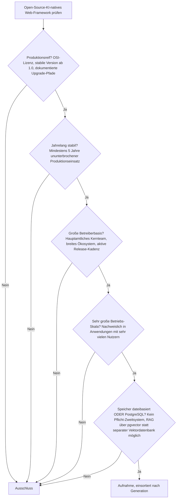
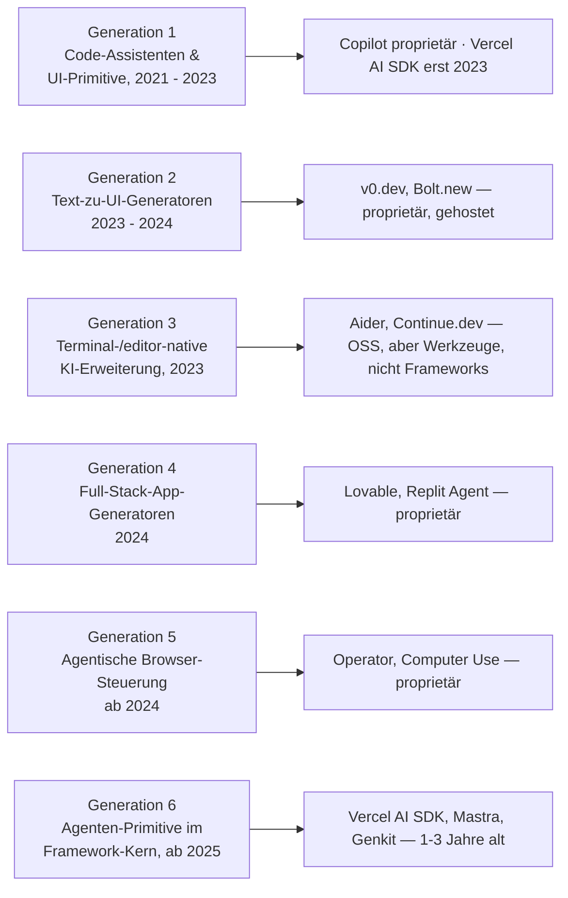

# Produktionsreife Open-Source-KI-native Web-Frameworks nach Generation — Reifegrad, Evaluation & Betriebs-Skala (noch kein Treffer)

Die [Evolution und Architekturen digitaler KI-nativer Web-Frameworks](evolution-digitaler-ki-native-webframeworks.md) ordnet diese Linie chronologisch in sechs Generationen — sie ist **Generation 6 und damit die aktuelle und letzte** im [übergeordneten Web-Framework-Modell](evolution-digitaler-webframeworks.md). Die [Topliste bester KI-nativer Web-Frameworks 2026](ki-native-webframeworks-2026-topliste.md) rankt die gesamte Kategorie. Diese Seite legt — parallel zur allgemeinen [Web-Framework-Variante](produktionsreife-webframeworks-generationen-2026-topliste.md), der [Meta-](produktionsreife-meta-frameworks-generationen-2026-topliste.md), [SPA-](produktionsreife-spa-frameworks-generationen-2026-topliste.md), [Islands-/Edge-](produktionsreife-islands-edge-architekturen-generationen-2026-topliste.md), [Enterprise-](produktionsreife-enterprise-webframeworks-generationen-2026-topliste.md) und [Rust-Variante](produktionsreife-rust-webframeworks-generationen-2026-topliste.md) sowie den Schwesterseiten für [Wissenssysteme](../../wissen/dokumentation/produktionsreife-wissenssysteme-generationen-2026-topliste.md), [CMS](../../wissen/dokumentation/produktionsreife-cms-generationen-2026-topliste.md) und [LMS](../../wissen/e-learning/produktionsreife-lms-generationen-2026-topliste.md) — dasselbe bewusst **konservative** Fünf-Filter-Sieb an: produktionsreif · jahrelang stabil · große Betreiberbasis · sehr große Betriebs-Skala · Speicher dateibasiert oder PostgreSQL. Sortiert nach Generation.

!!! warning "Achtung: Kein System besteht das Sieb — und das ist strukturell erwartbar"
    Die Kategorie ist rund **zwei Jahre alt** (das früheste benannte Werkzeug, das Vercel AI SDK, stammt von Juni 2023), der zweite Filter verlangt **fünf Jahre**. Hinzu kommt: Die Mehrheit der prominenten Werkzeuge — GitHub Copilot, Cursor, v0, Bolt.new, Lovable, Devin — ist **proprietär** und scheitert schon am Lizenzfilter (Aufstellung unter [Was bewusst nicht auf dieser Liste steht](#was-bewusst-nicht-auf-dieser-liste-steht)). Was heute belastbar ist, ist die Kombination aus einem **reifen Framework und einem etablierten KI-SDK** — siehe [Der pragmatische Weg](#der-pragmatische-weg-reifes-framework-plus-etabliertes-ki-sdk).

---

## Die fünf harten Filter

!!! note "Hinweis: Das meiste hier sind keine Frameworks"
    Die [Basis-Topliste](ki-native-webframeworks-2026-topliste.md) mischt drei Dinge, die man auseinanderhalten muss:

    - **Assistenten** — GitHub Copilot, Cursor, Claude Code, Aider, Continue.dev, Cline: schreiben Code, sind aber nichts, worauf man eine App *baut*.
    - **Generatoren** — v0.dev, Bolt.new, Lovable, Framer AI, tldraw „make real": erzeugen Code aus Text/Bild, meist als gehosteter Dienst.
    - **Agenten-Laufzeiten** — OpenAI Operator, Anthropic Computer Use, Devin: steuern fertige Anwendungen.

    Nur ein schmaler Rest ist eine echte **Framework-Primitive-Schicht**, mit der man baut: **Vercel AI SDK**, **LangChain.js**, **Mastra**, **Genkit**.

---

## Ergebnis: alle sechs Generationen unter der Reifezeit- oder Lizenzschwelle

---

## Kandidaten nach Generation

### Generation 1 — Code-Assistenten & eingebettete UI-Primitive (2021 – 2023)

- **GitHub Copilot** (2021) — die älteste breit adoptierte LLM-Integration, mit fünf Jahren gerade an der Reifezeit-Marke, aber **proprietär** → Lizenzfilter.
- **Vercel AI SDK** (Juni 2023) — MIT-lizenziert, von den Next.js-Machern, Streaming/Tool-Calling/generative UI als Framework-Primitive; die mit Abstand größte Betreiberbasis der OSS-Schicht. Scheitert allein an der **Reifezeit** (drei Jahre).

### Generation 2 & 4 — Text-zu-UI- und Full-Stack-Generatoren (2023 – 2024)

**v0.dev**, **Bolt.new**, **Lovable**, **Replit Agent**, **Framer AI** — durchweg **proprietäre, gehostete Dienste**. Selbst wenn der generierte Code offen ist, ist der Generator es nicht → Lizenzfilter. Zusätzlich alle unter zwei Jahren.

### Generation 3 — terminal-/editor-native KI-Erweiterung (2023)

**Aider** (Apache-2.0) und **Continue.dev** (Apache-2.0) sind quelloffen und aktiv, aber es sind **Entwickler-Werkzeuge**, keine Frameworks, auf denen eine Anwendung läuft. Außerdem erst seit 2023.

### Generation 5 — agentische Browser-Steuerung (ab 2024)

**OpenAI Operator**, **Anthropic Computer Use**, **Devin** — proprietäre Agenten-Laufzeiten, jünger als zwei Jahre. Dieselbe Kategorie mit demselben Sieb: [Produktionsreife autonome Open-Source-KI-Agenten nach Generation](../../künstliche-intelligenz/produktionsreife-autonome-ki-agenten-generationen-2026-topliste.md) — ebenfalls kein Treffer.

### Generation 6 — Agenten-Primitive im Framework-Kern (ab 2025)

| System | Lizenz | Stabil seit | Warum (noch) nicht |
|---|---|---|---|
| **Vercel AI SDK** (Agenten-Ausbau) | MIT | 2023 (AI SDK 5+ mit Agenten-Orchestrierung 2025) | Reifezeit — der aussichtsreichste Kandidat für ~2028 |
| **LangChain.js** | MIT | 2023 | Reifezeit; zudem eher Bibliothek als Framework-Kern |
| **Mastra** | Apache-2.0 | 1.0 im Januar 2026 | Ein Jahr alt; baut auf dem Vercel AI SDK auf. Vom Team hinter Gatsby — das in der [Meta-Framework-Liste](produktionsreife-meta-frameworks-generationen-2026-topliste.md) als eingeschlafenes Projekt auftaucht |
| **Genkit** (Google) | Apache-2.0 | Go 1.0 2026, JS ~2024/25 | Reifezeit; Firebase-nah |
| **Agent Client Protocol (ACP)** | Apache-2.0 | ab 2025 | Ein Protokoll, kein Framework — siehe [Agent Client Protocol](../../künstliche-intelligenz/coding/agent-client-protocol-acp.md) |

---

## Der pragmatische Weg: reifes Framework plus etabliertes KI-SDK

Weil kein KI-natives System das Sieb besteht, ist der belastbare Ansatz heute die **Trennung der Schichten** — ein produktionsreifes Framework aus einer der Schwesterlisten für die Anwendung, ein etabliertes SDK für die KI-Funktion:

| Aufgabe | Reifer Weg heute |
|---|---|
| Chat-/Streaming-UI, Tool-Calling, generative UI | **Vercel AI SDK** auf [Next.js](produktionsreife-meta-frameworks-generationen-2026-topliste.md) oder einem [SPA-Framework](produktionsreife-spa-frameworks-generationen-2026-topliste.md) |
| Agenten-Orchestrierung, RAG-Pipelines | **LangChain.js** oder direkt die Provider-SDKs, angebunden an ein [Web-Framework](produktionsreife-webframeworks-generationen-2026-topliste.md) |
| Modell-Auswahl, Kosten, Limits | [Multi-LLM- & Sprachmodell-Anbieter im Vergleich](../../künstliche-intelligenz/coding/llm-anbieter-vergleich.md) |
| Qualität der KI-Funktion messen | [Beste KI-Evaluationswerkzeuge 2026](../../künstliche-intelligenz/ki-evaluation-2026-topliste.md) |
| Gesamter Lernpfad | [Websites entwickeln mit KI](ki-webentwicklung.md) |

---

## Dateibasiert oder PostgreSQL? — Wie beim Framework darunter, plus pgvector für RAG

Ein KI-natives Web-Frontend hat keine eigene Speicherschicht — es erbt die des Backend-Frameworks, auf dem es aufsetzt. Neu ist allein der **Vektor-Bedarf** für Retrieval-Augmented Generation:

- **PostgreSQL mit [pgvector](../../wissen/daten/datenbanken/pgvector-anleitung.md)** deckt relationale Daten **und** Embeddings in einem System ab — kein separater Vektordienst nötig, kein Pflicht-Zweitsystem.
- **Dateibasiert / SQLite** trägt kleinere KI-Features und Edge-Deployments (SQLite mit Vektor-Erweiterungen, Cloudflare D1).
- **MongoDB-Zwang** gibt es nicht; wo eine dedizierte Vektordatenbank (Qdrant, Weaviate) eingesetzt wird, ist das eine bewusste Zusatzentscheidung, keine Framework-Anforderung.

Vertiefung: [PostgreSQL DBA Praxis-Handbuch](../infrastruktur/postgresql-dba-praxis.md).

!!! warning "Achtung: Momentaufnahme, Stand August 2026"
    Diese Kategorie verändert sich im Quartalsrhythmus. Das Vercel AI SDK erreicht frühestens 2028 die Fünf-Jahres-Marke; ob sich „Agenten-Primitive im Framework-Kern" überhaupt als eigene Kategorie durchsetzen oder in bestehende Frameworks aufgehen, ist offen.

---

## Was bewusst nicht auf dieser Liste steht

| System(e) | Erfüllt nicht | Anmerkung |
|---|---|---|
| **GitHub Copilot, Cursor, Windsurf, Devin, GitHub Copilot Workspace** | Lizenzfilter | Proprietäre Assistenten/IDEs |
| **v0.dev, Bolt.new, Lovable, Replit Agent, Framer AI, Builder.io Visual Copilot, tldraw „make real"** | Lizenzfilter | Proprietäre, gehostete Generatoren |
| **OpenAI Operator, Anthropic Computer Use** | Lizenzfilter | Proprietäre Agenten-Laufzeiten |
| **Vercel AI SDK, LangChain.js** | Reifezeit | OSS und weit verbreitet, aber erst seit 2023 |
| **Mastra, Genkit** | Reifezeit | OSS, aber 1.0 erst 2026 bzw. 2025/26 |
| **Aider, Continue.dev, Cline** | Kategorie | OSS-Werkzeuge, keine Frameworks |
| **Agent Client Protocol (ACP)** | Kategorie | Protokoll, kein Framework |

---

## 🔗 Verwandte Themen

- [Evolution und Architekturen digitaler KI-nativer Web-Frameworks](evolution-digitaler-ki-native-webframeworks.md) — das sechsstufige Generationenmodell, nach dem diese Liste sortiert ist
- [Beste KI-native Web-Frameworks 2026 (Top 20)](ki-native-webframeworks-2026-topliste.md) — breiteste Basis-Topliste inklusive proprietärer Werkzeuge
- [Produktionsreife Open-Source-Full-Stack-Meta-Frameworks nach Generation](produktionsreife-meta-frameworks-generationen-2026-topliste.md) — Next.js als reife Basis für das Vercel AI SDK
- [Produktionsreife Open-Source-Islands- & Edge-Architekturen nach Generation](produktionsreife-islands-edge-architekturen-generationen-2026-topliste.md) — die vorige, ebenfalls sehr junge Generation
- [Produktionsreife Open-Source-Web-Frameworks & -Bibliotheken nach Generation](produktionsreife-webframeworks-generationen-2026-topliste.md) — die übergeordnete, sprachübergreifende Variante
- [Websites entwickeln mit KI](ki-webentwicklung.md) — praktischer Lernpfad HTML/CSS bis Deployment mit KI
- [Multi-LLM- & Sprachmodell-Anbieter im Vergleich](../../künstliche-intelligenz/coding/llm-anbieter-vergleich.md) — die Modellschicht hinter jedem KI-nativen Feature
- [Beste KI-Evaluationswerkzeuge 2026 (Top 15)](../../künstliche-intelligenz/ki-evaluation-2026-topliste.md) — Qualitätssicherung für KI-Funktionen
- [PostgreSQL + pgvector](../../wissen/daten/datenbanken/pgvector-anleitung.md) — relationale Daten und Embeddings in einem System
